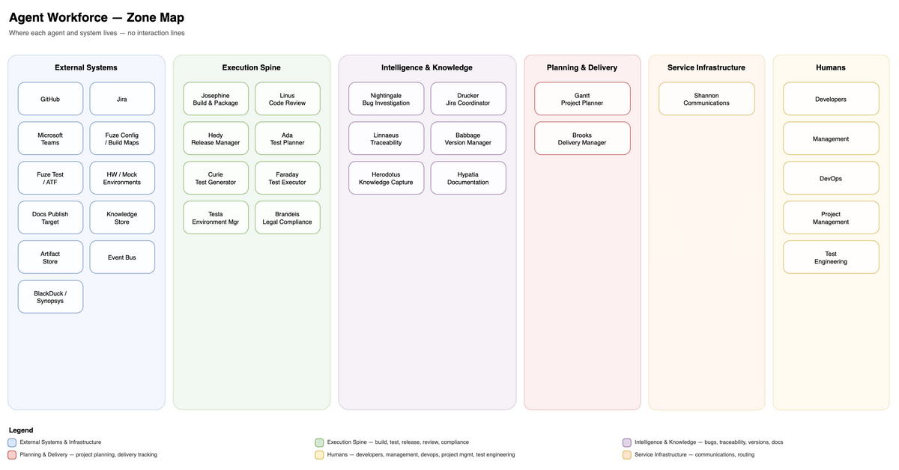

# Cornelis Agent Workforce

AI-powered engineering agents, reusable tools, and standalone CLI utilities for project management, Jira, Confluence, Excel, and Draw.io at Cornelis Networks.

## Table of Contents

- [Overview](#overview)
  - [When to Use What](#when-to-use-what)
- [Architecture](#architecture)
- [Quick Start](#quick-start)
- [Agents](#agents)
  - [Implemented Agents](#implemented-agents)
  - [Agent Communication](#agent-communication)
  - [Agent Workforce Vision](#agent-workforce-vision)
- [Agentic Workflows](#agentic-workflows)
- [Standalone Utilities](#standalone-utilities)
- [Tools (MCP / Agent API)](#tools-mcp--agent-api)
- [Development](#development)
- [License](#license)

---

## Overview

This repository contains three categories of tooling:

| Category | What it does | LLM required? |
|----------|-------------|----------------|
| **Agents** | Specialized AI agents for Jira coordination, Teams communication, project planning, and documentation — each with its own API and Teams channel | Varies |
| **Agentic Workflows** | Multi-phase AI pipelines for feature planning, bug reporting, hygiene analysis, and documentation generation via `agent-cli` | Yes |
| **Standalone Utilities** | CLI tools for Jira queries, Excel formatting, Draw.io diagrams, Confluence, and bulk operations — no LLM needed | No |

### When to Use What

**Use Agents** when you want continuous, interactive access to AI capabilities from Microsoft Teams. Shannon is the primary user interface — engineers mention `@Shannon` in the appropriate Teams channel to invoke any registered agent. Agents run as always-on services and respond with Adaptive Cards.

- Ask Drucker to scan your project's Jira hygiene: `@Shannon /hygiene-run project_key STL`
- Check bug activity trends: `@Shannon /bug-activity project_key STL`
- Ask Gantt for a planning snapshot: `@Shannon /planning-snapshot project_key STL`
- Run Gantt release monitoring from Teams: `@Shannon /release-monitor project_key STL releases 12.1.1.x,12.2.0.x`
- Get Shannon's own status: `@Shannon /stats`

**Use Agentic Workflows** when you need to run a multi-step AI pipeline from the command line — typically one-off planning, analysis, or reporting tasks that produce structured output files.

- Generate a Jira project plan from a scope document
- Build a planning snapshot with milestone proposals and risk summaries
- Produce an enriched bug report from a Jira filter
- Generate documentation drafts for repo Markdown or Confluence

See [docs/workflows.md](docs/workflows.md) for the full workflow reference.

**Use Standalone Utilities** when you need direct, deterministic CLI access to Jira, Excel, Draw.io, or Confluence — no LLM, no agents, just the tool.

- Query Jira projects, tickets, filters, dashboards
- Bulk-update or bulk-delete Jira tickets
- Convert, concatenate, or diff Excel workbooks
- Generate Draw.io dependency diagrams from Jira exports

---

## Architecture


> Source: [`docs/diagrams/system-overview.mmd`](docs/diagrams/system-overview.mmd) — regenerate with `mmdc -i docs/diagrams/system-overview.mmd -o docs/diagrams/system-overview.png -b transparent -w 1200`

---

## Quick Start

The fastest way to get set up is with [OpenCode](https://github.com/opencode-ai/opencode). Clone the repo and paste this prompt into an OpenCode session:

```
I just cloned the agent-workforce repo and need to set it up. Please:

1. Create a Python virtual environment in .venv, activate it, and install
   requirements.txt
2. Copy .env.example to .env (preserving all comments and structure)
3. Ask me for credentials to fill in. Group your questions into one message:
   - Jira email address (required)
   - Jira API token (required — generate at
     https://id.atlassian.com/manage-profile/security/api-tokens)
   - Jira URL (default: https://cornelisnetworks.atlassian.net — keep default
     unless I say otherwise)
   - Whether I want to use agentic workflows (if yes, ask which LLM provider:
     Cornelis internal, OpenAI, or Anthropic, and the corresponding API key)
4. Update only the corresponding values in .env — do not rewrite or reformat
   the file
5. Verify the installation:
   - Run: python3 jira_utils.py --help (confirms install works)
   - Run: python3 jira_utils.py --list (confirms Jira connectivity)
   - Report whether both succeeded
```

**Prerequisites:** Python 3.9+, access to Cornelis Networks Jira, and a Jira API token ([generate one here](https://id.atlassian.com/manage-profile/security/api-tokens)). An LLM API key is only required for agentic workflows.

For manual installation, global CLI install via pipx, and full configuration reference, see **[docs/installation.md](docs/installation.md)**.

---

## Agents

The repo implements specialized agents that automate engineering workflows. Each agent operates as an independent service with its own API, commands, and Teams channel. **Shannon is the primary user interface** — all agents are accessed through Shannon from Microsoft Teams.

### Implemented Agents

| Agent | Directory | Description | Port |
|-------|-----------|-------------|------|
| **Shannon** | `shannon/` + `agents/shannon/` | Microsoft Teams communications service. Routes commands from Teams to backend agents, renders Adaptive Card responses, and posts proactive notifications. Deployed at `shannon.cn-agents.com` via Cloudflare tunnel. | 8200 |
| **Drucker** | `agents/drucker/` | Engineering hygiene agent. Jira ticket quality scans, GitHub PR lifecycle monitoring (6 scan types), and remediation reports. | 8201 |
| **Gantt** | `agents/gantt/` | Project planning service. Builds Jira-grounded planning snapshots, release-health reports, and scheduled PM polling outputs. | 8202 |
| **Hypatia** | `agents/hypatia/` | Documentation agent. Produces source-grounded documentation candidates for repo Markdown and optional Confluence publication. | — |

### Agent Communication

Engineers interact with agents by mentioning `@Shannon` in the appropriate Microsoft Teams channel:

- `#agent-shannon` — Shannon self-service commands (`/stats`, `/busy`, `/work-today`, etc.)
- `#agent-drucker` — Drucker hygiene commands (`/hygiene-run`, `/hygiene-report`, `/bug-activity`, etc.)
- `#agent-gantt` — Gantt planning and release-monitor commands (`/planning-snapshot`, `/planning-snapshots`, `/release-monitor`, etc.)

Agent routing is configured in [`config/shannon/agent_registry.yaml`](config/shannon/agent_registry.yaml). For setup details, see [docs/shannon-teams-setup.md](docs/shannon-teams-setup.md). For deployment, see [`deploy/README.md`](deploy/README.md).

Shannon and Drucker are currently deployed on `bld-node-48.cornelisnetworks.com` with HTTPS provided by a Cloudflare named tunnel at `shannon.cn-agents.com` (domain: `cn-agents.com`).

### Agent Workforce Vision

This repo implements the first agents of a planned 17-agent workforce for Cornelis Networks engineering, organized across six zones:



> Source: [`docs/diagrams/workforce/AGENT_ZONE_MAP.drawio`](docs/diagrams/workforce/AGENT_ZONE_MAP.drawio) — regenerate with `drawio --export --format png --width 1200 --border 10 docs/diagrams/workforce/AGENT_ZONE_MAP.drawio`

The full architectural vision, agent specifications, and implementation phasing are documented in [docs/workforce/](docs/workforce/).

---

## Agentic Workflows

Agentic workflows are multi-step operator flows orchestrated by [`agent_cli.py`](agent_cli.py). Each agent also has a standalone CLI. Some workflows are deterministic, while others use an LLM to research, analyze, scope, and plan.

| Workflow | Command | Description |
|----------|---------|-------------|
| **Gantt Snapshot** | `agent-cli gantt snapshot` | Jira-grounded planning snapshots with milestone proposals and risk summaries |
| **Gantt Release Monitor** | `agent-cli gantt release-monitor` | Release-health reports with bug summaries, readiness, and stored exports |
| **Gantt Poller** | `agent-cli gantt poll` | Scheduled Gantt cycles for always-on planning and release monitoring |
| **Feature Plan** | `agent-cli feature-plan` | Scope document → Initiative → Epics → Stories in Jira |
| **Drucker Hygiene** | `agent-cli drucker hygiene` | Ticket hygiene reports with remediation suggestions |
| **Drucker Poller** | `agent-cli drucker poll` | Scheduled Drucker hygiene scans with optional Shannon notifications |
| **Hypatia Docs** | `agent-cli hypatia generate` | Source-grounded documentation drafts for repo Markdown or Confluence |
| **Bug Report** | `agent-cli bug-report` | Enriched bug reports from Jira filters, exported to styled Excel |

All workflows are **dry-run by default** — no Jira tickets are created or modified until `--execute` is passed.

For the complete workflow reference with examples, flags, and output files, see **[docs/workflows.md](docs/workflows.md)**.

---

## Standalone Utilities

These CLI tools work **without any LLM** and can be installed globally via `pipx`.

| Command | Source | Description |
|---------|--------|-------------|
| `jira-utils` | [`jira_utils.py`](jira_utils.py) | Full-featured Jira CLI (project queries, ticket creation, bulk ops, dashboards) |
| `excel-utils` | [`excel_utils.py`](excel_utils.py) | Excel workbook concatenation, CSV conversion, and diff reporting |
| `drawio-utils` | [`drawio_utilities.py`](drawio_utilities.py) | Draw.io diagram generator from Jira hierarchy CSV exports |
| `confluence-utils` | [`confluence_utils.py`](confluence_utils.py) | Confluence CLI for managing pages, spaces, and content |

Run any of them with `-h` for full help:

```bash
jira-utils -h
excel-utils -h
drawio-utils -h
confluence-utils -h
```

For detailed usage examples, see the sections below.

<details>
<summary>Jira CLI examples</summary>

#### Project & Metadata

```bash
python3 jira_utils.py --list
python3 jira_utils.py --project PROJ --get-workflow
python3 jira_utils.py --project PROJ --get-issue-types
python3 jira_utils.py --project PROJ --get-fields
python3 jira_utils.py --project PROJ --get-versions
python3 jira_utils.py --project PROJ --get-components
```

#### Ticket Queries

```bash
python3 jira_utils.py --project PROJ --get-tickets
python3 jira_utils.py --project PROJ --get-tickets --issue-types Bug Story --status Open --limit 50
python3 jira_utils.py --project PROJ --releases "12.*"
python3 jira_utils.py --project PROJ --release-tickets "12.3*" --issue-types Bug Story Task
python3 jira_utils.py --project PROJ --no-release --issue-types Bug --status Open
python3 jira_utils.py --jql "project = PROJ AND status = Open" --limit 20
python3 jira_utils.py --get-children PROJ-100
python3 jira_utils.py --get-related PROJ-100 --hierarchy
```

#### Date Filters

| Value | Meaning |
|-------|---------|
| `today` | Created today |
| `week` | Last 7 days |
| `month` | Last 30 days |
| `year` | Last 365 days |
| `all` | No date filter |
| `MM-DD-YYYY:MM-DD-YYYY` | Custom date range |

#### Dump to File

```bash
python3 jira_utils.py --project PROJ --get-tickets --dump-file tickets
python3 jira_utils.py --project PROJ --get-tickets --dump-file tickets --dump-format json
```

#### Filters

```bash
python3 jira_utils.py --list-filters
python3 jira_utils.py --run-filter 12345 --limit 100
```

#### Bulk Update

```bash
python3 jira_utils.py --bulk-update --input-file orphans.csv --set-release "12.3.0"          # dry-run
python3 jira_utils.py --bulk-update --input-file orphans.csv --set-release "12.3.0" --execute # execute
```

#### Bulk Delete

```bash
python3 jira_utils.py --bulk-delete --input-file to_delete.csv             # dry-run
python3 jira_utils.py --bulk-delete --input-file to_delete.csv --execute   # execute
```

#### Dashboard Management

```bash
python3 jira_utils.py --dashboards
python3 jira_utils.py --dashboard 12345
python3 jira_utils.py --create-dashboard "My Dashboard"
python3 jira_utils.py --copy-dashboard 12345 --name "Copy"
```

</details>

<details>
<summary>Excel CLI examples</summary>

```bash
# Concatenation
python3 excel_utils.py --concat fileA.xlsx fileB.xlsx --method merge-sheet --output merged.xlsx
python3 excel_utils.py --concat fileA.xlsx fileB.xlsx --method add-sheet --output combined.xlsx

# Conversion
python3 excel_utils.py --convert-to-csv data.xlsx
python3 excel_utils.py --convert-from-csv data.csv
python3 excel_utils.py --convert-from-csv data.csv --jira-url https://cornelisnetworks.atlassian.net

# Diff
python3 excel_utils.py --diff fileA.xlsx fileB.xlsx --output changes.xlsx

# Plain output (no formatting)
python3 excel_utils.py --convert-from-csv data.csv --no-formatting
```

</details>

<details>
<summary>Draw.io CLI examples</summary>

```bash
# Generate diagram from Jira hierarchy CSV
python3 drawio_utilities.py --create-map tickets.csv

# End-to-end: Jira → CSV → Draw.io
python3 jira_utils.py --get-related PROJ-100 --hierarchy --dump-file tickets
python3 drawio_utilities.py --create-map tickets.csv
```

</details>

<details>
<summary>Confluence CLI examples</summary>

```bash
confluence-utils -h   # Full usage
```

</details>

---

## Tools (MCP / Agent API)

The `tools/` directory and [`mcp_server.py`](mcp_server.py) expose agent-callable wrappers around the underlying standalone utilities. These tools provide safe, structured access to Jira, Excel, and other capabilities for AI agents and external consumers via MCP (Model Context Protocol).

| Category | Tools |
|----------|-------|
| **Jira** | `get_project_info`, `search_tickets`, `create_ticket`, `update_ticket`, `bulk_update_tickets`, `get_releases`, `get_components`, `get_related_tickets`, `link_tickets`, `assign_ticket` |
| **Excel** | `convert_from_csv`, `convert_to_csv`, `concat_merge_sheet`, `concat_add_sheet`, `diff_files` |
| **Draw.io** | `parse_org_chart`, `get_responsibilities`, `create_ticket_diagram`, `create_diagram_from_tickets` |
| **Vision** | `analyze_image`, `extract_roadmap_from_ppt`, `extract_roadmap_from_excel` |
| **Confluence** | `confluence_tools` |

---

## Development

### Project Structure

```
agent-workforce/
├── agent_cli.py                 # Unified CLI entry point (→ agent-cli)
├── jira_utils.py                # Standalone Jira CLI (→ jira-utils)
├── excel_utils.py               # Standalone Excel CLI (→ excel-utils)
├── drawio_utilities.py          # Standalone Draw.io CLI (→ drawio-utils)
├── confluence_utils.py          # Standalone Confluence CLI (→ confluence-utils)
├── mcp_server.py                # MCP server for exposing tools
├── shannon/                     # Teams communication service
│   ├── app.py                   # FastAPI server (port 8200)
│   ├── service.py               # Agent bridge / command routing
│   ├── poster.py                # Teams message posting (Workflows / Bot Framework)
│   └── cards.py                 # Adaptive Card renderers
├── agents/                      # Agent definitions
│   ├── base.py                  # BaseAgent abstract class
│   ├── drucker_api.py           # Drucker hygiene agent service (port 8201)
│   ├── gantt_agent.py           # Gantt planning agent
│   ├── hypatia_agent.py         # Documentation agent
│   ├── feature_planning_orchestrator.py
│   ├── research_agent.py
│   ├── hardware_analyst.py
│   ├── scoping_agent.py
│   └── ...
├── tools/                       # Agent-callable wrappers (MCP + direct)
│   ├── jira_tools.py
│   ├── excel_tools.py
│   ├── drawio_tools.py
│   ├── confluence_tools.py
│   └── ...
├── config/
│   ├── shannon/                 # Shannon bot config + agent registry
│   └── prompts/                 # Agent system prompts
├── docs/
│   ├── workflows.md             # Full agentic workflow reference
│   ├── shannon-teams-setup.md   # Teams integration setup guide
│   ├── shannon-deployment-plan.md
│   └── workforce/               # Agent workforce vision (17 agents)
├── pyproject.toml               # Package metadata & console_scripts
├── requirements.txt
└── .env.example
```

### Adding New Tools

```python
from tools.base import tool, ToolResult

@tool(description='My new tool')
def my_tool(param: str) -> ToolResult:
    return ToolResult.success({'result': 'data'})
```

### Adding New Agents

1. Create agent class extending `BaseAgent`
2. Define instruction prompt in `config/prompts/`
3. Register tools and implement `run()` method

### Testing

```bash
pytest tests/
pytest tests/test_tools/test_jira_tools.py
```

---

## License

Proprietary — Cornelis Networks

## Support

For issues or questions, contact the Engineering Tools team.
