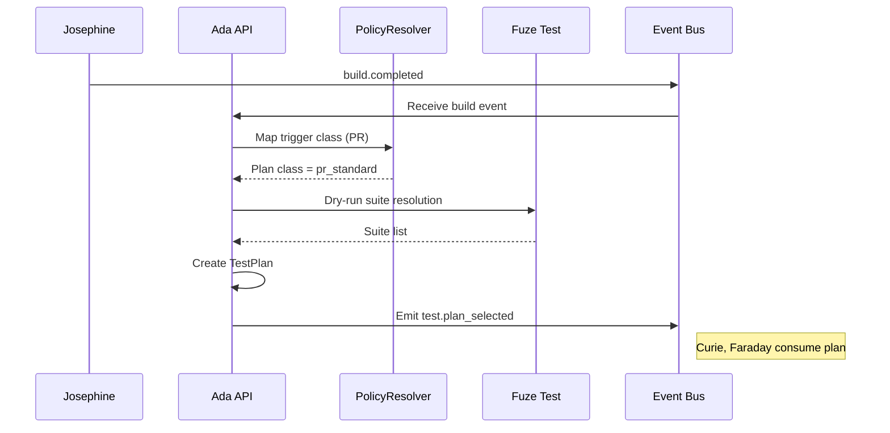
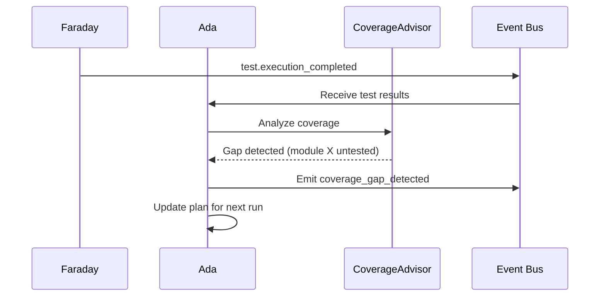

# Ada Test Planner Plan

## Summary
Ada should be the test-planning agent for the platform. Its v1 job is to turn build context, trigger type, environment state, and coverage needs into a durable `TestPlan` that downstream test agents can act on.

In practical terms:
- Ada decides what should be tested and at what depth
- Curie materializes that plan into concrete Fuze Test inputs
- Faraday executes the plan through Fuze Test
- Tesla manages scarce environment reservations

Ada should use Fuze Test in [atf](/Users/johnmacdonald/code/cornelis/atf) as the planning vocabulary and downstream execution substrate, but Ada itself should not own low-level execution or reservation logic.

## Product definition
### Goal
- consume build completion events from Josephine
- select the right test policy and scope for the trigger and hardware context
- produce a durable `TestPlan` record
- express environment class, coverage intent, and execution constraints clearly enough for downstream agents
- keep all test planning tied to the originating build ID

### Non-goals for v1
- direct test execution
- environment reservation implementation
- replacing Fuze Test's executive, product-test, or DUT-control layers
- inventing a new low-level test command format outside existing ATF test cases and test suites
- full autonomous test-authoring of arbitrary new test logic

### V1 shape
- `ada-api`: accepts planning requests and exposes plan records
- `ada-worker`: resolves planning inputs into normalized `TestPlan` outputs
- Fuze Test in [atf/executive](/Users/johnmacdonald/code/cornelis/atf/executive) remains the execution vocabulary that Curie and Faraday target

## Triggering model
- Ada should run as an always-on planning service.
- Normal work should start from build completion events, PR/merge/nightly trigger classes, direct planning requests, and release-validation requests.
- Humans should be able to preview plans and apply bounded policy overrides when needed.

## Architecture
### Core design
Ada should be split into three internal concerns:
- `TestPlanSelector`: maps trigger, branch, module, project, hardware profile, and policy into a plan class
- `PolicyResolver`: resolves planning policy, environment class, and timing constraints
- `CoverageAdvisor`: incorporates known gaps, trigger class, and confidence targets into the final `TestPlan`

Required internal objects:
- `TestPlanRequest`
- `TestPlan`
- `CoverageSummary`
- `PlanningPolicyDecision`

### Trigger model
Ada should support these v1 trigger classes:
- pull request: unit tests, fast functional tests, mocked or reduced HIL path
- merge to main: expanded functional tests, HIL when available
- nightly: extended suite with richer artifacts
- release validation request: certification-oriented suite selection, explicitly policy-gated

### Fuze Test integration
Ada should integrate with Fuze Test using the existing selection and execution model described in:
- [atf/executive/README.md](/Users/johnmacdonald/code/cornelis/atf/executive/README.md)
- [atf/docs/source/atf-getting-started.rst](/Users/johnmacdonald/code/cornelis/atf/docs/source/atf-getting-started.rst)
- [atf/executive/run-atf.py](/Users/johnmacdonald/code/cornelis/atf/executive/run-atf.py)

The important existing Fuze Test behaviors to preserve are:
- `run-atf.py` is the executive entrypoint
- test cycle inputs are driven by module, project, runtype, location, test setup, version, and optional suite list
- suite selection precedence already exists:
  1. explicit suite files
  2. configured suite list
  3. auto-selected suites from project/module/runtype naming and directory structure
- test suites and packaged test content can already be overlaid at run time

V1 integration strategy:
- Ada produces planning intent, not direct repo mutations
- Curie should be able to derive explicit suite inputs from Ada plans
- use existing project/module/runtype/location conventions as the first planning vocabulary
- use Fuze build IDs from Josephine as the primary key that links build, test plan, and test results

## Planning topology
### Where Ada runs
- run `ada-api` on normal internal service infrastructure
- planning does not require lab-resident worker hosts
- Ada should run close to the event and metadata systems it consumes

### How planning happens
- Ada receives a build event or direct planning request
- Ada resolves trigger class, scope, and coverage intent
- Ada selects a `TestPlan`
- Ada emits a durable planning record for Curie, Faraday, Tesla, and downstream traceability consumers

## Planning model
### Plan inputs
- `build_id`
- `repo`
- `commit_sha`
- `branch`
- `trigger_type`
- `module`
- `project`
- `module_version`
- `hardware_profile`
- `location`
- `test_setup`
- `environment_state`
- `coverage_context`
- `policy_profile`

### Plan outputs
A `TestPlan` should minimally contain:
- plan ID
- build ID
- trigger class
- suite selection intent
- environment class required
- execution mode intent: mock or HIL
- timeout budget
- result retention class
- coverage intent summary

### Planning rules
- PR plans must optimize for fast signal and low lab contention
- merge plans must increase realism and coverage without collapsing throughput
- nightly plans should expand breadth and artifact richness
- release validation plans must be explicit, auditable, and policy-gated
- when environment constraints prevent a requested HIL path, Ada should either:
  - degrade to an approved fallback plan, or
  - fail planning with an explicit reason

## Queueing and planning lifecycle
- put an explicit queue between Ada API and planning workers when planning load warrants it
- persist plan state independently of execution state
- planning should complete before reservation and execution begin
- do not couple plan generation to worker availability

## Public API and contracts
### API surface
- `POST /v1/test-plans/select`
  - input: build and trigger context
  - output: selected `TestPlan`
- `GET /v1/test-plans/{test_plan_id}`
  - returns normalized plan state, trigger context, and linked build ID
- `GET /v1/test-plans/{test_plan_id}/events`
  - returns planning events only

### Internal contracts
- `TestPlanRequest`
- `TestPlan`
- `CoverageSummary`
- `PlanningPolicyDecision`

## Observability and operations
### Structured events
Emit:
- `test.plan_selected`
- `test.coverage_gap_detected`
- `test.plan_invalidated`

### Metrics
Collect:
- planning latency
- plan count by trigger class
- fallback rate
- environment-class demand by plan type

### Operator controls
- replan a build
- invalidate a plan when source assumptions change
- review fallback decisions and policy overrides

## Fuze Test changes required
Ada should use Fuze Test as it exists, but the following changes would make it a much better planning substrate.

### 1. Add a dry-run planning mode
Add a Fuze Test mode that resolves:
- selected test suites
- scope filtering decisions
- required environment class
- runtime configuration summary

without actually executing the test cycle.

### 2. Add machine-readable plan output
Expose stable JSON output that includes:
- selected suite files
- excluded suite files and reasons
- selected DUT filters
- resolved module/project/runtype/location context
- packaged test-content overlays used

### 3. Add explicit generated-plan inputs
Add a supported way for Curie and Faraday to pass generated inputs without editing repo-tracked ATF config. Accept one or more of:
- explicit suite list file
- explicit generated tests config file
- explicit runtime overlay directory or archive

## Diagrams

### PR Test Plan Selection

### Coverage Gap Detection

## Decision Logging & Audit Trail

Every action this agent takes is logged with full context. For decisions, the complete decision tree is recorded — what options were considered, what data was evaluated, and why the chosen path was selected.

| Log Type | What Is Captured | Example |
|----------|-----------------|---------|
| **Action log** | Every API call, event consumed, event emitted, external system interaction. Timestamped with correlation_id and agent_id. | `action=emit_event, event_type=build.completed, build_id=BLD-1234, correlation_id=abc-123` |
| **Decision log** | The full decision tree: inputs evaluated, rules applied, alternatives considered, chosen outcome, and rationale. | `decision=select_test_plan, trigger=PR, inputs=[branch=feature/x, module=opx-core], candidates=[quick_smoke, pr_standard], selected=pr_standard, reason="PR trigger + no HIL changes"` |
| **Rejection log** | When an action is rejected or blocked — what was attempted, what rule prevented it, what the agent did instead. | `decision=promote_release, attempted=sit_to_qa, blocked_by=failing_test_TES-456, action=hold_and_notify` |

All logs are stored in PostgreSQL (audit table) and streamed to Grafana/Loki. Decision logs are queryable by correlation_id, agent_id, decision type, and time range.

## Tool Use & Token Efficiency

This agent prioritizes **deterministic tools** over LLM inference wherever possible. LLM calls are reserved for tasks that genuinely require reasoning, generation, or ambiguity resolution.

| Principle | Implementation |
|-----------|---------------|
| **Deterministic first** | Policy lookups, schema validation, event routing, suite selection, version mapping, and traceability queries all use deterministic code paths. No tokens spent on work that has a known algorithm. |
| **Custom tooling** | The agent platform builds and maintains its own tool library. When a pattern repeats, it becomes a tool. Agents can also generate new tools for themselves when they identify repeated LLM-heavy patterns. |
| **Token-aware execution** | Every LLM call logs input tokens, output tokens, model used, and cost. The agent selects the smallest capable model for each task. |
| **Caching** | LLM responses for identical inputs are cached (Redis). Repeated queries hit cache instead of burning tokens. |

### Token Tracking

All token usage is logged to PostgreSQL and accumulates per agent, per day, per operation type.

| Metric | Tracked | Queryable By |
|--------|---------|-------------|
| **Per-call tokens** | input_tokens, output_tokens, model, latency_ms, cost_usd | correlation_id, agent_id, timestamp |
| **Cumulative totals** | total_input_tokens, total_output_tokens, total_cost_usd | agent_id, date range, operation type |
| **Efficiency ratio** | deterministic_actions / total_actions (target: >80%) | agent_id, date range |

## Standard Commands

Every agent responds to these standard commands in its Teams channel and via REST API.

| Command | What It Returns |
|---------|----------------|
| `/token-status` | Token usage summary: today's input/output tokens, cumulative totals, cost, efficiency ratio, comparison to 7-day average. |
| `/decision-tree` | The last N decisions made by this agent, each showing: timestamp, decision type, inputs evaluated, candidates considered, selected outcome, and rationale. |
| `/why {decision-id}` | Deep dive into a specific decision: full decision tree, all inputs, every rule evaluated, alternatives rejected and why, final rationale with links to source data. |
| `/stats` | Operational statistics: uptime, total actions today/this week/this month, success/failure rates, average latency, queue depth, active jobs, error rate trend. |
| `/work-today` | Summary of today's work: number of jobs processed, key outcomes, notable decisions, any failures or blocked items. |
| `/busy` | Current load: active jobs, queue depth, estimated drain time. Status: idle / working / busy / overloaded. |

All commands also work via the agent's REST API (e.g., `GET /v1/status/tokens`, `GET /v1/status/decisions`, `GET /v1/status/stats`).

## Teams Channel Interface

This agent has a dedicated **Microsoft Teams channel** (`#agent-{name}`) in the "Agent Workforce" team. This is the primary human interface. This channel is managed by **[Shannon](SHANNON_COMMUNICATIONS_AGENT_PLAN.md)**, the communications service agent.

| Function | How It Works |
|----------|-------------|
| **Activity feed** | The agent posts a summary of every significant action. Engineers follow along in real time. |
| **Decision notifications** | Non-trivial decisions are posted with rationale. Engineers can review and challenge. |
| **Approval requests** | When human approval is required, the agent posts an Adaptive Card with approve/reject buttons. |
| **Input requests** | When the agent needs information it cannot determine automatically, it posts a structured request. Engineers reply in-thread. |
| **Error alerts** | Failures and anomalies posted with severity and suggested actions. Critical alerts @mention the relevant team. |
| **Status queries** | Engineers can ask for status by posting in the channel. The agent responds in-thread. |

## Phased roadmap
### Phase 1. Build the planning compatibility layer
- define normalized `TestPlanRequest` and `TestPlan`
- add build-ID linkage from Josephine to Ada
- map trigger class to planning policy

Exit criteria:
- plans are durable and queryable
- plan selection is linked to build ID
- planning events are durable and queryable

### Phase 2. Implement plan selection
- map trigger class to plan class
- select suites using project/module/runtype/location conventions
- choose mock vs HIL execution intent

Exit criteria:
- PR, merge, and nightly flows select distinct plan classes
- plan selection is queryable before execution
- fallback rules are explicit

### Phase 3. Add generated-plan support
- support Curie generating explicit suite lists or runtime overlays without modifying committed ATF config
- introduce dry-run planning support in Fuze Test
- emit machine-readable plan output

Exit criteria:
- Curie and Faraday can consume Ada plans without ambiguity
- Ada can preview and explain a plan before execution

### Phase 4. Add coverage and feedback loops
- publish coverage summaries
- identify suite gaps and unavailable tests
- emit defect-candidate and traceability signals downstream

Exit criteria:
- coverage summaries are available by build ID
- gap signals are queryable

## Test and acceptance plan
### Planning behavior
- PR trigger selects fast plan
- merge trigger selects expanded plan
- nightly trigger selects extended plan
- release request selects policy-gated validation plan

### Fuze Test integration behavior
- plan intent maps cleanly into Fuze Test suite selection behavior
- Curie and Faraday can consume Ada plans without ambiguity

### Environment behavior
- mock fallback path where policy allows
- explicit planning failure when required HIL path is unavailable and no fallback is allowed

### Operational behavior
- plan invalidation when source assumptions change
- structured failure on bad planning inputs or missing policy context

## Assumptions
- Fuze Test in [atf](/Users/johnmacdonald/code/cornelis/atf) is the execution substrate downstream of Ada planning
- Josephine provides the build ID, artifact context, and build-completion events Ada consumes
- Curie materializes executable test inputs from Ada plans
- Faraday executes plans and Tesla manages environment reservations
