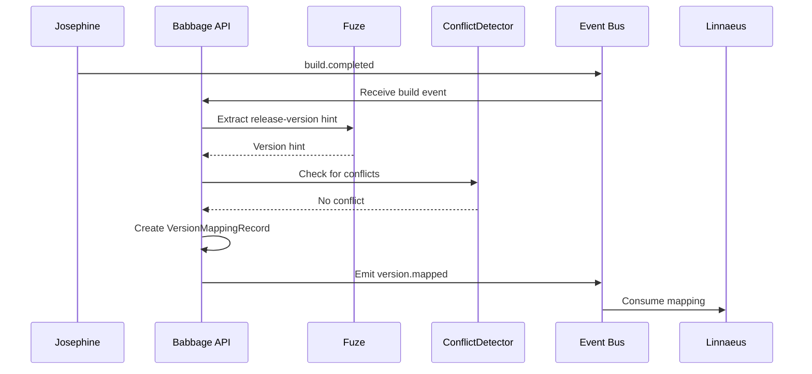
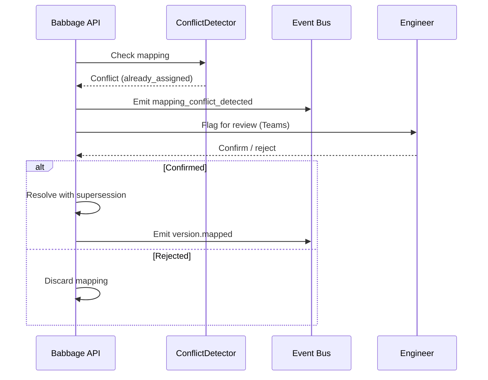

# Babbage Version Manager Plan

## Summary
Babbage should be the version-mapping agent for the platform. Its v1 job is to connect internal build identity from `fuze` with external release versions and maintain the lineage between the two.

In practical terms:
- Josephine produces the internal build identity
- Hedy decides release intent and scope
- Babbage maps internal build IDs to external versions and preserves that mapping as a durable record

Babbage should not replace `fuze`'s internal identity model. It should build a controlled mapping layer on top of it.

## Product definition
### Goal
- map internal Fuze build identities to external release versions
- maintain deterministic version lineage over time
- support lookups from internal build ID to external version and back
- surface mapping conflicts before they become release mistakes
- preserve compatibility and lineage records across promotions and replacements

### Non-goals for v1
- generating build IDs
- owning release-stage transitions
- owning traceability across tickets and requirements
- inventing a new internal identity model instead of using FuzeID

### Position in the system
- Josephine owns build identity and artifact facts
- Hedy owns release decisions and promotion workflows
- Babbage owns version mapping and version lineage
- Linnaeus consumes version mappings as part of the traceability graph

## Triggering model
- Babbage should run as an always-on version-mapping service.
- Normal work should start from build, release, and mapping requests or events.
- Humans should be able to confirm, correct, or approve mappings where policy or ambiguity requires it.

## Architecture
### Identity model
Babbage should explicitly distinguish:
- internal build identity: FuzeID
- build-map release version: human-oriented version hint such as `X.Y`
- external release version: customer or release-facing version designation
- release-stage version state: version attached to a released build in the release system

Grounding in `fuze`:
- FuzeID is the canonical internal build identifier
- releasing does not create a new FuzeID
- build maps already contain `release_version`
- packages already embed release-version and FuzeID information
- release DB records already store released version and stage information

Relevant references:
- [fuze/docs/source/fuze-fuzeid.rst](/Users/johnmacdonald/code/cornelis/fuze/docs/source/fuze-fuzeid.rst)
- [fuze/docs/source/fuze-releasing.rst](/Users/johnmacdonald/code/cornelis/fuze/docs/source/fuze-releasing.rst)
- [fuze/release.py](/Users/johnmacdonald/code/cornelis/fuze/release.py)

### Core components
- `VersionMapper`: maps build identity and release context into an external version
- `LineageRecorder`: records forward and reverse mapping relationships
- `ConflictDetector`: detects collisions, ambiguity, and policy violations
- `CompatibilityRecorder`: stores compatibility and replacement relationships where policy requires
- `VersionLookupService`: supports internal-to-external and external-to-internal lookup

Required internal objects:
- `VersionMappingRequest`
- `VersionMappingRecord`
- `VersionLineageRecord`
- `VersionConflict`
- `CompatibilityRecord`

## Mapping model
### Inputs
- `build_id` / FuzeID
- product or release name
- release context from Hedy
- branch or release-branch context
- policy profile
- optional marketing or customer-facing version rules
- existing release records and prior mappings

### Outputs
Babbage should produce:
- external version proposal
- accepted version mapping record
- version lineage record
- conflict signal when mapping cannot proceed safely

### Mapping rules
- one internal build ID may map to one or more scoped external versions only if policy explicitly allows target-specific variation
- an external version must resolve back to exact internal build identity or defined release scope
- a released external version must not silently re-point to a different internal build
- replacement and supersession must be explicit
- local or meaningless FuzeIDs must never receive customer-facing external versions

### Reverse lookup requirements
Babbage must support:
- `build_id -> external version(s)`
- `external version -> build_id(s)`
- `external version -> replacement/supersession history`

## Public API and contracts
### API surface
- `POST /v1/version-mappings`
  - input: `build_id`, release context, policy profile, optional external-version hints
  - output: proposed or accepted mapping
- `GET /v1/version-mappings/{mapping_id}`
  - returns exact mapping record and lineage
- `GET /v1/version-mappings/by-build/{build_id}`
  - returns external version mappings for a build
- `GET /v1/version-mappings/by-external/{external_version}`
  - returns internal builds and lineage for an external version
- `POST /v1/version-mappings/{mapping_id}/confirm`
  - confirms a proposed mapping when required by policy

### Internal contracts
- `VersionMappingRequest`
- `VersionMappingRecord`
- `VersionLineageRecord`
- `VersionConflict`
- `CompatibilityRecord`

## Decision and conflict model
### Conflict types
- external version already assigned to different build
- build already mapped to incompatible external version
- release scope mismatch
- non-release-eligible build attempting to receive external version
- ambiguous version hint from upstream systems

### Conflict policy
- never auto-resolve a conflicting external version by overwriting history
- emit `version.mapping_conflict_detected`
- require explicit resolution when ambiguity affects customer-visible versioning
- preserve both the attempted mapping and the rejection reason for auditability

## Integration with other agents
### Josephine
- supplies FuzeID and build metadata
- may supply build-map `release_version` as a hint, not as final truth

### Hedy
- supplies release context and target scope
- consumes Babbage mappings when creating release candidates and promotions

### Linnaeus
- consumes accepted mappings to join internal builds, releases, tests, and defects

### Hypatia
- may consume mappings for release notes, as-built docs, and version tables

## Observability and operations
### Structured events
Emit:
- `version.mapped`
- `version.mapping_proposed`
- `version.mapping_confirmed`
- `version.mapping_conflict_detected`

### Metrics
Collect:
- mapping count by product and branch
- conflict rate by policy profile
- lookup volume by direction
- supersession or replacement rate

### Operator controls
- inspect mapping lineage
- confirm or reject proposed mappings
- mark a mapping as superseded under policy
- inspect conflicts and resolution history

## Security and auditability
- use service principals for automatic mapping actions
- separate read access from conflict-resolution or confirmation privileges
- audit every mapping creation, confirmation, rejection, and supersession
- do not allow silent mutation of historical version records

## Fuze changes required
Babbage can work alongside `fuze` as-is, but the following improvements would make mapping cleaner.

### 1. Stable machine-readable release-version extraction
Expose build-map and package-level release-version hints in a cleaner service-facing form.

### 2. Stable release record lookup
Provide a clearer API for querying released version state by FuzeID and by external version.

### 3. Explicit replacement metadata
Improve structured representation of replaced or superseded releases so Babbage does not need to infer lineage from loosely structured release history fields.

## Diagrams

### Version Mapping

### Mapping Conflict

## Decision Logging & Audit Trail

Every action this agent takes is logged with full context. For decisions, the complete decision tree is recorded — what options were considered, what data was evaluated, and why the chosen path was selected.

| Log Type | What Is Captured | Example |
|----------|-----------------|---------|
| **Action log** | Every API call, event consumed, event emitted, external system interaction. Timestamped with correlation_id and agent_id. | `action=emit_event, event_type=build.completed, build_id=BLD-1234, correlation_id=abc-123` |
| **Decision log** | The full decision tree: inputs evaluated, rules applied, alternatives considered, chosen outcome, and rationale. | `decision=select_test_plan, trigger=PR, inputs=[branch=feature/x, module=opx-core], candidates=[quick_smoke, pr_standard], selected=pr_standard, reason="PR trigger + no HIL changes"` |
| **Rejection log** | When an action is rejected or blocked — what was attempted, what rule prevented it, what the agent did instead. | `decision=promote_release, attempted=sit_to_qa, blocked_by=failing_test_TES-456, action=hold_and_notify` |

All logs are stored in PostgreSQL (audit table) and streamed to Grafana/Loki. Decision logs are queryable by correlation_id, agent_id, decision type, and time range.

## Tool Use & Token Efficiency

This agent prioritizes **deterministic tools** over LLM inference wherever possible. LLM calls are reserved for tasks that genuinely require reasoning, generation, or ambiguity resolution.

| Principle | Implementation |
|-----------|---------------|
| **Deterministic first** | Policy lookups, schema validation, event routing, suite selection, version mapping, and traceability queries all use deterministic code paths. No tokens spent on work that has a known algorithm. |
| **Custom tooling** | The agent platform builds and maintains its own tool library. When a pattern repeats, it becomes a tool. Agents can also generate new tools for themselves when they identify repeated LLM-heavy patterns. |
| **Token-aware execution** | Every LLM call logs input tokens, output tokens, model used, and cost. The agent selects the smallest capable model for each task. |
| **Caching** | LLM responses for identical inputs are cached (Redis). Repeated queries hit cache instead of burning tokens. |

### Token Tracking

All token usage is logged to PostgreSQL and accumulates per agent, per day, per operation type.

| Metric | Tracked | Queryable By |
|--------|---------|-------------|
| **Per-call tokens** | input_tokens, output_tokens, model, latency_ms, cost_usd | correlation_id, agent_id, timestamp |
| **Cumulative totals** | total_input_tokens, total_output_tokens, total_cost_usd | agent_id, date range, operation type |
| **Efficiency ratio** | deterministic_actions / total_actions (target: >80%) | agent_id, date range |

## Standard Commands

Every agent responds to these standard commands in its Teams channel and via REST API.

| Command | What It Returns |
|---------|----------------|
| `/token-status` | Token usage summary: today's input/output tokens, cumulative totals, cost, efficiency ratio, comparison to 7-day average. |
| `/decision-tree` | The last N decisions made by this agent, each showing: timestamp, decision type, inputs evaluated, candidates considered, selected outcome, and rationale. |
| `/why {decision-id}` | Deep dive into a specific decision: full decision tree, all inputs, every rule evaluated, alternatives rejected and why, final rationale with links to source data. |
| `/stats` | Operational statistics: uptime, total actions today/this week/this month, success/failure rates, average latency, queue depth, active jobs, error rate trend. |
| `/work-today` | Summary of today's work: number of jobs processed, key outcomes, notable decisions, any failures or blocked items. |
| `/busy` | Current load: active jobs, queue depth, estimated drain time. Status: idle / working / busy / overloaded. |

All commands also work via the agent's REST API (e.g., `GET /v1/status/tokens`, `GET /v1/status/decisions`, `GET /v1/status/stats`).

## Teams Channel Interface

This agent has a dedicated **Microsoft Teams channel** (`#agent-{name}`) in the "Agent Workforce" team. This is the primary human interface. This channel is managed by **[Shannon](SHANNON_COMMUNICATIONS_AGENT_PLAN.md)**, the communications service agent.

| Function | How It Works |
|----------|-------------|
| **Activity feed** | The agent posts a summary of every significant action. Engineers follow along in real time. |
| **Decision notifications** | Non-trivial decisions are posted with rationale. Engineers can review and challenge. |
| **Approval requests** | When human approval is required, the agent posts an Adaptive Card with approve/reject buttons. |
| **Input requests** | When the agent needs information it cannot determine automatically, it posts a structured request. Engineers reply in-thread. |
| **Error alerts** | Failures and anomalies posted with severity and suggested actions. Critical alerts @mention the relevant team. |
| **Status queries** | Engineers can ask for status by posting in the channel. The agent responds in-thread. |

## Phased roadmap
### Phase 1. Basic mapping records
- map FuzeID to external version proposal
- support lookup by build ID and external version

Exit criteria:
- internal-to-external and external-to-internal lookups work
- mapping records are durable and queryable

### Phase 2. Conflict handling
- detect and surface version collisions and ambiguity
- require confirmation for risky mappings

Exit criteria:
- conflicting mappings are blocked and visible
- no silent overwrite of existing mappings occurs

### Phase 3. Lineage and supersession
- record replacement and supersession relationships
- expose compatibility and lineage views

Exit criteria:
- superseded external versions still resolve historically
- lineage can be traversed in both directions

### Phase 4. Release integration hardening
- tighten integration with Hedy release candidate workflows
- improve query interfaces for downstream traceability and documentation

Exit criteria:
- Hedy can consume version mappings without ambiguity
- Linnaeus and Hypatia can read mappings as stable system records

## Test and acceptance plan
### Mapping behavior
- map eligible build to external version
- reverse lookup returns original build ID
- multiple lookups return stable results

### Conflict behavior
- duplicate external version conflict detected
- ineligible build rejected
- scope mismatch conflict detected

### Lineage behavior
- superseded mapping remains historically queryable
- replacement chain is visible

### Operational behavior
- proposed mapping can be confirmed or rejected
- audit record exists for every state change

## Assumptions
- FuzeID remains the internal identity source of truth
- Hedy owns release decisions, not Babbage
- final external version policy may include human approval where risk is high
