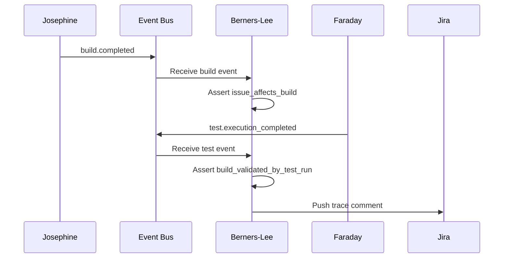
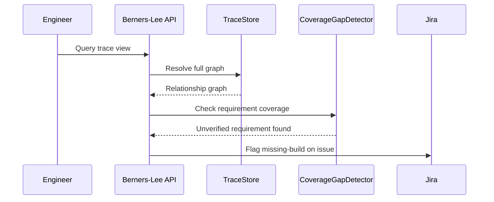

# Berners-Lee Traceability Agent Plan

## Summary
Berners-Lee should be the traceability agent for the platform. Its v1 job is to maintain exact, queryable relationships between requirements, Jira issues, commits, builds, test executions, releases, and external version mappings.

Berners-Lee should not become a vague reporting layer. It should be the system that establishes and serves relationship facts.

## Namesake

Berners-Lee is named for Tim Berners-Lee, the inventor of the World Wide Web, who showed how information becomes far more useful when it is linked, navigable, and addressable. We use his name for the traceability agent because Berners-Lee's job is to create and serve the links between requirements, issues, builds, tests, releases, and documents.

## Product definition
### Goal
- consume identity-bearing events from Jira, GitHub, Josephine, Faraday, Humphrey, Mercator, and project artifacts
- resolve and persist exact links between technical and workflow records
- expose trace views that humans and other agents can query reliably
- push narrow, evidence-backed traceability updates back into Jira where useful
- make it possible to move from any key record to the related build, test, release, and issue context

### Non-goals for v1
- replacing Jira as the issue system of record
- replacing Mercator version mapping logic
- replacing Humphrey release decisions
- building a generalized analytics platform
- inferring high-risk relationships without explicit evidence or clear policy

### Position in the system
- Josephine establishes build and artifact facts
- Faraday establishes test execution facts
- Humphrey establishes release facts
- Mercator establishes version mapping facts
- Drucker coordinates Jira workflow hygiene
- Berners-Lee establishes the authoritative relationship graph across those records

## Triggering model
- Berners-Lee should run as an always-on traceability service.
- Normal work should start from Jira, GitHub, build, test, release, and version events.
- Humans should be able to assert, correct, or suppress specific relationship records with audit trail.

## Architecture
### Core design
Berners-Lee should be split into these concerns:
- `RelationshipResolver`: resolves links between records using stable IDs and policy rules
- `TraceStore`: persists traceability records and lineage edges
- `TraceQueryService`: serves forward and reverse trace lookups
- `CoverageGapDetector`: identifies missing or incomplete links in critical chains
- `JiraTracePublisher`: writes narrow traceability comments, links, or metadata back into Jira

Required internal objects:
- `TraceabilityRecord`
- `RelationshipEdge`
- `TraceQuery`
- `CoverageGapRecord`
- `TraceAssertion`

### Identity model
Berners-Lee should anchor on stable identifiers, not fuzzy summaries.

Primary identity sources:
- FuzeID / internal build ID from Josephine
- Jira issue key
- test run or test cycle ID from Faraday / Fuze Test
- release ID from Humphrey
- external version identifier from Mercator
- commit SHA and pull request ID from GitHub
- requirement identifier from project artifacts where available

Rules:
- every stored relationship should name the source record, target record, edge type, confidence, and evidence source
- explicit links beat inferred links
- inferred links should remain visible as inferred, never silently upgraded to fact
- missing identities should produce coverage-gap records, not fabricated links

## Diagrams

### Build-Test Traceability

### Coverage Gap Detection

## Traceability model
### Inputs
- Jira issue create/update events
- GitHub pull request, merge, and commit events
- build records and artifact manifests from Josephine
- test execution records from Faraday
- release records from Humphrey
- version mappings from Mercator
- requirement mappings from project artifacts or controlled imports

### Outputs
Berners-Lee should produce:
- issue-to-build links
- build-to-test links
- build-to-release links
- build-to-version links
- requirement-to-code and requirement-to-build links where evidence exists
- coverage-gap findings for broken chains
- queryable trace views

### Relationship types
V1 should explicitly support:
- `issue_affects_build`
- `issue_fixed_in_build`
- `build_validated_by_test_run`
- `build_promoted_to_release`
- `build_mapped_to_external_version`
- `requirement_implemented_by_commit`
- `requirement_verified_by_test_run`
- `release_impacted_by_issue`

### Traceability rules
- build ID is the core technical anchor for v1
- issue links should prefer exact build association when available
- test results without a stable build reference should be retained but marked incomplete
- release context should attach to the exact build or build set promoted by Humphrey
- version mapping should come from Mercator, not be recomputed by Berners-Lee
- requirement links should be explicit unless there is a narrow approved inference rule

## Public API and contracts
### API surface
- `POST /v1/trace/assert`
  - input: source record, target record, edge type, evidence source
  - output: stored `TraceAssertion`
- `GET /v1/trace/builds/{build_id}`
  - return related issues, tests, releases, and external versions
- `GET /v1/trace/issues/{jira_key}`
  - return linked builds, tests, release relevance, and gap flags
- `GET /v1/trace/releases/{release_id}`
  - return linked builds, issues, tests, and versions
- `GET /v1/trace/requirements/{requirement_id}`
  - return linked commits, builds, and tests where available
- `GET /v1/trace/gaps`
  - return missing-link findings by project, product, or severity

### Internal contracts
- `TraceabilityRecord`
- `RelationshipEdge`
- `TraceQuery`
- `CoverageGapRecord`
- `TraceAssertion`

## Query model
### Key user questions Berners-Lee must answer
- starting from a Jira bug, which exact build or builds are affected?
- starting from a build, which tests validated it and what release used it?
- starting from a release, which issues and tests are relevant?
- starting from an external version, which internal build IDs and releases map to it?
- where is the traceability chain incomplete?

### Trace views
Berners-Lee should support:
- issue-centric view
- build-centric view
- release-centric view
- requirement-centric view
- gap-centric view for missing links

## Jira integration stance
Berners-Lee should write back into Jira carefully.

Allowed v1 write-backs:
- traceability comments
- evidence links
- missing-build-context flags
- links to trace views

Not v1 write-backs:
- arbitrary workflow transitions
- planning-field ownership
- release-state changes

That boundary keeps Berners-Lee focused on relationship truth while Drucker handles workflow hygiene and Humphrey handles release-state orchestration.

## Observability and operations
### Structured events
Emit:
- `trace.edge_created`
- `trace.edge_updated`
- `trace.gap_detected`
- `trace.jira_updated`
- `trace.query_served`

### Metrics
Collect:
- issue-to-build coverage rate
- build-to-test coverage rate
- build-to-release coverage rate
- trace gap count by class
- inferred-edge rate versus explicit-edge rate

### Operator controls
- assert or correct a relationship manually with audit trail
- suppress a known false-positive gap
- re-run trace resolution for a record scope
- inspect edge evidence for any stored relationship

## Security and approvals
- read access is required across Jira, build records, test records, release records, and version mappings
- write-back to Jira should be limited and auditable
- manual relationship corrections should be permissioned and recorded
- no hidden merges of conflicting identities
- sensitive trace views should respect product and customer scoping rules

## Fuze and platform changes required
Berners-Lee depends on cleaner identity and event surfaces than the current system provides.

### 1. Canonical event envelope
All contributing agents should emit normalized events with:
- stable record ID
- event type
- source system
- timestamp
- correlation ID

### 2. Stable build and test record schemas
Josephine and Faraday should expose machine-readable records with exact IDs, artifact references, and status summaries so Berners-Lee does not need to scrape logs.

### 3. Structured release and version outputs
Humphrey and Mercator should expose release and version mapping records directly so Berners-Lee can link them deterministically.

### 4. Trace-friendly Jira adapter
The shared Jira adapter should support:
- typed issue reads
- comment/link creation
- label or metadata updates for gap flags
- idempotent write-back behavior

## Decision Logging & Audit Trail

Every action this agent takes is logged with full context. For decisions, the complete decision tree is recorded — what options were considered, what data was evaluated, and why the chosen path was selected.

| Log Type | What Is Captured | Example |
|----------|-----------------|---------|
| **Action log** | Every API call, event consumed, event emitted, external system interaction. Timestamped with correlation_id and agent_id. | `action=emit_event, event_type=build.completed, build_id=BLD-1234, correlation_id=abc-123` |
| **Decision log** | The full decision tree: inputs evaluated, rules applied, alternatives considered, chosen outcome, and rationale. | `decision=select_test_plan, trigger=PR, inputs=[branch=feature/x, module=opx-core], candidates=[quick_smoke, pr_standard], selected=pr_standard, reason="PR trigger + no HIL changes"` |
| **Rejection log** | When an action is rejected or blocked — what was attempted, what rule prevented it, what the agent did instead. | `decision=promote_release, attempted=sit_to_qa, blocked_by=failing_test_TES-456, action=hold_and_notify` |

All logs are stored in PostgreSQL (audit table) and streamed to Grafana/Loki. Decision logs are queryable by correlation_id, agent_id, decision type, and time range.

## Tool Use & Token Efficiency

This agent prioritizes **deterministic tools** over LLM inference wherever possible. LLM calls are reserved for tasks that genuinely require reasoning, generation, or ambiguity resolution.

| Principle | Implementation |
|-----------|---------------|
| **Deterministic first** | Policy lookups, schema validation, event routing, suite selection, version mapping, and traceability queries all use deterministic code paths. No tokens spent on work that has a known algorithm. |
| **Custom tooling** | The agent platform builds and maintains its own tool library. When a pattern repeats, it becomes a tool. Agents can also generate new tools for themselves when they identify repeated LLM-heavy patterns. |
| **Token-aware execution** | Every LLM call logs input tokens, output tokens, model used, and cost. The agent selects the smallest capable model for each task. |
| **Caching** | LLM responses for identical inputs are cached (Redis). Repeated queries hit cache instead of burning tokens. |

### Token Tracking

All token usage is logged to PostgreSQL and accumulates per agent, per day, per operation type.

| Metric | Tracked | Queryable By |
|--------|---------|-------------|
| **Per-call tokens** | input_tokens, output_tokens, model, latency_ms, cost_usd | correlation_id, agent_id, timestamp |
| **Cumulative totals** | total_input_tokens, total_output_tokens, total_cost_usd | agent_id, date range, operation type |
| **Efficiency ratio** | deterministic_actions / total_actions (target: >80%) | agent_id, date range |

## Standard Commands

Every agent responds to these standard commands in its Teams channel and via REST API.

| Command | What It Returns |
|---------|----------------|
| `/token-status` | Token usage summary: today's input/output tokens, cumulative totals, cost, efficiency ratio, comparison to 7-day average. |
| `/decision-tree` | The last N decisions made by this agent, each showing: timestamp, decision type, inputs evaluated, candidates considered, selected outcome, and rationale. |
| `/why {decision-id}` | Deep dive into a specific decision: full decision tree, all inputs, every rule evaluated, alternatives rejected and why, final rationale with links to source data. |
| `/stats` | Operational statistics: uptime, total actions today/this week/this month, success/failure rates, average latency, queue depth, active jobs, error rate trend. |
| `/work-today` | Summary of today's work: number of jobs processed, key outcomes, notable decisions, any failures or blocked items. |
| `/busy` | Current load: active jobs, queue depth, estimated drain time. Status: idle / working / busy / overloaded. |

All commands also work via the agent's REST API (e.g., `GET /v1/status/tokens`, `GET /v1/status/decisions`, `GET /v1/status/stats`).

## Teams Channel Interface

This agent has a dedicated **Microsoft Teams channel** (`#agent-{name}`) in the "Agent Workforce" team. This is the primary human interface. This channel is managed by **[Shannon](SHANNON_COMMUNICATIONS_AGENT_PLAN.md)**, the communications service agent.

| Function | How It Works |
|----------|-------------|
| **Activity feed** | The agent posts a summary of every significant action. Engineers follow along in real time. |
| **Decision notifications** | Non-trivial decisions are posted with rationale. Engineers can review and challenge. |
| **Approval requests** | When human approval is required, the agent posts an Adaptive Card with approve/reject buttons. |
| **Input requests** | When the agent needs information it cannot determine automatically, it posts a structured request. Engineers reply in-thread. |
| **Error alerts** | Failures and anomalies posted with severity and suggested actions. Critical alerts @mention the relevant team. |
| **Status queries** | Engineers can ask for status by posting in the channel. The agent responds in-thread. |

## Phased roadmap
### Phase 1. Build and issue linkage
- persist issue-to-build and build-to-test relationships
- expose basic issue and build trace views

Exit criteria:
- engineers can move from a Jira issue to linked build and test facts
- missing build association is visible as a gap, not silently ignored

### Phase 2. Release and version lineage
- link builds to releases and external versions
- expose release-centric and version-aware trace views

Exit criteria:
- engineers can move from release or external version to internal build lineage
- release impact views are queryable

### Phase 3. Requirement coverage
- import or consume requirement identifiers
- add requirement-to-code and requirement-to-test linkage where supported

Exit criteria:
- at least one requirement source can be traced through code, build, and test artifacts
- coverage gaps are visible by requirement

### Phase 4. Jira feedback loop
- push narrow traceability comments and gap flags into Jira
- support controlled reverse lookups from issue workflow views

Exit criteria:
- Jira users can reach trace evidence without leaving their normal workflow blind
- write-backs remain idempotent and auditable

## Test and acceptance plan
### Linking behavior
- exact issue-to-build link is stored from explicit evidence
- build-to-test link is stored from test execution record
- build-to-release and build-to-version links resolve correctly

### Gap behavior
- missing build identity on a bug creates a gap record
- test run without build reference is retained and flagged incomplete
- conflicting identity claims do not overwrite each other silently

### Query behavior
- issue-centric view returns linked builds and tests
- build-centric view returns linked issues, releases, and versions
- gap query returns unresolved traceability holes by class

### Operational behavior
- repeated event processing is idempotent
- manual corrections remain auditable
- Jira write-backs do not duplicate comments or links

## Assumptions
- Fuze-generated internal build IDs remain the primary technical identity anchor
- Jira remains the issue and defect system of record
- Faraday and Humphrey expose stable test and release records
- requirement IDs may be partial in early phases and should be treated accordingly
