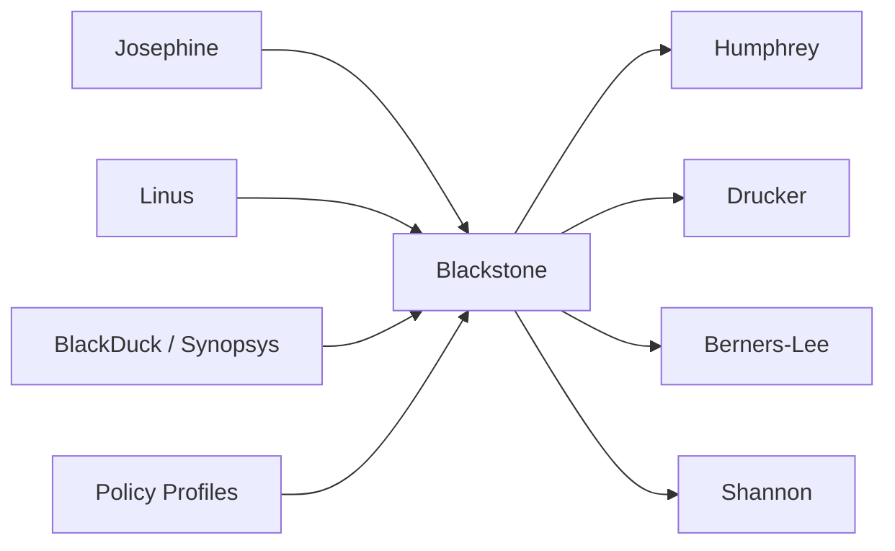
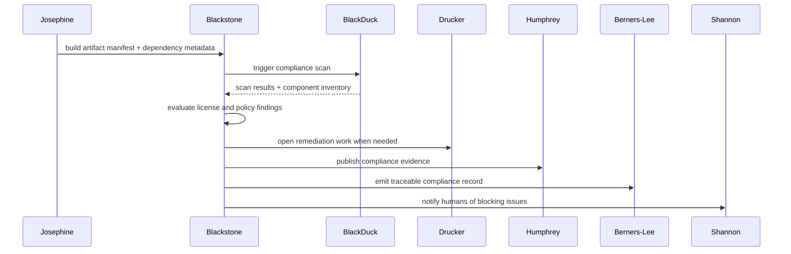

---

**Zone:** Execution Spine   |   **Status:** Wave 5   |   **Sprint:** S8–S9

## Overview

Blackstone is the legal compliance and code scanning agent for the platform. Named after William Blackstone, the English jurist whose Commentaries made legal rules durable, explainable, and easier to apply consistently.

Its v1 job is to orchestrate software composition analysis scans (BlackDuck / Synopsys), interpret results for license compliance and known vulnerabilities, maintain a software bill of materials (SBOM), and produce structured compliance evidence that Humphrey can consume as a release gate input.

Blackstone is not a generic security scanner or a vulnerability-only tool. It focuses on the legal and regulatory compliance surface: license compatibility, export control, FIPS/FedRAMP requirements, and SBOM accuracy. Humans remain the approval authority for license exceptions and regulatory waivers.

## Namesake

Blackstone is named for William Blackstone, the eighteenth-century English jurist whose Commentaries organized the common law into a durable, understandable body of rules. We use his name for the compliance agent because Blackstone turns messy policy, licensing, and regulatory obligations into clear, reviewable rules that can be applied consistently before software ships.

## Components

Component

Responsibility

**ScanOrchestrator**

Triggers and monitors BlackDuck scans, manages scan configurations per project/branch

**SBOMGenerator**

Produces and maintains software bill of materials from build artifacts and dependency manifests

**LicenseEvaluator**

Evaluates license compatibility across dependency trees, flags conflicts and unknown licenses

**VulnerabilityTriager**

Interprets CVE/vulnerability findings, prioritizes by severity and exploitability context

**RegulatoryPolicyEngine**

Evaluates compliance against export control, FIPS, FedRAMP, and sector-specific policy rules

**RemediationTracker**

Tracks remediation status for flagged findings, coordinates Jira work items via Drucker

**ComplianceReporter**

Produces structured compliance evidence records for release gating and audit

## Use Case Diagram

The following use case diagram illustrates the primary Build-Triggered Compliance Scan workflow, showing how Blackstone interacts with upstream build agents, external scanning tools, and downstream consumers of compliance evidence.

## Message Sequence Diagram

The sequence diagram below shows the step-by-step message flow for a build-triggered compliance scan, from the initial build artifact manifest through scan execution, license evaluation, SBOM generation, Jira finding creation, compliance reporting, traceability recording, and alert notification.

## Interfaces

### Inputs

Source

What

**Josephine**

Build artifacts, dependency manifests, package metadata, build IDs

**Linus**

Code-review signals when dependency changes are detected in PRs

**BlackDuck / Synopsys**

Scan results: license findings, vulnerability findings, component inventory

**Policy Profiles**

Regulatory policy rules (export control lists, FIPS requirements, license allowlists/blocklists)

**Mercator**

Version mapping for correlating scans to internal build IDs and external release versions

**Engineer / Operator**

License exception requests, regulatory waiver approvals, scan configuration overrides

### Outputs

Consumer

What

**Humphrey (Release Manager)**

Structured compliance evidence: ComplianceRecord with pass/fail/waived status per release candidate

**Drucker (Jira Coordination)**

Remediation work items: Jira tickets for license conflicts, vulnerability fixes, policy violations

**Berners-Lee (Traceability)**

Compliance relationships: scan-to-build, finding-to-component, remediation-to-release links

**Linus (Code Review)**

Dependency-risk context: license risk annotations for PRs that change dependencies

**Shannon (Communications)**

Compliance alerts, scan summaries, and status updates to Teams channels

**Audit Database**

Full scan history, finding history, remediation history, and compliance decision records

## Events

Event

Producer

Consumer(s)

Description

build.completed

Josephine

Blackstone

Triggers compliance scan for new build artifacts

compliance.scan.started

Blackstone

Shannon

Notifies that a compliance scan has been initiated

compliance.scan.completed

Blackstone

Humphrey, Shannon

Scan finished with summary of findings

compliance.finding.new

Blackstone

Drucker, Shannon

New license conflict, vulnerability, or policy violation found

compliance.evidence.ready

Blackstone

Humphrey, Berners-Lee

Structured ComplianceRecord ready for release gating

compliance.waiver.requested

Blackstone

Shannon

Human approval needed for license exception or regulatory waiver

compliance.waiver.resolved

Human (via Shannon)

Blackstone

Waiver approved or denied by compliance reviewer

sbom.updated

Blackstone

Berners-Lee, Hemingway

SBOM regenerated for a build/release

review.dependency_change

Linus

Blackstone

PR introduces dependency changes requiring license evaluation

## API

Endpoint

Method

Description

/v1/compliance/scan

POST

Trigger a compliance scan for a build ID or branch

/v1/compliance/scan/{scan_id}

GET

Get scan status and summary results

/v1/compliance/findings/{build_id}

GET

List all findings for a build

/v1/compliance/sbom/{build_id}

GET

Retrieve SBOM for a build (CycloneDX or SPDX format)

/v1/compliance/evidence/{release_id}

GET

Get structured ComplianceRecord for release gating

/v1/compliance/policy

GET

List active policy profiles and rules

/v1/compliance/policy/{profile_id}

PUT

Update a policy profile (requires human approval)

/v1/compliance/waivers

GET

List pending and resolved waivers

/v1/compliance/waivers/{waiver_id}

PUT

Resolve a waiver (approve/deny with rationale)

/v1/compliance/remediation/{finding_id}

GET

Get remediation status and linked Jira tickets

## Contracts

jsonComplianceRecord

jsonScanRequest

jsonWaiverRequest

## Use Cases

### Build-Triggered Compliance Scan

textSequence: Build-Triggered Compliance Scan

### PR Dependency Change Review

textSequence: PR Dependency Change Review

### License Exception Workflow

textSequence: License Exception Workflow

## Security

Rule

Detail

**No auto-approve waivers**

All license exceptions and regulatory waivers require human approval via Shannon

**No policy modification without review**

Policy profile changes require human approval and are audit-logged

**Evidence immutability**

ComplianceRecords are append-only with SHA-256 evidence hashes

**Scan credential isolation**

BlackDuck API credentials stored in vault, never in agent config or logs

**Audit trail**

Every scan, finding, waiver, and remediation action is logged with actor, timestamp, and rationale

## Decision Logging & Audit Trail

Blackstone logs all compliance decisions with full context:

Decision Type

Logged Context

**License evaluation**

Component, detected license, policy rule applied, compatibility result, alternatives considered

**Vulnerability triage**

CVE ID, CVSS score, exploitability assessment, component context, priority assignment rationale

**Policy evaluation**

Policy profile, rules evaluated, pass/fail per rule, aggregate result

**Waiver resolution**

Finding details, justification, approver, expiry, conditions

**Remediation tracking**

Finding, Jira ticket, status transitions, resolution evidence

## Tool Use & Token Efficiency

Blackstone is designed for maximum deterministic operation:

Operation

Method

**Scan orchestration**

Deterministic — API calls to BlackDuck, no LLM needed

**License evaluation**

Deterministic — policy rule matching against known license database

**SBOM generation**

Deterministic — dependency manifest parsing and CycloneDX/SPDX formatting

**Vulnerability triage**

Hybrid — CVSS scoring is deterministic; exploitability context assessment may use LLM

**Policy evaluation**

Deterministic — rule engine evaluation against component inventory

**Compliance reporting**

Deterministic — structured record assembly from scan results and policy evaluations

**Unknown license analysis**

LLM — when a license is not in the known database, LLM analyzes license text for compatibility

**Target:** >90% deterministic operations. LLM usage limited to unknown license analysis and complex vulnerability context assessment.

### Token Tracking

All LLM calls log: model, input tokens, output tokens, cost, and the specific task (e.g., “unknown license analysis for component X”). Token budgets are enforced per scan cycle.

## Standard Commands

Command

Returns

/token-status

Token usage: today, cumulative, cost, efficiency ratio

/decision-tree

Recent compliance decisions with inputs, rules applied, outcomes

/why {id}

Deep dive into a specific compliance decision’s full reasoning

/stats

Scan counts, finding rates, remediation velocity, compliance pass rate

/work-today

Today’s scans, findings, waivers processed, evidence records produced

/busy

Current load: idle / scanning / evaluating / overloaded

/scan-status

Status of active and recent scans

/compliance {build_id}

Compliance summary for a specific build

/sbom {build_id}

SBOM summary for a specific build

## Teams Channel Interface

Channel: #agent-blackstone in the Agent Workforce team, managed by Shannon.

Notification Type

When

**Scan started**

Compliance scan initiated for a build

**Scan completed**

Scan finished with finding summary (pass/fail/findings count)

**Critical finding**

High/critical severity license conflict or vulnerability discovered

**Waiver request**

Adaptive Card for approve/deny of license exception or regulatory waiver

**Compliance evidence ready**

ComplianceRecord produced and available for release gating

**Remediation update**

Status change on a tracked remediation item

## Implementation Phases

Phase

Scope

Depends On

**P1**

BlackDuck API adapter, scan trigger on build.completed, basic scan result parsing

Platform foundation, Josephine build events

**P2**

LicenseEvaluator with standard policy profiles, license allowlist/blocklist

P1

**P3**

SBOM generation (CycloneDX), VulnerabilityTriager with CVSS-based prioritization

P1

**P4**

ComplianceRecord production, Humphrey integration for release gating

P2, P3

**P5**

Waiver workflow via Shannon, Drucker integration for remediation Jira tickets

P4, Shannon, Drucker

**P6**

RegulatoryPolicyEngine (export control, FIPS), advanced unknown-license LLM analysis

P5

---

*Blackstone — Legal Compliance & Code Scanning Agent — AI Agent Workforce — Cornelis Networks*
