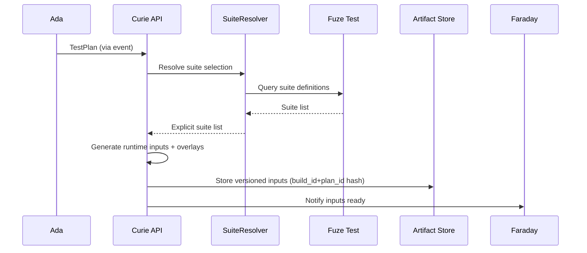
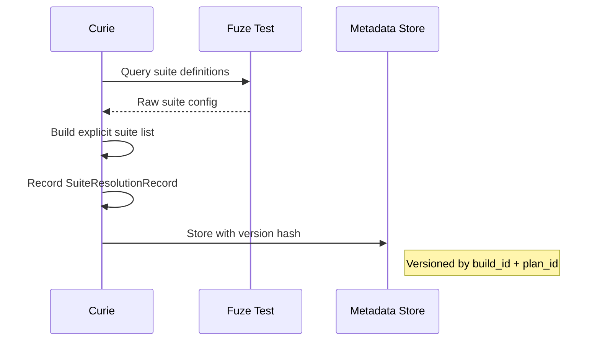

# Curie Test Generator Plan

## Summary
Curie should be the test-generation agent for the platform. Its v1 job is to take Ada's `TestPlan` and turn it into concrete Fuze Test runtime inputs that Faraday can execute through Fuze Test in [atf](/Users/johnmacdonald/code/cornelis/atf).

In practical terms:
- Ada defines the testing intent
- Curie materializes executable test content and runtime inputs
- Faraday executes the result
- Tesla supplies environment constraints where required

Curie should not invent a new low-level execution model. It should target the Fuze Test model that already exists.

## Product definition
### Goal
- consume a normalized `TestPlan`
- resolve that plan into concrete Fuze Test suite inputs
- generate explicit runtime inputs without mutating repo-tracked ATF config
- make execution inputs inspectable, reproducible, and tied to the originating build ID

### Non-goals for v1
- direct test execution
- lab reservation ownership
- replacing ATF suite selection and test case semantics
- free-form generation of arbitrary new test case logic without policy control

### Position in the system
- Ada decides what should be tested
- Curie decides how that intent becomes executable Fuze Test input
- Faraday runs the resulting inputs
- Tesla constrains generation when environment shape matters

## Triggering model
- Curie should normally run as an always-on generation service with light persistent state.
- Normal work should start from Ada-produced test plans or direct generation requests from other internal services.
- Humans should be able to request regeneration for debugging, inspection, or exceptional workflows.

## Architecture
### Core design
Curie should be split into these concerns:
- `PlanMaterializer`: converts planning intent into concrete suite and runtime inputs
- `SuiteResolver`: maps plan intent into existing Fuze Test suites and overlays
- `RuntimeInputBuilder`: creates ephemeral generated artifacts such as explicit suite lists or generated config overlays
- `GenerationExplainer`: records why a particular generated input set was produced

Required internal objects:
- `TestPlan`
- `GeneratedTestInput`
- `SuiteResolutionRecord`
- `GenerationDecisionRecord`

### Fuze Test integration
Curie should target the existing Fuze Test behaviors:
- explicit suite list through `run-atf.py --suite ...`
- configured suite list when explicitly needed
- auto-selection conventions based on project/module/runtype when appropriate
- packaged test-content overlays already supported by ATF

V1 generation strategy:
- prefer explicit suite lists over committed config mutation
- prefer runtime overlays over source edits
- preserve ATF naming and directory conventions
- record every generated input as an ephemeral, auditable artifact

## Generation model
### Inputs
- `test_plan_id`
- `build_id`
- trigger class
- suite selection intent
- module, project, module version
- runtype
- location and test setup
- environment constraints from Tesla
- coverage context
- policy profile

### Outputs
A `GeneratedTestInput` should minimally contain:
- generated input ID
- linked `test_plan_id`
- linked `build_id`
- explicit suite file list or suite manifest
- generated runtime overlays if any
- resolved include/exclude DUT filters if any
- generation explanation summary

### Generation rules
- if Ada provides explicit suite intent, materialize that as explicit suite input
- if the environment shape changes executable scope, reflect that in generated filters or overlays
- if existing ATF auto-selection is sufficient and auditable, Curie may emit a minimal generation record instead of over-specifying inputs
- generated inputs must be deterministic for the same planning inputs and policy version

## Execution topology
### Where it runs
- run Curie on normal internal service infrastructure or on planning-capable workers
- generation does not require HIL access
- generation may require access to build artifacts, ATF content, and metadata

### Artifact model
Curie should produce ephemeral artifacts such as:
- explicit suite list files
- generated tests config files
- runtime overlay directories or archives
- generation manifests

These artifacts should:
- be versioned by `build_id` and `test_plan_id`
- be available to Faraday at execution time
- not be committed back into ATF source control

## Public API and contracts
### API surface
- `POST /v1/test-inputs/generate`
  - input: `test_plan_id`, optional policy-approved overrides
  - output: `generated_input_id`, summary, artifact references
- `GET /v1/test-inputs/{generated_input_id}`
  - returns generated suite inputs, overlays, and explanation
- `GET /v1/test-inputs/{generated_input_id}/artifacts`
  - returns links to generated runtime artifacts

### Internal contracts
- `GeneratedTestInput`
- `SuiteResolutionRecord`
- `GenerationDecisionRecord`

## Observability and operations
### Structured events
Emit:
- `test.input_generation_started`
- `test.input_generated`
- `test.input_generation_failed`
- `test.input_generation_explained`

### Metrics
Collect:
- generation latency
- generated input count by trigger class
- overlay generation rate
- reuse of existing ATF auto-selection vs explicit materialization

### Operator controls
- inspect generated inputs before execution
- regenerate inputs when plan policy changes
- invalidate generated inputs when source assumptions change

## Security and access
- generated inputs must not contain long-lived secrets
- any runtime config generated from secrets should be created only in execution-adjacent storage with tight access controls
- generation artifacts should be readable by Faraday but not broadly writable across the system

## Fuze Test changes required
Curie can work with Fuze Test as it exists, but the following changes would improve generation quality.

### 1. Dry-run suite resolution
Expose a mode that resolves suite selection without executing a test cycle.

### 2. Stable suite-resolution output
Return machine-readable data for:
- selected suite files
- excluded suite files and reasons
- applied scope filters
- overlay sources used

### 3. First-class generated-input support
Support generated suite manifests, generated tests configs, and runtime overlays as official ATF inputs.

## Diagrams

### Test Input Generation

### Suite Resolution

## Decision Logging & Audit Trail

Every action this agent takes is logged with full context. For decisions, the complete decision tree is recorded — what options were considered, what data was evaluated, and why the chosen path was selected.

| Log Type | What Is Captured | Example |
|----------|-----------------|---------|
| **Action log** | Every API call, event consumed, event emitted, external system interaction. Timestamped with correlation_id and agent_id. | `action=emit_event, event_type=build.completed, build_id=BLD-1234, correlation_id=abc-123` |
| **Decision log** | The full decision tree: inputs evaluated, rules applied, alternatives considered, chosen outcome, and rationale. | `decision=select_test_plan, trigger=PR, inputs=[branch=feature/x, module=opx-core], candidates=[quick_smoke, pr_standard], selected=pr_standard, reason="PR trigger + no HIL changes"` |
| **Rejection log** | When an action is rejected or blocked — what was attempted, what rule prevented it, what the agent did instead. | `decision=promote_release, attempted=sit_to_qa, blocked_by=failing_test_TES-456, action=hold_and_notify` |

All logs are stored in PostgreSQL (audit table) and streamed to Grafana/Loki. Decision logs are queryable by correlation_id, agent_id, decision type, and time range.

## Tool Use & Token Efficiency

This agent prioritizes **deterministic tools** over LLM inference wherever possible. LLM calls are reserved for tasks that genuinely require reasoning, generation, or ambiguity resolution.

| Principle | Implementation |
|-----------|---------------|
| **Deterministic first** | Policy lookups, schema validation, event routing, suite selection, version mapping, and traceability queries all use deterministic code paths. No tokens spent on work that has a known algorithm. |
| **Custom tooling** | The agent platform builds and maintains its own tool library. When a pattern repeats, it becomes a tool. Agents can also generate new tools for themselves when they identify repeated LLM-heavy patterns. |
| **Token-aware execution** | Every LLM call logs input tokens, output tokens, model used, and cost. The agent selects the smallest capable model for each task. |
| **Caching** | LLM responses for identical inputs are cached (Redis). Repeated queries hit cache instead of burning tokens. |

### Token Tracking

All token usage is logged to PostgreSQL and accumulates per agent, per day, per operation type.

| Metric | Tracked | Queryable By |
|--------|---------|-------------|
| **Per-call tokens** | input_tokens, output_tokens, model, latency_ms, cost_usd | correlation_id, agent_id, timestamp |
| **Cumulative totals** | total_input_tokens, total_output_tokens, total_cost_usd | agent_id, date range, operation type |
| **Efficiency ratio** | deterministic_actions / total_actions (target: >80%) | agent_id, date range |

## Standard Commands

Every agent responds to these standard commands in its Teams channel and via REST API.

| Command | What It Returns |
|---------|----------------|
| `/token-status` | Token usage summary: today's input/output tokens, cumulative totals, cost, efficiency ratio, comparison to 7-day average. |
| `/decision-tree` | The last N decisions made by this agent, each showing: timestamp, decision type, inputs evaluated, candidates considered, selected outcome, and rationale. |
| `/why {decision-id}` | Deep dive into a specific decision: full decision tree, all inputs, every rule evaluated, alternatives rejected and why, final rationale with links to source data. |
| `/stats` | Operational statistics: uptime, total actions today/this week/this month, success/failure rates, average latency, queue depth, active jobs, error rate trend. |
| `/work-today` | Summary of today's work: number of jobs processed, key outcomes, notable decisions, any failures or blocked items. |
| `/busy` | Current load: active jobs, queue depth, estimated drain time. Status: idle / working / busy / overloaded. |

All commands also work via the agent's REST API (e.g., `GET /v1/status/tokens`, `GET /v1/status/decisions`, `GET /v1/status/stats`).

## Teams Channel Interface

This agent has a dedicated **Microsoft Teams channel** (`#agent-{name}`) in the "Agent Workforce" team. This is the primary human interface. This channel is managed by **[Shannon](SHANNON_COMMUNICATIONS_AGENT_PLAN.md)**, the communications service agent.

| Function | How It Works |
|----------|-------------|
| **Activity feed** | The agent posts a summary of every significant action. Engineers follow along in real time. |
| **Decision notifications** | Non-trivial decisions are posted with rationale. Engineers can review and challenge. |
| **Approval requests** | When human approval is required, the agent posts an Adaptive Card with approve/reject buttons. |
| **Input requests** | When the agent needs information it cannot determine automatically, it posts a structured request. Engineers reply in-thread. |
| **Error alerts** | Failures and anomalies posted with severity and suggested actions. Critical alerts @mention the relevant team. |
| **Status queries** | Engineers can ask for status by posting in the channel. The agent responds in-thread. |

## Phased roadmap
### Phase 1. Deterministic materialization
- generate explicit suite lists from Ada plans
- record generation artifacts and explanations

Exit criteria:
- Faraday can execute Curie-produced inputs
- generated inputs are inspectable and reproducible

### Phase 2. Overlay support
- support generated runtime overlays and plan-specific config materialization

Exit criteria:
- Curie can express plan-specific runtime input without repo mutation
- overlay artifacts remain auditable

### Phase 3. Smarter generation
- incorporate coverage gaps and environment constraints more directly into generation decisions

Exit criteria:
- generation decisions can explain why suites or overlays changed
- repeated generation for identical inputs stays deterministic

## Test and acceptance plan
### Generation behavior
- explicit suite list generation from a PR plan
- explicit suite list generation from a merge plan
- no-mutation guarantee for ATF source

### Integration behavior
- Faraday can consume generated inputs directly
- generated inputs stay linked to `build_id` and `test_plan_id`
- Tesla-provided environment constraints influence generation when required

### Operational behavior
- regenerate on policy change
- invalidate on stale input assumptions
- stable artifact retrieval for repeated queries

## Assumptions
- Curie is a distinct test-generation agent
- Ada remains the planner upstream
- Faraday remains the executor downstream
- Fuze Test remains the runtime model Curie targets
