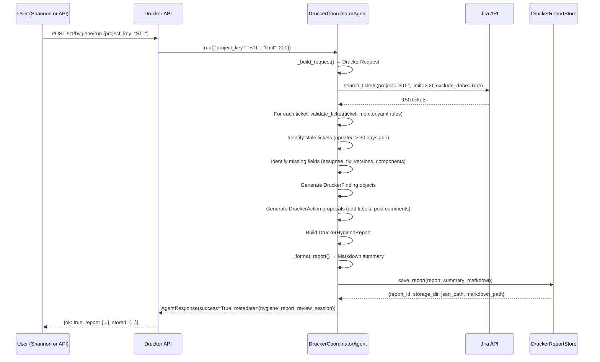
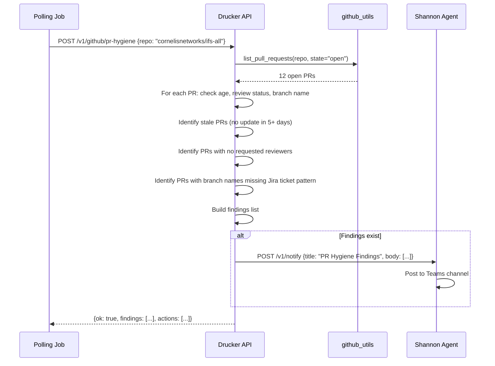
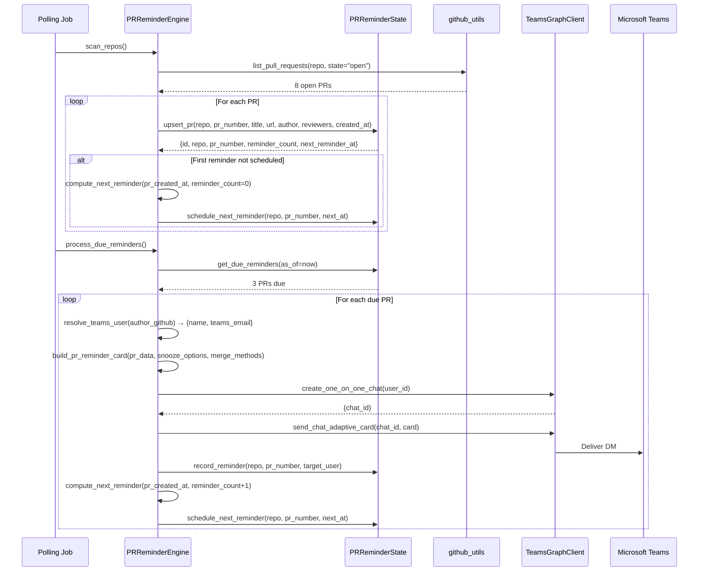

<!-- Generated by Documentation Agent — do not edit between markers -->

```yaml
---
title: "As-Built: Drucker Engineering Hygiene Agent"
date: "2026-04-06"
status: "draft"
---
```

# Drucker Engineering Hygiene Agent — Design Reference

## 1. Module Overview

The Drucker Engineering Hygiene Agent is a deterministic-first automation system that monitors Jira ticket quality and GitHub pull request lifecycle health across the Cornelis Networks engineering organization. Named after management theorist Peter Drucker, the agent identifies workflow drift, missing metadata, stale work, and routing mistakes in both Jira and GitHub, then produces actionable hygiene reports with review-gated remediation proposals. Drucker operates in dry-run mode by default, ensuring all mutation operations are previewed before execution. It exposes a REST API (port 8201), integrates with the Shannon Teams bot for interactive commands, and runs scheduled polling jobs for continuous hygiene monitoring. The agent is the most feature-rich implemented agent in the workforce, combining Jira ticket validation, GitHub PR staleness detection, PR reminder DMs via Teams, natural language query translation, and a learning subsystem that observes ticket-intake patterns to suggest metadata for new issues.

## 2. What Changed

### Before
- Drucker was a Jira-only hygiene agent with three core workflows: full project hygiene scans, single-ticket intake validation, and recent-ticket intake reports.
- GitHub PR hygiene was a planned feature but not implemented.
- No PR reminder system existed.
- No natural language query capability existed.
- The agent had no persistent activity tracking or observability into its own API usage.

### After
- **GitHub PR hygiene scanning** is fully implemented with six scan types: stale PRs, missing reviews, naming compliance, merge conflicts, CI failures, and stale branches.
- **PR reminder engine** delivers Teams DM notifications to PR authors and reviewers on configurable cadences, with snooze and merge actions via Adaptive Cards.
- **Natural language query translation** uses LLM function calling to convert plain English questions into structured Jira tool calls (e.g., "show me bugs updated in the last 24 hours" → JQL query).
- **Activity counter** tracks all API requests by category (hygiene, jira, github, nl, pr-reminders) with error counts and timestamps.
- **JQL query logging** was added to hygiene reports — the exact JQL queries used to generate each report are now stored in `report.jql_queries[]` and rendered in the Markdown summary.

### Impact
- **Shannon integration expanded**: Drucker now handles 20+ Shannon commands (up from 7), including `/pr-hygiene`, `/pr-reminder-scan`, `/ask` (NL query), and extended GitHub scans.
- **Observability improved**: The `/v1/status/*` endpoints now expose request counts, error rates, token usage (zero for deterministic paths, non-zero for NL queries), and recent decision history.
- **Deployment complexity increased**: Drucker now requires GitHub PAT credentials (`GITHUB_TOKEN`) and Teams Graph API credentials (`TEAMS_CLIENT_ID`, `TEAMS_CLIENT_SECRET`, `TEAMS_TENANT_ID`) for full functionality.
- **State layer expanded**: Five SQLite stores now manage state (activity, learning, monitor checkpoints, PR reminders, reports), up from three.

## 3. Component Diagram

```mermaid
graph TD
    subgraph "Drucker Agent (agents/drucker)"
        API[api.py<br/>FastAPI REST API]
        AGENT[agent.py<br/>DruckerCoordinatorAgent]
        CLI[cli.py<br/>Standalone CLI]
        CARDS[cards.py<br/>Adaptive Card builders]
        PR_REM[pr_reminders.py<br/>PR reminder engine]
        NL[nl_query.py<br/>NL query translator]
        JIRA_REP[jira_reporting.py<br/>Jira query wrappers]
    end

    subgraph "State Layer (agents/drucker/state)"
        ACT[activity_counter.py]
        LEARN[learning_store.py]
        MON[monitor_state.py]
        PR_STATE[pr_reminder_state.py]
        REP[report_store.py]
    end

    subgraph "External Dependencies"
        JIRA[Jira API]
        GITHUB[GitHub API]
        TEAMS[Teams Graph API]
        SHANNON[Shannon Agent]
        LLM[Cornelis LLM]
    end

    subgraph "Configuration"
        MON_CFG[config/monitor.yaml]
        POLL_CFG[config/polling.yaml]
        PR_CFG[config/pr_reminders.yaml]
        ID_MAP[config/identity_map.yaml]
    end

    API --> AGENT
    API --> PR_REM
    API --> NL
    API --> JIRA_REP
    API --> ACT
    API --> REP

    AGENT --> LEARN
    AGENT --> MON
    AGENT --> REP
    AGENT --> JIRA
    AGENT --> GITHUB

    PR_REM --> PR_STATE
    PR_REM --> GITHUB
    PR_REM --> TEAMS
    PR_REM --> CARDS

    NL --> LLM
    NL --> JIRA_REP

    CLI --> AGENT
    CLI --> PR_REM

    SHANNON --> API

    AGENT --> MON_CFG
    AGENT --> POLL_CFG
    PR_REM --> PR_CFG
    PR_REM --> ID_MAP
```



## 4. Key Flows

### Flow 1 — Jira Hygiene Scan (Full Project)

The full hygiene scan is the primary Drucker workflow. It queries all active tickets in a project, validates them against `monitor.yaml` rules, identifies stale work, and proposes low-risk remediation actions.



**Description:** The agent builds a `DruckerRequest` from the input, queries Jira for active tickets (excluding Done/Closed), validates each ticket against the `monitor.yaml` validation rules (e.g., Bug must have assignee, fix_versions, components, priority), identifies stale tickets (no update in 30+ days), detects missing required fields, generates `DruckerFinding` objects with severity (high/medium/low), proposes `DruckerAction` objects (e.g., "add label `needs-triage`", "post comment requesting assignee"), builds a `DruckerHygieneReport` with summary statistics, formats a Markdown summary, persists the report to `data/drucker_reports/<PROJECT>/<REPORT_ID>/`, and returns the report + review session to the caller. The exact JQL query used is now logged in `report.jql_queries[]` (recent change).

### Flow 2 — GitHub PR Hygiene Scan

GitHub PR hygiene scans run on a configurable schedule (default: disabled) and detect stale PRs, missing reviews, naming violations, merge conflicts, CI failures, and stale branches.



**Description:** The poller triggers a GitHub PR hygiene scan for a configured repository. The API calls `github_utils.list_pull_requests()` to fetch all open PRs with metadata (author, reviewers, created_at, updated_at, branch name). For each PR, the agent checks: (1) staleness — if `updated_at` is older than `github_stale_days` (default 5), flag as stale; (2) review coverage — if `requested_reviewers` is empty and no approvals exist, flag as missing review; (3) naming compliance — if the branch name does not match a Jira ticket pattern (e.g., `STLSW-12345`) or `[NO-JIRA]`, flag as non-compliant. Findings are aggregated and, if any exist, a notification is sent to Shannon for Teams delivery. The scan does **not** write GitHub comments or status checks — all notifications go through Shannon.

### Flow 3 — PR Reminder DM Delivery

The PR reminder engine scans configured repos, tracks open PRs in SQLite state, schedules reminders on a configurable cadence (e.g., [5, 8, 10, 15] days), resolves GitHub usernames to Teams emails via `identity_map.yaml`, and delivers interactive Adaptive Cards via Teams DM.



**Description:** The `scan_repos()` method fetches all open PRs for configured repositories and upserts them into `PRReminderState`. For new PRs (never reminded), it computes the first reminder time using the `reminder_days` schedule from `pr_reminders.yaml` (e.g., 5 days after PR creation). The `process_due_reminders()` method queries `get_due_reminders()` to find PRs where `next_reminder_at <= now` and `status = 'active'` (not snoozed, not closed). For each due PR, it resolves the GitHub username to a Teams email via `identity_map.yaml`, builds an Adaptive Card with snooze buttons ([2, 5, 7] days) and merge buttons ([squash, merge, rebase]), creates a 1:1 Teams chat via Graph API, delivers the card, records the reminder in state, increments `reminder_count`, and schedules the next reminder. If the user clicks "Snooze 5d", the API endpoint `/v1/github/pr-reminders/snooze` updates `snoozed_until` and `status = 'snoozed'`; the `unsnooze_expired()` method reactivates snoozed PRs when the window elapses.

## 5. Data Model

### Core Models (`agents/drucker/models.py`)

| Model | Fields | Description |
|---|---|---|
| `DruckerRequest` | `project_key`, `ticket_key`, `limit`, `include_done`, `stale_days`, `jql`, `since`, `recent_only`, `label_prefix`, `requested_by`, `approved_by`, `correlation_id`, `trigger` | Input request for hygiene analysis |
| `DruckerFinding` | `finding_id`, `ticket_key`, `category`, `severity`, `title`, `description`, `evidence[]`, `recommendation`, `action_ids[]` | Single hygiene violation |
| `DruckerAction` | `action_id`, `ticket_key`, `action_type`, `title`, `description`, `finding_ids[]`, `confidence`, `comment`, `update_fields{}`, `transition_to` | Proposed Jira write-back |
| `DruckerHygieneReport` | `report_id`, `project_key`, `created_at`, `request{}`, `project_info{}`, `summary{}`, `findings[]`, `proposed_actions[]`, `tickets[]`, `errors[]`, `summary_markdown`, `jql_queries[]` | Complete hygiene report |

### State Stores (SQLite)

| Store | Tables | Purpose |
|---|---|---|
| `ActivityCounter` | `activity(category, request_count, error_count, first_request_at, last_request_at)` | API request tracking by category |
| `DruckerLearningStore` | `observations`, `keyword_patterns`, `reporter_profiles`, `learned_tickets` | Ticket-intake pattern learning |
| `DruckerMonitorState` | `checkpoints`, `processed_tickets`, `validation_history` | Intake checkpoint tracking |
| `PRReminderState` | `pr_reminders`, `reminder_history` | PR reminder lifecycle |
| `DruckerReportStore` | Filesystem: `data/drucker_reports/<PROJECT>/<REPORT_ID>/report.json` | Hygiene report persistence |

### Validation Rules (`config/monitor.yaml`)

```yaml
validation_rules:
  Bug:
    required: [assignee, fix_versions, components, priority]
    warn: [description]
  Story:
    required: [assignee, fix_versions, components]
    warn: [description]
  Task:
    required: [assignee, fix_versions, components]
    warn: [description]
  Epic:
    required: [assignee]
    warn: [description]
```

## 6. Dependencies

| Dependency | Purpose | Version |
|---|---|---|
| `fastapi` | REST API framework | N/A |
| `pydantic` | Request/response validation | N/A |
| `uvicorn` | ASGI server | N/A |
| `jira` (via `jira_utils`) | Jira REST API client | N/A |
| `PyGithub` (via `github_utils`) | GitHub REST API client | N/A |
| `msal` (via `TeamsGraphClient`) | Microsoft Graph API authentication | N/A |
| `httpx` (via `TeamsGraphClient`) | Async HTTP client for Graph API | N/A |
| `yaml` | Config file parsing | Python stdlib |
| `sqlite3` | State persistence | Python stdlib |
| `litellm` (via `CornelisLLM`) | LLM function calling for NL queries | N/A |
| `dotenv` | Environment variable loading | N/A |

## 7. Configuration

### Environment Variables

| Variable | Required | Default | Description |
|---|---|---|---|
| `JIRA_URL` | Yes | — | Jira instance URL (e.g., `https://cornelisnetworks.atlassian.net`) |
| `JIRA_SERVICE_EMAIL` | Yes | — | Jira service account email |
| `JIRA_SERVICE_API_TOKEN` | Yes | — | Jira service account API token |
| `GITHUB_TOKEN` | No | — | GitHub PAT with `repo` + `read:org` scopes (required for GitHub scans) |
| `GITHUB_API_URL` | No | `https://api.github.com` | GitHub API base URL |
| `TEAMS_CLIENT_ID` | No | — | Azure AD app client ID (required for PR reminders) |
| `TEAMS_CLIENT_SECRET` | No | — | Azure AD app client secret |
| `TEAMS_TENANT_ID` | No | — | Azure AD tenant ID |
| `DRY_RUN` | No | `true` | Mutation safety flag (set to `false` to execute Jira writes) |
| `LOG_LEVEL` | No | `INFO` | Logging verbosity |
| `STATE_BACKEND` | No | `json` | State backend type (unused by Drucker) |
| `PERSISTENCE_DIR` | No | `/data/state` | State directory (unused by Drucker) |

### Configuration Files

| File | Purpose |
|---|---|
| `agents/drucker/config/monitor.yaml` | Jira field validation rules, learning subsystem config |
| `agents/drucker/config/polling.yaml` | Polling job definitions, GitHub repo list, scan intervals |
| `agents/drucker/config/pr_reminders.yaml` | PR reminder cadences, snooze options, merge methods |
| `config/identity_map.yaml` | GitHub username → Teams email mapping |
| `agents/drucker/prompts/system.md` | Agent system prompt |

### Feature Flags (Polling Jobs)

All GitHub scan jobs are **disabled by default** in `polling.yaml`:

```yaml
jobs:
  - job_id: hygiene-scan
    scan_type: jira
    # enabled: true (implicit)

  - job_id: recent-ticket-intake
    scan_type: jira
    recent_only: true
    # enabled: true (implicit)

  - job_id: github-hygiene-scan
    scan_type: github
    enabled: false  # Explicit disable

  - job_id: github-extended-scan
    scan_type: github-extended
    enabled: false

  - job_id: github-pr-reminders
    scan_type: github-pr-reminders
    enabled: false
```

## 8. Error Handling

### Dry-Run Safety

All mutation operations default to `dry_run: true`. This applies to:
- Jira field updates (`update_ticket`)
- Jira transitions (`transition_ticket`)
- Jira comment writes (`add_ticket_comment`)
- GitHub PR merges (`/v1/github/pr-reminders/merge`)

To override, pass `dry_run=false` in the request body or set `DRY_RUN=false` in the environment.

### Connection Errors

| Error Type | Handling |
|---|---|
| `JiraConnectionError` | Raised by `jira_utils.connect_to_jira()` if credentials are invalid or Jira is unreachable. Logged and returned as `AgentResponse.error_response()`. |
| `GitHubConnectionError` | Raised by `github_utils` if `GITHUB_TOKEN` is missing or invalid. Logged and returned as `{ok: false, error: ...}`. |
| `TeamsGraphError` | Raised by `TeamsGraphClient` if Graph API credentials are invalid or user resolution fails. Logged and returned as `{ok: false, error: ...}`. |

### State Store Errors

All SQLite stores (`ActivityCounter`, `DruckerLearningStore`, `DruckerMonitorState`, `PRReminderState`) follow a consistent error-handling pattern:

1. **Connection guard:** Every public method calls `_require_conn()`, which raises `RuntimeError('... connection is closed')` if `close()` has been called.
2. **Thread safety:** All database operations are wrapped in `with self._lock:` blocks using `threading.RLock`.
3. **Idempotent writes:** All insert operations use `INSERT ... ON CONFLICT DO UPDATE` (SQLite UPSERT).

### LLM Errors

The NL query translator (`nl_query.py`) wraps LLM calls in try/except:

```python
try:
    result = executor(tool_args)
except Exception as e:
    log.error(f'NL query tool execution failed: {tool_name} — {e}')
    return {'ok': False, 'error': str(e), 'tool_used': tool_name, 'tool_args': tool_args}
```

## 9. Known Limitations / Technical Debt

### 1. Duplicated Repository Lists

The 25-repository list appears in both `polling.yaml` (`defaults.github_repos`) and `pr_reminders.yaml` (`repos`). These lists are manually synchronized. Any addition or removal must be applied to both files, creating a maintenance risk. **Recommendation:** Consolidate to a single canonical source (e.g., `config/github_repos.yaml`) and reference it from both configs.

### 2. Empty Project Keys in Config

Both `monitor.yaml` (`project: ''`) and `polling.yaml` (`defaults.project_key: ''`) contain empty strings. These are hardcoded placeholders that must be populated at runtime or via an external mechanism. There is no documented contract for how this resolution occurs. **Recommendation:** Require `project_key` as a mandatory CLI argument or environment variable, and fail fast if missing.

### 3. All GitHub Jobs Disabled by Default

The three GitHub scan jobs (`github-hygiene-scan`, `github-extended-scan`, `github-pr-reminders`) are all set to `enabled: false`. This suggests the GitHub scanning capability is not yet production-ready or is gated behind an external activation step. **Recommendation:** Document the activation procedure or remove the jobs from the default config if they are experimental.

### 4. No Schema Validation for Config Files

There is no JSON Schema or equivalent validation definition for `monitor.yaml`, `polling.yaml`, or `pr_reminders.yaml`. Typos in key names (e.g., `reminder_day` instead of `reminder_days`) would silently produce incorrect behavior. **Recommendation:** Add Pydantic models for config validation and fail fast on schema violations.

### 5. Hardcoded Label Prefix

`defaults.label_prefix: drucker` is a hardcoded string that will be applied as Jira labels. Changing the agent's identity would require updating this value. **Recommendation:** Make `label_prefix` configurable per deployment or derive it from the agent name.

### 6. No Retry Logic for Graph API Calls

The `TeamsGraphClient` does not implement retry logic for transient Graph API failures (e.g., 429 rate limit, 503 service unavailable). A single failed DM delivery will abort the reminder for that PR. **Recommendation:** Add exponential backoff retry logic to `TeamsGraphClient`.

### 7. No Deduplication for PR Reminder Notifications

The PR reminder engine does not suppress repeat notifications for the same PR within a configurable window. If a PR is due for a reminder and the poller runs twice in quick succession, the user will receive duplicate DMs. **Recommendation:** Add a `last_notified_at` timestamp to `pr_reminders` and skip reminders if `now - last_notified_at < notification_window`.

### 8. No Observability for Learning Store Predictions

The `DruckerLearningStore` tracks observations and computes confidence scores, but there is no API endpoint or CLI command to inspect the learned patterns or prediction accuracy. **Recommendation:** Add `/v1/learning/patterns` and `/v1/learning/accuracy` endpoints.

### 9. No Cleanup for Closed PRs in State

The `PRReminderState` marks PRs as `status = 'closed'` or `status = 'merged'`, but these rows are never deleted. Over time, the `pr_reminders` table will accumulate stale rows. **Recommendation:** Add a cleanup job that deletes rows where `status IN ('closed', 'merged')` and `last_reminded_at < now - 90 days`.

### 10. No Rate Limiting for API Endpoints

The Drucker API has no rate limiting or request throttling. A malicious or misconfigured client could overwhelm the service with `/v1/hygiene/run` requests. **Recommendation:** Add rate limiting middleware (e.g., `slowapi` for FastAPI).

<!-- End Documentation Agent generated content -->