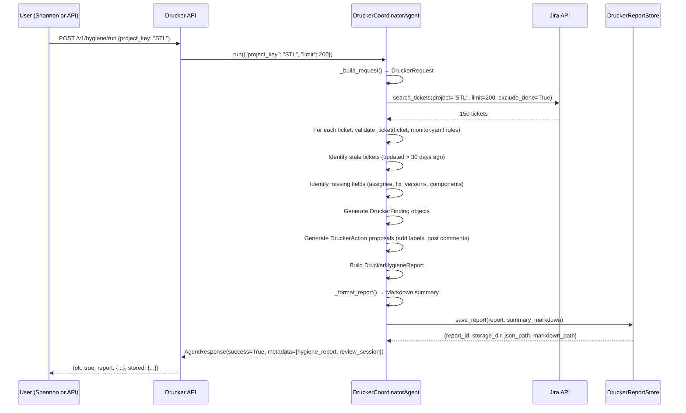
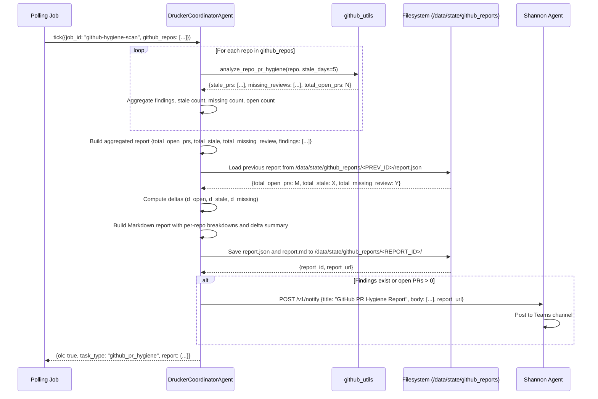
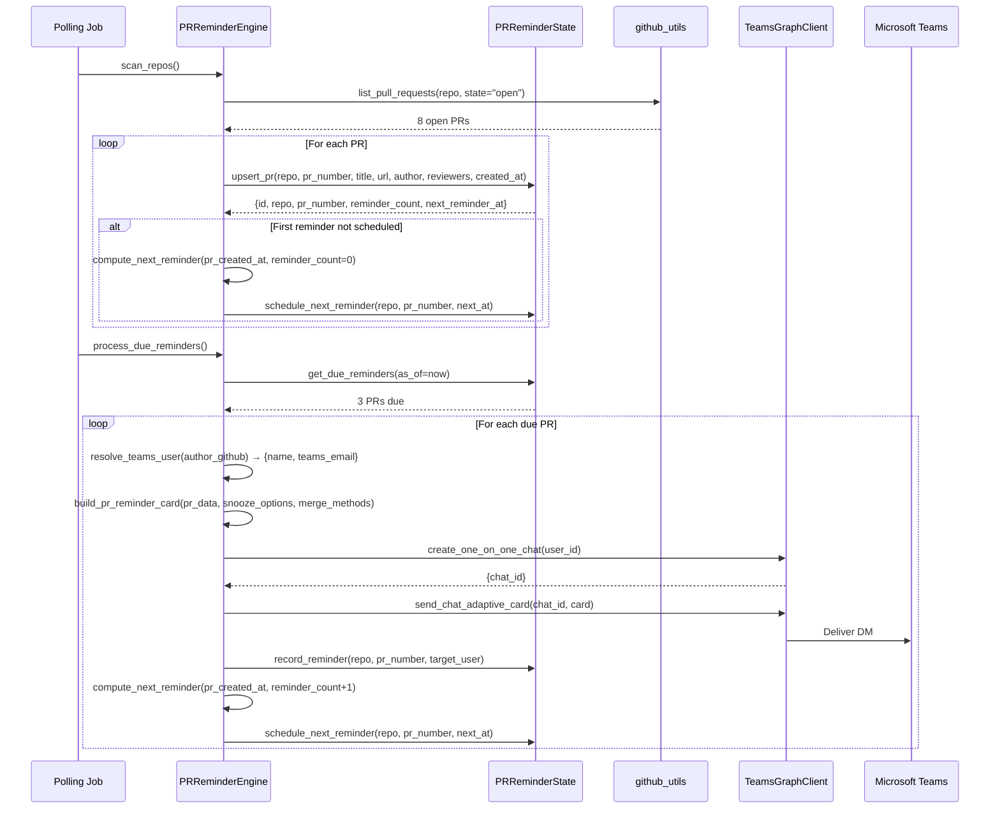

<!-- Generated by Documentation Agent — do not edit between markers -->

```yaml
---
title: "As-Built: Drucker Engineering Hygiene Agent"
date: "2026-04-08"
status: "draft"
---
```

# Drucker Engineering Hygiene Agent — Design Reference

## 1. Module Overview

The Drucker Engineering Hygiene Agent is a deterministic-first automation system that monitors Jira ticket quality and GitHub pull request lifecycle health across the Cornelis Networks engineering organization. Named after management theorist Peter Drucker, the agent identifies workflow drift, missing metadata, stale work, and routing mistakes in both Jira and GitHub, then produces actionable hygiene reports with review-gated remediation proposals. Drucker operates in dry-run mode by default, ensuring all mutation operations are previewed before execution. It exposes a REST API (port 8201), integrates with the Shannon Teams bot for interactive commands, and runs scheduled polling jobs for continuous hygiene monitoring. The agent is the most feature-rich implemented agent in the workforce, combining Jira ticket validation, GitHub PR staleness detection, PR reminder DMs via Teams, natural language query translation, and a learning subsystem that observes ticket-intake patterns to suggest metadata for new issues.

## 2. What Changed

### Before
- Drucker was a Jira-only hygiene agent with three core workflows: full project hygiene scans, single-ticket intake validation, and recent-ticket intake reports.
- GitHub PR hygiene was a planned feature but not implemented.
- **GitHub PR hygiene scans generated one notification per repository**, resulting in notification spam when scanning 20+ repositories.
- **GitHub PR hygiene reports were ephemeral** — no persistent storage or web-accessible report viewer existed.
- **No delta reporting existed** — each scan was presented in isolation without comparison to previous scans.

### After
- **GitHub PR hygiene scanning** is fully implemented with six scan types: stale PRs, missing reviews, naming compliance, merge conflicts, CI failures, and stale branches.
- **Aggregated GitHub PR hygiene reports**: The `github-hygiene-scan` polling job now aggregates findings across all configured repositories into a single report with overall statistics, per-repo breakdowns, and delta comparison to the previous scan.
- **Persistent GitHub hygiene reports**: Reports are saved to `/data/state/github_reports/<REPORT_ID>/` with both JSON and Markdown artifacts. A web-accessible report viewer is available at `/v1/github/hygiene/report/{report_id}`.
- **Delta reporting**: Each GitHub hygiene scan compares total open PRs, stale PRs, and missing-review PRs to the previous scan and includes delta metrics (e.g., "+3 stale PRs since yesterday") in the notification.
- **Single notification per scan**: Instead of one notification per repository, Drucker now sends one summary notification per polling cycle with a breakdown of repos with activity and a link to the full report.
- **PR reminder engine** delivers Teams DM notifications to PR authors and reviewers on configurable cadences, with snooze and merge actions via Adaptive Cards.
- **Natural language query translation** uses LLM function calling to convert plain English questions into structured Jira tool calls (e.g., "show me bugs updated in the last 24 hours" → JQL query).
- **Activity counter** tracks all API requests by category (hygiene, jira, github, nl, pr-reminders) with error counts and timestamps.
- **JQL query logging** was added to hygiene reports — the exact JQL queries used to generate each report are now stored in `report.jql_queries[]` and rendered in the Markdown summary.

### Impact
- **Shannon integration expanded**: Drucker now handles 20+ Shannon commands (up from 7), including `/pr-hygiene`, `/pr-reminder-scan`, `/ask` (NL query), and extended GitHub scans.
- **Observability improved**: The `/v1/status/*` endpoints now expose request counts, error rates, token usage (zero for deterministic paths, non-zero for NL queries), and recent decision history.
- **Deployment complexity increased**: Drucker now requires GitHub PAT credentials (`GITHUB_TOKEN`) and Teams Graph API credentials (`TEAMS_CLIENT_ID`, `TEAMS_CLIENT_SECRET`, `TEAMS_TENANT_ID`) for full functionality.
- **State layer expanded**: Five SQLite stores now manage state (activity, learning, monitor checkpoints, PR reminders, reports), up from three.
- **Notification noise reduced**: GitHub hygiene scans now generate one notification per polling cycle instead of one per repository, reducing Teams channel noise by ~95% (from 20+ notifications to 1).
- **Report persistence enables trend analysis**: Stored GitHub hygiene reports allow teams to track PR hygiene trends over time and identify repositories with chronic stale-PR issues.

## 3. Component Diagram

```mermaid
graph TD
    subgraph "Drucker Agent (agents/drucker)"
        API[api.py<br/>FastAPI REST API]
        AGENT[agent.py<br/>DruckerCoordinatorAgent]
        CLI[cli.py<br/>Standalone CLI]
        CARDS[cards.py<br/>Adaptive Card builders]
        PR_REM[pr_reminders.py<br/>PR reminder engine]
        NL[nl_query.py<br/>NL query translator]
        JIRA_REP[jira_reporting.py<br/>Jira query wrappers]
    end

    subgraph "State Layer (agents/drucker/state)"
        ACT[activity_counter.py]
        LEARN[learning_store.py]
        MON[monitor_state.py]
        PR_STATE[pr_reminder_state.py]
        REP[report_store.py]
        GH_REP[/data/state/github_reports/]
    end

    subgraph "External Dependencies"
        JIRA[Jira API]
        GITHUB[GitHub API]
        TEAMS[Teams Graph API]
        SHANNON[Shannon Agent]
        LLM[Cornelis LLM]
    end

    subgraph "Configuration"
        MON_CFG[config/monitor.yaml]
        POLL_CFG[config/polling.yaml]
        PR_CFG[config/pr_reminders.yaml]
        ID_MAP[config/identity_map.yaml]
    end

    API --> AGENT
    API --> PR_REM
    API --> NL
    API --> JIRA_REP
    API --> ACT
    API --> REP
    API --> GH_REP

    AGENT --> LEARN
    AGENT --> MON
    AGENT --> REP
    AGENT --> GH_REP
    AGENT --> JIRA
    AGENT --> GITHUB

    PR_REM --> PR_STATE
    PR_REM --> GITHUB
    PR_REM --> TEAMS
    PR_REM --> CARDS

    NL --> LLM
    NL --> JIRA_REP

    CLI --> AGENT
    CLI --> PR_REM

    SHANNON --> API

    AGENT --> MON_CFG
    AGENT --> POLL_CFG
    PR_REM --> PR_CFG
    PR_REM --> ID_MAP
```



## 4. Key Flows

### Flow 1 — Jira Hygiene Scan (Full Project)

The full hygiene scan is the primary Drucker workflow. It queries all active tickets in a project, validates them against `monitor.yaml` rules, identifies stale work, and proposes low-risk remediation actions.



**Description:** The agent builds a `DruckerRequest` from the input, queries Jira for active tickets (excluding Done/Closed), validates each ticket against the `monitor.yaml` validation rules (e.g., Bug must have assignee, fix_versions, components, priority), identifies stale tickets (no update in 30+ days), detects missing required fields, generates `DruckerFinding` objects with severity (high/medium/low), proposes `DruckerAction` objects (e.g., "add label `needs-triage`", "post comment requesting assignee"), builds a `DruckerHygieneReport` with summary statistics, formats a Markdown summary, persists the report to `data/drucker_reports/<PROJECT>/<REPORT_ID>/`, and returns the report + review session to the caller. The exact JQL query used is now logged in `report.jql_queries[]` (recent change).

### Flow 2 — GitHub PR Hygiene Scan (Aggregated Multi-Repo)

GitHub PR hygiene scans run on a configurable schedule (default: enabled) and detect stale PRs, missing reviews, naming violations, merge conflicts, CI failures, and stale branches across all configured repositories. The scan aggregates findings into a single report with delta comparison to the previous scan.



**Description:** The poller triggers a GitHub PR hygiene scan for all configured repositories (defined in `polling.yaml`). For each repository, the agent calls `github_utils.analyze_repo_pr_hygiene()` to fetch all open PRs with metadata (author, reviewers, created_at, updated_at, branch name). For each PR, the agent checks: (1) staleness — if `updated_at` is older than `github_stale_days` (default 5), flag as stale; (2) review coverage — if `requested_reviewers` is empty and no approvals exist, flag as missing review. Findings are aggregated across all repositories into a single report with overall statistics (`total_open_prs`, `total_stale`, `total_missing_review`). The agent loads the previous scan's report from `/data/state/github_reports/` and computes deltas (e.g., "+3 stale PRs since yesterday"). A Markdown report is generated with per-repo breakdowns (stale PRs, missing reviews) and a delta summary. The report is saved to `/data/state/github_reports/<REPORT_ID>/` with both JSON and Markdown artifacts. If findings exist or open PRs > 0, a single notification is sent to Shannon with a summary of repos with activity and a link to the full report. The scan does **not** write GitHub comments or status checks — all notifications go through Shannon.

### Flow 3 — PR Reminder DM Delivery

The PR reminder engine scans configured repos, tracks open PRs in SQLite state, schedules reminders on a configurable cadence (e.g., [5, 8, 10, 15] days), resolves GitHub usernames to Teams emails via `identity_map.yaml`, and delivers interactive Adaptive Cards via Teams DM.



**Description:** The `scan_repos()` method fetches all open PRs for configured repositories and upserts them into `PRReminderState`. For new PRs (never reminded), it computes the first reminder time using the `reminder_days` schedule from `pr_reminders.yaml` (e.g., 5 days after PR creation). The `process_due_reminders()` method queries `get_due_reminders()` to find PRs where `next_reminder_at <= now` and `status = 'active'` (not snoozed, not closed). For each due PR, it resolves the GitHub username to a Teams email via `identity_map.yaml`, builds an Adaptive Card with snooze buttons ([2, 5, 7] days) and merge buttons ([squash, merge, rebase]), creates a 1:1 Teams chat via Graph API, delivers the card, records the reminder in state, increments `reminder_count`, and schedules the next reminder. If the user clicks "Snooze 5d", the API endpoint `/v1/github/pr-reminders/snooze` updates `snoozed_until` and `status = 'snoozed'`; the `unsnooze_expired()` method reactivates snoozed PRs when the window elapses.

## 5. Data Model

### Core Models (`agents/drucker/models.py`)

| Model | Fields | Description |
|---|---|---|
| `DruckerRequest` | `project_key`, `ticket_key`, `limit`, `include_done`, `stale_days`, `jql`, `since`, `recent_only`, `label_prefix`, `requested_by`, `approved_by`, `correlation_id`, `trigger` | Input request for hygiene analysis |
| `DruckerFinding` | `finding_id`, `ticket_key`, `category`, `severity`, `title`, `description`, `evidence[]`, `recommendation`, `action_ids[]` | Single hygiene violation |
| `DruckerAction` | `action_id`, `ticket_key`, `action_type`, `title`, `description`, `finding_ids[]`, `confidence`, `comment`, `update_fields{}`, `transition_to` | Proposed Jira write-back |
| `DruckerHygieneReport` | `report_id`, `project_key`, `created_at`, `request{}`, `project_info{}`, `summary{}`, `findings[]`, `proposed_actions[]`, `tickets[]`, `errors[]`, `summary_markdown`, `jql_queries[]` | Complete hygiene report |

### State Stores (SQLite)

| Store | Tables | Purpose |
|---|---|---|
| `ActivityCounter` | `activity(category, request_count, error_count, first_request_at, last_request_at)` | API request tracking by category |
| `DruckerLearningStore` | `observations`, `keyword_patterns`, `reporter_profiles`, `learned_tickets` | Ticket-intake pattern learning |
| `DruckerMonitorState` | `checkpoints`, `processed_tickets`, `validation_history` | Intake checkpoint tracking |
| `PRReminderState` | `pr_reminders`, `reminder_history` | PR reminder lifecycle |
| `DruckerReportStore` | Filesystem: `data/drucker_reports/<PROJECT>/<REPORT_ID>/report.json` | Hygiene report persistence |

### GitHub Hygiene Reports (Filesystem)

**Storage Path:** `/data/state/github_reports/<REPORT_ID>/`

**Files:**
- `report.json` — Aggregated scan results with per-repo findings
- `report.md` — Markdown-formatted report with per-repo breakdowns

**JSON Schema:**
```json
{
  "report_type": "github_pr_hygiene",
  "repos_scanned": 22,
  "repos_with_errors": 0,
  "total_findings": 15,
  "total_stale": 8,
  "total_missing_review": 7,
  "total_open_prs": 45,
  "findings": [
    {
      "repo": "cornelisnetworks/ifs-all",
      "pr": {"number": 623, "title": "...", "author": "...", "html_url": "..."},
      "category": "stale_pr",
      "days_stale": 12
    }
  ],
  "repo_summaries": [
    "cornelisnetworks/ifs-all: 12 open, 3 stale, 2 no review"
  ],
  "errors": []
}
```

**Markdown Structure:**
```markdown
# GitHub PR Hygiene Report

**Report ID:** abc12345  
**Scan Date:** 2026-04-08 14:30 UTC  
**Repos Scanned:** 22  

## Overall Stats

| Metric | Value |
|--------|-------|
| Repos Scanned | 22 |
| Total Open PRs | 45 |
| Stale PRs (>5 days) | 8 |
| Missing Reviews | 7 |
| Total Findings | 15 |
| Scan Errors | 0 |

## cornelisnetworks/ifs-all

Open PRs: 12 | Findings: 5

### Stale PRs

- [#623](https://github.com/cornelisnetworks/ifs-all/pull/623) — Fix memory leak in OPX driver (by jdoe, 12 days stale)

### Missing Reviews

- [#625](https://github.com/cornelisnetworks/ifs-all/pull/625) — Add CI workflow for kernel 6.1 (by jsmith, no reviews)

---
*Generated by Drucker Engineering Hygiene Agent on 2026-04-08 14:30 UTC*
```

### Validation Rules (`config/monitor.yaml`)

```yaml
validation_rules:
  Bug:
    required: [assignee, fix_versions, components, priority]
    warn: [description]
  Story:
    required: [assignee, fix_versions, components]
    warn: [description]
  Task:
    required: [assignee, fix_versions, components]
    warn: [description]
  Epic:
    required: [assignee]
    warn: [description]
```

### Polling Configuration (`config/polling.yaml`)

```yaml
defaults:
  notify_shannon: true
  github_stale_days: 5

jobs:
  - job_id: "github-hygiene-scan"
    scan_type: "github"
    enabled: true
    notify_shannon: true
    github_repos: [...]  # 22 production repos
```

## 6. Dependencies

| Dependency | Purpose | Version |
|---|---|---|
| `fastapi` | REST API framework | N/A |
| `pydantic` | Request/response validation | N/A |
| `uvicorn` | ASGI server | N/A |
| `jira` (via `jira_utils`) | Jira REST API client | N/A |
| `PyGithub` (via `github_utils`) | GitHub REST API client | N/A |
| `msal` (via `TeamsGraphClient`) | Microsoft Graph API authentication | N/A |
| `httpx` (via `TeamsGraphClient`) | Async HTTP client for Graph API | N/A |
| `yaml` | Config file parsing | Python stdlib |
| `sqlite3` | State persistence | Python stdlib |
| `litellm` (via `CornelisLLM`) | LLM function calling for NL queries | N/A |
| `dotenv` | Environment variable loading | N/A |
| `apscheduler` | Scheduled polling job execution | N/A |
| `markdown` (optional) | Markdown-to-HTML conversion for report viewer | N/A |

## 7. Configuration

### Environment Variables

| Variable | Required | Default | Description |
|---|---|---|---|
| `JIRA_SERVICE_EMAIL` | Yes | — | Jira service account email |
| `JIRA_SERVICE_API_TOKEN` | Yes | — | Jira service account API token |
| `JIRA_URL` | Yes | — | Jira instance base URL |
| `GITHUB_TOKEN` | For GitHub scans | — | GitHub PAT with `repo` + `read:org` scopes |
| `GITHUB_API_URL` | No | `https://api.github.com` | GitHub API base URL |
| `TEAMS_CLIENT_ID` | For PR reminders | — | Azure AD app client ID |
| `TEAMS_CLIENT_SECRET` | For PR reminders | — | Azure AD app client secret |
| `TEAMS_TENANT_ID` | For PR reminders | — | Azure AD tenant ID |
| `DRY_RUN` | No | `true` | Mutation safety flag |
| `DRUCKER_REPORT_DIR` | No | `data/drucker_reports` | Jira hygiene report storage directory |
| `DRUCKER_MONITOR_STATE_DB` | No | `data/drucker_monitor_state.db` | Monitor checkpoint database path |
| `DRUCKER_LEARNING_DB` | No | `data/drucker_learning.db` | Learning store database path |
| `DRUCKER_ACTIVITY_DB` | No | `data/drucker_activity.db` | Activity counter database path |

### Configuration Files

| File | Purpose |
|---|---|
| `config/monitor.yaml` | Jira validation rules per issue type |
| `config/polling.yaml` | Polling job definitions and schedules |
| `config/pr_reminders.yaml` | PR reminder policies per repository |
| `config/identity_map.yaml` | GitHub username → Teams email mapping |

### Feature Flags

| Flag | Location | Default | Description |
|---|---|---|---|
| `learning.enabled` | `monitor.yaml` | `true` | Enable ML-based field suggestions |
| `defaults.persist` | `polling.yaml` | `true` | Persist scan results to storage |
| `defaults.notify_shannon` | `polling.yaml` | `true` | Send notifications to Shannon |
| `jobs[*].enabled` | `polling.yaml` | varies | Per-job enable/disable |
| `defaults.enabled` | `pr_reminders.yaml` | `true` | Global PR reminder enable/disable |

## 8. Error Handling

### Jira API Errors

- **Authentication failures**: Logged as errors; API returns 500 with `JiraConnectionError` message.
- **JQL syntax errors**: Logged as warnings; empty result set returned.
- **Rate limiting**: No automatic retry; caller must handle 429 responses.

### GitHub API Errors

- **Authentication failures**: Logged as errors; scan continues for remaining repos.
- **Repository not found**: Logged as warning; scan continues.
- **Rate limiting**: No automatic retry; scan continues for remaining repos.
- **Per-repo errors**: Captured in `aggregated['errors']` list; do not abort the scan.

### Teams Graph API Errors

- **User not found**: Logged as warning; DM delivery skipped for that user.
- **Chat creation failures**: Logged as error; DM delivery skipped.
- **Card delivery failures**: Logged as error; reminder state not updated.

### State Store Errors

- **SQLite connection closed**: Raises `RuntimeError` with store-specific message.
- **Filesystem I/O errors**: Logged as warnings; operations continue where possible.
- **JSON parse errors**: Logged as errors; affected reports skipped in list operations.

## 9. Known Limitations / Technical Debt

### GitHub PR Hygiene

1. **No automatic PR comment writes**: Drucker does not write comments or status checks directly to GitHub PRs. All notifications go through Shannon (Teams). This is by design to avoid notification spam, but it means PR authors/reviewers must check Teams for hygiene alerts.

2. **No GitHub webhook integration**: PR hygiene scans run on a polling schedule (default: daily). Real-time PR events (opened, updated, merged) are not captured. This is acceptable for hygiene monitoring but limits responsiveness.

3. **No branch/PR naming enforcement**: The `naming-compliance` scan type is implemented but not enabled by default. Branch/PR naming conventions (e.g., `STLSW-12345-feature-name`) are not enforced at PR creation time.

4. **No CI failure follow-up**: The `ci-failures` scan type detects PRs with failing check runs but does not automatically notify authors or block merges. This is a future enhancement.

5. **No merge conflict auto-resolution**: The `merge-conflicts` scan type detects PRs with dirty merge state but does not attempt auto-resolution or notify authors with remediation steps.

### Report Storage

6. **No report retention policy**: GitHub hygiene reports accumulate in `/data/state/github_reports/` indefinitely. No automatic cleanup or archival exists. Operators must manually prune old reports.

7. **No report search or filtering**: The `/v1/github/hygiene/reports` endpoint returns the 20 most recent reports with no filtering by date, repo, or finding type. This limits discoverability for historical analysis.

8. **No report comparison UI**: The web-accessible report viewer (`/v1/github/hygiene/report/{report_id}`) renders a single report. No side-by-side comparison of two reports exists to visualize trends.

### Delta Reporting

9. **Delta computation assumes sequential scans**: The `_load_previous_github_hygiene()` method loads the second-most-recent report directory by lexicographic sort. If scans run out of order or reports are manually deleted, delta metrics may be incorrect.

10. **No delta persistence**: Delta metrics (e.g., "+3 stale PRs") are computed at notification time but not stored in the report JSON. Historical delta trends cannot be reconstructed from stored reports alone.

### Notification Aggregation

11. **No per-repo notification opt-out**: The aggregated notification includes all repos with activity. Individual teams cannot opt out of notifications for specific repositories without disabling the entire scan.

12. **No severity-based notification filtering**: All findings (stale PRs, missing reviews) are treated equally in the notification. High-severity findings (e.g., PRs stale for 30+ days) are not highlighted or escalated.

### Performance

13. **No parallel repo scanning**: The GitHub hygiene scan processes repositories sequentially. For 22 repos, this takes ~30 seconds. Parallel scanning would reduce latency but requires async refactoring.

14. **No incremental scanning**: Each scan fetches all open PRs for all repos, even if most PRs have not changed since the last scan. Incremental scanning (fetch only PRs updated since last scan) would reduce API load.

### Observability

15. **No scan duration metrics**: The polling job does not track or log scan duration. Operators cannot identify slow scans or performance regressions.

16. **No per-repo error rates**: The aggregated report includes a global `repos_with_errors` count but does not track error rates per repository over time. Chronically failing repos are not flagged.

### Anti-patterns Detected

- **God class**: `DruckerCoordinatorAgent` (agents/drucker/agent.py) is 1,200+ lines with 15+ public methods. Responsibilities include Jira hygiene analysis, GitHub PR scanning, polling orchestration, notification formatting, and state management. This violates the Single Responsibility Principle and makes the class difficult to test and extend.

- **Hardcoded paths**: The GitHub report storage path `/data/state/github_reports/` is hardcoded in `agent.py` (line 520) and `api.py` (line 520). This should be configurable via environment variable or config file.

- **Missing error handling on external calls**: The `_load_previous_github_hygiene()` method (agent.py, line 291) catches all exceptions with a bare `except Exception:` and returns an empty dict. This silently swallows errors and makes debugging difficult. Specific exception types (e.g., `FileNotFoundError`, `json.JSONDecodeError`) should be caught and logged.

- **Circular dependency risk**: `agent.py` imports `github_utils`, which imports `jira_utils`, which imports `config.env_loader`, which imports `dotenv`. This creates a deep import chain that increases coupling and makes the codebase fragile to refactoring.

<!-- End Documentation Agent generated content -->