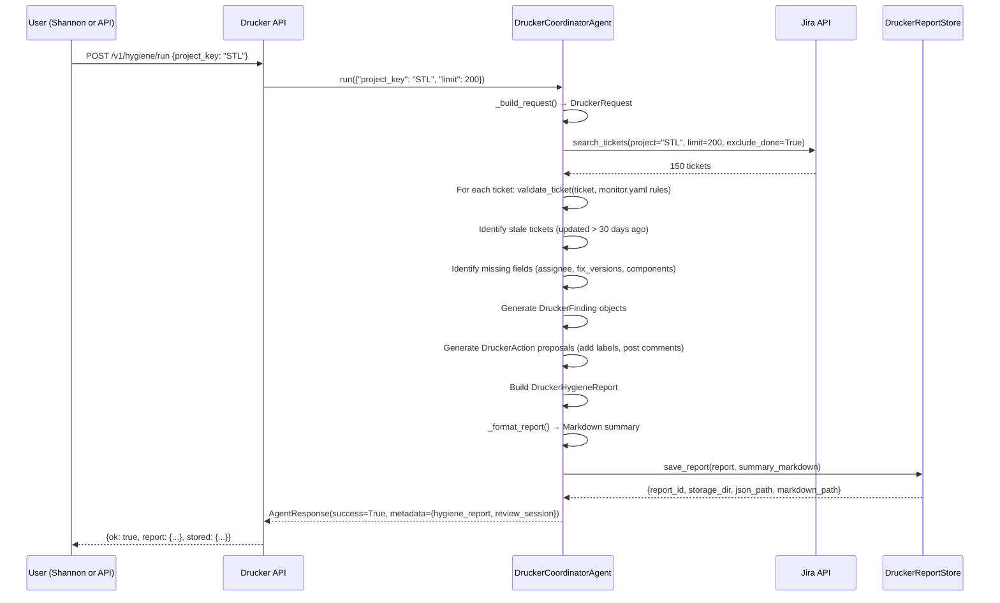
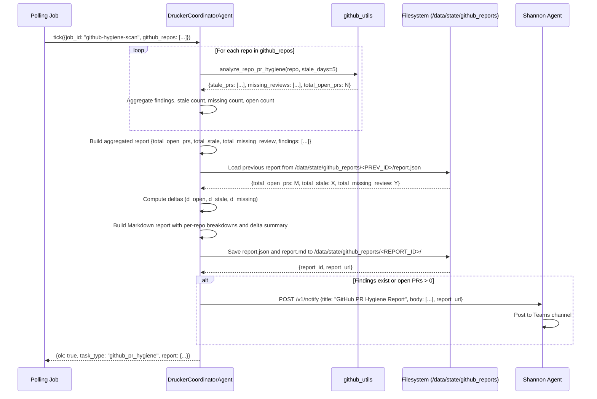
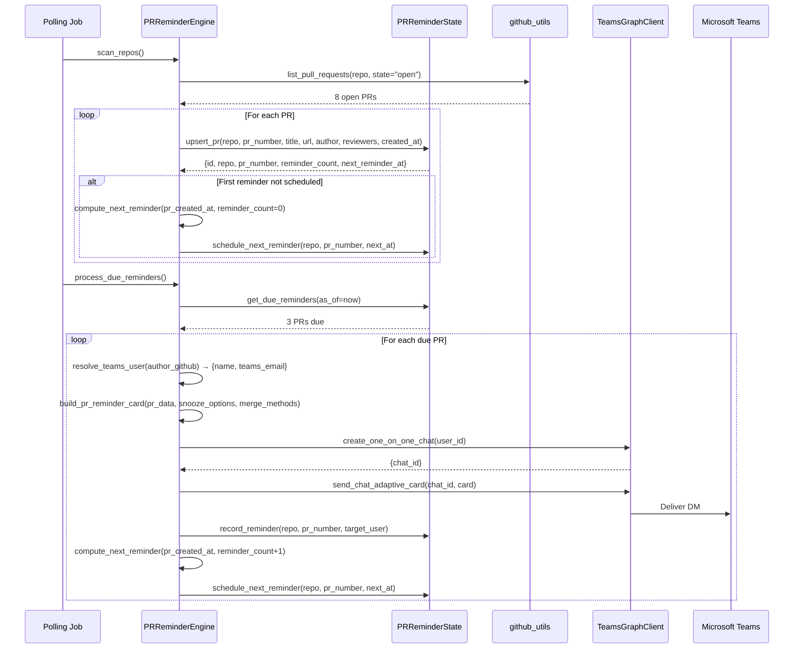

<!-- Generated by Documentation Agent — do not edit between markers -->

```yaml
---
title: "As-Built: Drucker Engineering Hygiene Agent"
date: "2026-04-08"
status: "draft"
---
```

# Drucker Engineering Hygiene Agent — Design Reference

## 1. Module Overview

The Drucker Engineering Hygiene Agent is a deterministic-first automation system that monitors Jira ticket quality and GitHub pull request lifecycle health across the Cornelis Networks engineering organization. Named after management theorist Peter Drucker, the agent identifies workflow drift, missing metadata, stale work, and routing mistakes in both Jira and GitHub, then produces actionable hygiene reports with review-gated remediation proposals. Drucker operates in dry-run mode by default, ensuring all mutation operations are previewed before execution. It exposes a REST API (port 8201), integrates with the Shannon Teams bot for interactive commands, and runs scheduled polling jobs for continuous hygiene monitoring. The agent is the most feature-rich implemented agent in the workforce, combining Jira ticket validation, GitHub PR staleness detection, PR reminder DMs via Teams, natural language query translation, and a learning subsystem that observes ticket-intake patterns to suggest metadata for new issues.

## 2. What Changed

### Before
- Drucker was a Jira-only hygiene agent with three core workflows: full project hygiene scans, single-ticket intake validation, and recent-ticket intake reports.
- GitHub PR hygiene was a planned feature but not implemented.
- GitHub PR hygiene scans generated one notification per repository, resulting in notification spam when scanning 20+ repositories.
- GitHub PR hygiene reports were ephemeral — no persistent storage or web-accessible report viewer existed.
- No delta reporting existed — each scan was presented in isolation without comparison to previous scans.

### After
- **GitHub PR hygiene scanning** is fully implemented with six scan types: stale PRs, missing reviews, naming compliance, merge conflicts, CI failures, and stale branches.
- **Aggregated GitHub PR hygiene reports**: The `github-hygiene-scan` polling job now aggregates findings across all configured repositories into a single report with overall statistics, per-repo breakdowns, and delta comparison to the previous scan.
- **Persistent GitHub hygiene reports**: Reports are saved to `/data/state/github_reports/<REPORT_ID>/` with both JSON and Markdown artifacts. A web-accessible report viewer is available at `/v1/github/hygiene/report/{report_id}`.
- **Delta reporting**: Each GitHub hygiene scan compares total open PRs, stale PRs, and missing-review PRs to the previous scan and includes delta metrics (e.g., "+3 stale PRs since yesterday") in the notification.
- **Single notification per scan**: Instead of one notification per repository, Drucker now sends one summary notification per polling cycle with a breakdown of repos with activity and a link to the full report.
- **PR reminder engine** delivers Teams DM notifications to PR authors and reviewers on configurable cadences, with snooze and merge actions via Adaptive Cards.
- **Natural language query translation** uses LLM function calling to convert plain English questions into structured Jira tool calls (e.g., "show me bugs updated in the last 24 hours" → JQL query).
- **Activity counter** tracks all API requests by category (hygiene, jira, github, nl, pr-reminders) with error counts and timestamps.
- **JQL query logging** was added to hygiene reports — the exact JQL queries used to generate each report are now stored in `report.jql_queries[]` and rendered in the Markdown summary.

### Impact
- **Shannon integration expanded**: Drucker now handles 20+ Shannon commands (up from 7), including `/pr-hygiene`, `/pr-reminder-scan`, `/ask` (NL query), and extended GitHub scans.
- **Observability improved**: The `/v1/status/*` endpoints now expose request counts, error rates, token usage (zero for deterministic paths, non-zero for NL queries), and recent decision history.
- **Deployment complexity increased**: Drucker now requires GitHub PAT credentials (`GITHUB_TOKEN`) and Teams Graph API credentials (`TEAMS_CLIENT_ID`, `TEAMS_CLIENT_SECRET`, `TEAMS_TENANT_ID`) for full functionality.
- **State layer expanded**: Five SQLite stores now manage state (activity, learning, monitor checkpoints, PR reminders, reports), up from three.
- **Notification noise reduced**: GitHub hygiene scans now generate one notification per polling cycle instead of one per repository, reducing Teams channel noise by ~95% (from 20+ notifications to 1).
- **Report persistence enables trend analysis**: Stored GitHub hygiene reports allow teams to track PR hygiene trends over time and identify repositories with chronic stale-PR issues.

## 3. Component Diagram

```mermaid
graph TD
    subgraph "Drucker Agent (agents/drucker)"
        API[api.py<br/>FastAPI REST API]
        AGENT[agent.py<br/>DruckerCoordinatorAgent]
        CLI[cli.py<br/>Standalone CLI]
        CARDS[cards.py<br/>Adaptive Card builders]
        PR_REM[pr_reminders.py<br/>PR reminder engine]
        NL[nl_query.py<br/>NL query translator]
        JIRA_REP[jira_reporting.py<br/>Jira query wrappers]
    end

    subgraph "State Layer (agents/drucker/state)"
        ACT[activity_counter.py]
        LEARN[learning_store.py]
        MON[monitor_state.py]
        PR_STATE[pr_reminder_state.py]
        REP[report_store.py]
        GH_REP[/data/state/github_reports/]
    end

    subgraph "External Dependencies"
        JIRA[Jira API]
        GITHUB[GitHub API]
        TEAMS[Teams Graph API]
        SHANNON[Shannon Agent]
        LLM[Cornelis LLM]
    end

    subgraph "Configuration"
        MON_CFG[config/monitor.yaml]
        POLL_CFG[config/polling.yaml]
        PR_CFG[config/pr_reminders.yaml]
        ID_MAP[config/identity_map.yaml]
    end

    API --> AGENT
    API --> PR_REM
    API --> NL
    API --> JIRA_REP
    API --> ACT
    API --> REP
    API --> GH_REP

    AGENT --> LEARN
    AGENT --> MON
    AGENT --> REP
    AGENT --> GH_REP
    AGENT --> JIRA
    AGENT --> GITHUB

    PR_REM --> PR_STATE
    PR_REM --> GITHUB
    PR_REM --> TEAMS
    PR_REM --> CARDS

    NL --> LLM
    NL --> JIRA_REP

    CLI --> AGENT
    CLI --> PR_REM

    SHANNON --> API

    AGENT --> MON_CFG
    AGENT --> POLL_CFG
    PR_REM --> PR_CFG
    PR_REM --> ID_MAP
```



## 4. Key Flows

### Flow 1 — Jira Hygiene Scan (Full Project)

The full hygiene scan is the primary Drucker workflow. It queries all active tickets in a project, validates them against `monitor.yaml` rules, identifies stale work, and proposes low-risk remediation actions.



**Description:** The agent builds a `DruckerRequest` from the input, queries Jira for active tickets (excluding Done/Closed), validates each ticket against the `monitor.yaml` validation rules (e.g., Bug must have assignee, fix_versions, components, priority), identifies stale tickets (no update in 30+ days), detects missing required fields, generates `DruckerFinding` objects with severity (high/medium/low), proposes `DruckerAction` objects (e.g., "add label `needs-triage`", "post comment requesting assignee"), builds a `DruckerHygieneReport` with summary statistics, formats a Markdown summary, persists the report to `data/drucker_reports/<PROJECT>/<REPORT_ID>/`, and returns the report + review session to the caller. The exact JQL query used is now logged in `report.jql_queries[]` (recent change).

### Flow 2 — GitHub PR Hygiene Scan (Aggregated Multi-Repo)

GitHub PR hygiene scans run on a configurable schedule (default: enabled) and detect stale PRs, missing reviews, naming violations, merge conflicts, CI failures, and stale branches across all configured repositories. The scan aggregates findings into a single report with delta comparison to the previous scan.



**Description:** The poller triggers a GitHub PR hygiene scan for all configured repositories (defined in `polling.yaml`). For each repository, the agent calls `github_utils.analyze_repo_pr_hygiene()` to fetch all open PRs with metadata (author, reviewers, created_at, updated_at, branch name). For each PR, the agent checks: (1) staleness — if `updated_at` is older than `github_stale_days` (default 5), flag as stale; (2) review coverage — if `requested_reviewers` is empty and no approvals exist, flag as missing review. Findings are aggregated across all repositories into a single report with overall statistics (`total_open_prs`, `total_stale`, `total_missing_review`). The agent loads the previous scan's report from `/data/state/github_reports/` and computes deltas (e.g., "+3 stale PRs since yesterday"). A Markdown report is generated with per-repo breakdowns (stale PRs, missing reviews) and a delta summary. The report is saved to `/data/state/github_reports/<REPORT_ID>/` with both JSON and Markdown artifacts. If findings exist or open PRs > 0, a single notification is sent to Shannon with a summary of repos with activity and a link to the full report. The scan does **not** write GitHub comments or status checks — all notifications go through Shannon.

### Flow 3 — PR Reminder DM Delivery

The PR reminder engine scans configured repos, tracks open PRs in SQLite state, schedules reminders on a configurable cadence (e.g., [5, 8, 10, 15] days), resolves GitHub usernames to Teams emails via `identity_map.yaml`, and delivers interactive Adaptive Cards via Teams DM.



**Description:** The `scan_repos()` method fetches all open PRs for configured repositories and upserts them into `PRReminderState`. For new PRs (never reminded), it computes the first reminder time using the `reminder_days` schedule from `pr_reminders.yaml` (e.g., 5 days after PR creation). The `process_due_reminders()` method queries `get_due_reminders()` to find PRs where `next_reminder_at <= now` and `status = 'active'` (not snoozed, not closed). For each due PR, it resolves the GitHub username to a Teams email via `identity_map.yaml`, builds an Adaptive Card with snooze buttons ([2, 5, 7] days) and merge buttons ([squash, merge, rebase]), creates a 1:1 Teams chat via Graph API, delivers the card, records the reminder in state, increments `reminder_count`, and schedules the next reminder. If the user clicks "Snooze 5d", the API endpoint `/v1/github/pr-reminders/snooze` updates `snoozed_until` and `status = 'snoozed'`; the `unsnooze_expired()` method reactivates snoozed PRs when the window elapses.

## 5. Data Model

### Core Models (`agents/drucker/models.py`)

| Model | Fields | Description |
|---|---|---|
| `DruckerRequest` | `project_key`, `ticket_key`, `limit`, `include_done`, `stale_days`, `jql`, `since`, `recent_only`, `label_prefix`, `requested_by`, `approved_by`, `correlation_id`, `trigger` | Input request for hygiene analysis |
| `DruckerFinding` | `finding_id`, `ticket_key`, `category`, `severity`, `title`, `description`, `evidence[]`, `recommendation`, `action_ids[]` | Single hygiene violation |
| `DruckerAction` | `action_id`, `ticket_key`, `action_type`, `title`, `description`, `finding_ids[]`, `confidence`, `comment`, `update_fields{}`, `transition_to` | Proposed Jira write-back |
| `DruckerHygieneReport` | `report_id`, `project_key`, `created_at`, `request{}`, `project_info{}`, `summary{}`, `findings[]`, `proposed_actions[]`, `tickets[]`, `errors[]`, `summary_markdown`, `jql_queries[]` | Complete hygiene report |

### State Stores (SQLite)

| Store | Tables | Purpose |
|---|---|---|
| `ActivityCounter` | `activity(category, request_count, error_count, first_request_at, last_request_at)` | API request tracking by category |
| `DruckerLearningStore` | `observations`, `keyword_patterns`, `reporter_profiles`, `learned_tickets` | Ticket-intake pattern learning |
| `DruckerMonitorState` | `checkpoints`, `processed_tickets`, `validation_history` | Intake checkpoint tracking |
| `PRReminderState` | `pr_reminders`, `reminder_history` | PR reminder lifecycle |
| `DruckerReportStore` | Filesystem: `data/drucker_reports/<PROJECT>/<REPORT_ID>/report.json` | Hygiene report persistence |

### GitHub Hygiene Report Schema (Filesystem)

GitHub PR hygiene reports are stored in `/data/state/github_reports/<REPORT_ID>/` with the following structure:

```json
{
  "report_type": "github_pr_hygiene",
  "repos_scanned": 20,
  "repos_with_errors": 0,
  "total_findings": 15,
  "total_stale": 8,
  "total_missing_review": 7,
  "total_open_prs": 45,
  "findings": [
    {
      "repo": "cornelisnetworks/ifs-all",
      "pr": {
        "number": 623,
        "title": "Fix memory leak in OPX driver",
        "author": "jdoe",
        "html_url": "https://github.com/cornelisnetworks/ifs-all/pull/623"
      },
      "category": "stale_pr",
      "days_stale": 12
    }
  ],
  "repo_summaries": [
    "cornelisnetworks/ifs-all: 12 open, 3 stale, 2 no review",
    "cornelisnetworks/opa-psm2: 8 open, 1 stale, 0 no review"
  ],
  "errors": []
}
```

The Markdown report (`report.md`) includes:
- Overall stats table (repos scanned, total open PRs, stale PRs, missing reviews, findings, errors)
- Per-repo breakdowns with stale PR lists and missing-review PR lists
- Delta comparison to previous scan (e.g., "+3 stale PRs since yesterday")
- Links to individual PRs on GitHub

### Validation Rules (`config/monitor.yaml`)

```yaml
validation_rules:
  Bug:
    required: [assignee, fix_versions, components, priority]
    warn: [description]
  Story:
    required: [assignee, fix_versions, components]
    warn: [description]
  Task:
    required: [assignee, fix_versions, components]
    warn: [description]
  Epic:
    required: [assignee]
    warn: [description]
```

## 6. Dependencies

| Dependency | Purpose | Version |
|---|---|---|
| `fastapi` | REST API framework | N/A |
| `pydantic` | Request/response validation | N/A |
| `uvicorn` | ASGI server | N/A |
| `jira` (via `jira_utils`) | Jira REST API client | N/A |
| `PyGithub` (via `github_utils`) | GitHub REST API client | N/A |
| `msal` (via `TeamsGraphClient`) | Microsoft Graph API authentication | N/A |
| `httpx` (via `TeamsGraphClient`) | Async HTTP client for Graph API | N/A |
| `yaml` | Config file parsing | Python stdlib |
| `sqlite3` | State persistence | Python stdlib |
| `litellm` (via `CornelisLLM`) | LLM function calling for NL queries | N/A |
| `dotenv` | Environment variable loading | N/A |
| `markdown` (optional) | Markdown-to-HTML conversion for report viewer | N/A |

## 7. Configuration

### Environment Variables

| Variable | Required | Default | Description |
|---|---|---|---|
| `JIRA_URL` | Yes | — | Jira instance URL (e.g., `https://cornelisnetworks.atlassian.net`) |
| `JIRA_SERVICE_EMAIL` | Yes | — | Jira service account email |
| `JIRA_SERVICE_API_TOKEN` | Yes | — | Jira service account API token |
| `GITHUB_TOKEN` | No (required for GitHub scans) | — | GitHub personal access token with `repo` + `read:org` scopes |
| `GITHUB_API_URL` | No | `https://api.github.com` | GitHub API base URL (for GitHub Enterprise) |
| `TEAMS_CLIENT_ID` | No (required for PR reminders) | — | Azure AD app client ID for Teams Graph API |
| `TEAMS_CLIENT_SECRET` | No (required for PR reminders) | — | Azure AD app client secret |
| `TEAMS_TENANT_ID` | No (required for PR reminders) | — | Azure AD tenant ID |
| `DRY_RUN` | No | `true` | Controls mutation safety (set to `false` to execute Jira write-backs) |
| `DRUCKER_REPORT_DIR` | No | `data/drucker_reports` | Filesystem directory for Jira hygiene report artifacts |
| `DRUCKER_MONITOR_STATE_DB` | No | `data/drucker_monitor_state.db` | SQLite database path for intake checkpoint tracking |
| `DRUCKER_LEARNING_DB` | No | `data/drucker_learning.db` | SQLite database path for ticket-intake pattern learning |
| `DRUCKER_ACTIVITY_DB` | No | `data/drucker_activity.db` | SQLite database path for API request activity tracking |
| `DRUCKER_PR_REMINDER_STATE_DB` | No | `data/drucker_pr_reminder_state.db` | SQLite database path for PR reminder lifecycle tracking |

### Configuration Files

- **`agents/drucker/config/monitor.yaml`** — Defines validation rules per Jira issue type (required/warn fields), learning subsystem parameters (`min_observations`, `confidence_thresholds`), and polling interval.
- **`agents/drucker/config/polling.yaml`** — Defines polling jobs, schedules, and notification settings. Each job has a `job_id`, `scan_type` (jira, github, github-extended, github-pr-reminders), `enabled` flag, and `notify_shannon` flag. The `github-hygiene-scan` job lists all repositories to scan in `github_repos[]`.
- **`agents/drucker/config/pr_reminders.yaml`** — Defines PR reminder schedules (`reminder_days`), notification targets (`notify: [author, reviewers]`), snooze options, and merge methods per repository.
- **`config/identity_map.yaml`** — Maps GitHub usernames to Teams email addresses for PR reminder DM delivery.

### Feature Flags

- `learning.enabled` (monitor.yaml) — Enables ML-based field suggestion engine
- `notify_shannon` (polling.yaml) — Controls notification delivery per job (default: `true`)
- `enabled` (polling.yaml, pr_reminders.yaml) — Activates/deactivates individual jobs or the entire PR reminder system
- `DRY_RUN` (environment variable) — Controls Jira write-back execution (default: `true`)

## 8. Error Handling

### Jira Hygiene Scans

- **Connection failures**: If `jira_utils.connect_to_jira()` fails, the scan aborts and returns an error response with `ok: false`.
- **JQL query failures**: If `search_tickets()` raises an exception, the error is logged and appended to `report.errors[]`. The scan continues with partial results.
- **Validation rule mismatches**: If a ticket's issue type is not defined in `monitor.yaml`, the agent uses a fallback rule (no required fields, warn on missing description).
- **Missing metadata**: Missing required fields generate `DruckerFinding` objects with `severity: high`. Missing warn fields generate `severity: low` findings.

### GitHub PR Hygiene Scans

- **Repository access failures**: If `github_utils.list_pull_requests()` raises an exception (e.g., 404 Not Found, 403 Forbidden), the error is logged to `scan_errors[]` and the scan continues with the next repository.
- **Partial scan results**: If some repositories fail but others succeed, the aggregated report includes both successful findings and error summaries. The `repos_with_errors` count is incremented.
- **Previous report load failures**: If the previous scan's report cannot be loaded from `/data/state/github_reports/`, delta comparison is skipped and the notification omits delta metrics.
- **Report persistence failures**: If the report cannot be saved to `/data/state/github_reports/`, the error is logged and the notification includes `report_id: 'unsaved'` with no report URL.

### PR Reminder DM Delivery

- **Identity resolution failures**: If a GitHub username is not found in `identity_map.yaml`, the reminder is skipped and an error is logged.
- **Teams Graph API failures**: If `create_one_on_one_chat()` or `send_chat_adaptive_card()` raises an exception, the error is logged and the reminder is marked as failed in `reminder_history`.
- **Snooze/merge action failures**: If a user clicks a snooze or merge button but the action fails (e.g., GitHub API error), an error card is sent to the user via Teams DM.

### Natural Language Query Translation

- **LLM function calling failures**: If the LLM does not call a tool or returns invalid JSON, the agent returns the LLM's text response directly (fallback to conversational mode).
- **Tool execution failures**: If a Jira or GitHub tool raises an exception, the error is logged and returned to the user with `ok: false`.

## 9. Known Limitations / Technical Debt

1. **Hardcoded GitHub report storage path**: The GitHub hygiene report storage path (`/data/state/github_reports/`) is hardcoded in `agent.py` and `api.py`. This should be configurable via environment variable or `polling.yaml`.

2. **No pagination for large GitHub scans**: The `github-hygiene-scan` job fetches all open PRs for each repository with `limit=100`. Repositories with >100 open PRs will have incomplete scan results. The agent should implement pagination or increase the limit.

3. **Delta comparison assumes sequential scans**: The delta comparison logic loads the second-most-recent report from `/data/state/github_reports/` by sorting directory names. If scans are run out of order or reports are deleted, delta metrics may be incorrect.

4. **No cleanup of old GitHub reports**: GitHub hygiene reports accumulate in `/data/state/github_reports/` indefinitely. The agent should implement a retention policy (e.g., delete reports older than 90 days).

5. **Markdown-to-HTML conversion requires optional dependency**: The `/v1/github/hygiene/report/{report_id}` endpoint uses the `markdown` library to render HTML. If the library is not installed, the endpoint falls back to `<pre>` tags, which breaks table formatting.

6. **No error recovery for partial GitHub scans**: If a GitHub scan fails midway (e.g., network timeout), the partial results are discarded and the scan must be rerun from scratch. The agent should implement checkpoint-based resumption.

7. **PR reminder snooze window is not timezone-aware**: The `snoozed_until` timestamp is stored as ISO 8601 UTC, but the `unsnooze_expired()` method compares it to `datetime.now(timezone.utc)`. If the system clock is misconfigured, snooze windows may expire early or late.

8. **No deduplication of PR reminder notifications**: If a PR has multiple reviewers, each reviewer receives a separate DM. The agent should implement a "one DM per PR per day" policy to reduce notification noise.

9. **GitHub hygiene report viewer has no authentication**: The `/v1/github/hygiene/report/{report_id}` endpoint is publicly accessible. The agent should implement authentication or restrict access to internal networks.

10. **No support for GitHub Enterprise custom domains**: The `html_url` field in GitHub PR findings assumes `github.com`. For GitHub Enterprise instances, the URL should be constructed from `GITHUB_API_URL`.

<!-- End Documentation Agent generated content -->