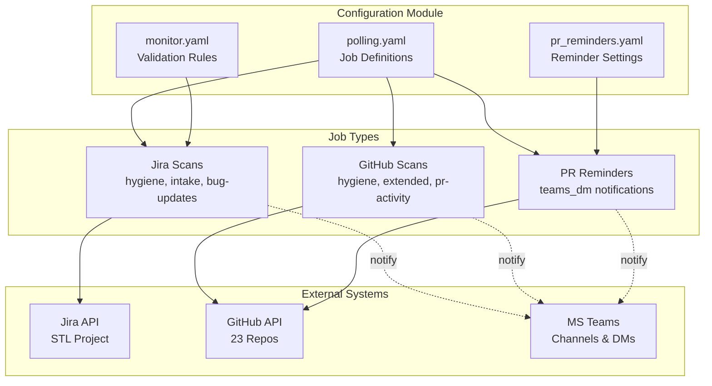
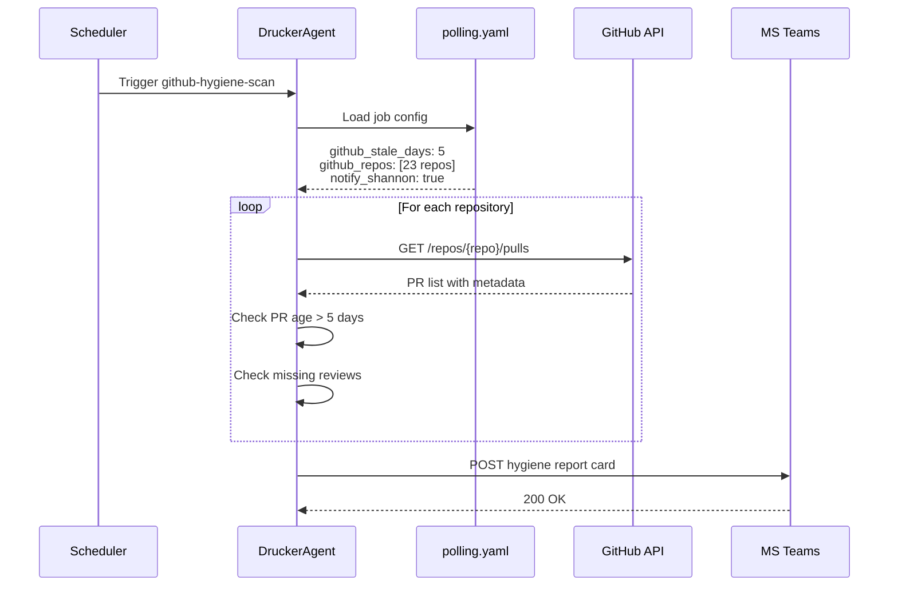
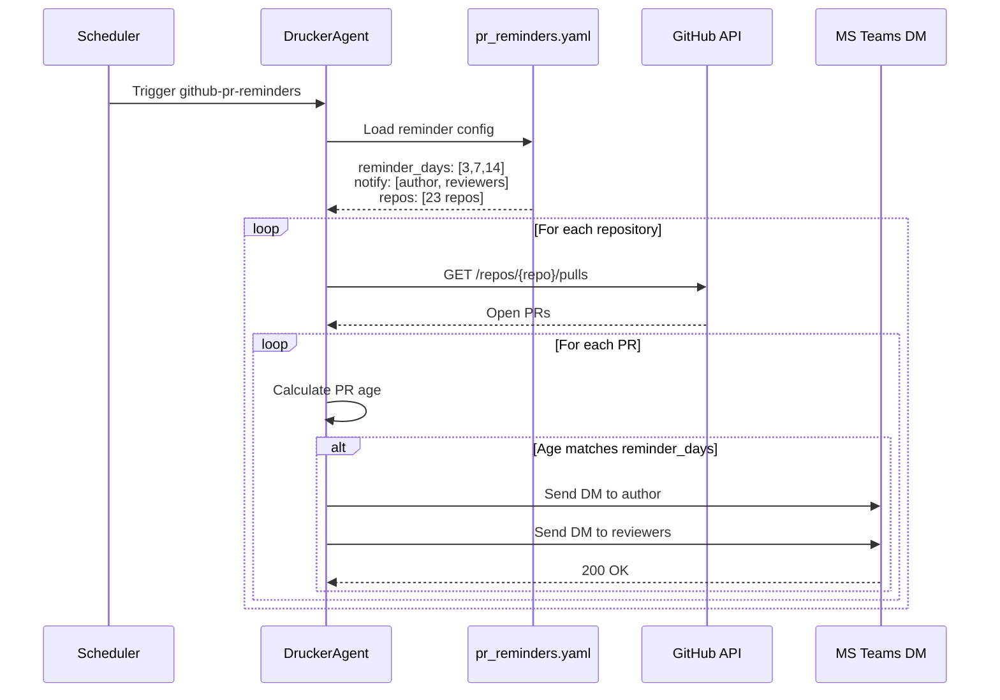
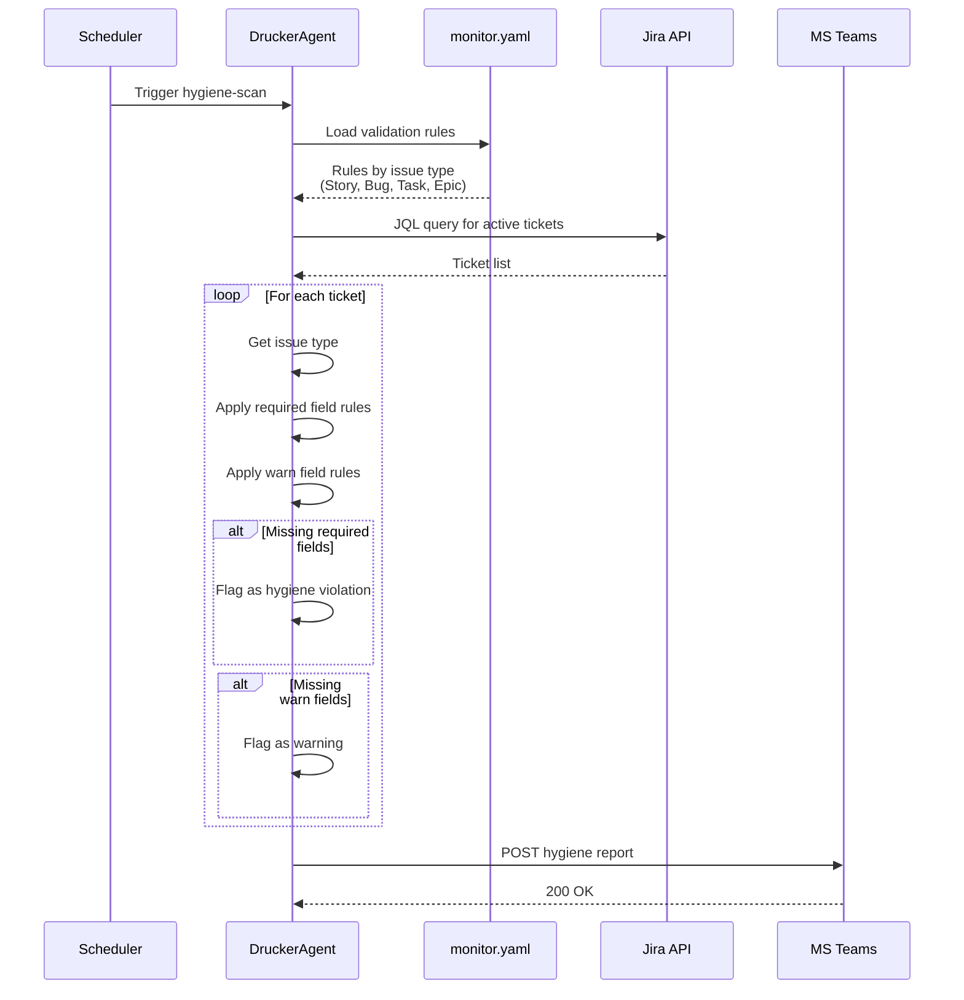

<!-- Generated by Documentation Agent — do not edit between markers -->

```yaml
---
title: "As-Built: Drucker Agent Configuration"
date: "2026-04-08"
status: "draft"
---
```

## Module Overview

The Drucker agent configuration module consists of three YAML configuration files that control automated project management hygiene monitoring across Jira and GitHub. The `polling.yaml` file defines scheduled jobs for scanning Jira tickets and GitHub pull requests, `monitor.yaml` specifies validation rules for different Jira issue types, and `pr_reminders.yaml` configures reminder schedules for stale pull requests. Together, these configurations enable the Drucker agent to monitor 23+ Cornelis Networks repositories, validate ticket hygiene, detect stale work, and send automated notifications through Teams channels and direct messages.

## What Changed

**Before:** The configuration included test repositories (`jmac-cornelis/agent-workforce`, `cornelisnetworks/opa-psm3`) in the default GitHub repository list. The `github-hygiene-scan` and `github-extended-scan` jobs were disabled (`enabled: false`). The `github-pr-reminders` job included the test repository in its monitored repos list.

**After:** Test repositories have been removed from all repository lists in `polling.yaml`. Both GitHub hygiene scan jobs are now enabled (`enabled: true`), activating stale PR detection, missing review checks, naming convention validation, merge conflict detection, and stale branch monitoring. The `github-pr-reminders` job no longer monitors test repositories.

**Impact:** The Drucker agent now actively monitors only production repositories for hygiene issues. GitHub hygiene scans will run on schedule, generating notifications for stale PRs (>5 days), missing reviews, and other issues. PR reminder notifications will be sent to authors and reviewers at 3, 7, and 14-day intervals for production repositories only. Teams will receive more focused notifications without test repository noise.

## Component Diagram



## Key Flows

### Flow 1: GitHub Hygiene Scan Execution



**Description:** The GitHub hygiene scan job runs on schedule, loading configuration from `polling.yaml`. It iterates through all 23 configured repositories, fetching open pull requests via the GitHub API. For each PR, it checks if the age exceeds `github_stale_days` (5 days) and validates that required reviews are present. Findings are aggregated and posted as a hygiene report card to the configured Teams channel.

### Flow 2: PR Reminder Notification



**Description:** The PR reminder job executes on schedule, loading reminder configuration from `pr_reminders.yaml`. It fetches open PRs from all configured repositories and calculates the age of each PR. When a PR's age matches one of the configured reminder days (3, 7, or 14), the agent sends direct messages via MS Teams to both the PR author and assigned reviewers. This ensures timely follow-up on stale pull requests.

### Flow 3: Jira Ticket Validation



**Description:** The Jira hygiene scan loads validation rules from `monitor.yaml`, which define required and warning fields for each issue type (Story, Bug, Task, Epic). The agent queries Jira for active tickets and validates each against the appropriate rule set. For example, Bug tickets must have `assignee`, `fix_versions`, `components`, and `priority` fields populated. Violations are flagged and aggregated into a hygiene report posted to Teams.

## Data Model

### polling.yaml Structure

```yaml
defaults:
  project_key: string          # Jira project key (empty = all projects)
  limit: integer               # Max tickets per query (200)
  include_done: boolean        # Include completed tickets (false)
  stale_days: integer          # Days before ticket considered stale (30)
  label_prefix: string         # Label prefix for categorization ("drucker")
  persist: boolean             # Persist scan state (true)
  notify_shannon: boolean      # Send notifications (true)
  github_stale_days: integer   # Days before PR considered stale (5)
  github_repos: array[string]  # List of org/repo names (23 repos)

jobs:
  - job_id: string             # Unique job identifier
    description: string        # Human-readable job description
    scan_type: enum            # jira | github | github-extended | github-pr-reminders | jira-bug-updates | github-pr-activity
    enabled: boolean           # Job enabled flag (default: true)
    recent_only: boolean       # Scan only recent tickets (for jira scans)
    notify_shannon: boolean    # Override default notification setting
    interval_minutes: integer  # Polling interval (for continuous jobs)
    project_key: string        # Override default project key
    github_stale_days: integer # Override default stale threshold
    branch_stale_days: integer # Stale branch threshold (30 days)
    repos: array[string]       # Job-specific repo list
    reminder_schedule: array[integer] # Days for reminders [3, 7, 14]
```

### monitor.yaml Structure

```yaml
project: string                # Jira project key (empty = all projects)
poll_interval_minutes: integer # Polling frequency (5 minutes)

validation_rules:
  <IssueType>:                 # Story | Bug | Task | Epic
    required: array[string]    # Fields that must be populated
    warn: array[string]        # Fields that should be populated

learning:
  enabled: boolean             # Enable ML-based field suggestions (true)
  min_observations: integer    # Min samples for learning (20)
  confidence_thresholds:
    auto_fill: float           # Auto-populate threshold (0.90)
    suggest: float             # Suggestion threshold (0.50)
    flag_only: float           # Flag-only threshold (0.0)
```

### pr_reminders.yaml Structure

```yaml
defaults:
  reminder_days: array[integer]    # Days to send reminders [5, 8, 10, 15]
  notify: array[string]            # Recipients: [author, reviewers]
  channels: array[string]          # Notification channels: [teams_dm]
  snooze_options_days: array[integer] # Snooze durations [2, 5, 7]
  merge_methods: array[string]     # Allowed merge methods [squash, merge, rebase]
  enabled: boolean                 # Global enable flag (true)

repos:
  - repo: string                   # org/repo name
    reminder_days: array[integer]  # Override default reminder schedule (optional)
```

## Dependencies

| Dependency | Purpose | Version |
|------------|---------|---------|
| Jira API | Fetch and validate Jira tickets | Cloud REST API v3 |
| GitHub API | Fetch PR and repository metadata | REST API v3 |
| MS Teams API | Send notifications and DMs | Graph API v1.0 |
| PyYAML | Parse YAML configuration files | Not specified |
| Python datetime | Calculate PR/ticket age | stdlib |

## Configuration

### Environment Variables

The configuration files themselves do not reference environment variables directly, but the Drucker agent consuming these files likely requires:

- `JIRA_API_TOKEN` - Authentication token for Jira API
- `GITHUB_TOKEN` - Personal access token for GitHub API
- `TEAMS_WEBHOOK_URL` - MS Teams incoming webhook URL
- `TEAMS_BOT_TOKEN` - MS Teams bot token for DM functionality

### Configuration Files

**polling.yaml**
- Location: `agents/drucker/config/polling.yaml`
- Purpose: Defines polling jobs, schedules, and repository lists
- Key settings:
  - `defaults.github_stale_days: 5` - PR staleness threshold
  - `defaults.stale_days: 30` - Jira ticket staleness threshold
  - `defaults.notify_shannon: true` - Enable notifications by default
  - `jobs[].enabled` - Per-job enable/disable flag

**monitor.yaml**
- Location: `agents/drucker/config/monitor.yaml`
- Purpose: Defines Jira ticket validation rules
- Key settings:
  - `poll_interval_minutes: 5` - Validation check frequency
  - `validation_rules.<IssueType>.required` - Mandatory fields per issue type
  - `learning.enabled: true` - Enable ML-based field suggestions
  - `learning.confidence_thresholds.auto_fill: 0.90` - Auto-populate confidence threshold

**pr_reminders.yaml**
- Location: `agents/drucker/config/pr_reminders.yaml`
- Purpose: Configures PR reminder schedules and notification targets
- Key settings:
  - `defaults.reminder_days: [5, 8, 10, 15]` - Default reminder schedule
  - `defaults.notify: [author, reviewers]` - Notification recipients
  - `repos[].reminder_days` - Per-repository reminder override

### Feature Flags

- `polling.yaml:jobs[].enabled` - Enable/disable individual polling jobs
- `monitor.yaml:learning.enabled` - Enable/disable ML-based field learning
- `pr_reminders.yaml:defaults.enabled` - Global PR reminder enable flag

## Error Handling

The configuration files are declarative YAML and do not contain error handling logic. However, the Drucker agent consuming these files must handle:

1. **Missing Required Fields**: If a job definition lacks required fields (e.g., `job_id`, `scan_type`), the agent should log a validation error and skip the job.

2. **Invalid Enum Values**: If `scan_type` contains an unrecognized value, the agent should raise a configuration error and halt startup.

3. **Repository Access Failures**: If a repository in `github_repos` is inaccessible (404, 403), the agent should log the error, skip that repository, and continue processing others.

4. **YAML Parse Errors**: Malformed YAML should trigger a startup failure with a descriptive error message pointing to the line/column of the syntax error.

5. **Circular Dependencies**: Not applicable to these configuration files, as they define data structures rather than code dependencies.

## Known Limitations / Technical Debt

1. **Hardcoded Repository List**: The `polling.yaml` file contains a hardcoded list of 23 repositories. This list must be manually updated when new repositories are added to the organization. Consider implementing dynamic repository discovery via GitHub organization API.

2. **Empty Project Key**: The `defaults.project_key` in `polling.yaml` is set to an empty string, which likely means "all projects." This implicit behavior should be documented or replaced with an explicit `null` or `"*"` wildcard.

3. **Duplicate Repository Lists**: The same 23-repository list appears in both `defaults.github_repos` and `jobs[github-pr-activity].github_repos`. This violates DRY principles and creates maintenance burden. Consider using YAML anchors or referencing the default list.

4. **Missing Validation**: The `pr_reminders.yaml` file includes a `repos` list with only one entry (`jmac-cornelis/agent-workforce`), but the `defaults` section defines `reminder_days: [5, 8, 10, 15]` while the repo-specific override uses `[3, 5, 8, 12]`. There's no validation to ensure reminder days are in ascending order or non-negative.

5. **Implicit Defaults**: The `monitor.yaml` file has `project: ''` (empty string), which likely defaults to all projects. This should be explicitly documented or use a more descriptive value like `"ALL"`.

6. **No Schema Validation**: The YAML files lack embedded JSON Schema or similar validation. The agent must implement runtime validation, which delays error detection until execution time.

7. **Hardcoded Confidence Thresholds**: The `monitor.yaml` learning thresholds (`auto_fill: 0.90`, `suggest: 0.50`) are hardcoded. These should be tunable per-project or per-issue-type for different risk tolerances.

8. **Missing Job Dependencies**: The `polling.yaml` jobs have no explicit dependency or ordering constraints. If `recent-ticket-intake` depends on `hygiene-scan` completing first, this relationship is not captured in the configuration.

9. **No Rate Limiting Configuration**: The configuration lacks rate limiting parameters for API calls. With 23 repositories and multiple jobs, the agent could exceed GitHub/Jira API rate limits during peak execution.

10. **Inconsistent Notification Flags**: The `notify_shannon` flag appears in both `defaults` and individual job definitions, but there's no clear precedence rule documented. The agent must implement explicit override logic.

<!-- End Documentation Agent generated content -->