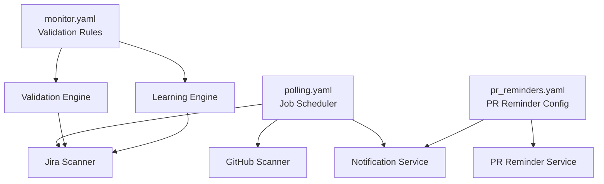
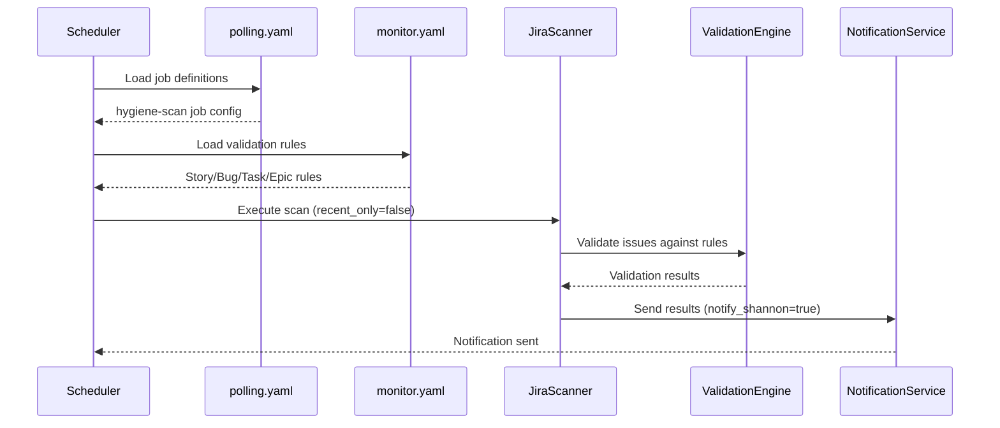
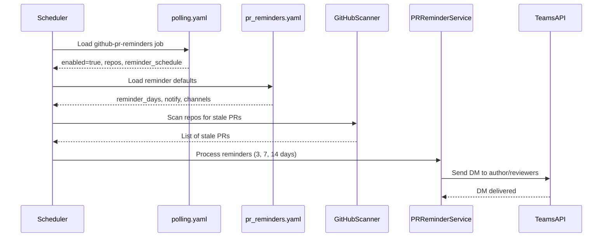
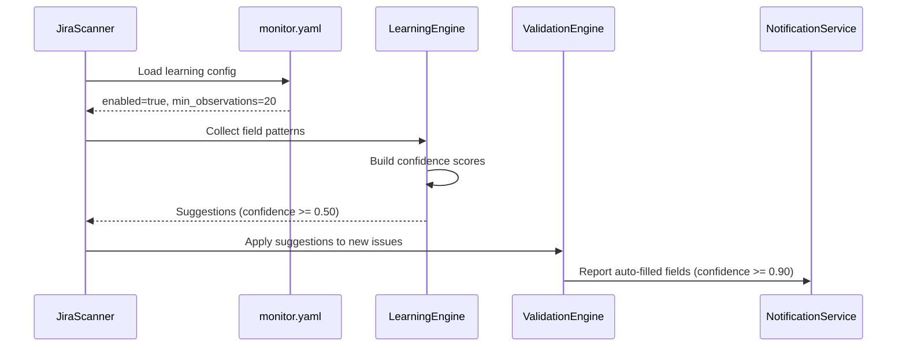

<!-- Generated by Documentation Agent — do not edit between markers -->

```yaml
---
title: "As-Built: Drucker Agent Configuration"
date: "2026-04-06"
status: "draft"
---
```

## Module Overview

The Drucker agent configuration module defines three YAML configuration files that control the behavior of a project management hygiene monitoring system. The module configures validation rules for Jira issue types (`monitor.yaml`), polling job schedules and parameters (`polling.yaml`), and GitHub pull request reminder settings (`pr_reminders.yaml`). These configurations enable automated scanning of Jira tickets and GitHub repositories across the Cornelis Networks organization, with support for notifications, learning-based field suggestions, and stale work detection.

## What Changed

**Before:** The `polling.yaml` configuration had `notify_shannon: false` as the default, and the `github-pr-reminders` job was disabled. The job definitions lacked explicit `notify_shannon` overrides and repository-specific reminder schedules.

**After:** The default `notify_shannon` is now `true`, enabling notifications by default for all jobs. Each job definition now explicitly includes `notify_shannon: true`. The `github-pr-reminders` job is enabled with a specific repository list (`jmac-cornelis/agent-workforce`) and a custom reminder schedule of `[3, 7, 14]` days.

**Impact:** All polling jobs now send notifications to Shannon by default. The PR reminder system is active and will send reminders for the specified repository at 3, 7, and 14 days. Teams using the Drucker agent will receive automated notifications for hygiene issues and stale PRs.

## Component Diagram



## Key Flows

### Flow 1: Jira Hygiene Scan Execution



The `hygiene-scan` job performs a full-project scan of Jira tickets. It loads validation rules from `monitor.yaml` (required and warning fields for each issue type) and applies them to all active issues. Results are sent to the notification service when `notify_shannon: true`.

### Flow 2: GitHub PR Reminder Delivery



The `github-pr-reminders` job scans configured repositories for pull requests that have been open for 3, 7, or 14 days. It sends Teams direct messages to authors and reviewers based on the `reminder_schedule` defined in `polling.yaml` and the notification preferences in `pr_reminders.yaml`.

### Flow 3: Learning-Based Field Suggestion



When `learning.enabled: true` in `monitor.yaml`, the system observes field patterns across at least 20 issues. It builds confidence scores and suggests field values when confidence exceeds 0.50. Fields are auto-filled when confidence reaches 0.90, and all actions are logged to the notification service.

## Data Model

### Monitor Configuration Schema

```yaml
project: string                    # Jira project key (empty = all projects)
poll_interval_minutes: integer     # Polling frequency

validation_rules:
  <IssueType>:                     # Story, Bug, Task, Epic
    required: [string]             # Fields that must be present
    warn: [string]                 # Fields that trigger warnings if missing

learning:
  enabled: boolean                 # Enable ML-based field suggestions
  min_observations: integer        # Minimum samples before suggesting
  confidence_thresholds:
    auto_fill: float              # Threshold for automatic field population
    suggest: float                # Threshold for suggesting values
    flag_only: float              # Threshold for flagging patterns
```

### Polling Configuration Schema

```yaml
defaults:
  project_key: string              # Default Jira project
  limit: integer                   # Max issues per scan
  include_done: boolean            # Include completed issues
  stale_days: integer              # Days before marking stale
  label_prefix: string             # Label prefix for tagging
  persist: boolean                 # Save scan state
  notify_shannon: boolean          # Send notifications
  github_stale_days: integer       # Days before PR is stale
  github_repos: [string]           # List of org/repo names

jobs:
  - job_id: string                 # Unique job identifier
    description: string            # Human-readable description
    scan_type: string              # jira | github | github-extended | github-pr-reminders
    recent_only: boolean           # Scan only recent changes
    enabled: boolean               # Job active flag
    notify_shannon: boolean        # Override default notification setting
    repos: [string]                # Job-specific repo list
    reminder_schedule: [integer]   # Days for PR reminders
```

### PR Reminders Configuration Schema

```yaml
defaults:
  reminder_days: [integer]         # Days after PR creation to send reminders
  notify: [string]                 # author | reviewers
  channels: [string]               # teams_dm | email
  snooze_options_days: [integer]   # Snooze duration options
  merge_methods: [string]          # squash | merge | rebase
  enabled: boolean                 # Global enable flag

repos:
  - repo: string                   # org/repo name
    reminder_days: [integer]       # Override default reminder schedule
```

## Dependencies

| Dependency | Purpose | Version |
|------------|---------|---------|
| PyYAML | YAML parsing and validation | Not specified |
| Jira API | Issue retrieval and validation | Not specified |
| GitHub API | PR and repository scanning | Not specified |
| Microsoft Teams API | Direct message notifications | Not specified |

## Configuration

### Environment Variables

The configuration files themselves do not reference environment variables, but the consuming application likely requires:

- `JIRA_API_TOKEN` — Authentication for Jira API
- `GITHUB_TOKEN` — Authentication for GitHub API
- `TEAMS_WEBHOOK_URL` or `TEAMS_BOT_TOKEN` — Teams notification credentials

### Configuration Files

- **`agents/drucker/config/monitor.yaml`** — Defines validation rules and learning parameters
- **`agents/drucker/config/polling.yaml`** — Defines polling jobs, schedules, and notification settings
- **`agents/drucker/config/pr_reminders.yaml`** — Defines PR reminder schedules and notification channels

### Feature Flags

- `learning.enabled` (monitor.yaml) — Enables ML-based field suggestion engine
- `notify_shannon` (polling.yaml) — Controls notification delivery per job
- `enabled` (polling.yaml, pr_reminders.yaml) — Activates/deactivates individual jobs or the entire PR reminder system

## Error Handling

The configuration files are declarative YAML and do not contain error handling logic. The consuming application must implement:

- **Schema validation** — Ensure required fields are present and types are correct
- **Default value handling** — Apply defaults from `polling.yaml` and `pr_reminders.yaml` when job-specific values are missing
- **Graceful degradation** — If a repository or job is misconfigured, log the error and continue processing other jobs
- **Notification failure handling** — Retry or log failures when `notify_shannon: true` but the notification service is unavailable

## Known Limitations / Technical Debt

1. **Empty project key** — The `project` field in `monitor.yaml` is an empty string, which may indicate incomplete configuration or a placeholder for multi-project support.

2. **Hardcoded repository list** — The `github_repos` list in `polling.yaml` contains 26 repositories. This list is duplicated in `pr_reminders.yaml` (with minor differences), creating a maintenance burden. Consider centralizing the repository list or loading it from an external source.

3. **Inconsistent reminder schedules** — The `jmac-cornelis/agent-workforce` repository has a custom reminder schedule of `[3, 5, 8, 12]` in `pr_reminders.yaml` but `[3, 7, 14]` in `polling.yaml`. This inconsistency may cause confusion or unexpected behavior.

4. **Missing validation for confidence thresholds** — The `confidence_thresholds` in `monitor.yaml` are floats between 0.0 and 1.0, but there is no schema enforcement to ensure `auto_fill >= suggest >= flag_only`.

5. **Disabled jobs** — The `github-hygiene-scan` and `github-extended-scan` jobs are disabled (`enabled: false`). If these are deprecated, they should be removed to reduce configuration clutter.

6. **No version pinning** — The configuration does not specify versions for external dependencies (Jira API, GitHub API, Teams API), which may lead to compatibility issues during upgrades.

<!-- End Documentation Agent generated content -->