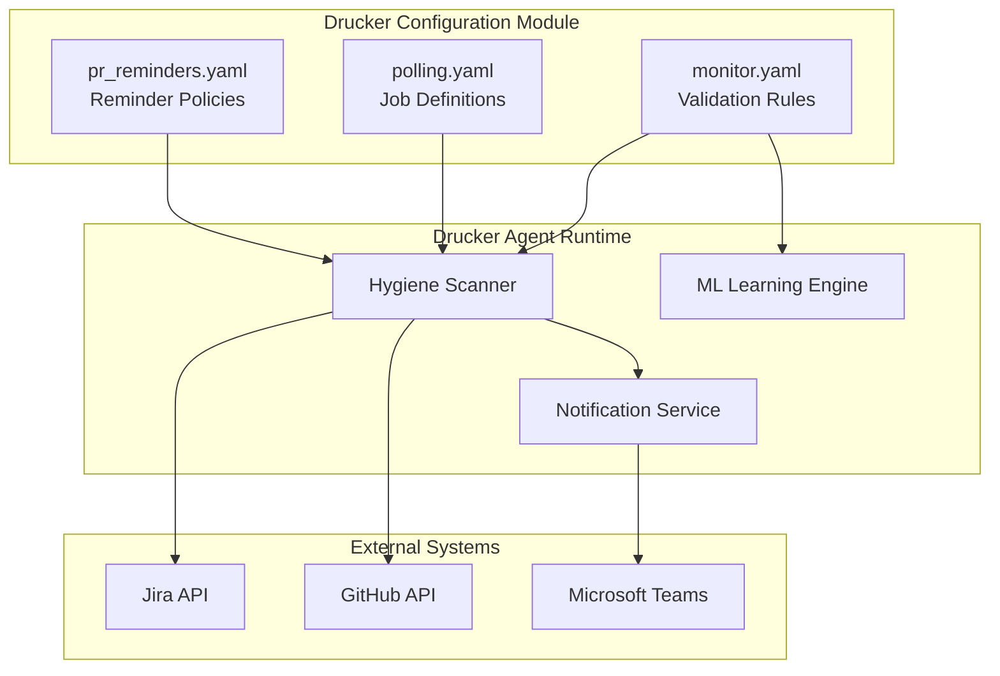
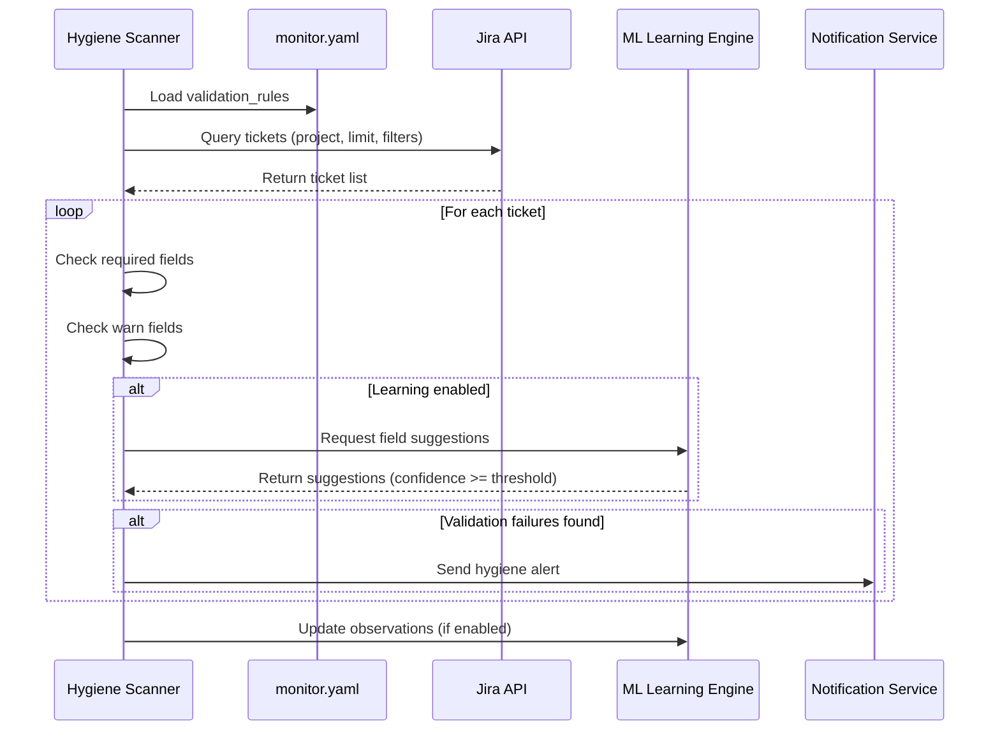
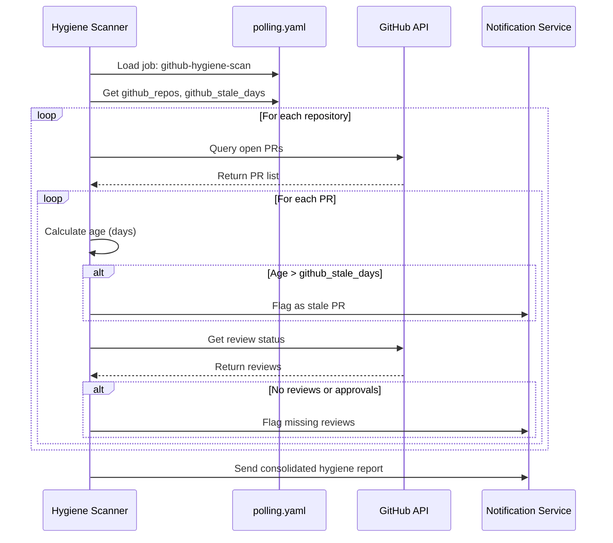
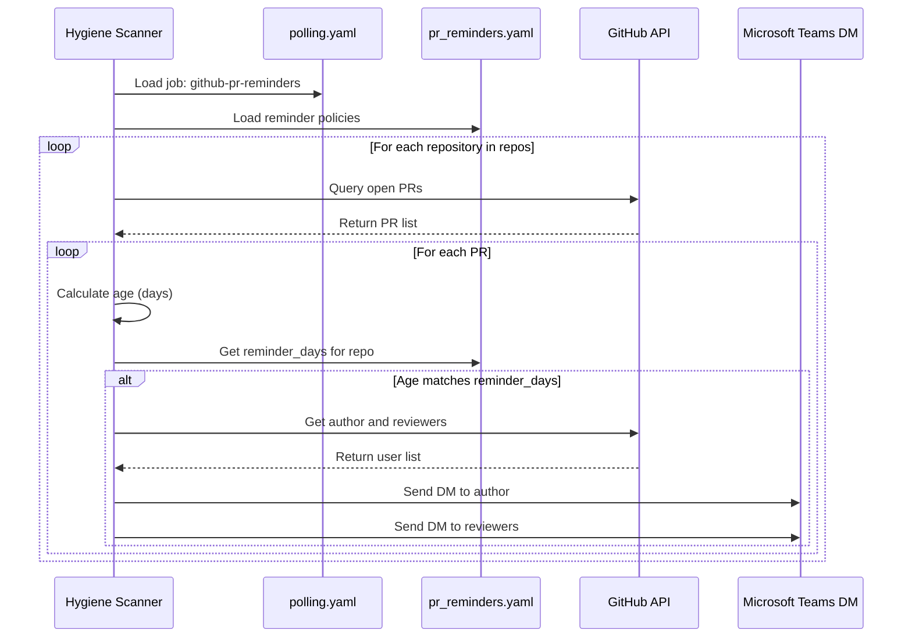

<!-- Generated by Documentation Agent — do not edit between markers -->

```yaml
---
title: "As-Built: Drucker Agent Configuration"
date: "2026-04-08"
status: "draft"
---
```

## Module Overview

The Drucker agent configuration module consists of three YAML configuration files that control a project management hygiene monitoring system for Cornelis Networks. The module defines validation rules for Jira issue types (`monitor.yaml`), polling job schedules and scan parameters (`polling.yaml`), and GitHub pull request reminder policies (`pr_reminders.yaml`). Together, these configurations enable automated scanning of Jira tickets and GitHub repositories, with support for notifications, machine learning-based field suggestions, and detection of stale work items.

## What Changed

**Before:** The `polling.yaml` configuration included the test repository `jmac-cornelis/agent-workforce` and `cornelisnetworks/opa-psm3` in the default GitHub repository list. The `github-hygiene-scan` and `github-extended-scan` jobs were disabled (`enabled: false`). The `github-pr-reminders` job included the test repository in its monitored repos list.

**After:** The test repository `jmac-cornelis/agent-workforce` and `cornelisnetworks/opa-psm3` have been removed from the default `github_repos` list in `polling.yaml`. The `github-hygiene-scan` and `github-extended-scan` jobs are now enabled (`enabled: true`). The `github-pr-reminders` job no longer includes the test repository in its monitored repos list. The `github-pr-activity` job also no longer includes the test repository.

**Impact:** The Drucker agent now actively monitors production repositories only, excluding test repositories from hygiene scans and PR activity monitoring. GitHub hygiene scans (both basic and extended) are now operational, detecting stale PRs, missing reviews, naming issues, merge conflicts, CI failures, and stale branches across all production repositories. Teams will receive automated notifications for these hygiene issues.

## Component Diagram



## Key Flows

### Flow 1: Jira Hygiene Validation

This flow describes how the Drucker agent validates Jira tickets against configured rules and optionally learns from historical patterns.



**Description:** The scanner loads validation rules from `monitor.yaml`, queries Jira for tickets matching the configured project and filters, then validates each ticket against issue-type-specific required and warning fields. If learning is enabled (`learning.enabled: true`), the ML engine provides field suggestions based on historical patterns when confidence exceeds the configured thresholds (`auto_fill: 0.90`, `suggest: 0.50`). Validation failures trigger notifications via the notification service.

### Flow 2: GitHub PR Hygiene Scan

This flow describes how the Drucker agent scans GitHub repositories for stale pull requests and missing reviews.



**Description:** The scanner loads the `github-hygiene-scan` job configuration from `polling.yaml`, which specifies `github_stale_days: 5` and a list of 22 production repositories. For each repository, it queries the GitHub API for open PRs, calculates their age, and flags PRs older than 5 days as stale. It also checks review status and flags PRs with missing reviews. The notifier sends a consolidated hygiene report to the configured channels (Shannon and/or Teams).

### Flow 3: GitHub PR Reminder Delivery

This flow describes how the Drucker agent sends periodic reminders to PR authors and reviewers based on configured schedules.



**Description:** The scanner loads the `github-pr-reminders` job from `polling.yaml` and the reminder policies from `pr_reminders.yaml`. For each configured repository, it queries open PRs and calculates their age. When a PR's age matches one of the configured `reminder_days` (default: `[5, 8, 10, 15]`, or repo-specific overrides like `[3, 5, 8, 12]` for `jmac-cornelis/agent-workforce`), the scanner retrieves the PR author and reviewers from GitHub and sends direct messages via Microsoft Teams to both parties. The reminders include snooze options (`[2, 5, 7]` days) and merge method suggestions (`[squash, merge, rebase]`).

## Data Model

### monitor.yaml Schema

```yaml
project: string                    # Jira project key (empty = all projects)
poll_interval_minutes: integer     # Polling frequency for validation checks

validation_rules:
  <IssueType>:                     # e.g., Story, Bug, Task, Epic
    required: [string]             # Field names that must be populated
    warn: [string]                 # Field names that should be populated (warnings only)

learning:
  enabled: boolean                 # Enable ML-based field suggestions
  min_observations: integer        # Minimum data points before learning activates
  confidence_thresholds:
    auto_fill: float               # Confidence threshold for automatic field population (0.0-1.0)
    suggest: float                 # Confidence threshold for suggesting values (0.0-1.0)
    flag_only: float               # Confidence threshold for flagging issues (0.0-1.0)
```

**Key Structures:**
- `validation_rules`: Maps Jira issue types to field validation requirements. Currently defines rules for `Story`, `Bug`, `Task`, and `Epic` issue types.
- `learning.confidence_thresholds`: Controls ML behavior at three levels: `auto_fill` (0.90) for automatic field population, `suggest` (0.50) for user suggestions, and `flag_only` (0.0) for issue flagging.

### polling.yaml Schema

```yaml
defaults:
  project_key: string              # Default Jira project key
  limit: integer                   # Maximum tickets per query
  include_done: boolean            # Include completed tickets in scans
  stale_days: integer              # Days before a ticket is considered stale
  label_prefix: string             # Prefix for Drucker-applied labels
  persist: boolean                 # Persist scan results to storage
  notify_shannon: boolean          # Send notifications to Shannon channel
  github_stale_days: integer       # Days before a PR is considered stale
  github_repos: [string]           # Default list of GitHub repositories to scan

jobs:
  - job_id: string                 # Unique job identifier
    description: string            # Human-readable job description
    scan_type: string              # Type of scan (jira, github, github-extended, etc.)
    enabled: boolean               # Enable/disable the job
    recent_only: boolean           # Scan only recent tickets (uses checkpoint state)
    notify_shannon: boolean        # Override default notification setting
    interval_minutes: integer      # Polling interval for continuous jobs
    github_stale_days: integer     # Override default stale threshold
    branch_stale_days: integer     # Days before a branch is considered stale
    github_repos: [string]         # Override default repository list
    repos: [string]                # Repository list for specific jobs
    reminder_schedule: [integer]   # Days for sending reminders
```

**Key Structures:**
- `defaults.github_repos`: List of 22 production repositories across the Cornelis Networks organization, including kernel drivers (`wfr-linux-devel`, `wfr-driver`), firmware tools (`opa400-FirmwareTools`), and infrastructure (`scm-jenkins-shared-library`).
- `jobs`: Array of 7 job definitions including Jira hygiene scans, GitHub PR hygiene scans, PR reminders, bug ticket monitoring, and PR activity tracking.

### pr_reminders.yaml Schema

```yaml
defaults:
  reminder_days: [integer]         # Days after PR creation to send reminders
  notify: [string]                 # Notification targets (author, reviewers)
  channels: [string]               # Notification channels (teams_dm)
  snooze_options_days: [integer]   # Snooze duration options
  merge_methods: [string]          # Suggested merge methods (squash, merge, rebase)
  enabled: boolean                 # Enable/disable PR reminders globally

repos:
  - repo: string                   # Repository name (org/repo format)
    reminder_days: [integer]       # Override default reminder schedule
```

**Key Structures:**
- `defaults.reminder_days`: Default reminder schedule of `[5, 8, 10, 15]` days after PR creation.
- `repos`: List of 25 repositories with optional per-repository reminder schedule overrides (e.g., `jmac-cornelis/agent-workforce` uses `[3, 5, 8, 12]`).

## Dependencies

| Dependency | Purpose | Version |
|------------|---------|---------|
| Jira API | Query and validate Jira tickets | Not specified |
| GitHub API | Query PRs, reviews, branches, and CI status | Not specified |
| Microsoft Teams API | Send direct messages and channel notifications | Not specified |
| YAML Parser | Parse configuration files | Not specified |
| ML Learning Engine | Generate field suggestions based on historical patterns | Not specified |
| Notification Service | Route alerts to Shannon channel and Teams DMs | Not specified |

## Configuration

### Environment Variables

The configuration files themselves do not directly reference environment variables, but the Drucker agent runtime likely requires:

- `JIRA_API_TOKEN`: Authentication token for Jira API access
- `GITHUB_TOKEN`: Authentication token for GitHub API access
- `TEAMS_WEBHOOK_URL` or `TEAMS_BOT_TOKEN`: Authentication for Microsoft Teams notifications
- `DRUCKER_CONFIG_PATH`: Path to configuration directory (defaults to `agents/drucker/config/`)

### Configuration Files

**monitor.yaml:**
- `project`: Empty string (scans all projects)
- `poll_interval_minutes`: 5 minutes
- `learning.enabled`: `true`
- `learning.min_observations`: 20 data points required before ML activates
- `learning.confidence_thresholds.auto_fill`: 0.90 (90% confidence for automatic field population)

**polling.yaml:**
- `defaults.limit`: 200 tickets per query
- `defaults.stale_days`: 30 days for Jira tickets
- `defaults.github_stale_days`: 5 days for GitHub PRs
- `defaults.notify_shannon`: `true` (notifications enabled by default)
- `jobs[github-hygiene-scan].enabled`: `true`
- `jobs[github-extended-scan].enabled`: `true`
- `jobs[github-extended-scan].branch_stale_days`: 30 days

**pr_reminders.yaml:**
- `defaults.reminder_days`: `[5, 8, 10, 15]`
- `defaults.snooze_options_days`: `[2, 5, 7]`
- `defaults.enabled`: `true`

### Feature Flags

- `learning.enabled` (monitor.yaml): Enables ML-based field suggestions
- `defaults.persist` (polling.yaml): Enables persistence of scan results
- `defaults.notify_shannon` (polling.yaml): Enables Shannon channel notifications
- `jobs[*].enabled` (polling.yaml): Per-job enable/disable flags
- `defaults.enabled` (pr_reminders.yaml): Global PR reminder enable/disable

## Error Handling

The configuration files do not contain explicit error handling logic, as they are declarative YAML documents. Error handling is expected to occur in the Drucker agent runtime that consumes these configurations:

**Expected Runtime Error Handling:**
- **Invalid YAML syntax**: The YAML parser should raise parsing errors with line numbers.
- **Missing required fields**: The configuration loader should validate required fields (e.g., `job_id`, `scan_type`) and raise validation errors.
- **Invalid field values**: Type validation should occur for integers, booleans, and enums (e.g., `scan_type` must be one of `jira`, `github`, `github-extended`, etc.).
- **API authentication failures**: The runtime should catch authentication errors when connecting to Jira, GitHub, or Teams APIs and log appropriate error messages.
- **Repository not found**: GitHub API calls should handle 404 errors for repositories that no longer exist or are inaccessible.
- **Rate limiting**: The runtime should implement exponential backoff and retry logic for API rate limit errors.

**Validation Patterns:**
- The `validation_rules` structure in `monitor.yaml` defines a two-tier validation system: `required` fields trigger errors, while `warn` fields trigger warnings only.
- The `learning.confidence_thresholds` structure defines three confidence levels for ML suggestions, allowing graceful degradation from automatic field population to manual flagging.

## Known Limitations / Technical Debt

1. **Hardcoded Repository Lists**: The `polling.yaml` and `pr_reminders.yaml` files contain hardcoded lists of 22-25 repositories. Adding or removing repositories requires manual configuration updates. Consider implementing dynamic repository discovery via GitHub organization API or a separate repository registry.

2. **Empty Project Key**: The `monitor.yaml` file has `project: ''`, which scans all Jira projects. This may cause performance issues in large Jira instances. Consider adding project filtering or pagination support.

3. **No Validation Schema**: The YAML files lack JSON Schema or similar validation definitions. Invalid configurations may only be detected at runtime. Consider adding schema validation using tools like `yamllint` or `jsonschema`.

4. **Duplicate Repository Lists**: The `polling.yaml` file contains the same repository list in `defaults.github_repos` and in the `github-pr-activity` job. This violates DRY principles and creates maintenance burden. Consider using YAML anchors or references to deduplicate.

5. **Missing Interval Configuration**: The `github-pr-reminders` job in `polling.yaml` lacks an `interval_minutes` field, while other continuous jobs (e.g., `bug-ticket-updates`, `github-pr-activity`) have explicit intervals. The polling frequency for PR reminders is unclear.

6. **No Retry Configuration**: The configuration files do not specify retry policies for API failures, rate limiting, or transient errors. The runtime must implement these policies without configuration guidance.

7. **Hardcoded Confidence Thresholds**: The `learning.confidence_thresholds` in `monitor.yaml` are hardcoded to `0.90`, `0.50`, and `0.0`. These values may not be optimal for all issue types or projects. Consider making thresholds configurable per issue type.

8. **No Notification Routing**: The `notify_shannon` flag is binary (true/false) and does not support routing to multiple channels or users. Consider implementing a more flexible notification routing configuration.

9. **Missing Job Dependencies**: The `jobs` array in `polling.yaml` does not define dependencies between jobs (e.g., `recent-ticket-intake` depends on `hygiene-scan` checkpoint state). Job execution order and dependencies are implicit.

10. **No Rate Limit Configuration**: The configuration files do not specify API rate limits or request throttling parameters. The runtime must implement rate limiting without configuration guidance, which may lead to API quota exhaustion.

<!-- End Documentation Agent generated content -->