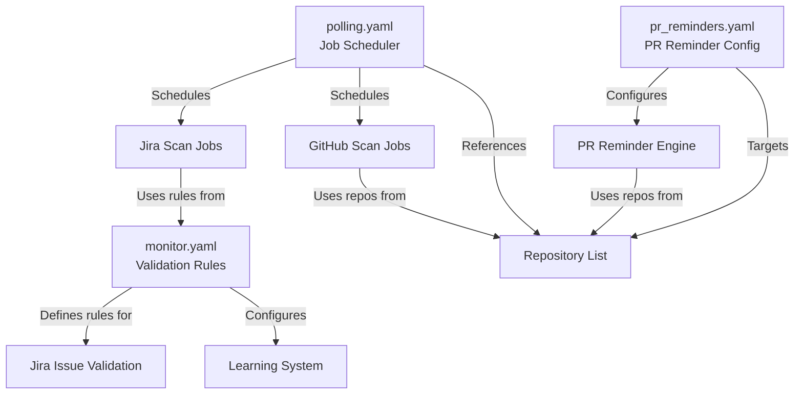
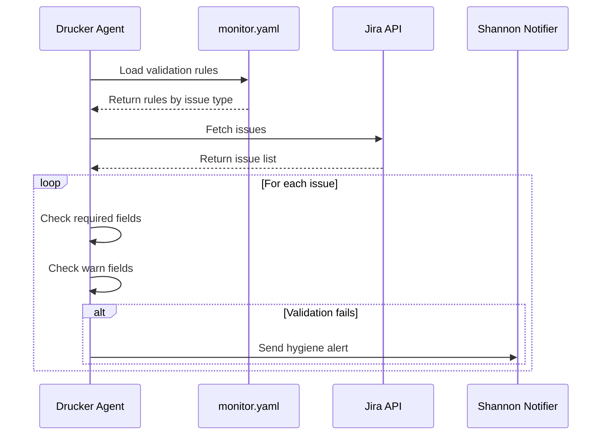
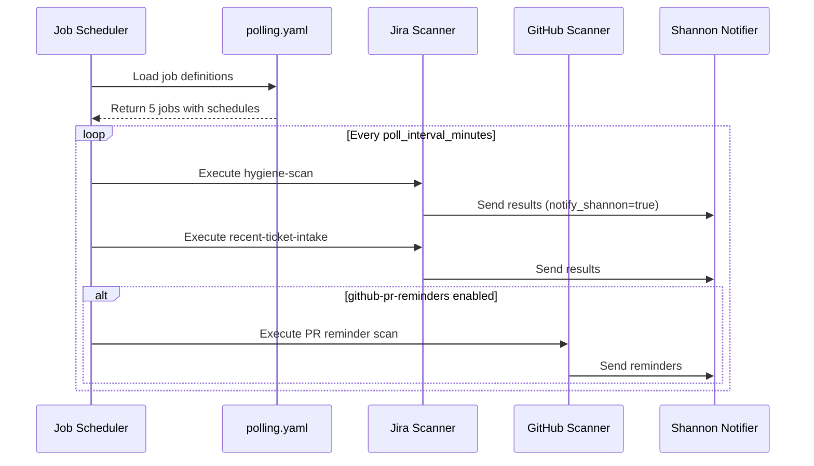
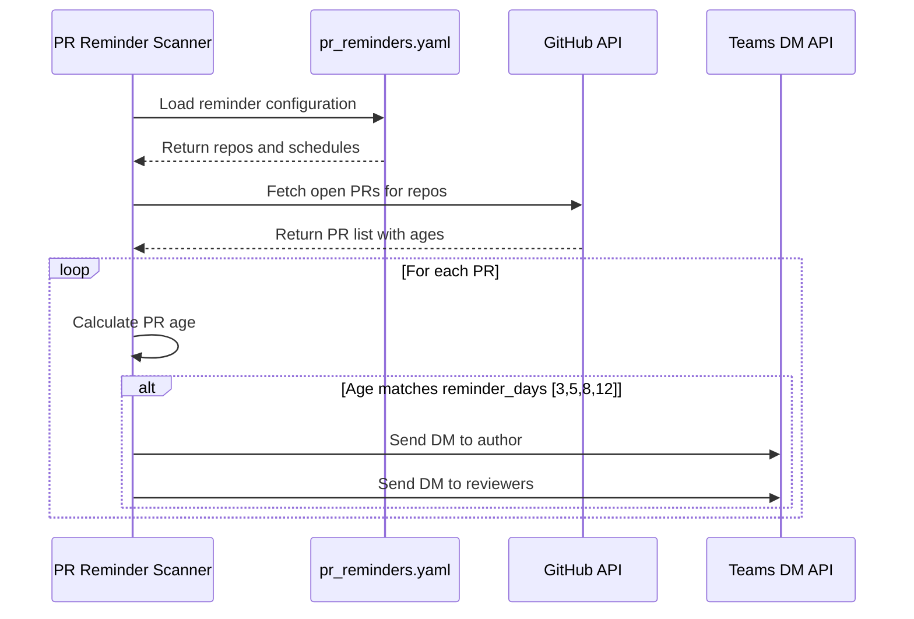

<!-- Generated by Documentation Agent — do not edit between markers -->

```yaml
---
title: "As-Built: Drucker Agent Configuration"
date: "2026-04-06"
status: "draft"
---
```

## Module Overview

The Drucker agent configuration module defines three YAML configuration files that control the behavior of a project management hygiene monitoring system. The module configures validation rules for Jira issue types (`monitor.yaml`), polling job schedules and parameters (`polling.yaml`), and GitHub pull request reminder settings (`pr_reminders.yaml`). These configurations enable automated scanning of Jira tickets and GitHub repositories across the Cornelis Networks organization, with support for notifications, learning-based field prediction, and stale work detection.

## What Changed

**Before:** The `polling.yaml` configuration had `notify_shannon: false` as the default, and the `github-pr-reminders` job was disabled. The job definitions lacked explicit `notify_shannon` overrides and the PR reminders job had no repository or schedule configuration.

**After:** The default `notify_shannon` is now `true`, and all five job definitions explicitly set `notify_shannon: true`. The `github-pr-reminders` job is now enabled with a specific repository (`jmac-cornelis/agent-workforce`) and a reminder schedule of `[3, 7, 14]` days.

**Impact:** Shannon (presumably a notification channel or user) will now receive notifications for all polling jobs by default. The PR reminder system is active and will send reminders for the agent-workforce repository at 3, 7, and 14 days after PR creation. Teams using the Drucker agent will receive more proactive notifications about stale work.

## Component Diagram



## Key Flows

### Flow 1: Jira Issue Validation



The agent loads validation rules from `monitor.yaml`, which defines required and warning-level fields for each Jira issue type (Story, Bug, Task, Epic). When scanning issues, the agent checks for missing required fields (assignee, fix_versions, components) and warns about missing optional fields (description). Validation failures trigger notifications to Shannon.

### Flow 2: Polling Job Execution



The polling configuration defines five jobs: two Jira scans (full hygiene and recent intake), two GitHub scans (currently disabled), and one PR reminder job (now enabled). Each job runs on a schedule defined by `poll_interval_minutes` (5 minutes from `monitor.yaml`) and sends results to Shannon when `notify_shannon: true`.

### Flow 3: GitHub PR Reminder Delivery



The PR reminder system uses `pr_reminders.yaml` to determine which repositories to monitor and when to send reminders. For the `jmac-cornelis/agent-workforce` repo, reminders are sent at 3, 5, 8, and 12 days. Other repos use the default schedule of `[5, 8, 10, 15]` days. Reminders are delivered via Teams direct messages to both authors and reviewers.

## Data Model

### monitor.yaml Schema

```yaml
project: string                    # Jira project key (empty = all projects)
poll_interval_minutes: integer     # Polling frequency

validation_rules:
  <IssueType>:                     # Story, Bug, Task, Epic
    required: [string]             # Fields that must be present
    warn: [string]                 # Fields that should be present

learning:
  enabled: boolean                 # Enable ML-based field prediction
  min_observations: integer        # Minimum data points for learning
  confidence_thresholds:
    auto_fill: float              # Threshold for automatic field population
    suggest: float                # Threshold for suggesting values
    flag_only: float              # Threshold for flagging anomalies
```

### polling.yaml Schema

```yaml
defaults:
  project_key: string              # Jira project key
  limit: integer                   # Max issues per scan
  include_done: boolean            # Include completed issues
  stale_days: integer              # Days before marking stale
  label_prefix: string             # Label prefix for tagging
  persist: boolean                 # Persist scan state
  notify_shannon: boolean          # Send notifications
  github_stale_days: integer       # Days before PR is stale
  github_repos: [string]           # List of org/repo names

jobs:
  - job_id: string                 # Unique job identifier
    description: string            # Human-readable description
    scan_type: string              # jira | github | github-extended | github-pr-reminders
    recent_only: boolean           # Scan only recent changes
    enabled: boolean               # Job active flag
    notify_shannon: boolean        # Override default notification
    repos: [string]                # Job-specific repo list
    reminder_schedule: [integer]   # Days for PR reminders
```

### pr_reminders.yaml Schema

```yaml
defaults:
  reminder_days: [integer]         # Days after PR creation to remind
  notify: [string]                 # author | reviewers
  channels: [string]               # teams_dm | email
  snooze_options_days: [integer]   # Snooze duration options
  merge_methods: [string]          # squash | merge | rebase
  enabled: boolean                 # Global enable flag

repos:
  - repo: string                   # org/repo name
    reminder_days: [integer]       # Override default schedule
```

## Dependencies

| Dependency | Purpose | Version |
|------------|---------|---------|
| PyYAML | YAML parsing and validation | Not specified |
| Jira API | Issue fetching and validation | Not specified |
| GitHub API | PR and repository scanning | Not specified |
| Microsoft Teams API | Direct message notifications | Not specified |

## Configuration

### Environment Variables

The configuration files themselves do not reference environment variables, but the Drucker agent likely requires:

- `JIRA_API_TOKEN` — Authentication for Jira API access
- `GITHUB_TOKEN` — Authentication for GitHub API access
- `TEAMS_WEBHOOK_URL` or `TEAMS_BOT_TOKEN` — Teams notification delivery
- `DRUCKER_CONFIG_PATH` — Path to configuration directory (defaults to `agents/drucker/config/`)

### Configuration Files

- **`monitor.yaml`** — Validation rules and learning system configuration
- **`polling.yaml`** — Job definitions, schedules, and repository lists
- **`pr_reminders.yaml`** — PR reminder schedules and notification preferences

### Feature Flags

- `learning.enabled` (monitor.yaml) — Enables ML-based field prediction (currently `true`)
- `jobs[].enabled` (polling.yaml) — Per-job enable/disable flag
  - `github-hygiene-scan`: `false`
  - `github-extended-scan`: `false`
  - `github-pr-reminders`: `true`
- `defaults.enabled` (pr_reminders.yaml) — Global PR reminder enable flag (currently `true`)

## Error Handling

The configuration files are declarative YAML and do not contain error handling logic. Error handling is expected to occur in the Drucker agent code that consumes these configurations:

- **Missing required fields**: The agent should validate that all required configuration keys are present before starting jobs.
- **Invalid YAML syntax**: The YAML parser will raise exceptions that should be caught and logged with clear error messages.
- **Invalid job references**: Jobs referencing non-existent scan types or repositories should fail gracefully with descriptive errors.
- **API failures**: The agent should implement retry logic and exponential backoff for Jira, GitHub, and Teams API calls.

## Known Limitations / Technical Debt

1. **Empty project key**: The `project` field in `monitor.yaml` is an empty string, which likely means "all projects" but this is not documented. This implicit behavior should be made explicit.

2. **Hardcoded repository list**: The `github_repos` list in `polling.yaml` contains 26 hardcoded repositories. This list is duplicated in `pr_reminders.yaml` (with slight variations). This violates DRY principles and creates maintenance burden. Consider externalizing to a shared repository registry.

3. **Inconsistent reminder schedules**: The `polling.yaml` defines `reminder_schedule: [3, 7, 14]` for the PR reminders job, while `pr_reminders.yaml` defines `reminder_days: [3, 5, 8, 12]` for the same repository. This configuration conflict is unclear — which takes precedence?

4. **No schema validation**: The YAML files lack schema definitions or validation rules. Invalid configurations will only be detected at runtime. Consider adding JSON Schema or Pydantic models for validation.

5. **Magic numbers**: Confidence thresholds (`0.90`, `0.50`, `0.0`) and stale day counts (`30`, `5`) are hardcoded without explanation. These should be documented or made more discoverable.

6. **Disabled jobs**: Two of five polling jobs are disabled (`github-hygiene-scan`, `github-extended-scan`). If these are permanently unused, they should be removed to reduce configuration complexity.

7. **Notification coupling**: The `notify_shannon` flag appears throughout the configuration, tightly coupling the system to a specific notification target. This should be generalized to support multiple notification channels or recipients.

<!-- End Documentation Agent generated content -->