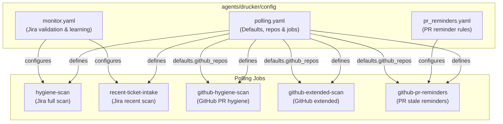
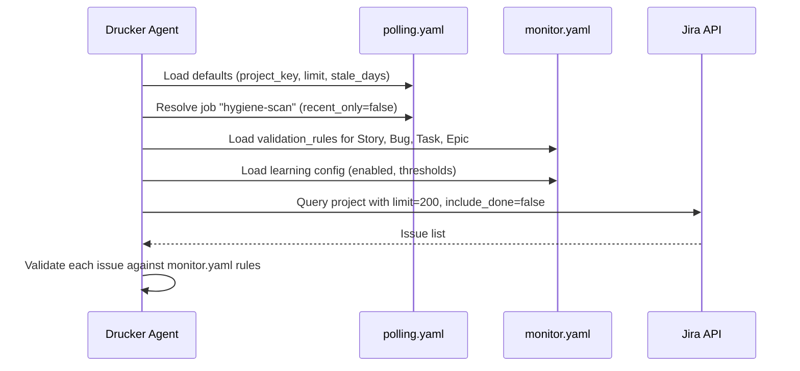
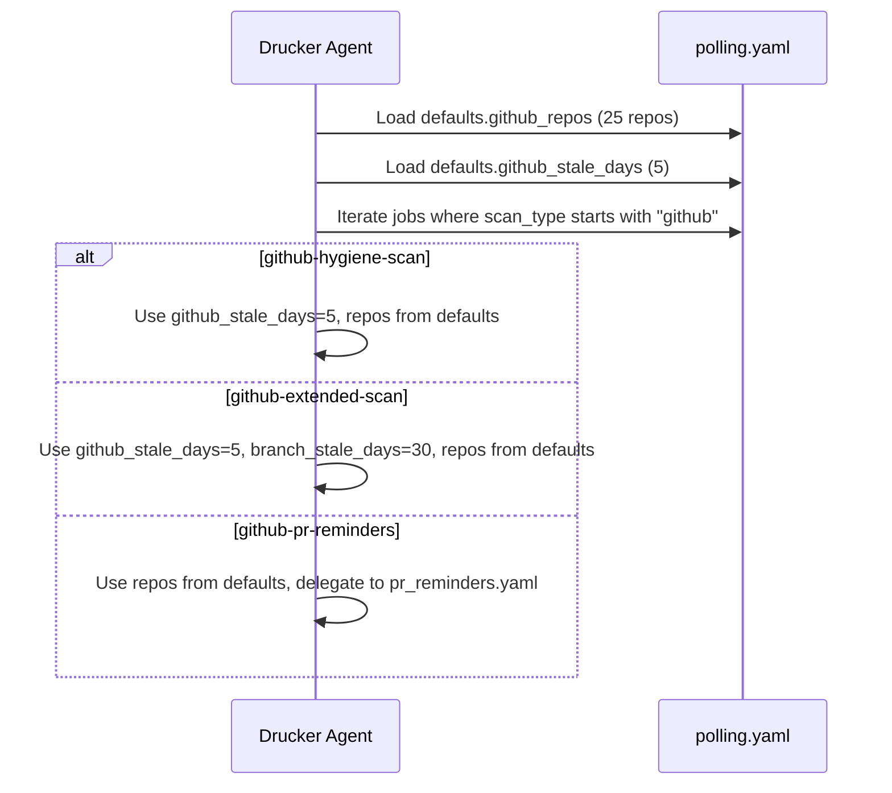
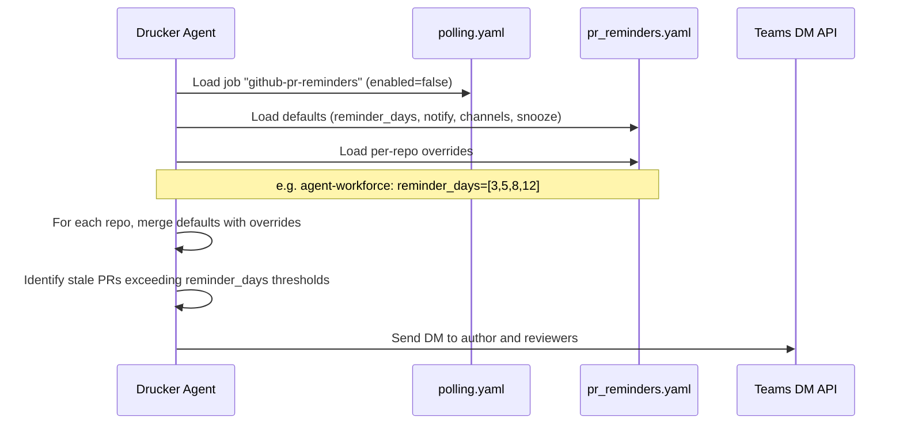

<!-- Generated by Documentation Agent — do not edit between markers -->

```yaml
---
title: "As-Built: Drucker Agent — Config"
date: "2026-04-03"
status: "draft"
---
```

# Config — Design Reference

## 1. Module Overview

The `agents/drucker/config/` directory contains the YAML configuration files that govern the Drucker agent — a project-hygiene automation agent responsible for scanning Jira tickets and GitHub repositories for compliance issues, stale work, and missing metadata. Three configuration files define the agent's behavior: `monitor.yaml` controls Jira field-validation rules and a machine-learning suggestion subsystem; `polling.yaml` defines the polling defaults, the canonical list of monitored GitHub repositories, and the discrete scan jobs the agent can execute; and `pr_reminders.yaml` configures a pull-request reminder system that notifies authors and reviewers of aging PRs via Teams direct messages. Together these files parameterize the Drucker agent without requiring code changes.

## 2. What Changed

### Before

- The `github_repos` list was specified per-job inside `polling.yaml` (as empty arrays on the `github-hygiene-scan` and `github-extended-scan` jobs).
- No `github-pr-reminders` job existed.
- No `pr_reminders.yaml` file existed.

### After

- The `github_repos` list is now a **top-level default** in `polling.yaml` (`defaults.github_repos`), containing 25 repositories. Individual jobs no longer carry their own `github_repos` overrides.
- A new job `github-pr-reminders` (scan type `github-pr-reminders`, disabled by default) was added to `polling.yaml`.
- A new file `pr_reminders.yaml` was introduced, defining reminder cadences, notification channels, snooze options, and per-repo overrides for the PR-reminder workflow.

### Impact

- **All GitHub scan jobs** (`github-hygiene-scan`, `github-extended-scan`, `github-pr-reminders`) now inherit the same 25-repo list from `defaults.github_repos`, ensuring consistency and eliminating per-job duplication.
- **Downstream consumers** that read `polling.yaml` must resolve `github_repos` from `defaults` rather than from individual job entries.
- The new `pr_reminders.yaml` introduces a dependency on a Teams DM notification pathway; any runtime code that loads this config must handle the `channels: [teams_dm]` target.

## 3. Component Diagram



## 4. Key Flows

### Flow 1 — Jira Hygiene Scan Configuration Resolution

When the Drucker agent starts a Jira hygiene scan, it loads `polling.yaml` to obtain job parameters and `monitor.yaml` to obtain per-issue-type validation rules.



**Description:** The agent merges `polling.yaml` defaults with the `hygiene-scan` job definition to determine query parameters (`limit: 200`, `include_done: false`, `stale_days: 30`). It then applies `monitor.yaml` validation rules — for example, a `Bug` must have `assignee`, `fix_versions`, `components`, and `priority` (required), while `description` triggers a warning. The learning subsystem (when `enabled: true` and at least `min_observations: 20` samples exist) can auto-fill fields at ≥ 90% confidence, suggest at ≥ 50%, or flag-only below that.

### Flow 2 — GitHub Repository List Resolution for Scan Jobs

All three GitHub-oriented jobs resolve their target repository list from the shared `defaults.github_repos` key.



**Description:** The `defaults.github_repos` list is the single source of truth for which repositories are scanned. Individual jobs may override `github_stale_days` or add job-specific keys like `branch_stale_days: 30` (on `github-extended-scan`), but the repo list itself is inherited. All three GitHub jobs are currently `enabled: false`.

### Flow 3 — PR Reminder Configuration Resolution

The `github-pr-reminders` job delegates its behavioral configuration to `pr_reminders.yaml`.



**Description:** `pr_reminders.yaml` defines a default reminder cadence of `[5, 8, 10, 15]` days, notifying both `author` and `reviewers` via `teams_dm`. Per-repo overrides are supported — for example, `jmac-cornelis/agent-workforce` uses an accelerated cadence of `[3, 5, 8, 12]` days. Snooze options (`[2, 5, 7]` days) and allowed merge methods (`[squash, merge, rebase]`) are also configurable. All 25 repos from `polling.yaml` are mirrored in the `repos` list here.

## 5. Data Model

The configuration files define the following logical data structures:

### `monitor.yaml`

| Key Path | Type | Description |
|---|---|---|
| `project` | `string` | Jira project key (currently empty string) |
| `poll_interval_minutes` | `int` | Polling interval; `5` minutes |
| `validation_rules.<IssueType>.required` | `list[string]` | Fields that must be populated |
| `validation_rules.<IssueType>.warn` | `list[string]` | Fields that trigger warnings if absent |
| `learning.enabled` | `bool` | Toggle for ML suggestion engine |
| `learning.min_observations` | `int` | Minimum samples before predictions activate (`20`) |
| `learning.confidence_thresholds.auto_fill` | `float` | Threshold for automatic field population (`0.90`) |
| `learning.confidence_thresholds.suggest` | `float` | Threshold for user-facing suggestions (`0.50`) |
| `learning.confidence_thresholds.flag_only` | `float` | Floor threshold for flagging (`0.0`) |

### `polling.yaml`

| Key Path | Type | Description |
|---|---|---|
| `defaults.project_key` | `string` | Jira project key (empty string) |
| `defaults.limit` | `int` | Max issues per query (`200`) |
| `defaults.include_done` | `bool` | Whether to include resolved issues (`false`) |
| `defaults.stale_days` | `int` | Days before a Jira issue is considered stale (`30`) |
| `defaults.label_prefix` | `string` | Label prefix applied by Drucker (`drucker`) |
| `defaults.persist` | `bool` | Whether to persist scan state (`true`) |
| `defaults.notify_shannon` | `bool` | Whether to notify the Shannon agent (`false`) |
| `defaults.github_stale_days` | `int` | Days before a PR is considered stale (`5`) |
| `defaults.github_repos` | `list[string]` | Canonical list of 25 GitHub repositories |
| `jobs[].job_id` | `string` | Unique job identifier |
| `jobs[].scan_type` | `string` | One of `jira`, `github`, `github-extended`, `github-pr-reminders` |
| `jobs[].enabled` | `bool` | Job enable flag (absent = enabled) |
| `jobs[].recent_only` | `bool` | Jira-specific: use checkpoint state |
| `jobs[].branch_stale_days` | `int` | GitHub-extended-specific: stale branch threshold (`30`) |

### `pr_reminders.yaml`

| Key Path | Type | Description |
|---|---|---|
| `defaults.reminder_days` | `list[int]` | Days-since-open thresholds for reminders (`[5,8,10,15]`) |
| `defaults.notify` | `list[string]` | Notification targets (`[author, reviewers]`) |
| `defaults.channels` | `list[string]` | Delivery channels (`[teams_dm]`) |
| `defaults.snooze_options_days` | `list[int]` | Snooze durations offered to users (`[2,5,7]`) |
| `defaults.merge_methods` | `list[string]` | Allowed merge strategies (`[squash, merge, rebase]`) |
| `defaults.enabled` | `bool` | Global enable for PR reminders (`true`) |
| `repos[].repo` | `string` | Repository slug |
| `repos[].reminder_days` | `list[int]` | Per-repo override of reminder cadence |

## 6. Dependencies

| Dependency | Purpose | Version |
|---|---|---|
| Jira API | Target of hygiene and intake scans configured in `polling.yaml` and `monitor.yaml` | N/A (external service) |
| GitHub API | Target of GitHub scan jobs; repos enumerated in `defaults.github_repos` | N/A (external service) |
| Microsoft Teams API | Delivery channel for PR reminder notifications (`channels: [teams_dm]`) | N/A (external service) |
| Shannon Agent | Optional notification target (`notify_shannon: false` in defaults) | Internal agent |
| YAML parser | Runtime must parse these YAML files (e.g., PyYAML, ruamel.yaml) | N/A |

## 7. Configuration

All configuration for the Drucker agent is contained within these three files. There are no environment variables or feature flags defined in the config files themselves; runtime secrets (Jira credentials, GitHub tokens, Teams webhook URLs) are expected to be provided externally.

| File | Key Configuration Points |
|---|---|
| `monitor.yaml` | `project` (empty — must be set), `poll_interval_minutes`, per-issue-type `validation_rules`, `learning` subsystem toggles and thresholds |
| `polling.yaml` | `defaults.project_key` (empty — must be set), `defaults.limit`, `defaults.github_repos` (25 repos), five job definitions with `enabled` flags |
| `pr_reminders.yaml` | `defaults.reminder_days`, `defaults.channels`, per-repo overrides |

**Feature flags (job-level):**

```yaml
# polling.yaml — GitHub jobs are disabled by default
- job_id: github-hygiene-scan
  enabled: false

- job_id: github-extended-scan
  enabled: false

- job_id: github-pr-reminders
  enabled: false
```

The two Jira jobs (`hygiene-scan`, `recent-ticket-intake`) have no `enabled` key, implying they are enabled by default.

## 8. Error Handling

These are static YAML configuration files and contain no error-handling logic themselves. Error handling is the responsibility of the consuming runtime code. However, the configuration structure implies the following validation expectations:

- **Empty `project` / `project_key`:** Both `monitor.yaml` (`project: ''`) and `polling.yaml` (`defaults.project_key: ''`) ship with empty project keys. The runtime must either fail fast or resolve these from an external source.
- **Confidence threshold ordering:** The three thresholds in `learning.confidence_thresholds` form an implicit hierarchy (`auto_fill: 0.90` > `suggest: 0.50` > `flag_only: 0.0`). Consumers should validate this ordering.
- **Missing per-repo keys in `pr_reminders.yaml`:** Most repos in the `repos` list have no overrides beyond `repo`. The runtime must fall back to `defaults` for all missing keys.

## 9. Known Limitations / Technical Debt

1. **Empty project keys:** Both `monitor.yaml` (`project: ''`) and `polling.yaml` (`defaults.project_key: ''`) contain empty strings. These are effectively **hardcoded placeholders** that must be populated at runtime or via an external mechanism. There is no documented contract for how this resolution occurs.

2. **Duplicated repository lists:** The 25-repository list appears in both `polling.yaml` (`defaults.github_repos`) and `pr_reminders.yaml` (`repos`). These lists are manually synchronized. Any addition or removal must be applied to both files, creating a maintenance risk. A single canonical source would be preferable.

3. **All GitHub jobs disabled:** The three GitHub scan jobs (`github-hygiene-scan`, `github-extended-scan`, `github-pr-reminders`) are all set to `enabled: false`. This suggests the GitHub scanning capability is not yet production-ready or is gated behind an external activation step.

4. **No schema validation:** There is no JSON Schema or equivalent validation definition for these YAML files. Typos in key names (e.g., `reminder_day` instead of `reminder_days`) would silently produce incorrect behavior.

5. **Implicit `enabled` default for Jira jobs:** The Jira jobs (`hygiene-scan`, `recent-ticket-intake`) omit the `enabled` key entirely, relying on the runtime to treat absence as `true`. This implicit convention is not documented in the config and could lead to confusion.

6. **`notify_shannon: false` with no documentation:** The `notify_shannon` flag in `polling.yaml` defaults references an inter-agent communication channel with no further specification of the protocol or payload format in these config files.

7. **Hardcoded label prefix:** `defaults.label_prefix: drucker` is a hardcoded string that will be applied as Jira labels. Changing the agent's identity would require updating this value.

<!-- End Documentation Agent generated content -->