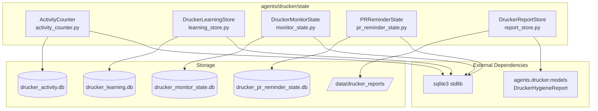
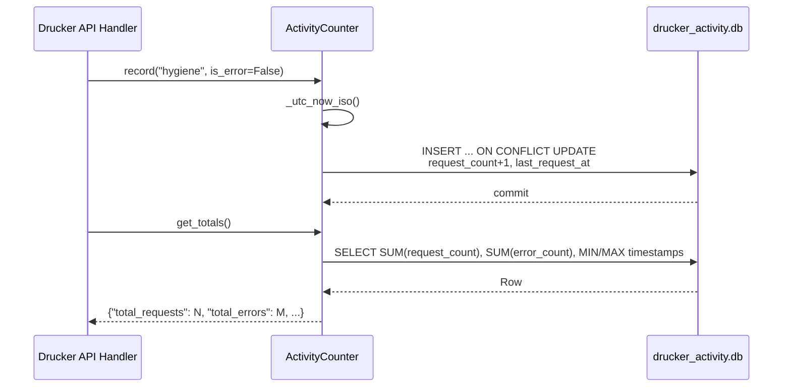
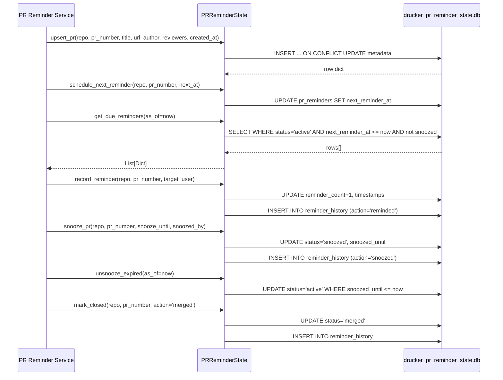
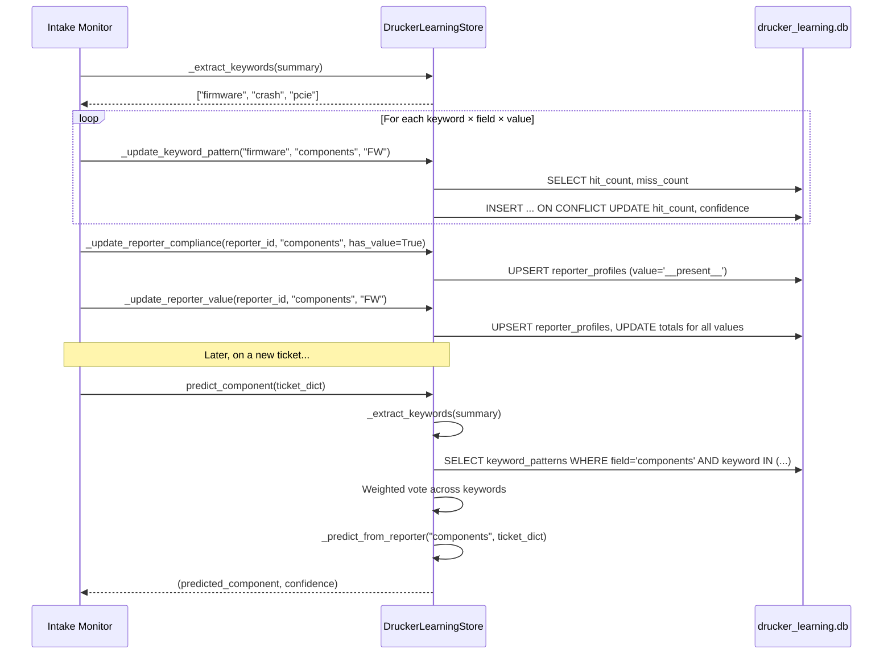

<!-- Generated by Documentation Agent — do not edit between markers -->

```yaml
---
title: "As-Built: Drucker State Layer"
date: "2026-04-03"
status: "draft"
---
```

## Module Overview

The `agents/drucker/state/` package provides the persistence layer for the Drucker agent — a Jira hygiene and PR review automation system within the Cornelis Networks agent workforce. The package contains five SQLite-backed and filesystem-backed stores, each responsible for a distinct domain of durable state: API request activity counters, ticket-intake learning patterns, intake-monitor checkpoints, PR reminder lifecycle tracking, and hygiene report artifact storage. Every SQLite store follows a consistent architectural pattern — thread-safe access via `threading.RLock`, `sqlite3.Row`-based row factories, `check_same_thread=False` connections, automatic parent-directory creation, and an explicit `close()` lifecycle method. The filesystem store (`DruckerReportStore`) persists JSON and Markdown report artifacts to a configurable directory tree. Together, these stores give Drucker durable, crash-recoverable state without requiring an external database server.

## What Changed

- **Before:** The state layer consisted of three stores: `DruckerLearningStore` (keyword/reporter pattern learning), `DruckerMonitorState` (intake checkpoint tracking), and `DruckerReportStore` (hygiene report persistence).
- **After:** Two new SQLite stores were added: `ActivityCounter` for tracking per-category API request and error counts with timestamps, and `PRReminderState` for managing the full PR reminder lifecycle including scheduling, snoozing, unsnoozing, and action history.
- **Impact:** Drucker now has observability into its own API usage patterns via `ActivityCounter`, and can autonomously track and escalate stale pull requests via `PRReminderState`. Consumers of the Drucker API (e.g., the `pr-reminders` and activity/status endpoints) depend on these new stores. Existing stores (`DruckerLearningStore`, `DruckerMonitorState`, `DruckerReportStore`) are unchanged.

## Component Diagram



## Key Flows

### Flow 1: Recording and Querying API Activity

The `ActivityCounter` provides a fire-and-forget `record()` call that upstream API handlers invoke on every request. Aggregated totals are retrieved via `get_all()` (per-category) or `get_totals()` (global sums).



The `record()` method uses a single `INSERT ... ON CONFLICT DO UPDATE` statement to atomically upsert the category row. On the first request for a category, `first_request_at` is set; on subsequent requests only `last_request_at` and the counters are updated:

```python
def record(self, category: str, is_error: bool = False) -> None:
    conn = self._require_conn()
    now = self._utc_now_iso()
    with self._lock:
        cursor = conn.cursor()
        cursor.execute(
            '''
            INSERT INTO activity (category, request_count, error_count, first_request_at, last_request_at)
            VALUES (?, 1, ?, ?, ?)
            ON CONFLICT(category) DO UPDATE SET
                request_count = request_count + 1,
                error_count = error_count + ?,
                last_request_at = ?
            ''',
            (category, int(is_error), now, now, int(is_error), now),
        )
        conn.commit()
```

### Flow 2: PR Reminder Lifecycle (Track → Remind → Snooze → Close)

`PRReminderState` manages the full lifecycle of a pull request from initial tracking through reminder escalation, optional snoozing, and eventual closure.



The `get_due_reminders()` query filters on three conditions — active status, non-null `next_reminder_at` in the past, and expired or absent snooze window:

```python
cursor.execute(
    '''
    SELECT * FROM pr_reminders
    WHERE status = 'active'
      AND next_reminder_at IS NOT NULL
      AND next_reminder_at <= ?
      AND (snoozed_until IS NULL OR snoozed_until <= ?)
    ORDER BY next_reminder_at ASC
    ''',
    (now, now),
)
```

### Flow 3: Learning from Ticket Intake Observations

`DruckerLearningStore` observes resolved Jira tickets to build keyword→component and reporter→field-value association patterns. These patterns are later queried via `predict_component()` to suggest metadata for new tickets.



Confidence for keyword patterns uses Laplace smoothing: `confidence = hit_count / (hit_count + miss_count + 2)`. The `predict_component()` method aggregates weighted votes from all matching keyword patterns and blends with reporter-profile predictions. The `min_observations` threshold (default 20) gates predictions to avoid premature suggestions.

## Data Model

The state layer uses four SQLite databases and one filesystem tree. Each database is single-file, WAL-mode compatible, and created on first access.

### `drucker_activity.db` — ActivityCounter

| Table | Column | Type | Notes |
|-------|--------|------|-------|
| `activity` | `category` | TEXT PK | Endpoint category (e.g., "hygiene", "jira", "github", "nl", "pr-reminders") |
| | `request_count` | INTEGER | Monotonically increasing |
| | `error_count` | INTEGER | Subset of request_count |
| | `first_request_at` | TEXT | ISO 8601 UTC |
| | `last_request_at` | TEXT | ISO 8601 UTC |

### `drucker_learning.db` — DruckerLearningStore

| Table | Column | Type | Notes |
|-------|--------|------|-------|
| `observations` | `id` | INTEGER PK AUTO | |
| | `ticket_key` | TEXT | e.g., "PROJ-123" |
| | `field` | TEXT | Normalized field name |
| | `predicted_value` | TEXT | What was predicted |
| | `actual_value` | TEXT | What was actually set |
| | `correct` | INTEGER | 0 or 1 |
| | `timestamp` | TEXT | ISO 8601 UTC |
| `keyword_patterns` | `keyword, field, value` | TEXT PK (composite) | |
| | `hit_count` | INTEGER | Times keyword co-occurred with value |
| | `miss_count` | INTEGER | Times keyword appeared without value |
| | `confidence` | REAL | `hit / (hit + miss + 2)` |
| `reporter_profiles` | `reporter_id, field, value` | TEXT PK (composite) | `value='__present__'` tracks compliance |
| | `count` | INTEGER | |
| | `total` | INTEGER | |
| | `compliance_rate` | REAL | `count / total` |
| `learned_tickets` | `ticket_key, fingerprint` | TEXT PK (composite) | Deduplication via content hash |
| | `learned_at` | TEXT | ISO 8601 UTC |

**Indexes:** `idx_drucker_obs_ticket_field`, `idx_drucker_keyword_patterns`, `idx_drucker_reporter_profiles`, `idx_drucker_learned_tickets_key`.

### `drucker_monitor_state.db` — DruckerMonitorState

| Table | Column | Type | Notes |
|-------|--------|------|-------|
| `checkpoints` | `project` | TEXT PK | Jira project key |
| | `last_checked` | TEXT | ISO 8601 cursor |
| `processed_tickets` | `ticket_key` | TEXT PK | |
| | `project` | TEXT | |
| | `processed_at` | TEXT | |
| `validation_history` | `id` | INTEGER PK AUTO | |
| | `ticket_key` | TEXT | |
| | `project` | TEXT | |
| | `result_json` | TEXT | JSON-serialized validation result |
| | `timestamp` | TEXT | |

**Indexes:** `idx_drucker_processed_project`, `idx_drucker_history_ticket`, `idx_drucker_history_project`.

### `drucker_pr_reminder_state.db` — PRReminderState

| Table | Column | Type | Notes |
|-------|--------|------|-------|
| `pr_reminders` | `id` | INTEGER PK AUTO | |
| | `repo` | TEXT | GitHub `owner/repo` |
| | `pr_number` | INTEGER | UNIQUE with repo |
| | `pr_title` | TEXT | |
| | `pr_url` | TEXT | |
| | `author_github` | TEXT | |
| | `reviewers_github` | TEXT | Comma-separated or JSON |
| | `created_at` | TEXT | PR creation time |
| | `first_reminded_at` | TEXT | |
| | `last_reminded_at` | TEXT | |
| | `next_reminder_at` | TEXT | Scheduling cursor |
| | `reminder_count` | INTEGER | |
| | `snoozed_until` | TEXT | |
| | `snoozed_by` | TEXT | |
| | `status` | TEXT | `active`, `snoozed`, `closed`, `merged` |
| `reminder_history` | `id` | INTEGER PK AUTO | |
| | `repo, pr_number` | TEXT, INTEGER | |
| | `action` | TEXT | `reminded`, `snoozed`, `closed`, `merged` |
| | `target_user` | TEXT | |
| | `details_json` | TEXT | |
| | `timestamp` | TEXT | |

**Indexes:** `idx_pr_reminders_repo_status`, `idx_pr_reminders_next` (partial, active only), `idx_reminder_history_pr`.

### Filesystem — DruckerReportStore

```
data/drucker_reports/
  └── <PROJECT_KEY>/
      └── <REPORT_ID>/
          ├── report.json
          └── summary.md
```

## Dependencies

| Dependency | Purpose | Version |
|---|---|---|
| `sqlite3` | Embedded relational database for all four SQLite stores | Python stdlib |
| `threading` | `RLock` for thread-safe database access | Python stdlib |
| `json` | Serialization of validation results, history details, report data | Python stdlib |
| `pathlib.Path` | Directory creation and file path resolution | Python stdlib |
| `hashlib` | Imported in `learning_store.py` (available for fingerprint computation) | Python stdlib |
| `re` | Keyword tokenization in `DruckerLearningStore._extract_keywords()` | Python stdlib |
| `logging` | Structured logging in `learning_store.py` and `report_store.py` | Python stdlib |
| `agents.drucker.models.DruckerHygieneReport` | Report model with `to_dict()` and `summary_markdown` for `DruckerReportStore.save_report()` | Internal |

## Configuration

| Parameter | Source | Default | Description |
|---|---|---|---|
| `db_path` (ActivityCounter) | Constructor argument | `'data/drucker_activity.db'` | SQLite database file path |
| `db_path` (DruckerLearningStore) | Constructor argument | `'data/drucker_learning.db'` | SQLite database file path |
| `min_observations` (DruckerLearningStore) | Constructor argument | `20` | Minimum observation count before predictions are emitted; clamped to ≥1 |
| `db_path` (DruckerMonitorState) | Constructor argument | `'data/drucker_monitor_state.db'` | SQLite database file path |
| `db_path` (PRReminderState) | Constructor argument | `'data/drucker_pr_reminder_state.db'` | SQLite database file path |
| `storage_dir` (DruckerReportStore) | Constructor argument | `None` (falls through) | Filesystem directory for report artifacts |
| `DRUCKER_REPORT_DIR` | Environment variable | `'data/drucker_reports'` | Overrides default report storage directory when `storage_dir` is not passed |

All SQLite stores accept `':memory:'` as `db_path` for testing; when this value is used, parent-directory creation is skipped.

## Error Handling

All five stores follow a consistent error-handling pattern:

1. **Connection guard:** Every public method calls `_require_conn()`, which raises `RuntimeError('... connection is closed')` if `close()` has already been called. Each store class has its own message string (e.g., `'ActivityCounter connection is closed'`, `'PRReminderState connection is closed'`).

2. **Thread safety:** All database operations are wrapped in `with self._lock:` blocks using a `threading.RLock`. This prevents concurrent mutation from multiple threads sharing a single store instance.

3. **Idempotent writes:** All insert operations use `INSERT ... ON CONFLICT DO UPDATE` (SQLite UPSERT), making repeated calls with the same key safe.

4. **DruckerReportStore** uses `try/except` around file I/O in `get_report()` and `list_reports()`:
   - Failed JSON loads in `get_report()` log an error and return `None`.
   - Failed reads during `list_reports()` log a warning and skip the file.
   - Failed markdown reads log a warning and default to an empty string.

5. **DruckerReportStore.save_report()** raises `ValueError` if `report_id` or `project_key` is missing from the report data — this is the only validation-style exception in the package.

6. **Timestamp parsing** in `DruckerReportStore._sort_timestamp()` catches `ValueError` from `datetime.fromisoformat()` and falls back to `datetime.min` to avoid crashing list operations on malformed data.

## Known Limitations / Technical Debt

1. **Truncated source file:** The `learning_store.py` source provided is truncated mid-method inside `predict_component()`. The keyword-weighted voting logic and reporter-blend logic are partially visible but the method body is incomplete. This means the full prediction algorithm cannot be documented with certainty.

2. **No connection pooling or WAL mode:** All SQLite stores use a single `sqlite3.connect()` call with `check_same_thread=False`. There is no explicit `PRAGMA journal_mode=WAL` or `PRAGMA busy_timeout` configuration, which may cause `database is locked` errors under concurrent write load.

3. **No schema migration support:** All tables are created with `CREATE TABLE IF NOT EXISTS`. There is no versioning or migration mechanism — adding columns to existing tables would require manual intervention or a fresh database.

4. **Hardcoded default database paths:** Each store has a hardcoded default path (e.g., `'data/drucker_activity.db'`, `'data/drucker_pr_reminder_state.db'`). These are relative paths that depend on the working directory of the process. There is no centralized configuration or path registry.

5. **`DruckerLearningStore` imports `hashlib` but never uses it in the visible source.** The `learned_tickets` table stores a `fingerprint` column, suggesting hashing is used elsewhere or was planned but the call site is in the truncated portion.

6. **No data retention or pruning:** The `validation_history`, `reminder_history`, and `observations` tables grow without bound. There are no TTL, archival, or vacuum mechanisms.

7. **`DruckerReportStore` glob-based lookups:** `_find_report_json()` uses `self.storage_dir.glob(f'*/{report_id}/report.json')` when no `project_key` is provided, which scans the entire directory tree. This will degrade at scale.

8. **Missing error handling on `conn.commit()`:** No store wraps `commit()` in a try/except. A disk-full or I/O error during commit would propagate as an unhandled `sqlite3.OperationalError`.

9. **`_STOPWORDS` in `DruckerLearningStore`** is a class-level constant with ~60 entries. It is not configurable and cannot be extended without modifying the source.

<!-- End Documentation Agent generated content -->