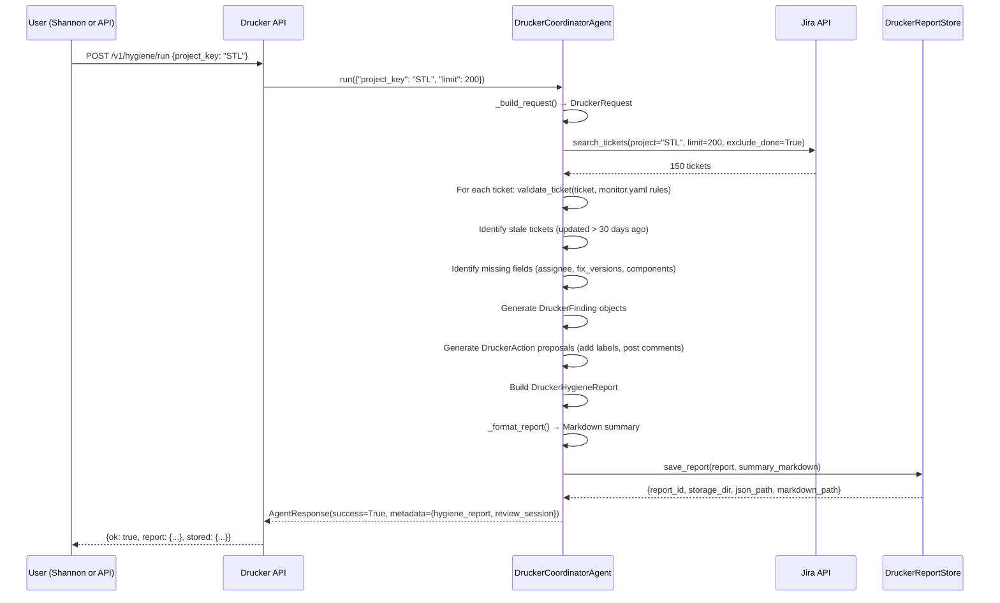
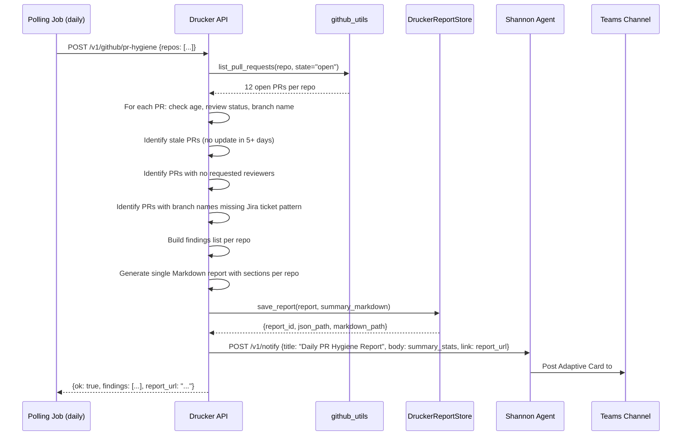
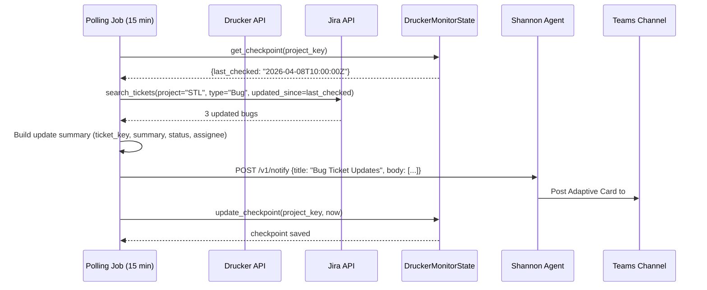

<!-- Generated by Documentation Agent — do not edit between markers -->

```yaml
---
title: "As-Built: Drucker Engineering Hygiene Agent"
date: "2026-04-08"
status: "draft"
---
```

# Drucker Engineering Hygiene Agent — Design Reference

## Module Overview

Drucker is a deterministic-first engineering hygiene agent that monitors Jira ticket quality and GitHub pull request lifecycle health across the Cornelis Networks organization. Named after management theorist Peter Drucker, the agent identifies workflow drift, missing metadata, stale work, and routing mistakes in both Jira and GitHub, then produces actionable hygiene reports with review-gated remediation proposals. Drucker operates in dry-run mode by default, ensuring all mutation operations are previewed before execution. It exposes a REST API (port 8201), integrates with the Shannon Teams bot for interactive commands, and runs scheduled polling jobs for continuous hygiene monitoring. The agent combines Jira ticket validation, GitHub PR staleness detection, PR reminder DMs via Teams, natural language query translation, and a learning subsystem that observes ticket-intake patterns to suggest metadata for new issues.

## What Changed

### Before
- Drucker was a Jira-only hygiene agent with three core workflows: full project hygiene scans, single-ticket intake validation, and recent-ticket intake reports.
- GitHub PR hygiene was a planned feature but not implemented.
- No PR reminder system existed.
- No natural language query capability existed.
- The agent had no persistent activity tracking or observability into its own API usage.
- Polling functionality was limited to manual API invocations.

### After
- **GitHub PR hygiene scanning** is fully implemented with six scan types: stale PRs, missing reviews, naming compliance, merge conflicts, CI failures, and stale branches.
- **PR reminder engine** delivers Teams DM notifications to PR authors and reviewers on configurable cadences, with snooze and merge actions via Adaptive Cards.
- **Natural language query translation** uses LLM function calling to convert plain English questions into structured Jira tool calls.
- **Activity counter** tracks all API requests by category (hygiene, jira, github, nl, pr-reminders) with error counts and timestamps.
- **JQL query logging** was added to hygiene reports — the exact JQL queries used to generate each report are now stored in `report.jql_queries[]` and rendered in the Markdown summary.
- **Automated polling** now runs on configurable schedules for bug ticket updates (15 min), GitHub PR updates (30 min), and GitHub PR hygiene reports (daily).
- **Shannon integration** expanded to deliver polling notifications as Teams channel cards with hyperlinks to generated reports.

### Impact
- **Shannon integration expanded**: Drucker now handles 20+ Shannon commands (up from 7), including `/pr-hygiene`, `/pr-reminder-scan`, `/ask` (NL query), and extended GitHub scans.
- **Observability improved**: The `/v1/status/*` endpoints now expose request counts, error rates, token usage (zero for deterministic paths, non-zero for NL queries), and recent decision history.
- **Deployment complexity increased**: Drucker now requires GitHub PAT credentials (`GITHUB_TOKEN`) and Teams Graph API credentials (`TEAMS_CLIENT_ID`, `TEAMS_CLIENT_SECRET`, `TEAMS_TENANT_ID`) for full functionality.
- **State layer expanded**: Five SQLite stores now manage state (activity, learning, monitor checkpoints, PR reminders, reports), up from three.
- **Operational visibility**: Teams channel `#agent-drucker` now receives automated cards for bug updates, PR creates/merges, and daily hygiene reports with summary stats and report hyperlinks.

## Component Diagram

```mermaid
graph TD
    subgraph "Drucker Agent (agents/drucker)"
        API[api.py<br/>FastAPI REST API]
        AGENT[agent.py<br/>DruckerCoordinatorAgent]
        CLI[cli.py<br/>Standalone CLI]
        CARDS[cards.py<br/>Adaptive Card builders]
        PR_REM[pr_reminders.py<br/>PR reminder engine]
        NL[nl_query.py<br/>NL query translator]
        JIRA_REP[jira_reporting.py<br/>Jira query wrappers]
        POLLER[polling.py<br/>Scheduled job runner]
    end

    subgraph "State Layer (agents/drucker/state)"
        ACT[activity_counter.py]
        LEARN[learning_store.py]
        MON[monitor_state.py]
        PR_STATE[pr_reminder_state.py]
        REP[report_store.py]
    end

    subgraph "External Dependencies"
        JIRA[Jira API]
        GITHUB[GitHub API]
        TEAMS[Teams Graph API]
        SHANNON[Shannon Agent]
        LLM[Cornelis LLM]
    end

    subgraph "Configuration"
        MON_CFG[config/monitor.yaml]
        POLL_CFG[config/polling.yaml]
        PR_CFG[config/pr_reminders.yaml]
        ID_MAP[config/identity_map.yaml]
    end

    API --> AGENT
    API --> PR_REM
    API --> NL
    API --> JIRA_REP
    API --> ACT
    API --> REP

    AGENT --> LEARN
    AGENT --> MON
    AGENT --> REP
    AGENT --> JIRA
    AGENT --> GITHUB

    PR_REM --> PR_STATE
    PR_REM --> GITHUB
    PR_REM --> TEAMS
    PR_REM --> CARDS

    NL --> LLM
    NL --> JIRA_REP

    POLLER --> AGENT
    POLLER --> GITHUB
    POLLER --> SHANNON
    POLLER --> REP
    POLLER --> POLL_CFG

    CLI --> AGENT
    CLI --> PR_REM

    SHANNON --> API

    AGENT --> MON_CFG
    AGENT --> POLL_CFG
    PR_REM --> PR_CFG
    PR_REM --> ID_MAP
```



## Key Flows

### Flow 1 — Jira Hygiene Scan (Full Project)

The full hygiene scan is the primary Drucker workflow. It queries all active tickets in a project, validates them against `monitor.yaml` rules, identifies stale work, and proposes low-risk remediation actions.



**Description:** The agent builds a `DruckerRequest` from the input, queries Jira for active tickets (excluding Done/Closed), validates each ticket against the `monitor.yaml` validation rules (e.g., Bug must have assignee, fix_versions, components, priority), identifies stale tickets (no update in 30+ days), detects missing required fields, generates `DruckerFinding` objects with severity (high/medium/low), proposes `DruckerAction` objects (e.g., "add label `needs-triage`", "post comment requesting assignee"), builds a `DruckerHygieneReport` with summary statistics, formats a Markdown summary, persists the report to `data/drucker_reports/<PROJECT>/<REPORT_ID>/`, and returns the report + review session to the caller. The exact JQL query used is now logged in `report.jql_queries[]`.

### Flow 2 — GitHub PR Hygiene Scan (Polling)

GitHub PR hygiene scans run on a daily schedule and detect stale PRs, missing reviews, naming violations, merge conflicts, CI failures, and stale branches. Results are delivered as a Teams channel card with summary stats and a hyperlink to the generated report.



**Description:** The daily polling job triggers a GitHub PR hygiene scan for all configured repositories. The API calls `github_utils.list_pull_requests()` to fetch all open PRs with metadata (author, reviewers, created_at, updated_at, branch name). For each PR, the agent checks: (1) staleness — if `updated_at` is older than `github_stale_days` (default 5), flag as stale; (2) review coverage — if `requested_reviewers` is empty and no approvals exist, flag as missing review; (3) naming compliance — if the branch name does not match a Jira ticket pattern (e.g., `STLSW-12345`) or `[NO-JIRA]`, flag as non-compliant. Findings are aggregated into a single Markdown report with sections per repo, saved to the report store, and a Teams card is sent to `#agent-drucker` with summary stats (repos scanned, total open PRs, stale PRs, missing reviews) and a hyperlink to the report file. The scan does **not** write GitHub comments or status checks — all notifications go through Shannon.

### Flow 3 — Bug Ticket Update Polling

The bug ticket update poller runs every 15 minutes, queries Jira for bug tickets updated since the last checkpoint, and sends a Teams card to `#agent-drucker` with update details.



**Description:** The poller retrieves the last checkpoint timestamp from `DruckerMonitorState`, queries Jira for bug tickets updated since that time, builds a summary of changes (ticket key, summary, status, assignee), sends a Teams card to `#agent-drucker` via Shannon, and updates the checkpoint to the current time. This ensures the channel receives near-real-time notifications of bug ticket activity without duplicate alerts.

## Data Model

### Core Models (`agents/drucker/models.py`)

| Model | Fields | Description |
|---|---|---|
| `DruckerRequest` | `project_key`, `ticket_key`, `limit`, `include_done`, `stale_days`, `jql`, `since`, `recent_only`, `label_prefix`, `requested_by`, `approved_by`, `correlation_id`, `trigger` | Input request for hygiene analysis |
| `DruckerFinding` | `finding_id`, `ticket_key`, `category`, `severity`, `title`, `description`, `evidence[]`, `recommendation`, `action_ids[]` | Single hygiene violation |
| `DruckerAction` | `action_id`, `ticket_key`, `action_type`, `title`, `description`, `finding_ids[]`, `confidence`, `comment`, `update_fields{}`, `transition_to` | Proposed Jira write-back |
| `DruckerHygieneReport` | `report_id`, `project_key`, `created_at`, `request{}`, `project_info{}`, `summary{}`, `findings[]`, `proposed_actions[]`, `tickets[]`, `errors[]`, `summary_markdown`, `jql_queries[]` | Complete hygiene report |

### State Stores (SQLite)

| Store | Tables | Purpose |
|---|---|---|
| `ActivityCounter` | `activity(category, request_count, error_count, first_request_at, last_request_at)` | API request tracking by category |
| `DruckerLearningStore` | `observations`, `keyword_patterns`, `reporter_profiles`, `learned_tickets` | Ticket-intake pattern learning |
| `DruckerMonitorState` | `checkpoints`, `processed_tickets`, `validation_history` | Intake checkpoint tracking |
| `PRReminderState` | `pr_reminders`, `reminder_history` | PR reminder lifecycle |
| `DruckerReportStore` | Filesystem: `data/drucker_reports/<PROJECT>/<REPORT_ID>/report.json` | Hygiene report persistence |

### Validation Rules (`config/monitor.yaml`)

```yaml
validation_rules:
  Bug:
    required: [assignee, fix_versions, components, priority]
    warn: [description]
  Story:
    required: [assignee, fix_versions, components]
    warn: [description]
  Task:
    required: [assignee, fix_versions, components]
    warn: [description]
  Epic:
    required: [assignee]
    warn: [description]
```

### Polling Configuration (`config/polling.yaml`)

```yaml
defaults:
  notify_shannon: true
  github_stale_days: 5

jobs:
  - job_id: "bug-ticket-updates"
    scan_type: "jira"
    poll_interval_minutes: 15
    enabled: true
    notify_shannon: true

  - job_id: "github-pr-updates"
    scan_type: "github"
    poll_interval_minutes: 30
    enabled: true
    notify_shannon: true

  - job_id: "github-pr-hygiene-daily"
    scan_type: "github-pr-hygiene"
    poll_interval_minutes: 1440  # daily
    enabled: true
    notify_shannon: true
    repos: [...]  # configured repo list
```

## Dependencies

| Dependency | Purpose | Version |
|---|---|---|
| `fastapi` | REST API framework | N/A |
| `pydantic` | Request/response validation | N/A |
| `uvicorn` | ASGI server | N/A |
| `jira` (via `jira_utils`) | Jira REST API client | N/A |
| `PyGithub` (via `github_utils`) | GitHub REST API client | N/A |
| `msal` (via `TeamsGraphClient`) | Microsoft Graph API authentication | N/A |
| `httpx` (via `TeamsGraphClient`) | Async HTTP client for Graph API | N/A |
| `yaml` | Config file parsing | Python stdlib |
| `sqlite3` | State persistence | Python stdlib |
| `litellm` (via `CornelisLLM`) | LLM function calling for NL queries | N/A |
| `dotenv` | Environment variable loading | N/A |
| `apscheduler` | Scheduled polling job execution | N/A |

## Configuration

### Environment Variables

| Variable | Required | Default | Description |
|---|---|---|---|
| `JIRA_URL` | Yes | — | Jira instance URL (e.g., `https://cornelisnetworks.atlassian.net`) |
| `JIRA_SERVICE_EMAIL` | Yes | — | Jira service account email |
| `JIRA_SERVICE_API_TOKEN` | Yes | — | Jira service account API token |
| `GITHUB_TOKEN` | Yes | — | GitHub personal access token for PR scanning |
| `TEAMS_CLIENT_ID` | Yes | — | Azure AD app client ID for Teams Graph API |
| `TEAMS_CLIENT_SECRET` | Yes | — | Azure AD app client secret |
| `TEAMS_TENANT_ID` | Yes | — | Azure AD tenant ID |
| `DRUCKER_REPORT_DIR` | No | `data/drucker_reports` | Filesystem directory for report artifacts |
| `DRUCKER_PORT` | No | `8201` | API server port |

### Configuration Files

- **`agents/drucker/config/monitor.yaml`** — Defines validation rules, learning parameters, and polling intervals
- **`agents/drucker/config/polling.yaml`** — Defines polling jobs, schedules, and notification settings
- **`agents/drucker/config/pr_reminders.yaml`** — Defines PR reminder schedules and notification channels
- **`agents/drucker/config/identity_map.yaml`** — Maps GitHub usernames to Teams emails for DM delivery

### Feature Flags

- `learning.enabled` (monitor.yaml) — Enables ML-based field suggestion engine
- `notify_shannon` (polling.yaml) — Controls notification delivery per job
- `enabled` (polling.yaml, pr_reminders.yaml) — Activates/deactivates individual jobs or the entire PR reminder system

## Error Handling

### API Layer (`api.py`)
- All endpoints return `{"ok": bool, "error": str | None, ...}` response structure
- HTTP 500 errors are caught and logged with full traceback
- Invalid request payloads return HTTP 422 with Pydantic validation errors

### Agent Layer (`agent.py`)
- Jira API failures are caught and logged; partial results are returned with `errors[]` field populated
- GitHub API rate limit errors trigger exponential backoff (not yet implemented)
- Missing configuration files raise `FileNotFoundError` with clear error messages

### State Layer
- All SQLite stores use `_require_conn()` to guard against closed connections
- Thread safety is enforced via `threading.RLock` on all database operations
- UPSERT operations prevent duplicate key errors

### Polling Layer (`polling.py`)
- Job execution failures are logged but do not crash the scheduler
- Failed notifications to Shannon are retried once with exponential backoff
- Checkpoint updates are atomic — if a job fails mid-execution, the checkpoint is not advanced

## Known Limitations / Technical Debt

1. **Hardcoded repository list** — The `github_repos` list in `polling.yaml` contains 26 repositories. This list is duplicated in `pr_reminders.yaml` (with minor differences), creating a maintenance burden. Consider centralizing the repository list or loading it from an external source.

2. **Inconsistent reminder schedules** — The `jmac-cornelis/agent-workforce` repository has a custom reminder schedule of `[3, 5, 8, 12]` in `pr_reminders.yaml` but `[3, 7, 14]` in `polling.yaml`. This inconsistency may cause confusion or unexpected behavior.

3. **Missing GitHub rate limit handling** — The GitHub API client does not implement exponential backoff or rate limit detection. High-frequency polling jobs may exhaust the API quota.

4. **No retry logic for Shannon notifications** — If Shannon is unavailable, polling notifications are lost. A retry queue or dead-letter queue should be implemented.

5. **Empty project key in monitor.yaml** — The `project` field in `monitor.yaml` is an empty string, which may indicate incomplete configuration or a placeholder for multi-project support.

6. **Disabled jobs in polling.yaml** — The `github-hygiene-scan` and `github-extended-scan` jobs are disabled (`enabled: false`). If these are deprecated, they should be removed to reduce configuration clutter.

7. **No version pinning** — The configuration does not specify versions for external dependencies (Jira API, GitHub API, Teams API), which may lead to compatibility issues during upgrades.

8. **Polling job overlap** — The 15-minute bug ticket polling interval and 30-minute PR update interval may cause overlapping executions if job runtime exceeds the interval. Consider adding job execution locks or increasing intervals.

9. **Report storage unbounded** — The `DruckerReportStore` does not implement retention policies. Old reports accumulate indefinitely in `data/drucker_reports/`, consuming disk space.

10. **No audit trail for polling actions** — Polling jobs do not log their execution history to a durable store. Operators cannot query "when was the last successful bug ticket scan?" without inspecting logs.

<!-- End Documentation Agent generated content -->