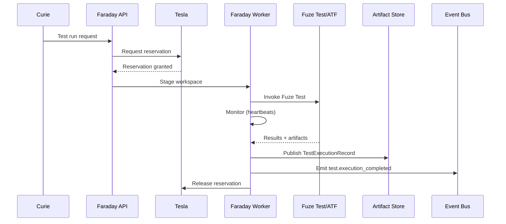
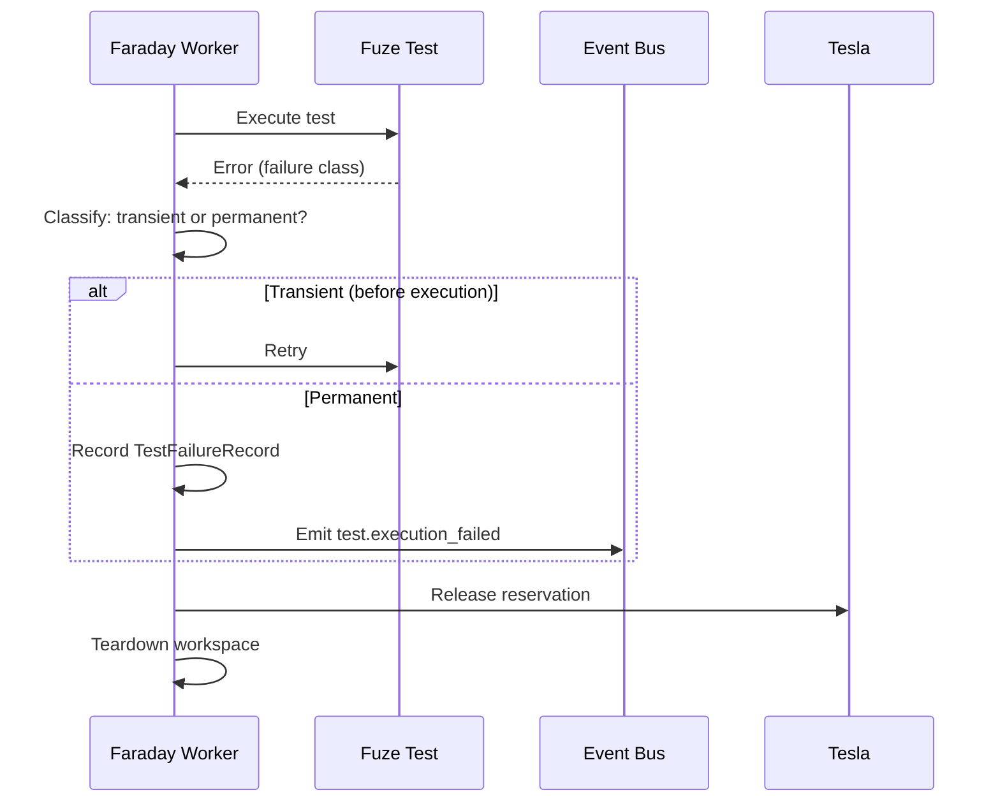

# Faraday Test Executor Plan

## Summary
Faraday should be the test-execution agent for the platform. Its job is to take a resolved `TestPlan`, acquire the required environment through Tesla, execute the plan through Fuze Test in [atf](/Users/johnmacdonald/code/cornelis/atf), collect results, and publish machine-readable test execution records tied to the originating build ID.

In v1, Faraday should wrap the existing Fuze Test execution path rather than replacing the ATF executive or Product Test Adapter layers.

## Product definition
### Goal
- consume a concrete `TestPlan`
- validate or bind the required environment reservation
- invoke Fuze Test execution reliably
- capture normalized results, raw artifacts, and status events
- expose a durable execution record keyed by build ID and test run ID

### Non-goals for v1
- replacing `run-atf.py`
- replacing the Product Test Adapter API
- inventing a second low-level test execution engine outside Fuze Test
- solving full lab scheduling beyond reservation and basic conflict handling
- automatic rerun heuristics for flaky tests beyond bounded operator-approved retries

### Position in the system
- Ada decides what should run
- Curie materializes executable test inputs
- Faraday runs the plan
- Tesla owns environment reservation truth
- Fuze Test executes the actual test cycle

## Triggering model
- Faraday should run as an always-on execution control plane backed by queued workers.
- Normal work should start from accepted test-run submissions once the required Tesla reservation is ready.
- Humans should be able to submit, cancel, retry, and inspect runs through controlled APIs.

## Architecture
### Execution model
Faraday should treat the existing Fuze Test execution flow as the canonical state machine:
1. create test cycle
2. prepare environment
3. prepare test list
4. run tests
5. close and publish results

This is already visible in:
- [atf/executive/run-atf.py](/Users/johnmacdonald/code/cornelis/atf/executive/run-atf.py)
- [atf/executive/functions/testcycle.py](/Users/johnmacdonald/code/cornelis/atf/executive/functions/testcycle.py)

### Internal components
- `TestRunDispatcher`: moves accepted runs onto the correct worker queue
- `EnvironmentBinder`: validates Tesla reservation, location, DUT, and test setup
- `FuzeTestInvoker`: materializes runtime inputs and launches `run-atf.py` or packaged `run-atf`
- `ResultNormalizer`: converts ATF outputs, logs, and artifacts into stable execution records
- `RunMonitor`: tracks heartbeats, timeouts, cancellation, and terminal state cleanup

### Runtime inputs
The executor should consume:
- `test_run_id`
- `build_id`
- `test_plan_id`
- module, project, module version
- runtype
- location
- test setup
- explicit suite list or runtime overlay from Curie
- include/exclude DUT filters
- environment reservation reference
- result publication policy

### Fuze Test boundary
The executor should rely on the existing Fuze Test interfaces:
- executive entrypoint in `run-atf.py`
- command-line parameter model in [atf/executive/run_atf_common.py](/Users/johnmacdonald/code/cornelis/atf/executive/run_atf_common.py)
- Product Test Adapter abstraction in [atf/producttest/README.md](/Users/johnmacdonald/code/cornelis/atf/producttest/README.md)

The executor should not duplicate:
- suite preparation logic already inside ATF
- PTA configuration behavior
- DUT program/reboot/restore logic
- result file generation that already exists in ATF

## Execution topology
### Where it runs
- run execution on dedicated test workers, never in the API process
- use separate worker classes for:
  - `mock-test-worker`
  - `hil-test-worker`
- ensure workers have access to:
  - ATF source or packaged ATF runtime
  - required package artifacts under test
  - lab network access where needed
  - result publication endpoints

### Workspace model
- create an isolated ephemeral workspace per test run
- materialize:
  - ATF runtime
  - generated suite list or runtime overrides
  - build artifacts or packages under test
  - secret-backed local runtime config where required
- remove ephemeral state after teardown verification

### Execution path
1. accept a `TestRunRequest`
2. validate Tesla reservation and environment requirements
3. stage ATF runtime and build artifacts
4. invoke Fuze Test with explicit runtime arguments
5. stream structured status events during execution
6. collect logs, results, and attachments
7. normalize results into execution records
8. release or conclude reservation usage and clean workspace

## Queueing and scheduling
- use an explicit queue between API and executor workers
- route by worker class and environment requirements
- persist run state independently of queue state
- require an active reservation before dispatch to scarce HIL workers
- use one active HIL run per reserved environment unless policy explicitly allows parallelism
- use leases and worker heartbeats to detect stuck or lost runs

Retry policy:
- auto-retry only for transient infrastructure failures before Fuze Test execution starts
- do not auto-retry deterministic test failures
- do not auto-retry mid-run HIL failures unless the failure class is explicitly marked retry-safe

## Public API and contracts
### API surface
- `POST /v1/test-runs`
  - input: `build_id`, `test_plan_id`, execution context overrides allowed by policy
  - output: `test_run_id`, status, submitted time
- `POST /v1/test-runs/{test_run_id}/cancel`
  - cancels queued or running execution
- `GET /v1/test-runs/{test_run_id}`
  - returns run state, current stage, worker, environment, and summary
- `GET /v1/test-runs/{test_run_id}/events`
  - returns stage-level execution events
- `GET /v1/test-runs/{test_run_id}/results`
  - returns normalized result record and artifact links

### Internal contracts
- `TestRunRequest`
- `EnvironmentReservation`
- `ExecutionContext`
- `TestExecutionRecord`
- `TestFailureRecord`
- `ResultArtifactSet`

### Execution stages
The executor should expose stable stages:
- `accepted`
- `waiting_for_environment`
- `environment_reserved`
- `staging_runtime`
- `invoking_fuze_test`
- `running`
- `collecting_results`
- `publishing_results`
- `completed`
- `failed`
- `cancelled`

## Observability and operations
### Structured events
Emit:
- `test.execution_accepted`
- `test.execution_started`
- `test.execution_stage_changed`
- `test.execution_completed`
- `test.execution_failed`
- `test.execution_cancelled`

### Metrics
Collect:
- queue age
- reservation wait time
- staging time
- execution duration
- publish duration
- success/failure/cancel rates
- timeout rate
- lab utilization by location and DUT class

### Logs and artifacts
- keep raw ATF stdout/stderr and log files
- keep result JSON and any Fuze Test-generated attachments
- keep normalized execution summary keyed by build ID and test run ID
- record the exact invocation context used to launch ATF

### Failure handling
Classify failures into:
- bad request or invalid plan
- missing artifacts or missing runtime inputs
- reservation failure
- ATF configuration failure
- PTA failure
- DUT or environment failure
- timeout
- infrastructure loss

## Security and access
- do not place raw lab credentials or reporting credentials in test run requests
- resolve secrets on workers only
- isolate per-run secret files and runtime config
- keep repo/package access separate from lab-control access
- redact secrets and sensitive endpoints from logs and surfaced failures
- require stronger policy gates for workers that can power-cycle, program, or otherwise mutate real hardware

## Fuze Test changes required
Faraday can work with Fuze Test as it exists, but the following changes would materially improve reliability and integration quality.

### 1. Machine-readable execution state
Expose machine-readable run-state transitions for:
- environment preparation
- PTA configuration
- suite start and completion
- test case start and completion
- close/publish phase

### 2. Stable result envelope
Ensure Fuze Test emits a stable result object that includes:
- build ID
- test run ID
- session or execution IDs
- suite IDs
- test case IDs
- location
- DUT identities used
- pass/fail/skipped/unavailable results
- raw artifact references

### 3. Structured failure classes
Surface explicit failure categories instead of requiring the executor to infer everything from logs or return codes.

### 4. Cancellation support
Add a supported cancellation path so Faraday can stop a running test cycle cleanly rather than relying only on process termination.

### 5. Dry-run validation
Add a validation mode that confirms:
- inputs are structurally valid
- required ATF assets exist
- required suites can be resolved
- reservation prerequisites are met

without executing the real test cycle.

## Diagrams

### Test Execution Flow

### Test Failure Handling

## Decision Logging & Audit Trail

Every action this agent takes is logged with full context. For decisions, the complete decision tree is recorded — what options were considered, what data was evaluated, and why the chosen path was selected.

| Log Type | What Is Captured | Example |
|----------|-----------------|---------|
| **Action log** | Every API call, event consumed, event emitted, external system interaction. Timestamped with correlation_id and agent_id. | `action=emit_event, event_type=build.completed, build_id=BLD-1234, correlation_id=abc-123` |
| **Decision log** | The full decision tree: inputs evaluated, rules applied, alternatives considered, chosen outcome, and rationale. | `decision=select_test_plan, trigger=PR, inputs=[branch=feature/x, module=opx-core], candidates=[quick_smoke, pr_standard], selected=pr_standard, reason="PR trigger + no HIL changes"` |
| **Rejection log** | When an action is rejected or blocked — what was attempted, what rule prevented it, what the agent did instead. | `decision=promote_release, attempted=sit_to_qa, blocked_by=failing_test_TES-456, action=hold_and_notify` |

All logs are stored in PostgreSQL (audit table) and streamed to Grafana/Loki. Decision logs are queryable by correlation_id, agent_id, decision type, and time range.

## Tool Use & Token Efficiency

This agent prioritizes **deterministic tools** over LLM inference wherever possible. LLM calls are reserved for tasks that genuinely require reasoning, generation, or ambiguity resolution.

| Principle | Implementation |
|-----------|---------------|
| **Deterministic first** | Policy lookups, schema validation, event routing, suite selection, version mapping, and traceability queries all use deterministic code paths. No tokens spent on work that has a known algorithm. |
| **Custom tooling** | The agent platform builds and maintains its own tool library. When a pattern repeats, it becomes a tool. Agents can also generate new tools for themselves when they identify repeated LLM-heavy patterns. |
| **Token-aware execution** | Every LLM call logs input tokens, output tokens, model used, and cost. The agent selects the smallest capable model for each task. |
| **Caching** | LLM responses for identical inputs are cached (Redis). Repeated queries hit cache instead of burning tokens. |

### Token Tracking

All token usage is logged to PostgreSQL and accumulates per agent, per day, per operation type.

| Metric | Tracked | Queryable By |
|--------|---------|-------------|
| **Per-call tokens** | input_tokens, output_tokens, model, latency_ms, cost_usd | correlation_id, agent_id, timestamp |
| **Cumulative totals** | total_input_tokens, total_output_tokens, total_cost_usd | agent_id, date range, operation type |
| **Efficiency ratio** | deterministic_actions / total_actions (target: >80%) | agent_id, date range |

## Standard Commands

Every agent responds to these standard commands in its Teams channel and via REST API.

| Command | What It Returns |
|---------|----------------|
| `/token-status` | Token usage summary: today's input/output tokens, cumulative totals, cost, efficiency ratio, comparison to 7-day average. |
| `/decision-tree` | The last N decisions made by this agent, each showing: timestamp, decision type, inputs evaluated, candidates considered, selected outcome, and rationale. |
| `/why {decision-id}` | Deep dive into a specific decision: full decision tree, all inputs, every rule evaluated, alternatives rejected and why, final rationale with links to source data. |
| `/stats` | Operational statistics: uptime, total actions today/this week/this month, success/failure rates, average latency, queue depth, active jobs, error rate trend. |
| `/work-today` | Summary of today's work: number of jobs processed, key outcomes, notable decisions, any failures or blocked items. |
| `/busy` | Current load: active jobs, queue depth, estimated drain time. Status: idle / working / busy / overloaded. |

All commands also work via the agent's REST API (e.g., `GET /v1/status/tokens`, `GET /v1/status/decisions`, `GET /v1/status/stats`).

## Teams Channel Interface

This agent has a dedicated **Microsoft Teams channel** (`#agent-{name}`) in the "Agent Workforce" team. This is the primary human interface. This channel is managed by **[Shannon](SHANNON_COMMUNICATIONS_AGENT_PLAN.md)**, the communications service agent.

| Function | How It Works |
|----------|-------------|
| **Activity feed** | The agent posts a summary of every significant action. Engineers follow along in real time. |
| **Decision notifications** | Non-trivial decisions are posted with rationale. Engineers can review and challenge. |
| **Approval requests** | When human approval is required, the agent posts an Adaptive Card with approve/reject buttons. |
| **Input requests** | When the agent needs information it cannot determine automatically, it posts a structured request. Engineers reply in-thread. |
| **Error alerts** | Failures and anomalies posted with severity and suggested actions. Critical alerts @mention the relevant team. |
| **Status queries** | Engineers can ask for status by posting in the channel. The agent responds in-thread. |

## Phased roadmap
### Phase 1. Basic wrapper execution
- execute existing Fuze Test runs from worker infrastructure
- link run records to build IDs
- capture raw logs and result artifacts

Exit criteria:
- executor can launch ATF successfully
- terminal states are durable and queryable
- raw artifacts are preserved

### Phase 2. Structured execution state
- add stable execution stages
- normalize failures
- publish machine-readable summaries

Exit criteria:
- operators can see where a run is stuck or failed
- failures are grouped by class
- results are queryable by build ID and run ID

### Phase 3. Reservation and HIL hardening
- integrate Tesla reservation gating
- distinguish mock and HIL workers
- add worker heartbeat and timeout behavior

Exit criteria:
- HIL runs do not start without reservation
- lost workers are detected
- timeout behavior is deterministic

### Phase 4. Better Fuze Test integration
- add dry-run validation
- add cancellation support
- add richer machine-readable ATF outputs

Exit criteria:
- executor can validate before run
- cancellation works predictably
- result parsing is not dependent on fragile log scraping

## Test and acceptance plan
### Happy-path execution
- run a mock-path test plan successfully through Faraday
- run a HIL-path test plan successfully through Faraday
- verify build ID linkage and result publication

### Failure-path execution
- missing artifact input
- bad ATF config
- reservation unavailable
- PTA failure
- timeout
- worker loss

### Operational behavior
- queued run cancellation
- running run cancellation
- heartbeat expiry
- cleanup verification after failure

### Data integrity
- result record contains build ID, run ID, suites, and outcome summary
- raw ATF artifacts remain linked from normalized execution records
- repeated queries return stable state

## Assumptions
- Fuze Test remains the execution substrate for v1
- Faraday is a distinct test-execution agent, not just a function inside Ada
- Josephine provides build IDs and artifacts under test
- Tesla provides environment reservation truth
