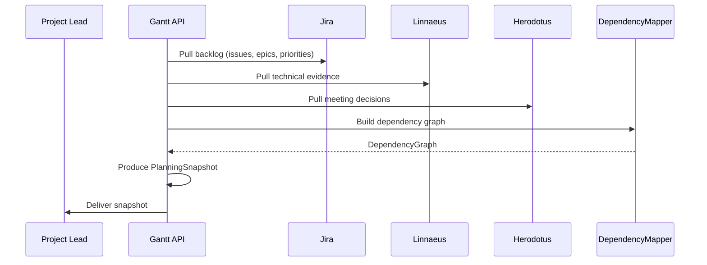
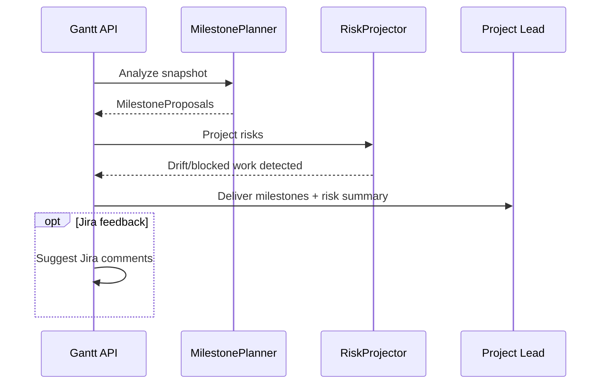

# Gantt Project Planner Plan

## Summary
Gantt should be the project-planning agent for the platform. Its v1 job is to convert Jira work state, technical evidence, release intent, and meeting-derived decisions into structured planning outputs: milestone proposals, dependency views, backlog recommendations, and roadmap health signals.

Gantt should not replace human program ownership. It should make planning legible, current, and evidence-backed.

## Product definition
### Goal
- consume Jira issue state and project structure
- incorporate delivery evidence from Josephine, Hedy, Babbage, Linnaeus, and the test agents
- produce planning recommendations that connect work items to actual technical progress
- expose milestone, dependency, and schedule-risk views

### Non-goals for v1
- fully autonomous roadmap ownership
- direct scope changes without approval
- automatic assignment of people to work
- replacing Jira as the system of record for planned work

### Position in the system
- Jira remains the work-tracking source of truth
- Herodotus supplies decision and action-item context from meetings
- Linnaeus supplies requirement, build, test, and release traceability
- Hedy supplies release intent and readiness context
- Gantt turns those signals into planning intelligence

## Triggering model
- Gantt should primarily run as an on-demand planning service, even if the service process itself is always available.
- Normal work should start from explicit planning snapshot requests and, later, optional scheduled refreshes for defined projects or boards.
- Humans should request snapshots, review recommendations, and approve any write-back into Jira planning fields.

## Architecture
### Core design
Gantt should be split into these concerns:
- `BacklogInterpreter`: normalizes Jira epics, stories, bugs, priorities, and workflow state
- `DependencyMapper`: identifies explicit and inferred dependencies between work items
- `MilestonePlanner`: groups work into milestones, release trains, or delivery windows
- `PlanningSummarizer`: produces machine-readable and human-readable planning summaries
- `RiskProjector`: converts technical blockers and stale dependencies into planning risk

Required internal objects:
- `PlanningRequest`
- `PlanningSnapshot`
- `MilestoneProposal`
- `DependencyGraph`
- `PlanningRiskRecord`

### Jira grounding
Gantt should treat Jira as the planning substrate for v1:
- issues, epics, and release fields remain owned by Jira
- Gantt reads and annotates Jira, but does not become the primary planning database
- any generated planning recommendations should be linkable back to concrete Jira issues and fields

## Planning model
### Inputs
- Jira issue and epic state
- priorities and assignees
- release targets
- build evidence from Josephine
- test evidence from Faraday
- release readiness from Hedy
- version context from Babbage
- traceability context from Linnaeus
- meeting decisions and action items from Herodotus

### Outputs
Gantt should produce:
- milestone proposals
- dependency graphs
- scope risk summaries
- stale-work and blocked-work summaries
- roadmap drift or slip signals

### Planning rules
- planning recommendations must always cite evidence
- technical work with no linked build, test, or traceability evidence should be marked lower-confidence
- blocked dependencies should surface before schedule promises are made
- release-relevant work should be grouped with its readiness evidence where possible
- recommendations should be incremental and reviewable, not sweeping rewrites of the backlog

## Public API and contracts
### API surface
- `POST /v1/planning/snapshot`
  - input: project or board scope, planning horizon, policy profile
  - output: `PlanningSnapshot`
- `GET /v1/planning/snapshots/{snapshot_id}`
  - returns milestone, dependency, and risk views
- `GET /v1/planning/projects/{project_key}/milestones`
  - returns milestone proposals and health
- `GET /v1/planning/projects/{project_key}/dependencies`
  - returns dependency graph and blocker summary

### Internal contracts
- `PlanningRequest`
- `PlanningSnapshot`
- `MilestoneProposal`
- `DependencyGraph`
- `PlanningRiskRecord`

## Observability and operations
### Structured events
Emit:
- `planning.snapshot_created`
- `planning.milestone_proposed`
- `planning.dependency_risk_detected`
- `planning.scope_drift_detected`

### Metrics
Collect:
- blocked-work count
- stale-work count
- dependency depth by milestone
- planning recommendation acceptance rate
- issue-to-evidence coverage rate

### Operator controls
- regenerate a planning snapshot
- approve or reject milestone proposals
- mark dependency inference as accepted or incorrect

## Security and approvals
- read access to Jira planning data is required
- write-back to Jira should be limited to comments, links, and explicitly approved planning annotations in v1
- approval is required before changing target milestones, release targets, or major planning fields
- audit every recommendation and every accepted or rejected recommendation

## Diagrams

### Planning Snapshot

### Milestone Proposal

## Decision Logging & Audit Trail

Every action this agent takes is logged with full context. For decisions, the complete decision tree is recorded — what options were considered, what data was evaluated, and why the chosen path was selected.

| Log Type | What Is Captured | Example |
|----------|-----------------|---------|
| **Action log** | Every API call, event consumed, event emitted, external system interaction. Timestamped with correlation_id and agent_id. | `action=emit_event, event_type=build.completed, build_id=BLD-1234, correlation_id=abc-123` |
| **Decision log** | The full decision tree: inputs evaluated, rules applied, alternatives considered, chosen outcome, and rationale. | `decision=select_test_plan, trigger=PR, inputs=[branch=feature/x, module=opx-core], candidates=[quick_smoke, pr_standard], selected=pr_standard, reason="PR trigger + no HIL changes"` |
| **Rejection log** | When an action is rejected or blocked — what was attempted, what rule prevented it, what the agent did instead. | `decision=promote_release, attempted=sit_to_qa, blocked_by=failing_test_TES-456, action=hold_and_notify` |

All logs are stored in PostgreSQL (audit table) and streamed to Grafana/Loki. Decision logs are queryable by correlation_id, agent_id, decision type, and time range.

## Tool Use & Token Efficiency

This agent prioritizes **deterministic tools** over LLM inference wherever possible. LLM calls are reserved for tasks that genuinely require reasoning, generation, or ambiguity resolution.

| Principle | Implementation |
|-----------|---------------|
| **Deterministic first** | Policy lookups, schema validation, event routing, suite selection, version mapping, and traceability queries all use deterministic code paths. No tokens spent on work that has a known algorithm. |
| **Custom tooling** | The agent platform builds and maintains its own tool library. When a pattern repeats, it becomes a tool. Agents can also generate new tools for themselves when they identify repeated LLM-heavy patterns. |
| **Token-aware execution** | Every LLM call logs input tokens, output tokens, model used, and cost. The agent selects the smallest capable model for each task. |
| **Caching** | LLM responses for identical inputs are cached (Redis). Repeated queries hit cache instead of burning tokens. |

### Token Tracking

All token usage is logged to PostgreSQL and accumulates per agent, per day, per operation type.

| Metric | Tracked | Queryable By |
|--------|---------|-------------|
| **Per-call tokens** | input_tokens, output_tokens, model, latency_ms, cost_usd | correlation_id, agent_id, timestamp |
| **Cumulative totals** | total_input_tokens, total_output_tokens, total_cost_usd | agent_id, date range, operation type |
| **Efficiency ratio** | deterministic_actions / total_actions (target: >80%) | agent_id, date range |

## Standard Commands

Every agent responds to these standard commands in its Teams channel and via REST API.

| Command | What It Returns |
|---------|----------------|
| `/token-status` | Token usage summary: today's input/output tokens, cumulative totals, cost, efficiency ratio, comparison to 7-day average. |
| `/decision-tree` | The last N decisions made by this agent, each showing: timestamp, decision type, inputs evaluated, candidates considered, selected outcome, and rationale. |
| `/why {decision-id}` | Deep dive into a specific decision: full decision tree, all inputs, every rule evaluated, alternatives rejected and why, final rationale with links to source data. |
| `/stats` | Operational statistics: uptime, total actions today/this week/this month, success/failure rates, average latency, queue depth, active jobs, error rate trend. |
| `/work-today` | Summary of today's work: number of jobs processed, key outcomes, notable decisions, any failures or blocked items. |
| `/busy` | Current load: active jobs, queue depth, estimated drain time. Status: idle / working / busy / overloaded. |

All commands also work via the agent's REST API (e.g., `GET /v1/status/tokens`, `GET /v1/status/decisions`, `GET /v1/status/stats`).

## Teams Channel Interface

This agent has a dedicated **Microsoft Teams channel** (`#agent-{name}`) in the "Agent Workforce" team. This is the primary human interface. This channel is managed by **[Shannon](SHANNON_COMMUNICATIONS_AGENT_PLAN.md)**, the communications service agent.

| Function | How It Works |
|----------|-------------|
| **Activity feed** | The agent posts a summary of every significant action. Engineers follow along in real time. |
| **Decision notifications** | Non-trivial decisions are posted with rationale. Engineers can review and challenge. |
| **Approval requests** | When human approval is required, the agent posts an Adaptive Card with approve/reject buttons. |
| **Input requests** | When the agent needs information it cannot determine automatically, it posts a structured request. Engineers reply in-thread. |
| **Error alerts** | Failures and anomalies posted with severity and suggested actions. Critical alerts @mention the relevant team. |
| **Status queries** | Engineers can ask for status by posting in the channel. The agent responds in-thread. |

## Phased roadmap
### Phase 1. Planning snapshots
- build a project snapshot from Jira and linked technical evidence
- surface milestones, blockers, and stale work

Exit criteria:
- Gantt can create a durable planning snapshot
- snapshots are queryable and evidence-linked

### Phase 2. Dependency mapping
- infer and visualize dependencies
- flag blocking items and missing predecessors

Exit criteria:
- dependency views are usable for planning meetings
- blocker signals are visible before milestone evaluation

### Phase 3. Milestone proposals
- generate milestone and release-window proposals
- incorporate release context and technical readiness

Exit criteria:
- milestone proposals are reviewable and cite evidence
- scope-to-readiness mismatch is visible

### Phase 4. Jira feedback loop
- add controlled Jira annotations and planning comments
- support approval-backed write-backs

Exit criteria:
- planning outputs can flow back into Jira safely
- no silent backlog mutation occurs

## Test and acceptance plan
### Snapshot behavior
- creates project snapshot from Jira scope
- includes linked build, test, and release evidence when available

### Dependency behavior
- explicit dependency recognized
- inferred blocker recognized
- stale dependency flagged

### Milestone behavior
- proposal generated for scoped release window
- missing evidence lowers planning confidence
- blocked work raises planning risk

### Operational behavior
- repeated snapshot generation is stable
- recommendations are auditable
- rejected recommendations remain historically visible

## Assumptions
- Jira remains the system of record for planned work
- Gantt is advisory in v1, not autonomous
- technical evidence from build, test, release, version, and traceability agents is available as linked records
