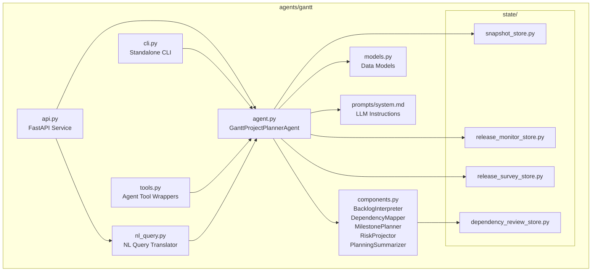
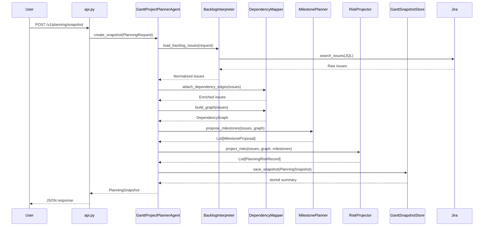
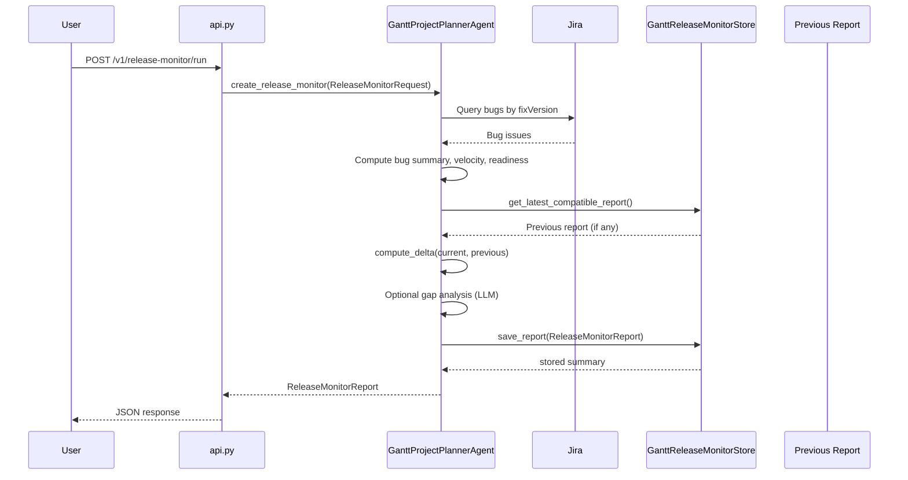
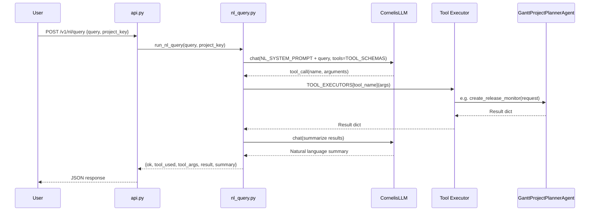

<!-- Generated by Documentation Agent — do not edit between markers -->

```yaml
---
title: "As-Built: Gantt Project Planner Agent"
date: "2026-04-03"
status: "draft"
---
```

# Module Overview

Gantt is the project-planning agent for the Cornelis Networks agent workforce platform. It reads Jira backlogs — epics, stories, bugs, priorities, assignees, and workflow states — and cross-references them with technical evidence from builds, tests, and releases to produce durable planning artifacts: **planning snapshots**, **release health monitor reports**, **release execution surveys**, **roadmap gap analyses**, and **dependency graphs**. The agent is deterministic-first: specialized planner components (`BacklogInterpreter`, `DependencyMapper`, `MilestonePlanner`, `RiskProjector`, `PlanningSummarizer`) handle the core logic without LLM calls, while an optional LLM path is used only for roadmap gap analysis and the new natural-language query interface. Gantt is accessible through a FastAPI REST API (port 8202), a standalone CLI (`gantt-agent`), the unified `agent-cli`, and the Shannon Teams bot.

# What Changed

- **Before:** Gantt exposed planning snapshots, release monitoring, release surveys, plan export/import, and release-task queries through its REST API and CLI. All user interaction required structured commands or API calls with explicit parameters.
- **After:** A new **natural-language query interface** was added via `agents/gantt/nl_query.py` and the `POST /v1/nl/query` API endpoint. Users can now ask plain English questions (e.g., "how healthy is release 12.2?") which are translated into structured Gantt tool calls using LLM function-calling, executed, and summarized back in natural language. The API model `NLQueryRequest` was added to `api.py`, and the `/v1/info` endpoint now advertises the new capability.
- **Impact:** Shannon bot integrations and any API consumers gain a conversational planning interface. The new module introduces a hard dependency on `llm.cornelis_llm.CornelisLLM` and `jira_utils` (for the `gantt_release_tasks` and `gantt_plan_export` executors), which are lazy-imported at call time.

# Component Diagram



# Key Flows

## 1. Planning Snapshot Creation

The primary flow: a user requests a planning snapshot for a Jira project. The agent queries Jira, normalizes issues, maps dependencies, proposes milestones, projects risks, and persists the result.



The `BacklogInterpreter.load_backlog_issues()` method builds JQL from the `PlanningRequest`, queries Jira via `self._jira_provider()`, and normalizes each issue through `normalize_issue()`. This method enriches each issue with computed fields like `is_stale`, `age_days`, `is_done`, and `status_category`. The `DependencyMapper` then extracts explicit edges from Jira issue links and parent relationships, infers additional edges from text references in summaries and descriptions, and consults the `GanttDependencyReviewStore` to suppress previously-rejected inferences.

## 2. Release Monitor Report

Tracks the health of active releases with bug trends, velocity metrics, readiness assessment, and optional roadmap gap analysis.



The release monitor uses `_RELEASE_TICKET_QUERY_FIELDS` (defined in `agent.py`) to fetch a targeted set of Jira fields. The `ReleaseMonitorRequest` model controls which analysis sections are included via boolean flags: `include_gap_analysis`, `include_bug_report`, `include_velocity`, `include_readiness`, and `compare_to_previous`. The store's `get_latest_compatible_report()` method matches on project key, release names, and scope label to find the correct prior report for delta comparison.

## 3. Natural Language Query

New flow added in the latest change. A plain English question is translated into a structured Gantt tool call via LLM function-calling, executed, and summarized.



The `nl_query.py` module defines five tool schemas in `TOOL_SCHEMAS`: `gantt_release_health`, `gantt_release_tasks`, `gantt_planning_snapshot`, `gantt_release_survey`, and `gantt_plan_export`. The `NL_SYSTEM_PROMPT` constant instructs the LLM on Cornelis Networks conventions (version format normalization like "12.2" → "12.2.0.x", default project "STL", tool selection rules). The `TOOL_EXECUTORS` dict maps tool names to executor functions that lazy-import and invoke the appropriate Gantt agent methods. A second LLM call in `_summarize_results()` converts the structured output into a human-readable summary.

# Data Model

The core data structures are defined as Python dataclasses in `agents/gantt/models.py`. All models implement `to_dict()` for JSON serialization.

**Planning Domain:**

| Dataclass | Purpose | Key Fields |
|-----------|---------|------------|
| `PlanningRequest` | Input for snapshot generation | `project_key`, `planning_horizon_days`, `limit`, `include_done`, `backlog_jql`, `policy_profile`, `evidence_paths` |
| `PlanningSnapshot` | Durable snapshot of project state | `snapshot_id` (8-char UUID), `project_key`, `created_at`, `backlog_overview`, `milestones`, `dependency_graph`, `risks`, `issues`, `evidence_summary`, `summary_markdown` |
| `DependencyEdge` | Single dependency between two issues | `source_key`, `target_key`, `relationship`, `inferred`, `confidence`, `rule_id`, `review_state`, `rationale` |
| `DependencyGraph` | Full dependency graph for a backlog | `nodes`, `edges`, `blocked_keys`, `unscheduled_keys`, `cycle_paths`, `depth_by_key`, `blocker_chains`, `root_blockers`, `review_summary`, `suppressed_edges` |
| `MilestoneProposal` | Proposed milestone grouping | `name`, `source`, `target_date`, `issue_keys`, `total_issues`, `open_issues`, `done_issues`, `blocked_issues`, `confidence`, `risk_level` |
| `PlanningRiskRecord` | Identified planning risk | `risk_type`, `severity`, `title`, `description`, `issue_keys`, `evidence`, `recommendation` |

**Roadmap Domain:**

| Dataclass | Purpose | Key Fields |
|-----------|---------|------------|
| `RoadmapRequest` | Input for roadmap analysis | `project_key`, `scope_label`, `initiative_keys`, `fix_versions`, `hierarchy_depth`, `include_gap_analysis` |
| `RoadmapItem` | Single Jira ticket in roadmap | `key`, `summary`, `issue_type`, `status`, `depth`, `source` ("Jira" or "Proposed") |
| `RoadmapGap` | LLM-identified missing work | `summary`, `issue_type`, `priority`, `suggested_component`, `acceptance_criteria`, `dependencies` |
| `RoadmapSection` | Logical grouping of items and gaps | `title`, `items`, `gaps` |
| `RoadmapSnapshot` | Durable roadmap analysis output | `project_key`, `scope_label`, `snapshot_id`, `sections`, `summary_markdown` |

**Release Domain** (referenced in agent.py imports but defined in models.py — source truncated):

| Dataclass | Purpose |
|-----------|---------|
| `ReleaseMonitorRequest` | Input for release health monitoring |
| `ReleaseMonitorReport` | Durable release health report |
| `ReleaseSurveyRequest` | Input for release execution survey |
| `ReleaseSurveyReport` | Durable release survey output |
| `BugSummary` | Bug status/priority breakdown |

**Persistence Layout:**

```
data/
├── gantt_snapshots/<PROJECT>/<SNAPSHOT_ID>/
│   ├── snapshot.json
│   └── summary.md
├── gantt_release_monitors/<PROJECT>/<REPORT_ID>/
│   ├── report.json
│   ├── summary.md
│   └── *.xlsx (optional)
├── gantt_release_surveys/<PROJECT>/<SURVEY_ID>/
│   ├── survey.json
│   ├── summary.md
│   └── *.xlsx (optional)
├── gantt_dependency_reviews/<PROJECT>.json
└── gantt_exports/
```

# Dependencies

| Dependency | Purpose | Version |
|------------|---------|---------|
| `agents.base` (internal) | `BaseAgent`, `AgentConfig`, `AgentResponse` base classes | — |
| `llm.base` / `llm.cornelis_llm` (internal) | `Message`, `CornelisLLM` for LLM chat and function-calling | — |
| `tools.jira_tools` (internal) | `JiraTools`, `get_jira`, `search_tickets`, `get_children_hierarchy`, `get_releases` | — |
| `tools.knowledge_tools` (internal) | `search_knowledge`, `list_knowledge_files`, `read_knowledge_file` for org data | — |
| `tools.base` (internal) | `BaseTool`, `ToolResult`, `@tool` decorator | — |
| `core.evidence` (internal) | `EvidenceBundle`, `load_evidence_bundle` for build/test evidence | — |
| `core.release_tracking` (internal) | `ReleaseSnapshot`, `build_snapshot`, `compute_delta`, `compute_velocity`, `assess_readiness` | — |
| `core.tickets` (internal) | `issue_to_dict` for Jira issue normalization | — |
| `agents.pm_runtime` (internal) | `normalize_csv_list`, `notify_shannon` shared PM utilities | — |
| `excel_utils` (internal) | Excel formatting helpers (`STATUS_FILL_COLORS`, `_apply_header_style`, etc.) | — |
| `config.env_loader` (internal) | `load_env()` for environment bootstrapping | — |
| `jira_utils` (internal) | `connect_to_jira`, `run_jql_query`, `dump_tickets_to_file` (used by NL query executors) | — |
| `fastapi` (external) | REST API framework | — |
| `pydantic` (external) | Request/response model validation | — |
| `openpyxl` (external) | Excel workbook generation for exports and reports | — |
| `dotenv` (external) | Environment file loading in CLI | — |

# Configuration

| Variable / File | Purpose | Default |
|-----------------|---------|---------|
| `GANTT_SNAPSHOT_DIR` | Override storage directory for planning snapshots | `data/gantt_snapshots` |
| `GANTT_RELEASE_MONITOR_DIR` | Override storage directory for release monitor reports | `data/gantt_release_monitors` |
| `GANTT_RELEASE_SURVEY_DIR` | Override storage directory for release survey reports | `data/gantt_release_surveys` |
| `GANTT_DEPENDENCY_REVIEW_DIR` | Override storage directory for dependency review decisions | `data/gantt_dependency_reviews` |
| `GANTT_EXPORT_DIR` | Override directory for plan exports | `data/gantt_exports` |
| `CONFLUENCE_JIRA_SERVER` | Jira server name for Confluence integration | `'System Jira'` |
| `CONFLUENCE_JIRA_SERVER_ID` / `JIRA_SERVER_ID` | Jira server ID for Confluence links | `'332fe428-27be-3c06-ad09-b2cd4d269bee'` |
| `agents/gantt/prompts/system.md` | LLM system prompt for the Gantt agent | Required — agent raises `FileNotFoundError` if missing |
| `.env` (or `--env` CLI flag) | Standard dotenv file for Jira credentials, LLM keys, etc. | `.env` |

**Key Agent Constants** (in `agent.py`):

```python
STALE_DAYS = 30                          # Issues unchanged for 30+ days are flagged stale
JIRA_BASE_URL = 'https://cornelisnetworks.atlassian.net'
_EXCLUDED_TYPES = {'Bug', 'bug'}         # Excluded from roadmap views
_DONE_STATUSES = {'Closed', 'Done', 'Resolved'}
```

**NL Query Configuration** (in `nl_query.py`):

The `NL_SYSTEM_PROMPT` constant hardcodes project conventions (default project `STL`, version format rules, tool selection guidance). The LLM model is hardcoded to `'developer-sonnet'` in `run_nl_query()`.

# Error Handling

The agent uses a layered error handling pattern:

1. **Agent-level try/catch in `run()`**: The `GanttProjectPlannerAgent.run()` method wraps `create_snapshot()` in a try/except block and returns `AgentResponse.error_response(str(e))` on failure.

2. **Task dispatcher in `run_once()`**: Each task type (`planning_snapshot`, `release_monitor`, `release_survey`) validates the request type with explicit `TypeError` raises. Unsupported task types raise `ValueError`.

3. **Poller `tick()` method**: Individual task failures within a polling cycle are caught, logged, and appended to an `errors` list. The cycle continues executing remaining tasks. The tick result includes both `tasks` and `errors` arrays.

4. **API endpoints**: Each FastAPI endpoint wraps its logic in try/except and returns `{'ok': False, 'error': str(e)}` on failure. The NL query endpoint follows the same pattern.

5. **Store-level error handling**: All four stores (`GanttSnapshotStore`, `GanttReleaseMonitorStore`, `GanttReleaseSurveyStore`, `GanttDependencyReviewStore`) catch JSON parse errors and file I/O errors with `log.warning()` and return `None` or skip the unreadable record. Required fields (`snapshot_id`, `project_key`) raise `ValueError` if missing.

6. **Tool wrappers**: Each `@tool`-decorated function in `tools.py` wraps its body in try/except and returns `ToolResult.failure()` on error.

7. **NL query executor**: Tool execution failures in `nl_query.py` are caught and returned as `{'ok': False, 'error': str(e), 'tool_used': tool_name}`.

The `BacklogInterpreter.parse_jira_datetime()` method silently returns `None` for unparseable date strings rather than raising, which propagates as `age_days = 0` and `is_stale = False`.

# Known Limitations / Technical Debt

1. **God class: `GanttProjectPlannerAgent`** — The `agent.py` file is very large (source truncated well past 500 lines) and the agent class handles planning snapshots, release monitoring, release surveys, roadmap analysis, plan export/import, Excel generation, polling, Shannon notifications, and manager alias resolution. This class has far more than 10 public methods and should be decomposed.

2. **Hardcoded URL** — `JIRA_BASE_URL = 'https://cornelisnetworks.atlassian.net'` is hardcoded in `agent.py` rather than loaded from configuration.

3. **Hardcoded Confluence server ID** — The fallback value `'332fe428-27be-3c06-ad09-b2cd4d269bee'` for `CONFLUENCE_JIRA_SERVER_ID` is hardcoded in `agent.py`.

4. **Hardcoded LLM model in NL query** — `run_nl_query()` hardcodes `model='developer-sonnet'` with no configuration override:
   ```python
   llm = CornelisLLM(model='developer-sonnet')
   ```

5. **NL query `_exec_gantt_release_tasks` bypasses agent layer** — The release tasks executor directly calls `jira_utils.connect_to_jira()` and `jira_utils.run_jql_query()` instead of routing through the agent or its tools, creating a parallel Jira access path with no shared error handling or credential management.

6. **NL query `_exec_gantt_plan_export` bypasses agent layer** — Similarly calls `excel_utils` and `jira_utils` directly rather than through the agent's plan export method.

7. **Missing error handling on LLM calls in NL query** — The `run_nl_query()` function does not wrap the initial LLM `chat()` call or the summarization `_summarize_results()` call in try/except. Network failures or LLM errors will propagate as unhandled exceptions to the API endpoint's outer catch.

8. **File-based persistence only** — All four stores use JSON files on the local filesystem. There is no database backend, no locking for concurrent writes, and no atomic write pattern (writes directly to the target path rather than writing to a temp file and renaming).

9. **Manager alias cache is a class-level mutable** — `_release_survey_manager_lookup_cache` is `Optional[Dict]` at class level, shared across all instances, with no thread safety.

10. **Source files truncated in provided context** — `agent.py`, `api.py`, `cli.py`, `models.py`, `nl_query.py`, and `components.py` are all truncated. Key methods like `create_snapshot()`, `create_release_monitor()`, `create_release_survey()`, `create_roadmap_snapshot()`, the full `tick()` implementation, and several model definitions (`ReleaseMonitorReport`, `ReleaseSurveyReport`, `BugSummary`, `ReleaseSurveyReleaseSummary`) are not visible in the provided source. This document describes what is observable; the actual implementation may contain additional patterns not covered here.

11. **Token tracking is stubbed** — The `/v1/status/tokens` endpoint returns hardcoded zeros for `token_usage_today` and `token_usage_cumulative`, despite the PLAN.md specifying per-call token tracking. The NL query module introduces real LLM usage but has no token accounting.

12. **No duplicate-post protection for Shannon notifications** — The `tick()` method builds notification payloads and calls `notify_shannon`, but there is no visible deduplication or idempotency mechanism for repeated polling cycles.

<!-- End Documentation Agent generated content -->