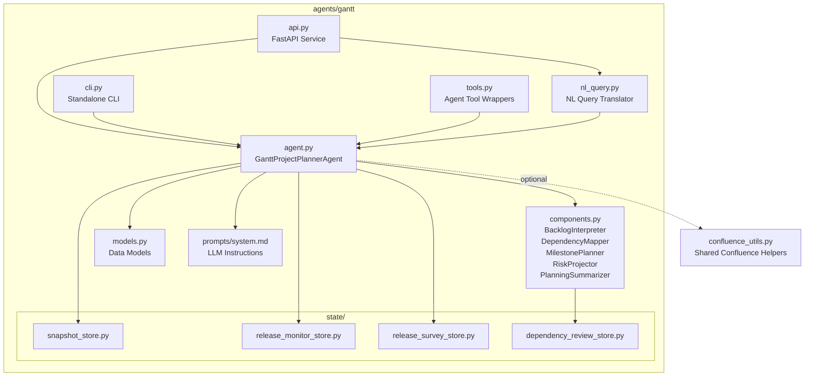
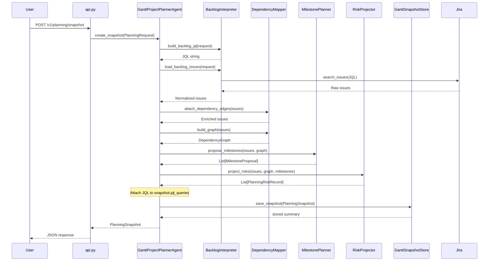
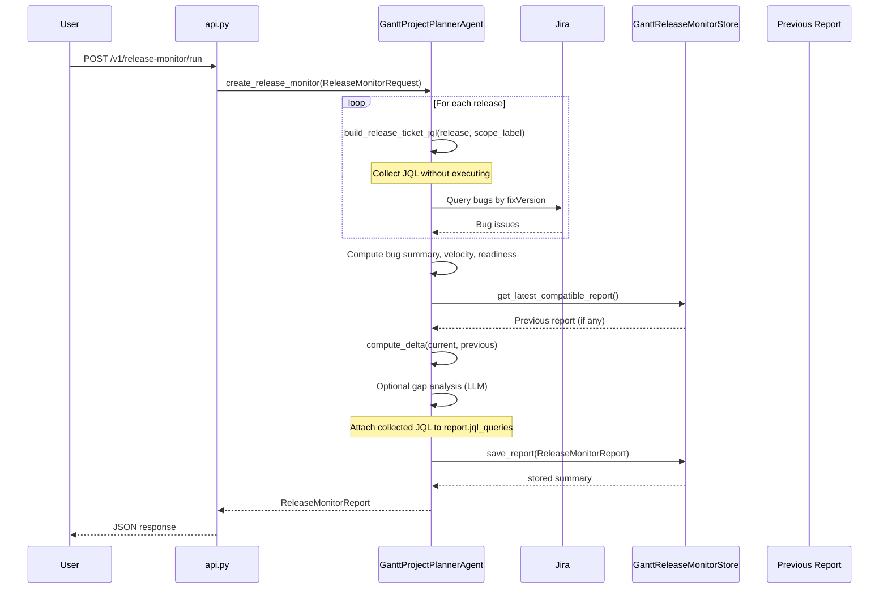
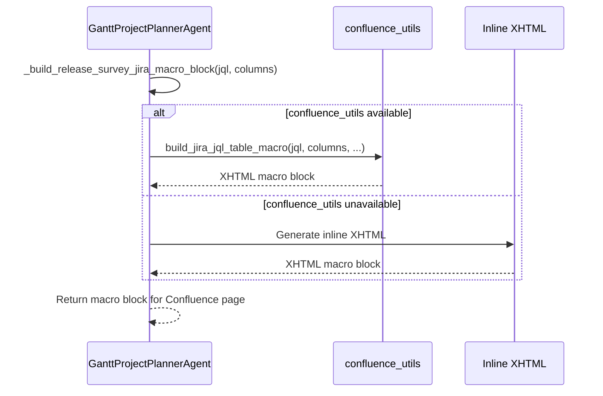

<!-- Generated by Documentation Agent — do not edit between markers -->

```yaml
---
title: "As-Built: Gantt Project Planner Agent"
date: "2026-04-06"
status: "draft"
---
```

# Module Overview

Gantt is the project-planning agent for the Cornelis Networks agent workforce platform. It reads Jira backlogs — epics, stories, bugs, priorities, assignees, and workflow states — and cross-references them with technical evidence from builds, tests, and releases to produce durable planning artifacts: **planning snapshots**, **release health monitor reports**, **release execution surveys**, **roadmap gap analyses**, and **dependency graphs**. The agent is deterministic-first: specialized planner components (`BacklogInterpreter`, `DependencyMapper`, `MilestonePlanner`, `RiskProjector`, `PlanningSummarizer`) handle the core logic without LLM calls, while an optional LLM path is used only for roadmap gap analysis and the new natural-language query interface. Gantt is accessible through a FastAPI REST API (port 8202), a standalone CLI (`gantt-agent`), the unified `agent-cli`, and the Shannon Teams bot.

# What Changed

- **Before:** Planning snapshots, release monitors, and release surveys stored their output but did not preserve the JQL queries used to generate them. Confluence integration for release survey Jira macros was implemented inline with hardcoded XHTML generation.
- **After:** All three report types (`PlanningSnapshot`, `ReleaseMonitorReport`, `ReleaseSurveyReport`) now include a `jql_queries: List[str]` field that captures the exact JQL used to query Jira. The `_build_release_ticket_jql()` method was extracted from `_query_release_tickets()` to enable JQL collection without executing queries. Confluence Jira macro generation now delegates to the shared `confluence_utils.build_jira_jql_table_macro()` function with a fallback to inline XHTML if the utility is unavailable.
- **Impact:** Stored reports are now fully reproducible — users can re-run the exact same JQL to verify or update results. Confluence integration is centralized and consistent across agents. The change is backward-compatible: existing reports without `jql_queries` will have an empty list.

# Component Diagram



# Key Flows

## 1. Planning Snapshot Creation with JQL Capture

The primary flow: a user requests a planning snapshot for a Jira project. The agent queries Jira, normalizes issues, maps dependencies, proposes milestones, projects risks, and persists the result **with the JQL used**.



**Code Evidence:**

In `agent.py`, the `create_snapshot()` method now builds the JQL before querying and stores it in the snapshot:

```python
# Line 616
backlog_jql = request.backlog_jql or BacklogInterpreter.build_backlog_jql(request)

snapshot = PlanningSnapshot(
    project_key=request.project_key,
    planning_horizon_days=request.planning_horizon_days,
    # ... other fields ...
    jql_queries=[backlog_jql],  # Line 629
)
```

The `BacklogInterpreter.build_backlog_jql()` method is a static method that constructs JQL from the request without executing it:

```python
# components.py, BacklogInterpreter class
@staticmethod
def build_backlog_jql(request: PlanningRequest) -> str:
    clauses = [
        f'project = "{request.project_key}"',
        'issuetype != "Sub-task"',
    ]
    if not request.include_done:
        clauses.append('statusCategory != Done')
    return ' AND '.join(clauses) + ' ORDER BY updated DESC'
```

## 2. Release Monitor Report with JQL Collection

Tracks the health of active releases with bug trends, velocity metrics, readiness assessment, and optional roadmap gap analysis. **Now captures the JQL for each release queried.**



**Code Evidence:**

In `agent.py`, the `create_release_monitor()` method now collects JQL before querying:

```python
# Line 1920
collected_jql: List[str] = []

for release in release_names:
    collected_jql.append(self._build_release_ticket_jql(release, request.scope_label))  # Line 1923
    tickets = self._query_release_tickets(release, request.scope_label)
    all_tickets_by_release[release] = tickets
    # ... process tickets ...
```

The `_build_release_ticket_jql()` method was extracted from `_query_release_tickets()`:

```python
# Line 2885
def _build_release_ticket_jql(
    self,
    release: str,
    scope_label: Optional[str] = None,
) -> str:
    '''
    Build JQL for querying release tickets without executing the query.
    '''
    jql_parts = [
        f'project = {self.project_key or "STL"}',
        f'fixVersion = "{release}"',
    ]
    if scope_label:
        # ... scope filtering logic ...
    return ' AND '.join(jql_parts) + ' ORDER BY priority ASC, updated DESC'
```

The `_query_release_tickets()` method now delegates to `_build_release_ticket_jql()`:

```python
# Line 2907
def _query_release_tickets(
    self,
    release: str,
    scope_label: Optional[str] = None,
) -> List[Dict[str, Any]]:
    '''
    Query Jira for all tickets in a given release.
    '''
    jql = self._build_release_ticket_jql(release, scope_label)  # Line 2917
    log.debug(f'Release ticket query JQL: {jql}')
    # ... execute query ...
```

The collected JQL is attached to the report:

```python
# Line 2139
report = ReleaseMonitorReport(
    # ... other fields ...
    jql_queries=collected_jql,
)
```

## 3. Confluence Jira Macro Generation

When generating Confluence pages with live Jira issue tables, the agent now delegates to a shared utility function instead of inline XHTML generation.



**Code Evidence:**

At the top of `agent.py`, the module attempts to import the shared utility:

```python
# Line 87
try:
    from confluence_utils import build_jira_jql_table_macro
except ImportError:
    build_jira_jql_table_macro = None  # type: ignore[assignment]
```

The `_build_release_survey_jira_macro_block()` method now delegates to the shared function:

```python
# Line 3885
def _build_release_survey_jira_macro_block(
    self,
    jql: str,
    columns: Optional[List[str]] = None,
    column_ids: Optional[List[str]] = None,
    maximum_issues: int = 1000,
) -> str:
    '''
    Build a Confluence Jira Issues macro block for one live section.

    Delegates to the shared confluence_utils builder.
    '''
    default_columns = [
        'key', 'summary', 'type', 'status',
        'assignee', 'priority', 'updated',
    ]
    default_column_ids = [
        'issuekey', 'summary', 'issuetype', 'status',
        'assignee', 'priority', 'updated',
    ]

    if build_jira_jql_table_macro is not None:  # Line 3897
        return build_jira_jql_table_macro(
            jql=jql,
            columns=columns or default_columns,
            column_ids=column_ids or default_column_ids,
            maximum_issues=maximum_issues,
        )

    # Fallback: inline XHTML if confluence_utils is unavailable
    macro_columns = columns or default_columns
    macro_column_ids = column_ids or default_column_ids
    # ... inline XHTML generation ...
```

# Data Model

The core data structures are defined as Python dataclasses in `agents/gantt/models.py`. All models implement `to_dict()` for JSON serialization.

**Planning Domain:**

| Dataclass | Purpose | Key Fields | **New in This Change** |
|-----------|---------|------------|------------------------|
| `PlanningRequest` | Input for snapshot generation | `project_key`, `planning_horizon_days`, `limit`, `include_done`, `backlog_jql`, `policy_profile`, `evidence_paths` | — |
| `PlanningSnapshot` | Durable snapshot of project state | `snapshot_id` (8-char UUID), `project_key`, `created_at`, `backlog_overview`, `milestones`, `dependency_graph`, `risks`, `issues`, `evidence_summary`, `jql_queries` | **`jql_queries: List[str]`** (line 218) |
| `DependencyEdge` | Single dependency between two issues | `source_key`, `target_key`, `relationship`, `inferred`, `confidence`, `rule_id`, `review_state`, `rationale` | — |
| `DependencyGraph` | Full dependency graph for a backlog | `nodes`, `edges`, `blocked_keys`, `unscheduled_keys`, `cycle_paths`, `depth_by_key`, `blocker_chains`, `root_blockers`, `review_summary`, `suppressed_edges` | — |
| `MilestoneProposal` | Proposed milestone grouping | `name`, `source`, `target_date`, `issue_keys`, `total_issues`, `open_issues`, `done_issues`, `blocked_issues`, `confidence`, `risk_level` | — |
| `PlanningRiskRecord` | Identified planning risk | `risk_type`, `severity`, `title`, `description`, `issue_keys`, `evidence`, `recommendation` | — |

**Release Domain:**

| Dataclass | Purpose | Key Fields | **New in This Change** |
|-----------|---------|------------|------------------------|
| `ReleaseMonitorRequest` | Input for release health monitoring | `project_key`, `releases`, `scope_label`, `include_gap_analysis`, `include_bug_report`, `include_velocity`, `include_readiness`, `compare_to_previous`, `output_file` | — |
| `ReleaseMonitorReport` | Durable release health report | `report_id`, `project_key`, `created_at`, `releases_monitored`, `scope_label`, `bug_summaries`, `velocity`, `readiness`, `gap_analysis`, `summary_markdown`, `jql_queries` | **`jql_queries: List[str]`** (line 575) |
| `ReleaseSurveyRequest` | Input for release execution survey | `project_key`, `releases`, `scope_label`, `survey_mode`, `output_file` | — |
| `ReleaseSurveyReport` | Durable release survey output | `survey_id`, `project_key`, `created_at`, `releases_surveyed`, `release_summaries`, `total_tickets`, `done_count`, `in_progress_count`, `remaining_count`, `blocked_count`, `summary_markdown`, `jql_queries` | **`jql_queries: List[str]`** (line 711) |
| `BugSummary` | Bug status/priority breakdown | `release`, `total_bugs`, `by_status`, `by_priority`, `p0_open`, `p1_open` | — |

**Persistence Layout:**

```
data/
├── gantt_snapshots/<PROJECT>/<SNAPSHOT_ID>/
│   ├── snapshot.json          # Now includes jql_queries field
│   └── summary.md
├── gantt_release_monitors/<PROJECT>/<REPORT_ID>/
│   ├── report.json            # Now includes jql_queries field
│   ├── summary.md
│   └── *.xlsx (optional)
├── gantt_release_surveys/<PROJECT>/<SURVEY_ID>/
│   ├── survey.json            # Now includes jql_queries field
│   ├── summary.md
│   └── *.xlsx (optional)
├── gantt_dependency_reviews/<PROJECT>.json
└── gantt_exports/
```

# Dependencies

| Dependency | Purpose | Version | **New in This Change** |
|------------|---------|---------|------------------------|
| `agents.base` (internal) | `BaseAgent`, `AgentConfig`, `AgentResponse` base classes | — | — |
| `llm.base` / `llm.cornelis_llm` (internal) | `Message`, `CornelisLLM` for LLM chat and function-calling | — | — |
| `tools.jira_tools` (internal) | `JiraTools`, `get_jira`, `search_tickets`, `get_children_hierarchy`, `get_releases` | — | — |
| `tools.knowledge_tools` (internal) | `search_knowledge`, `list_knowledge_files`, `read_knowledge_file` for org data | — | — |
| `tools.base` (internal) | `BaseTool`, `ToolResult`, `@tool` decorator | — | — |
| `core.evidence` (internal) | `EvidenceBundle`, `load_evidence_bundle` for build/test evidence | — | — |
| `core.release_tracking` (internal) | `ReleaseSnapshot`, `build_snapshot`, `compute_delta`, `compute_velocity`, `assess_readiness` | — | — |
| `core.tickets` (internal) | `issue_to_dict` for Jira issue normalization | — | — |
| `agents.pm_runtime` (internal) | `normalize_csv_list`, `notify_shannon` shared PM utilities | — | — |
| `excel_utils` (internal) | Excel formatting helpers (`STATUS_FILL_COLORS`, `_apply_header_style`, etc.) | — | — |
| `config.env_loader` (internal) | `load_env()` for environment bootstrapping | — | — |
| `jira_utils` (internal) | `connect_to_jira`, `run_jql_query`, `dump_tickets_to_file` (used by NL query executors) | — | — |
| `confluence_utils` (internal) | `build_jira_jql_table_macro` for Confluence Jira macro generation | — | **Optional import** (line 87) |
| `fastapi` (external) | REST API framework | — | — |
| `pydantic` (external) | Request/response model validation | — | — |
| `openpyxl` (external) | Excel workbook generation for exports and reports | — | — |
| `dotenv` (external) | Environment file loading in CLI | — | — |

# Configuration

| Variable / File | Purpose | Default |
|-----------------|---------|---------|
| `GANTT_SNAPSHOT_DIR` | Override storage directory for planning snapshots | `data/gantt_snapshots` |
| `GANTT_RELEASE_MONITOR_DIR` | Override storage directory for release monitor reports | `data/gantt_release_monitors` |
| `GANTT_RELEASE_SURVEY_DIR` | Override storage directory for release survey reports | `data/gantt_release_surveys` |
| `GANTT_DEPENDENCY_REVIEW_DIR` | Override storage directory for dependency review decisions | `data/gantt_dependency_reviews` |
| `GANTT_EXPORT_DIR` | Override directory for plan exports | `data/gantt_exports` |
| `CONFLUENCE_JIRA_SERVER` | Jira server name for Confluence integration | `'System Jira'` |
| `CONFLUENCE_JIRA_SERVER_ID` / `JIRA_SERVER_ID` | Jira server ID for Confluence links | `'332fe428-27be-3c06-ad09-b2cd4d269bee'` |
| `agents/gantt/prompts/system.md` | LLM system prompt for the Gantt agent | Required — agent raises `FileNotFoundError` if missing |
| `.env` (or `--env` CLI flag) | Standard dotenv file for Jira credentials, LLM keys, etc. | `.env` |

**Key Agent Constants** (in `agent.py`):

```python
STALE_DAYS = 30                          # Issues unchanged for 30+ days are flagged stale
JIRA_BASE_URL = 'https://cornelisnetworks.atlassian.net'
_EXCLUDED_TYPES = {'Bug', 'bug'}         # Excluded from roadmap views
_DONE_STATUSES = {'Closed', 'Done', 'Resolved'}
```

**NL Query Configuration** (in `nl_query.py`):

The `NL_SYSTEM_PROMPT` constant hardcodes project conventions (default project `STL`, version format rules, tool selection guidance). The LLM model is hardcoded to `'developer-sonnet'` in `run_nl_query()`.

# Error Handling

The agent uses a layered error handling pattern:

1. **Agent-level try/catch in `run()`**: The `GanttProjectPlannerAgent.run()` method wraps `create_snapshot()` in a try/except block and returns `AgentResponse.error_response(str(e))` on failure.

2. **Task dispatcher in `run_once()`**: Each task type (`planning_snapshot`, `release_monitor`, `release_survey`) validates the request type with explicit `TypeError` raises. Unsupported task types raise `ValueError`.

3. **Store-level validation**: The snapshot, release monitor, and release survey stores validate required fields (`snapshot_id`, `project_key`, `report_id`, `survey_id`) and raise `ValueError` if missing.

4. **JQL construction**: The `_build_release_ticket_jql()` method does not raise exceptions — it constructs JQL from the provided parameters. If `scope_label` is provided, it builds scope filter clauses; otherwise, it omits them. Invalid JQL will fail at query execution time in `_query_release_tickets()`.

5. **Confluence utility fallback**: If `confluence_utils.build_jira_jql_table_macro` is unavailable (import fails), the agent falls back to inline XHTML generation. This is a graceful degradation, not an error.

**Exception Hierarchy:**

- `ValueError`: Missing required fields, invalid request types, unsupported task types
- `FileNotFoundError`: Missing system prompt file (`agents/gantt/prompts/system.md`)
- `TypeError`: Incorrect request type passed to `run_once()`
- Generic `Exception`: Caught and logged in `run()`, `create_snapshot()`, `create_release_monitor()`, `create_release_survey()`

# Known Limitations / Technical Debt

## Hardcoded Values

1. **Default project key**: The agent defaults to `'STL'` in multiple places (e.g., `_build_release_ticket_jql()` line 2893, `NL_SYSTEM_PROMPT` in `nl_query.py`). This should be configurable via environment variable or agent initialization.

2. **Jira base URL**: Hardcoded to `'https://cornelisnetworks.atlassian.net'` (line 105 in `agent.py`). Should be configurable.

3. **Confluence Jira server ID**: Hardcoded default `'332fe428-27be-3c06-ad09-b2cd4d269bee'` (line 106). Should be environment-driven.

4. **LLM model selection**: The NL query interface hardcodes `'developer-sonnet'` in `nl_query.py`. Should be configurable.

5. **Stale days threshold**: Hardcoded to `30` days (line 100). Should be configurable per project or policy profile.

## Missing Implementations

1. **Policy profiles**: The `PlanningRequest.policy_profile` field is accepted but not used. The agent does not implement policy-driven planning rules.

2. **Evidence bundle integration**: The `PlanningRequest.evidence_paths` field is accepted and loaded, but the evidence is only summarized — it is not used to enrich dependency inference or milestone proposals.

3. **Roadmap gap analysis**: The roadmap analysis mode is documented in the system prompt but not fully implemented in the current codebase (the `create_roadmap_snapshot()` method is referenced in `tools.py` but not shown in the provided source).

4. **Cycle detection**: The `DependencyGraph.cycle_paths` field is populated by `_find_cycles()` in `components.py`, but the agent does not surface cycle-breaking recommendations in the planning snapshot summary.

## Technical Debt

1. **JQL duplication**: The `_build_release_ticket_jql()` method is called once per release in `create_release_monitor()` and `create_release_survey()`, but the JQL is also constructed inline in `_query_release_tickets()`. This duplication was introduced to enable JQL collection without breaking existing behavior. A refactor should consolidate JQL construction into a single method.

2. **Confluence utility coupling**: The agent has a hard dependency on `confluence_utils` for Confluence integration, but the import is optional with a fallback. This creates two code paths for the same functionality. The fallback should be removed once `confluence_utils` is guaranteed to be available.

3. **Store interface inconsistency**: The snapshot, release monitor, and release survey stores have similar but not identical interfaces. A shared base class or protocol would reduce duplication.

4. **Markdown summary generation**: The `_format_snapshot()`, `_format_release_monitor_summary()`, and `_format_release_survey_summary()` methods are large and procedural. They should be refactored into smaller, testable functions.

5. **Test coverage**: The module has characterization tests (`test_gantt_agent_char.py`, `test_gantt_tools_char.py`) but lacks unit tests for individual methods like `_build_release_ticket_jql()`, `_apply_review()`, and `_find_cycles()`.

## Anti-patterns Detected

1. **God class**: `GanttProjectPlannerAgent` is 3800+ lines with 50+ public and private methods. It handles planning snapshots, release monitoring, release surveys, roadmap analysis, Confluence page generation, and natural-language query translation. This violates the Single Responsibility Principle. Recommendation: Split into separate agents or delegate to specialized service classes.

2. **Circular dependency risk**: The agent imports `tools.jira_tools`, which imports `agents.gantt.agent` for the `create_gantt_snapshot` tool. This is not currently circular because the tool import is lazy, but it creates fragility. Recommendation: Move tool definitions to a separate module.

3. **Missing error handling on external calls**: The `_query_release_tickets()` method calls `jira.search_issues()` without a try/except block. If Jira is unavailable or the JQL is invalid, the exception will propagate to the caller. Recommendation: Add explicit error handling with retry logic.

4. **Hardcoded credentials**: The agent relies on `get_jira()` from `tools.jira_tools`, which reads credentials from environment variables. If those variables are missing, the agent will fail at runtime. Recommendation: Add explicit credential validation at agent initialization.

<!-- End Documentation Agent generated content -->