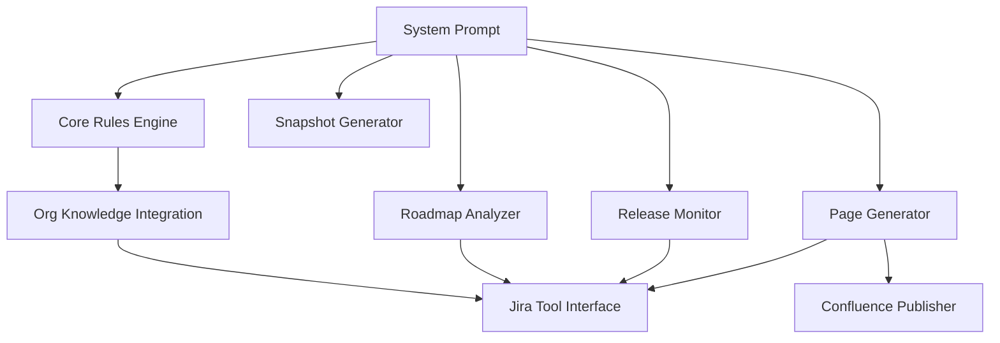
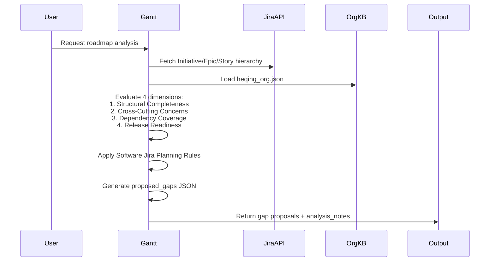
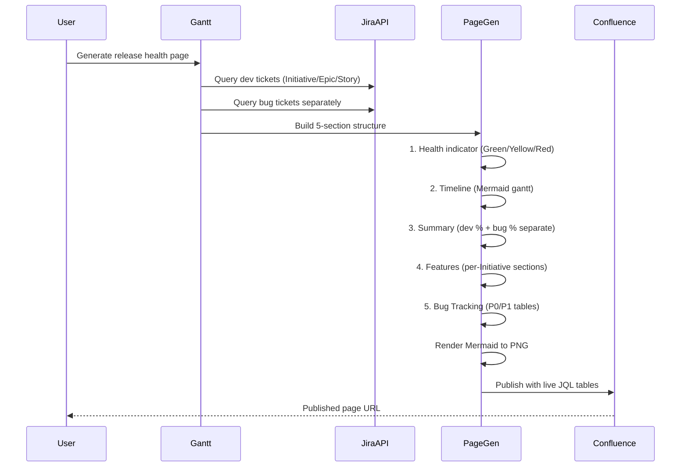
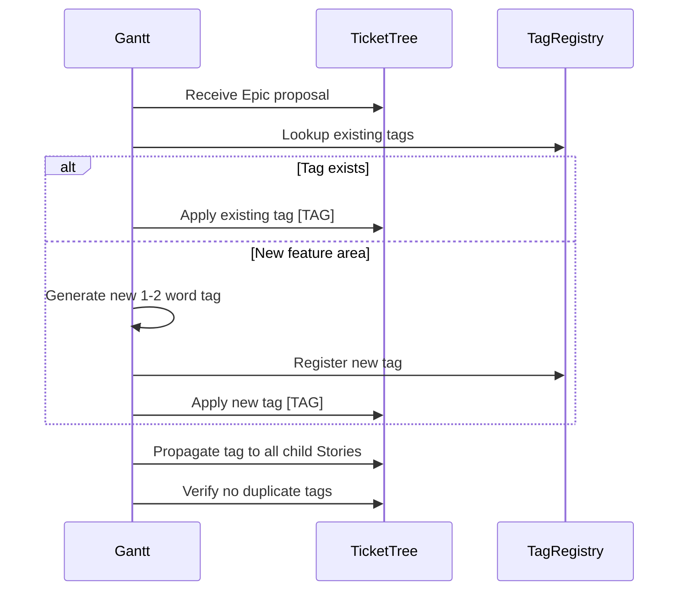

<!-- Generated by Documentation Agent — do not edit between markers -->

```yaml
---
title: "As-Built: Gantt Agent System Prompt"
date: "2026-04-06"
status: "draft"
---
```

## Module Overview

The Gantt agent system prompt defines the behavior, capabilities, and output formats for a project-planning AI agent that transforms Jira work state into actionable planning intelligence. The prompt establishes strict rules for roadmap analysis, release monitoring, bug tracking separation, and Confluence page generation while grounding all recommendations in observable project data rather than speculation.

## What Changed

**Before:** The prompt did not include comprehensive guidance for generating roadmap and release health pages with proper separation of bug tickets from development tickets.

**After:** Added a complete "Roadmap & Release Health Page Generation" section (lines 321-445) that:
- Enforces strict separation between bug tickets and development tickets in all analysis
- Defines a standardized 5-section page structure (Health, Timeline, Summary, Features, Bug Tracking)
- Specifies live JQL table generation rules with proper Initiative-as-heading treatment
- Mandates Mermaid diagram rendering to PNG for Confluence publication
- Provides clear health indicator criteria (Green/Yellow/Red) with observable risk factors

**Impact:** 
- Users requesting roadmap or release health pages now receive consistently structured output
- Bug tracking is properly isolated from feature delivery tracking
- Confluence publications use live JQL tables that stay current after publication
- Initiative tickets are correctly used as section headings rather than table rows

## Component Diagram



## Key Flows

### Flow 1: Roadmap Gap Analysis



**Description:** When performing roadmap analysis via `create_roadmap_snapshot`, the agent fetches the current Jira hierarchy, loads organizational knowledge to identify component owners and capacity constraints, evaluates coverage across four dimensions (structural completeness, cross-cutting concerns, dependency coverage, release readiness), and outputs a structured JSON proposal of missing Epics and Stories following strict 2-level hierarchy rules (Initiative → Epic → Story).

### Flow 2: Release Health Page Generation



**Description:** When generating a release health page, the agent queries development tickets and bug tickets as separate populations, constructs a standardized 5-section page (Health, Timeline, Summary, Features, Bug Tracking), renders Mermaid diagrams to PNG images, and publishes to Confluence using live JQL filter tables that remain current after publication. Development completion and bug closure percentages are reported independently, never blended.

### Flow 3: Ticket Naming Convention Application



**Description:** When proposing or generating ticket trees, the agent applies a bracketed tag prefix to Epic summaries (e.g., `[CYR RoCE]`, `[GPU OPA]`) and propagates that tag to all child Stories. Tags are derived from a registry of 30+ established feature area tags or newly generated following the 1-2 word uppercase-first convention. This ensures tickets are scannable at a glance and feature threads are visually grouped.

## Data Model

### Gap Proposal Schema

The roadmap analyzer outputs a JSON structure conforming to this schema:

```json
{
  "proposed_gaps": [
    {
      "section": "string",           // Section title this gap belongs in
      "issue_type": "Epic | Story",  // Never Initiative, Bug, Task, or Sub-task
      "depth": 1,                     // Hierarchy depth (1=Epic, 2=Story)
      "summary": "string",            // Concise Jira ticket summary with [TAG] prefix
      "priority": "P0 | P1 | P2 | P3",
      "suggested_component": "string", // Real Jira component name
      "acceptance_criteria": "string", // Measurable definition of done
      "dependencies": "STL-XXXXX; STL-YYYYY", // Semicolon-separated keys or ""
      "suggested_fix_version": "string",
      "labels": "string",
      "parent_summary": "string"      // Parent Epic summary if this is a Story
    }
  ],
  "analysis_notes": "string"         // Markdown summary of gaps found
}
```

### Organizational Knowledge Structure

The agent loads `data/knowledge/heqing_org.json` containing:

```json
{
  "name": "string",
  "title": "string",
  "reports_to": "string",
  "jira_components": [
    {
      "component": "string",
      "issue_count": 0
    }
  ],
  "github_repos": ["string"],
  "direct_reports": [/* recursive structure */]
}
```

This structure maps 44 engineers to their Jira component ownership and GitHub repository contributions.

### Page Generation Output

Release health and roadmap pages follow this structure:

1. **Health Block**: `{ status: "Green|Yellow|Red", risk_factors: ["string"] }`
2. **Timeline**: Mermaid gantt diagram with Initiative landing windows
3. **Summary**: Text block with dev completion %, bug closure %, top risks
4. **Features**: Per-Initiative sections with live JQL tables
5. **Bug Tracking**: P0/P1 tables, component heatmap, stale ticket table

## Dependencies

| Dependency | Purpose | Version |
|------------|---------|---------|
| Jira API | Fetch project info, tickets, releases, fields | Cloud REST API v3 |
| Knowledge Base | Load org structure, component ownership | Local JSON files |
| Confluence API | Publish pages with live JQL tables | Cloud REST API v2 |
| Mermaid | Generate timeline and component diagrams | 10.x (via rendering service) |
| `search_knowledge` | Search knowledge base by keyword | Internal tool |
| `list_knowledge_files` | List all knowledge base files | Internal tool |
| `read_knowledge_file` | Read specific knowledge base file | Internal tool |
| `get_project_info` | Fetch Jira project metadata | Internal tool |
| `search_tickets` | Query Jira tickets by JQL | Internal tool |
| `get_ticket` | Fetch single ticket details | Internal tool |
| `get_project_fields` | Fetch custom field definitions | Internal tool |
| `get_releases` | Fetch release/fixVersion data | Internal tool |
| `create_release_monitor` | Generate release health report | Internal tool |
| `create_filter` | Create named Jira filter from JQL | Internal tool |
| `build_jira_jql_table_macro` | Generate Confluence JQL table macro | Internal tool |

## Configuration

### Environment Variables

None explicitly defined in the prompt. The agent relies on tool implementations to handle Jira and Confluence authentication.

### Feature Flags

- **Roadmap Analysis Mode**: Activated via `create_roadmap_snapshot` tool call
- **Release Monitor Mode**: Activated via `create_release_monitor` tool call
- **Page Generation Mode**: Activated by user request for "roadmap page", "release health page", or "release readiness page"

### Configuration Files

- `data/knowledge/heqing_org.json`: Primary organizational reference (44-person SW engineering org)
- Knowledge base files accessible via `list_knowledge_files()` and `read_knowledge_file()`

### Ticket Naming Tag Registry

The prompt embeds a registry of 30+ established feature area tags:

| Tag | Feature Area |
|-----|--------------|
| `[CYR Cport]` | CYR firmware cport updates |
| `[CYR 800G]` | CYR 800GB support |
| `[CYR OPX]` | CYR OPX design and dual-plane |
| `[CYR RoCE]` | CYR RoCE driver support |
| `[CYR SR-IOV]` | CYR OPA SR-IOV support |
| `[RoCE Driver]` | RoCE driver implementation |
| `[RoCE HFIsvc]` | RoCE via HFIsvc |
| `[RoCE DevOps]` | RoCE CI/build pipeline |
| `[SR-IOV Driver]` | SR-IOV ethernet driver |
| `[SR-IOV MW]` | SR-IOV middleware (OPX) |
| `[SR-IOV Arch]` | SR-IOV architecture design |
| `[OPA HFIsvc]` | OPA port to HFIsvc |
| `[MW OPX]` | Middleware OPX enablement |
| `[RDMA Core]` | RDMA core API implementation |
| `[ETH MAC]` | Ethernet MAC configuration |
| `[ETH FW]` | Ethernet firmware |
| `[TCP/IP Perf]` | TCP/IP performance testing |
| `[GPU SOL]` | GPU SpeedOfLight |
| `[GPU OPA]` | GPU over OPA verbs |
| `[GPU RoCE]` | GPU over RoCE verbs |
| `[GPU OPX]` | GPU over OPX |
| `[SERDES]` | SERDES configuration |
| `[PQC]` | Post-quantum cryptography |
| `[Build Pipeline]` | CI/build pipeline |
| `[EMU Delivery]` | Emulation SW delivery |
| `[BTS/Verbs]` | BTS and verbs merge |
| `[FW Tools]` | Firmware tools |
| `[Backport ETH]` | ETH driver distro backports |
| `[Backport OPA]` | OPA driver distro backports |
| `[IPoIB]` | IPoIB enablement |
| `[Storage]` | Storage protocol enablement |
| `[Perf RoCE]` | RoCE performance targets |
| `[Perf OPA]` | OPA performance targets |
| `[Perf OPX]` | OPX performance targets |

## Error Handling

### Evidence Gap Handling

The prompt explicitly instructs the agent to "highlight evidence gaps explicitly instead of guessing" (line 18). When observable project data is missing:

- Flag the gap in `analysis_notes` or risk factors
- Do not propose speculative work items
- Surface the missing data as a planning risk

### Anti-Pattern Detection

The prompt defines four anti-patterns to flag in roadmap analysis (lines 218-221):

1. **God classes**: >500 lines with >10 public methods (not applicable to Jira planning)
2. **Circular dependencies**: Between modules or classes (mapped to cross-Epic dependency cycles)
3. **Missing error handling**: On external calls or I/O boundaries (mapped to missing acceptance criteria)
4. **Hardcoded credentials or URLs**: (mapped to missing configuration Stories)

When detected, these must be explicitly flagged in the "Known Limitations / Technical Debt" section.

### Validation Rules

The prompt enforces strict validation on gap proposals:

- **issue_type**: Must be `"Epic"` or `"Story"` only. Never `"Initiative"`, `"Bug"`, `"Task"`, or `"Sub-task"` (lines 287-288).
- **priority**: Must be one of `"P0"`, `"P1"`, `"P2"`, `"P3"` with defined semantics (lines 291-295).
- **suggested_component**: Must be a real Jira component from the project (line 296).
- **dependencies**: Must reference real `STL-` ticket keys from the input or be empty string (lines 300-301).
- **summary**: Must represent one branch-sized software deliverable, not an umbrella Story (lines 302-304).

### Bug/Dev Ticket Separation Enforcement

The prompt mandates strict separation of bug tickets from development tickets in all analysis (lines 330-343):

- Roadmap pages assess **only** development tickets (Initiatives, Epics, Stories)
- Release readiness pages assess **both** but in clearly separated sections
- **Never mix bugs and dev tickets in the same table or count**
- Report "Dev Completion: X%" and "Bug Closure: Y%" separately

Violation of this rule would produce misleading completion percentages and confuse feature delivery tracking with defect resolution.

## Known Limitations / Technical Debt

### Hardcoded Tag Registry

The ticket naming tag registry (lines 200-237) is embedded directly in the prompt rather than loaded from a configuration file. This creates maintenance burden when new feature areas are added. **Recommendation**: Extract the tag registry to `data/knowledge/ticket_tags.json` and load it via `read_knowledge_file()`.

### Missing Validation for JQL Syntax

The prompt instructs the agent to generate JQL queries for live Confluence tables but does not provide validation rules for JQL syntax correctness. Invalid JQL will cause Confluence table rendering failures. **Recommendation**: Add a JQL validation step or reference to Jira's JQL syntax documentation.

### Incomplete Mermaid Rendering Specification

The prompt states "Render Mermaid diagrams to PNG images before publishing to Confluence" (line 441) and references `render_diagrams()` or `_render_mermaid()` from `confluence_utils.py`, but does not specify error handling when diagram rendering fails (e.g., syntax errors, rendering service unavailable). **Recommendation**: Add fallback behavior (e.g., publish as code block with warning) when PNG rendering fails.

### Ambiguous "Stale Ticket" Definition

The prompt uses "stale tickets" in multiple contexts:
- Line 33: "stale, unassigned, and unscheduled work"
- Line 315: "Stale tickets (no update beyond expected cycle time)"
- Line 417: "Bugs with no update in 30+ days"

The 30-day threshold is only specified for bugs. Development ticket staleness criteria are undefined. **Recommendation**: Define explicit staleness thresholds for Initiatives, Epics, and Stories (e.g., 60 days for Initiatives, 45 days for Epics, 30 days for Stories).

### No Guidance on Initiative-as-Heading Edge Cases

The prompt states "The Initiative ticket is the **heading**, not a row in the table" (line 393) and "Do not include `issuekey = <initiative_key>` in the JQL for the table" (lines 394-395). However, it does not address the edge case where an Initiative has no child Epics or Stories. **Recommendation**: Add guidance to either omit the Initiative section entirely or include a note that the Initiative has no decomposed work.

### Missing Confluence Macro Version Compatibility

The prompt references `build_jira_jql_table_macro` (line 385) but does not specify which Confluence macro format to use (legacy `{jira}` macro vs. modern `ac:structured-macro` XML). Different Confluence versions support different macro formats. **Recommendation**: Specify the target Confluence version and macro format explicitly.

### Incomplete Cross-Cutting Concern Coverage

The prompt lists six cross-cutting concerns to check (lines 155-171):
1. DevOps / CI build pipeline
2. Distro backport enablement
3. Performance target definition and validation
4. GPU enablement
5. Storage protocol enablement
6. IPoIB support

This list is specific to Cornelis Networks' hardware/driver domain. It does not generalize to other project types (e.g., web services, embedded systems, data pipelines). **Recommendation**: Either document that this prompt is domain-specific or parameterize the cross-cutting concern checklist.

### No Handling of Multi-Release Roadmaps

The prompt assumes each roadmap or release health page targets a single release (line 323: "treat the request as a view of a **future release**"). It does not provide guidance for multi-release roadmaps spanning multiple fixVersions. **Recommendation**: Add a section on how to structure pages when the roadmap covers multiple releases (e.g., separate sections per release, or a unified timeline with release markers).

<!-- End Documentation Agent generated content -->