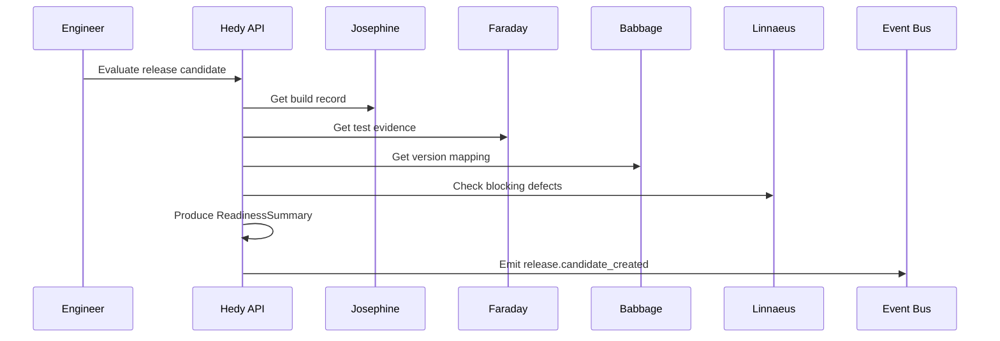
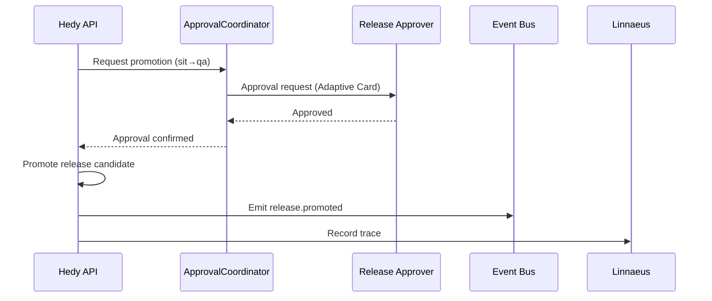

# Hedy Release Manager Plan

## Summary
Hedy should be the release-management agent for the platform. Its v1 job is to take build facts from Josephine, version facts from Babbage, test evidence from the test agents, and traceability context from Linnaeus, then turn those inputs into controlled release decisions and release-state transitions.

Hedy should use `fuze`'s existing release model as the underlying release engine where possible. In v1, Hedy should not replace `fuze` release mechanics; it should orchestrate and govern them.

## Product definition
### Goal
- evaluate release readiness for a build across branch, hardware, customer, and policy context
- create release candidates and promotion requests
- drive release-state transitions through Fuze-compatible mechanisms
- produce durable release records, readiness summaries, and approval artifacts
- keep release decisions tied to exact build, version, test, and traceability evidence

### Non-goals for v1
- replacing `fuze` release-state storage or tagging logic
- replacing Babbage version mapping
- replacing Linnaeus traceability ownership
- fully autonomous promotion to production without explicit approval
- customer-visible delivery orchestration as the first slice

### Position in the system
- Josephine provides build and artifact facts
- Ada, Curie, Faraday, and Tesla provide validation and environment evidence
- Babbage provides internal-to-external version mapping
- Linnaeus provides issue, requirement, build, and test traceability
- Hedy decides whether a build should become a release candidate, advance stage, pause, or be blocked

## Triggering model
- Hedy should run as an always-on release control-plane service.
- Normal work should start from build completion events, release-evaluation requests, and promotion or block requests.
- Humans should remain the trigger source for approvals, final promotions, blocking decisions, and deprecation actions where policy requires it.

## Architecture
### Core design
Hedy should be split into these concerns:
- `ReleaseEvaluator`: determines readiness against release policy
- `StagePromoter`: requests or performs stage transitions through Fuze-compatible release interfaces
- `ApprovalCoordinator`: creates approval requests and records human decisions
- `ReleaseMatrixResolver`: applies hardware, customer, and branch policy to release scope
- `ReadinessSummarizer`: generates machine-readable and human-readable release summaries

Required internal objects:
- `ReleaseEvaluationRequest`
- `ReleaseCandidate`
- `ReleaseDecision`
- `ReleasePromotionRequest`
- `ReleaseReadinessSummary`

### Fuze release grounding
The plan should explicitly reuse the release concepts already present in `fuze`:
- release is a state change attached to an existing universal FuzeID
- released items must already have packages
- release stages already exist in documentation and code
- release metadata is stored in a release DB
- git tags are created as part of release persistence
- plugin-driven automations already exist for Jira and automated testing

Grounding references:
- [fuze/docs/source/fuze-releasing.rst](/Users/johnmacdonald/code/cornelis/fuze/docs/source/fuze-releasing.rst)
- [fuze/release.py](/Users/johnmacdonald/code/cornelis/fuze/release.py)

### Release-state model
Hedy should treat the existing Fuze release model as canonical for v1.

Documented public stages:
- `sit`
- `qa`
- `release`
- `deprecated`

Existing implementation also indicates internal or exceptional stages such as:
- `REJECTED`
- `TEST-ONLY`

V1 rule:
- Hedy may use the richer internal state model operationally, but must clearly distinguish:
  - public release stages
  - internal workflow states
  - terminal blocked or rejected outcomes

### Release candidate model
Hedy should create a `ReleaseCandidate` that contains:
- `release_candidate_id`
- `build_id`
- proposed release branch
- hardware targets
- customer targets
- proposed stage
- mapped external version reference
- readiness summary
- approval status

## Diagrams

### Release Evaluation

### Release Promotion

## Decision model
### Inputs
- `build_id`
- branch and commit context
- build artifacts and package manifest
- Babbage version mapping
- test execution evidence
- traceability and defect state
- release branch policy
- customer and hardware matrix policy
- human approval status where required

### Decision outputs
Hedy should produce:
- `candidate_created`
- `promotion_requested`
- `promotion_approved`
- `promotion_blocked`
- `promotion_completed`
- `deprecated`

### Decision rules
- only builds with release-eligible package state may advance
- local or non-shareable build identities must not become release candidates
- release readiness must account for:
  - build success and artifact availability
  - required test evidence
  - known blocking defects
  - version mapping availability
  - branch and release-policy compliance
- production or customer-visible promotion must require explicit approval
- blocked releases must record exact reasons and linked evidence

## Execution topology
### Where Hedy runs
- run Hedy on standard internal service infrastructure
- Hedy is a control-plane service, not a build or test worker
- Hedy may trigger downstream work, but should not execute builds or tests directly

### How release flow happens
1. Josephine emits build completion
2. Babbage maps version context
3. test agents attach validation evidence
4. Linnaeus attaches traceability and defect context
5. Hedy evaluates release readiness
6. Hedy creates a release candidate or blocks it
7. when approved, Hedy promotes the release through Fuze-compatible release operations
8. Hedy emits release records and downstream notifications

## Public API and contracts
### API surface
- `POST /v1/releases/evaluate`
  - input: `build_id`, release context, target matrix, policy profile
  - output: `ReleaseDecision` and optional `ReleaseCandidate`
- `POST /v1/releases`
  - input: `build_id`, desired stage, release scope, version reference, approval context
  - output: `release_id`, status, candidate summary
- `POST /v1/releases/{release_id}/promote`
  - advance to next allowed stage if policy and approval allow
- `POST /v1/releases/{release_id}/block`
  - block a release with explicit reason
- `POST /v1/releases/{release_id}/deprecate`
  - deprecate a release where policy allows
- `GET /v1/releases/{release_id}`
  - return current release state and linked evidence
- `GET /v1/releases/{release_id}/summary`
  - return readiness summary and approval history

### Internal contracts
- `ReleaseEvaluationRequest`
- `ReleaseCandidate`
- `ReleaseDecision`
- `ReleasePromotionRequest`
- `ReleaseReadinessSummary`

## Queueing and workflow
- use asynchronous workflow for evaluation and promotion side effects
- persist release state independently from queued work
- keep promotion idempotent so repeated requests do not double-promote
- serialize conflicting promotions for the same release target
- require approval gates before irreversible stage transitions

## Observability and operations
### Structured events
Emit:
- `release.candidate_created`
- `release.approval_requested`
- `release.promoted`
- `release.blocked`
- `release.deprecated`

### Metrics
Collect:
- release candidate count by branch and product
- approval wait time
- promotion success/failure rate by stage
- blocked release count and reason class
- release throughput by hardware and customer target

### Operator controls
- approve promotion
- reject promotion
- block release with reason
- deprecate release
- inspect exact evidence linked to a release decision

## Security and approvals
- require explicit approval for production or customer-visible promotion
- separate evaluation privileges from promotion privileges
- use service principals for automated release actions
- audit every approval, rejection, block, promotion, and deprecation action
- never allow hidden policy overrides

## Fuze changes required
Hedy can reuse `fuze` release capabilities, but the following changes would make it a stronger release substrate.

### 1. Non-interactive release API
Expose release operations as a library or service-friendly interface that does not require interactive prompts for version or stage confirmation.

### 2. Machine-readable release evaluation
Add a dry-run release-evaluation mode that returns:
- whether the FuzeID is release-eligible
- package eligibility
- allowed next stages
- reasons a promotion would fail

### 3. Stable release-state output
Return machine-readable release records with:
- `build_id` / FuzeID
- release stage
- version
- tag name
- previous stage history
- approval and automation status

### 4. Explicit automation hooks
Separate release-state persistence from optional automations such as Jira and test triggering so Hedy can call them intentionally and observe their results independently.

## Decision Logging & Audit Trail

Every action this agent takes is logged with full context. For decisions, the complete decision tree is recorded — what options were considered, what data was evaluated, and why the chosen path was selected.

| Log Type | What Is Captured | Example |
|----------|-----------------|---------|
| **Action log** | Every API call, event consumed, event emitted, external system interaction. Timestamped with correlation_id and agent_id. | `action=emit_event, event_type=build.completed, build_id=BLD-1234, correlation_id=abc-123` |
| **Decision log** | The full decision tree: inputs evaluated, rules applied, alternatives considered, chosen outcome, and rationale. | `decision=select_test_plan, trigger=PR, inputs=[branch=feature/x, module=opx-core], candidates=[quick_smoke, pr_standard], selected=pr_standard, reason="PR trigger + no HIL changes"` |
| **Rejection log** | When an action is rejected or blocked — what was attempted, what rule prevented it, what the agent did instead. | `decision=promote_release, attempted=sit_to_qa, blocked_by=failing_test_TES-456, action=hold_and_notify` |

All logs are stored in PostgreSQL (audit table) and streamed to Grafana/Loki. Decision logs are queryable by correlation_id, agent_id, decision type, and time range.

## Tool Use & Token Efficiency

This agent prioritizes **deterministic tools** over LLM inference wherever possible. LLM calls are reserved for tasks that genuinely require reasoning, generation, or ambiguity resolution.

| Principle | Implementation |
|-----------|---------------|
| **Deterministic first** | Policy lookups, schema validation, event routing, suite selection, version mapping, and traceability queries all use deterministic code paths. No tokens spent on work that has a known algorithm. |
| **Custom tooling** | The agent platform builds and maintains its own tool library. When a pattern repeats, it becomes a tool. Agents can also generate new tools for themselves when they identify repeated LLM-heavy patterns. |
| **Token-aware execution** | Every LLM call logs input tokens, output tokens, model used, and cost. The agent selects the smallest capable model for each task. |
| **Caching** | LLM responses for identical inputs are cached (Redis). Repeated queries hit cache instead of burning tokens. |

### Token Tracking

All token usage is logged to PostgreSQL and accumulates per agent, per day, per operation type.

| Metric | Tracked | Queryable By |
|--------|---------|-------------|
| **Per-call tokens** | input_tokens, output_tokens, model, latency_ms, cost_usd | correlation_id, agent_id, timestamp |
| **Cumulative totals** | total_input_tokens, total_output_tokens, total_cost_usd | agent_id, date range, operation type |
| **Efficiency ratio** | deterministic_actions / total_actions (target: >80%) | agent_id, date range |

## Standard Commands

Every agent responds to these standard commands in its Teams channel and via REST API.

| Command | What It Returns |
|---------|----------------|
| `/token-status` | Token usage summary: today's input/output tokens, cumulative totals, cost, efficiency ratio, comparison to 7-day average. |
| `/decision-tree` | The last N decisions made by this agent, each showing: timestamp, decision type, inputs evaluated, candidates considered, selected outcome, and rationale. |
| `/why {decision-id}` | Deep dive into a specific decision: full decision tree, all inputs, every rule evaluated, alternatives rejected and why, final rationale with links to source data. |
| `/stats` | Operational statistics: uptime, total actions today/this week/this month, success/failure rates, average latency, queue depth, active jobs, error rate trend. |
| `/work-today` | Summary of today's work: number of jobs processed, key outcomes, notable decisions, any failures or blocked items. |
| `/busy` | Current load: active jobs, queue depth, estimated drain time. Status: idle / working / busy / overloaded. |

All commands also work via the agent's REST API (e.g., `GET /v1/status/tokens`, `GET /v1/status/decisions`, `GET /v1/status/stats`).

## Teams Channel Interface

This agent has a dedicated **Microsoft Teams channel** (`#agent-{name}`) in the "Agent Workforce" team. This is the primary human interface. This channel is managed by **[Shannon](SHANNON_COMMUNICATIONS_AGENT_PLAN.md)**, the communications service agent.

| Function | How It Works |
|----------|-------------|
| **Activity feed** | The agent posts a summary of every significant action. Engineers follow along in real time. |
| **Decision notifications** | Non-trivial decisions are posted with rationale. Engineers can review and challenge. |
| **Approval requests** | When human approval is required, the agent posts an Adaptive Card with approve/reject buttons. |
| **Input requests** | When the agent needs information it cannot determine automatically, it posts a structured request. Engineers reply in-thread. |
| **Error alerts** | Failures and anomalies posted with severity and suggested actions. Critical alerts @mention the relevant team. |
| **Status queries** | Engineers can ask for status by posting in the channel. The agent responds in-thread. |

## Phased roadmap
### Phase 1. Release evaluation
- evaluate release readiness from build, version, and test evidence
- create durable release candidate and readiness summary records

Exit criteria:
- Hedy can evaluate a build and produce a release decision
- readiness evidence is queryable

### Phase 2. Promotion orchestration
- trigger Fuze-compatible release transitions
- support approval and block workflows
- persist promotion results and linked tags

Exit criteria:
- stage promotion works for supported stages
- promotion is auditable and idempotent

### Phase 3. Matrix-aware release management
- add hardware and customer target matrix logic
- produce scope-aware release candidates and summaries

Exit criteria:
- Hedy can distinguish release readiness by target scope
- blocked targets do not force unrelated targets to share the same status unless policy says so

### Phase 4. Automation hardening
- integrate downstream release validation and Jira-facing release automation deliberately
- improve dry-run evaluation and machine-readable outputs from Fuze

Exit criteria:
- automation side effects are observable and recoverable
- release flow is operable without manual log inspection

## Test and acceptance plan
### Evaluation behavior
- eligible build with required packages becomes release candidate
- missing package eligibility blocks release
- missing version mapping blocks or pauses release according to policy
- blocking defect state prevents promotion where policy requires

### Promotion behavior
- supported stage transition succeeds
- illegal stage transition is rejected
- repeated promotion request is idempotent
- deprecation path works and is audited

### Evidence integrity
- release summary links exact build, version, test, and traceability records
- release records remain queryable by build ID and release ID
- approval history is durable

### Operational behavior
- approval gate enforced
- blocked release reason visible
- failed automation side effect does not silently corrupt release state

## Assumptions
- `fuze` remains the release-state engine in v1
- Babbage owns external version mapping, not Hedy
- Linnaeus owns traceability records, not Hedy
- final production release approval remains human-controlled
