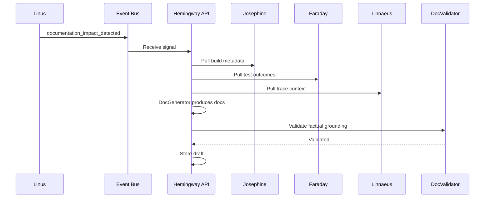
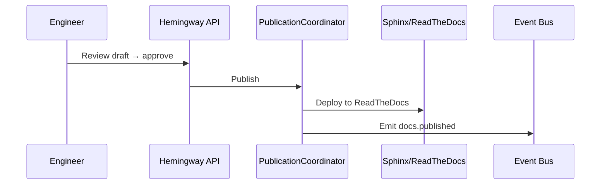

# Hemingway Documentation Agent Plan

## Summary
Hemingway should be the documentation agent for the platform. Its v1 job is to turn source changes, build and test facts, traceability context, release context, and meeting-derived clarifications into durable engineering and user-facing documentation updates.

Hemingway should not be a prose generator detached from implementation truth. It should produce documentation from authoritative system records.

## Product definition
### Goal
- generate and maintain repo-level as-built documentation
- update user and engineering documentation from validated system facts
- propose documentation changes when code, build, test, release, or meeting knowledge changes
- publish approved docs to internal documentation targets
- keep documentation linked to builds, versions, and traceability records where useful

### Non-goals for v1
- fully autonomous publication of external customer-visible documentation
- replacing engineers as final approvers of normative docs
- inventing architecture or behavior not grounded in source or records
- replacing Hemingway with generic LLM-generated markdown dumps

### Position in the system
- GitHub supplies source and structural change signals
- Josephine supplies build/package facts
- Faraday supplies test execution evidence
- Hedy supplies release readiness and release-state context
- Linnaeus supplies traceability context
- Herodotus supplies meeting-derived clarification and documentation suggestions
- Hemingway turns those sources into durable documentation artifacts

## Triggering model
- Hemingway should run as an always-on documentation service.
- Normal work should start from documentation-impact signals caused by source, build, test, release, and approved meeting-summary changes, or from direct generation requests.
- Humans should review, publish, reject, and regenerate documentation outputs.

## Architecture
### Core design
Hemingway should be split into these concerns:
- `DocImpactAnalyzer`: determines which docs are affected by source, build, test, release, or meeting changes
- `SourceSynthesizer`: gathers authoritative inputs from code, schemas, records, and prior docs
- `DocGenerator`: produces candidate documentation updates in the appropriate format
- `DocValidator`: checks structure, references, publishability, and confidence
- `PublicationCoordinator`: stages, commits, or publishes approved docs to configured targets

Required internal objects:
- `DocumentationRequest`
- `DocumentationRecord`
- `DocumentationPatch`
- `DocumentationImpactRecord`
- `PublicationRecord`

### Documentation grounding
Hemingway should be grounded in the existing documentation substrate already present in `fuze`:
- `fuze/docs/source` is a Sphinx documentation tree
- repo-owned docs remain the preferred source of durable documentation
- internal publishing should stay compatible with Sphinx / ReadTheDocs-style output where possible

Grounding references:
- [fuze/docs/source/index.rst](/Users/johnmacdonald/code/cornelis/fuze/docs/source/index.rst)
- [fuze/docs/source/conf.py](/Users/johnmacdonald/code/cornelis/fuze/docs/source/conf.py)
- [fuze/docs/Makefile](/Users/johnmacdonald/code/cornelis/fuze/docs/Makefile)

## Diagrams

### Doc Generation Flow

### Doc Publication

## Documentation model
### Inputs
- source changes and repository structure from GitHub
- review findings from Linus
- build metadata and artifact manifests from Josephine
- test outcomes from Faraday
- release and version context from Hedy and Babbage
- traceability context from Linnaeus
- documentation suggestions or rationale context from Herodotus
- existing documentation trees and style conventions

### Outputs
Hemingway should produce:
- repo-level as-built docs
- user documentation
- engineering and architecture documentation
- change summaries for docs review
- publishable documentation bundles or committed doc patches

### Documentation classes
V1 should explicitly distinguish:
- `as_built`
- `user_guide`
- `engineering_reference`
- `release_note_support`
- `how_to` / operational guidance

### Documentation rules
- every substantive claim should be traceable to a source artifact, record, or approved meeting summary
- generated docs should cite or link authoritative inputs where practical
- missing source truth should lower confidence or block generation, not be filled with speculation
- externally shared docs should require stronger review gates than internal engineering docs
- Hemingway should update existing doc structures when possible instead of creating parallel documentation silos

## Publication model
### Primary targets
V1 should focus on internal documentation targets:
- repo-owned docs trees
- Sphinx / ReadTheDocs-style internal publishing
- internal engineering knowledge stores where policy allows

### Publication flow
1. detect documentation impact
2. generate candidate patch or document bundle
3. validate links, structure, and source grounding
4. request review where policy requires it
5. commit or publish approved docs

### Publication rules
- internal publication may be semi-automated with approval
- external publication should remain approval-gated in v1
- every published doc set should retain source references and generation metadata
- doc publication should be idempotent and auditable

## Public API and contracts
### API surface
- `POST /v1/docs/impact`
  - input: repo scope, commit/build/release/meeting references
  - output: `DocumentationImpactRecord`
- `POST /v1/docs/generate`
  - input: documentation scope, source refs, target type
  - output: `DocumentationRecord`
- `GET /v1/docs/{doc_id}`
  - return generated doc record, confidence, and source refs
- `GET /v1/docs/{doc_id}/patch`
  - return candidate patch or generated bundle metadata
- `POST /v1/docs/{doc_id}/publish`
  - publish or commit approved documentation updates

### Internal contracts
- `DocumentationRequest`
- `DocumentationRecord`
- `DocumentationPatch`
- `DocumentationImpactRecord`
- `PublicationRecord`

## Integration boundaries
### With Herodotus
- Herodotus suggests documentation-relevant decisions or clarifications
- Hemingway decides what becomes durable documentation text

### With Linnaeus
- Linnaeus provides traceability context and authoritative relationship links
- Hemingway may reference those links but does not own traceability truth

### With Hedy and Babbage
- Hedy and Babbage provide release and version context for release-note support and versioned docs
- Hemingway does not decide release status or version mapping

### With Linus
- Linus may flag documentation-impact findings during review
- Hemingway owns doc generation and maintenance, not code review policy

## Observability and operations
### Structured events
Emit:
- `docs.impact_detected`
- `docs.generated`
- `docs.validation_failed`
- `docs.publish_requested`
- `docs.published`

### Metrics
Collect:
- doc generation success rate
- review acceptance rate
- documentation lag after source/build/release change
- broken-reference rate
- percentage of builds/releases with linked documentation updates

### Operator controls
- regenerate docs for a specific scope
- reject a candidate doc patch
- force revalidation after source changes
- retract or supersede a published doc set under policy

## Security and approvals
- source repos, build records, test results, release records, and docs targets may each have distinct access policies
- publication to external or customer-visible targets should require explicit approval
- generation metadata and source references must be retained for audit
- sensitive release or customer details should not leak into broad documentation targets without policy support
- doc commits and publications must be attributable

## Fuze and platform changes required
Hemingway will be stronger if the platform exposes documentation-friendly inputs.

### 1. Stable documentation-impact events
Emit explicit documentation-impact signals from:
- source changes
- build completion
- release changes
- meeting summary approvals

### 2. Machine-readable build, test, and release summaries
Josephine, Faraday, and Hedy should expose concise records that can be rendered into documentation without log scraping.

### 3. Shared source-reference model
Use a canonical way to cite:
- repo paths
- commit SHAs
- build IDs
- release IDs
- Jira keys
- meeting summary IDs

### 4. Documentation validation pipeline
Add or reuse a validation path for:
- Sphinx build success
- broken links
- missing references
- publication eligibility

## Decision Logging & Audit Trail

Every action this agent takes is logged with full context. For decisions, the complete decision tree is recorded — what options were considered, what data was evaluated, and why the chosen path was selected.

| Log Type | What Is Captured | Example |
|----------|-----------------|---------|
| **Action log** | Every API call, event consumed, event emitted, external system interaction. Timestamped with correlation_id and agent_id. | `action=emit_event, event_type=build.completed, build_id=BLD-1234, correlation_id=abc-123` |
| **Decision log** | The full decision tree: inputs evaluated, rules applied, alternatives considered, chosen outcome, and rationale. | `decision=select_test_plan, trigger=PR, inputs=[branch=feature/x, module=opx-core], candidates=[quick_smoke, pr_standard], selected=pr_standard, reason="PR trigger + no HIL changes"` |
| **Rejection log** | When an action is rejected or blocked — what was attempted, what rule prevented it, what the agent did instead. | `decision=promote_release, attempted=sit_to_qa, blocked_by=failing_test_TES-456, action=hold_and_notify` |

All logs are stored in PostgreSQL (audit table) and streamed to Grafana/Loki. Decision logs are queryable by correlation_id, agent_id, decision type, and time range.

## Tool Use & Token Efficiency

This agent prioritizes **deterministic tools** over LLM inference wherever possible. LLM calls are reserved for tasks that genuinely require reasoning, generation, or ambiguity resolution.

| Principle | Implementation |
|-----------|---------------|
| **Deterministic first** | Policy lookups, schema validation, event routing, suite selection, version mapping, and traceability queries all use deterministic code paths. No tokens spent on work that has a known algorithm. |
| **Custom tooling** | The agent platform builds and maintains its own tool library. When a pattern repeats, it becomes a tool. Agents can also generate new tools for themselves when they identify repeated LLM-heavy patterns. |
| **Token-aware execution** | Every LLM call logs input tokens, output tokens, model used, and cost. The agent selects the smallest capable model for each task. |
| **Caching** | LLM responses for identical inputs are cached (Redis). Repeated queries hit cache instead of burning tokens. |

### Token Tracking

All token usage is logged to PostgreSQL and accumulates per agent, per day, per operation type.

| Metric | Tracked | Queryable By |
|--------|---------|-------------|
| **Per-call tokens** | input_tokens, output_tokens, model, latency_ms, cost_usd | correlation_id, agent_id, timestamp |
| **Cumulative totals** | total_input_tokens, total_output_tokens, total_cost_usd | agent_id, date range, operation type |
| **Efficiency ratio** | deterministic_actions / total_actions (target: >80%) | agent_id, date range |

## Standard Commands

Every agent responds to these standard commands in its Teams channel and via REST API.

| Command | What It Returns |
|---------|----------------|
| `/token-status` | Token usage summary: today's input/output tokens, cumulative totals, cost, efficiency ratio, comparison to 7-day average. |
| `/decision-tree` | The last N decisions made by this agent, each showing: timestamp, decision type, inputs evaluated, candidates considered, selected outcome, and rationale. |
| `/why {decision-id}` | Deep dive into a specific decision: full decision tree, all inputs, every rule evaluated, alternatives rejected and why, final rationale with links to source data. |
| `/stats` | Operational statistics: uptime, total actions today/this week/this month, success/failure rates, average latency, queue depth, active jobs, error rate trend. |
| `/work-today` | Summary of today's work: number of jobs processed, key outcomes, notable decisions, any failures or blocked items. |
| `/busy` | Current load: active jobs, queue depth, estimated drain time. Status: idle / working / busy / overloaded. |

All commands also work via the agent's REST API (e.g., `GET /v1/status/tokens`, `GET /v1/status/decisions`, `GET /v1/status/stats`).

## Teams Channel Interface

This agent has a dedicated **Microsoft Teams channel** (`#agent-{name}`) in the "Agent Workforce" team. This is the primary human interface. This channel is managed by **[Shannon](SHANNON_COMMUNICATIONS_AGENT_PLAN.md)**, the communications service agent.

| Function | How It Works |
|----------|-------------|
| **Activity feed** | The agent posts a summary of every significant action. Engineers follow along in real time. |
| **Decision notifications** | Non-trivial decisions are posted with rationale. Engineers can review and challenge. |
| **Approval requests** | When human approval is required, the agent posts an Adaptive Card with approve/reject buttons. |
| **Input requests** | When the agent needs information it cannot determine automatically, it posts a structured request. Engineers reply in-thread. |
| **Error alerts** | Failures and anomalies posted with severity and suggested actions. Critical alerts @mention the relevant team. |
| **Status queries** | Engineers can ask for status by posting in the channel. The agent responds in-thread. |

## Phased roadmap
### Phase 1. Documentation impact and internal generation
- detect documentation impact from source and build changes
- generate internal candidate updates for repo docs

Exit criteria:
- Hemingway can identify affected docs for a scoped change
- candidate doc updates are grounded in source and build facts

### Phase 2. Engineering documentation support
- generate architecture and engineering-reference updates using traceability and meeting context
- support reviewable patch generation for existing doc trees

Exit criteria:
- engineering docs can be updated without manual copy/paste assembly
- generated changes remain reviewable as concrete patches

### Phase 3. Release and user documentation support
- incorporate release and version context
- generate release-note support material and user-facing doc updates for approved internal targets

Exit criteria:
- release-linked documentation can be generated from authoritative records
- version-aware documentation updates are supported

### Phase 4. Controlled publishing
- publish approved docs to internal targets
- add stronger policy gates for external publication

Exit criteria:
- internal publication is reliable and auditable
- external publication remains controlled and review-backed

## Test and acceptance plan
### Impact behavior
- source change detects affected documentation scope
- build or release event can trigger documentation impact analysis
- unchanged scope does not produce noisy updates

### Generation behavior
- generated docs retain source references
- missing authoritative input lowers confidence or blocks generation
- candidate patches align with existing doc structure instead of duplicating it

### Validation behavior
- broken links are detected
- invalid Sphinx-compatible output is rejected before publish
- publication metadata remains attached to the generated doc set

### Operational behavior
- regeneration is idempotent for unchanged inputs
- rejected docs remain auditable
- published docs can be traced back to source records

## Assumptions
- repo-owned documentation remains the preferred durable target in v1
- internal Sphinx-style documentation is a valid initial publication model
- humans remain in the approval loop for externally visible documentation
- source-grounded correctness matters more than broad stylistic polish
