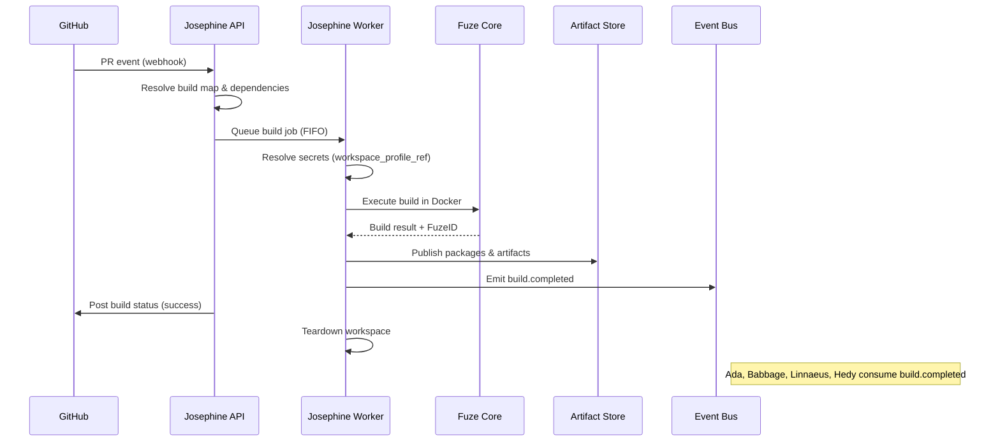
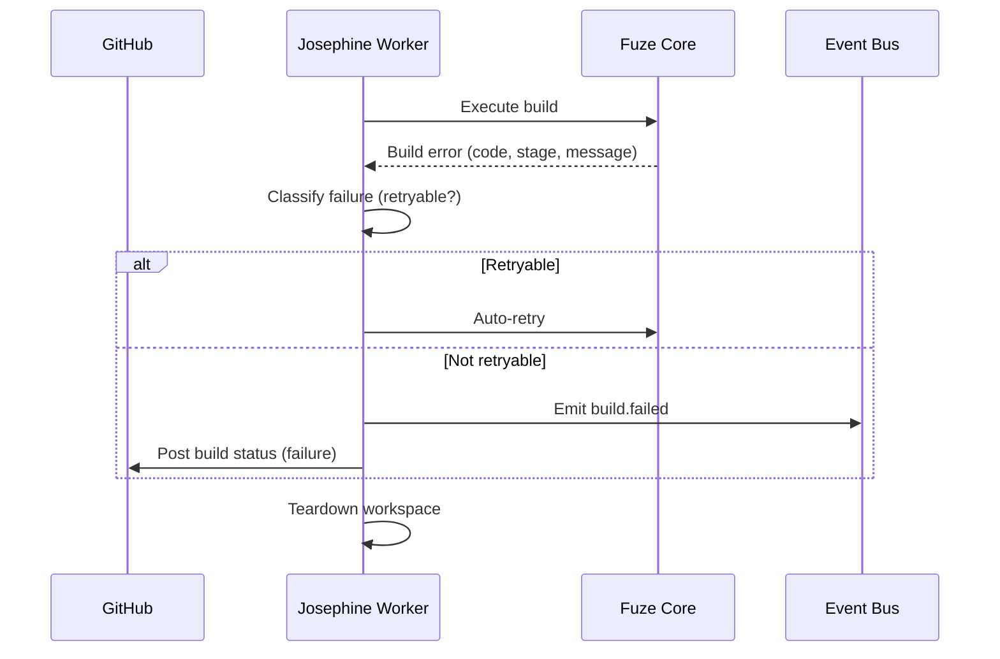

# Josephine Build Agent Plan

## Summary
Josephine should be an internal API-driven build service built on top of a reusable `fuze` core. Its v1 job is to run `fuze`-compatible build and packaging workflows in a hosted environment while preserving existing build maps, package semantics, FuzeID behavior, and Fuze-compatible metadata and artifact lineage.

Josephine is not a replacement for ATF, release promotion, or Jira/Bamboo workflow ownership in v1. It is the hosted build/package execution layer.

## Product definition
### Goal
- Accept build jobs through an API.
- Execute those jobs on dedicated workers.
- Publish packages, logs, and provenance in a way existing Fuze consumers can still use.
- Preserve compatibility with current `fuze` build maps and core workflows.

### Non-goals for v1
- Running ATF as part of Josephine jobs.
- Owning release promotion workflows.
- Replacing local developer CLI workflows.
- Introducing a brand new metadata model as the primary source of truth.

### V1 shape
- `josephine-api`: accepts jobs, exposes status, events, artifacts, and control operations.
- `josephine-worker`: executes queued jobs using the extracted `fuze` core.
- `fuze` CLI remains available and should be moved onto the same extracted core for compatibility.

## Triggering model
- Josephine should run as an always-on API, scheduler, and worker control plane.
- Normal work should start from build-job submission APIs or upstream repository/build trigger events routed into Josephine.
- Humans should be able to submit, retry, cancel, and inspect jobs directly through controlled APIs or admin tools.

## Architecture
### Core design
Refactor `fuze` from a monolithic CLI into instantiable library components that Josephine can call directly.

Required core components:
- `BuildSession`
- `BuildRequest`
- `BuildRunner`
- `DependencyResolver`
- `PackagePublisher`
- `MetadataRecorder`

Required core interfaces:
- `Executor`: `DockerExecutor`, later `LocalExecutor`
- `ArtifactStore`
- `MetadataStore`
- `RepoSource`
- `SecretProvider`
- `EventSink`

Core requirements:
- preserve existing build-map behavior, dependency resolution, package naming, CBE semantics, and FuzeID rules
- remove singleton-only orchestration from hosted execution paths
- remove interactive prompts from library mode
- isolate AWS-specific behavior behind adapters rather than embedding it in core execution flow

### Execution topology
- Run `josephine-api` on normal internal service infrastructure.
- Do not execute builds inside the API process.
- Run build jobs on dedicated Linux worker hosts with local Docker access.
- For each job, create an isolated ephemeral workspace on the worker, clone or fetch the repo, execute the `fuze` core, publish artifacts and metadata, then tear the workspace down.
- Keep actual build commands inside the existing `fuze` Docker/CBE model. The worker host schedules the build; the CBE remains the build environment.
- Do not use developer laptops, long-lived shared workspaces, or the API container as default execution targets.
- Treat host-native execution as an exception path for non-containerizable toolchains only. If needed later, implement it as a separate worker class such as `host-toolchain-worker`. Default v1 worker class is `docker-worker`.

### Queueing and scheduling
- Put an explicit asynchronous queue between API and workers.
- Persist job states so jobs survive API or worker restarts.
- Default scheduling policy is FIFO within each worker class.
- Default worker concurrency is one active build per worker host.
- Route jobs based on normalized execution requirements from `BuildRequest`, including executor type, repo access profile, and runtime constraints.
- Use separate routing keys or queues for `docker-worker` and any future `host-toolchain-worker`.
- Add leases and heartbeats so stuck workers can be detected.
- Allow automatic retry only for bounded transient infrastructure failures.
- Do not auto-retry deterministic failures such as invalid build maps, dependency resolution failures, or reproducible build errors.

## Public API and contracts
### API surface
- `POST /v1/build-jobs`
  - request: `repo_url`, `git_ref`, `build_map_path`, `targets[]`, `packages[]`, `publish_mode` (`none|add|update`), `workspace_profile_ref`, `variables{}`, `labels{}`
  - response: `job_id`, `status`, `submitted_at`
- `GET /v1/build-jobs/{job_id}`
  - returns job state, resolved repo ref, FuzeID if assigned, artifact summary, and failure details
- `GET /v1/build-jobs/{job_id}/events`
  - returns ordered structured events from queue through completion
- `GET /v1/build-jobs/{job_id}/artifacts`
  - returns packages, logs, and provenance references using the existing Fuze-compatible metadata model
- API/admin controls should also support cancellation, retry, worker health, queue health, and draining a worker for maintenance

### Internal contracts
- `BuildRequest`: normalized request used by scheduler and worker
- `BuildResult`: `status`, `fuze_id`, `packages[]`, `metadata_record_keys[]`, `logs_ref`
- `FailureResult`: machine-readable `code`, `stage`, `message`, optional `retryable`

## Security and operations
### Secrets and access
- Do not store raw credentials, SSH private keys, or long-lived tokens in build requests, build maps, or logs.
- Resolve `workspace_profile_ref` into runtime credentials inside the worker through `SecretProvider`.
- Materialize secrets only for the lifetime of the job and remove them during teardown.
- Scope repo, artifact, and metadata credentials separately.
- Keep control-plane credentials unavailable to the build runtime.
- Prefer short-lived per-job credentials.
- Require explicit allowlisting before enabling host-native execution.

### Worker isolation
- Each job must run in an isolated workspace with no shared mutable checkout, shared secret files, or shared home directory across jobs.
- Restrict default network access from build execution to required source, dependency, artifact, and metadata endpoints plus explicitly approved build-time external services.
- Treat source under build as untrusted input. Do not expose broad worker-host credentials to build containers.

### Observability and controls
- Emit structured logs from API, scheduler, and workers with stable fields such as `job_id`, `worker_id`, `repo_url`, `git_ref`, `build_map_path`, `fuze_id`, `stage`, and `attempt`.
- Publish stage-level structured events so live status does not depend on parsing raw stdout.
- Store build stdout and stderr as job artifacts.
- Collect metrics for queue depth, queue age, job latency, execution time, success/failure/cancellation counts, worker utilization, heartbeat freshness, Docker/CBE startup failures, artifact upload latency, and metadata write latency.
- Alert on queue backlog, expired heartbeats, repeated worker or CBE startup failures, repeated artifact publication failures, and elevated failure rates for a repo or build map.
- Support cancellation for queued and running jobs, and ensure every cancelled job reaches a clear terminal state.
- If a worker heartbeat expires before execution starts, re-queue or fail according to retry policy.
- If a heartbeat expires during execution, mark the job failed as infrastructure loss unless safe resumption is explicitly supported.
- Verify teardown after every terminal state so containers, temp files, mounts, and secrets are not left behind.

## Fuze changes required
- Extract hosted build logic from [fuze.py](/Users/johnmacdonald/code/cornelis/fuze/fuze.py) into reusable library entrypoints.
- Extract build execution concerns from [build.py](/Users/johnmacdonald/code/cornelis/fuze/build.py) behind executor, artifact, metadata, and repo interfaces.
- Reduce or remove dependence on the current singleton/global process state.
- Replace interactive dirty-repo prompts with explicit policy:
  - hosted Josephine jobs fail hard on dirty repo state
  - local CLI may allow explicit local or unsafe operation
- Replace thread-based plugin side effects from [plugin.py](/Users/johnmacdonald/code/cornelis/fuze/plugin.py) with event sinks or explicit integrations where hosted behavior is needed.
- Standardize structured stage logging and timing.
- Add a parity harness so a legacy CLI run and a Josephine-driven run can be compared on metadata and package outputs.

## Diagrams

### PR Build Flow

### Build Failure Flow

## Decision Logging & Audit Trail

Every action this agent takes is logged with full context. For decisions, the complete decision tree is recorded — what options were considered, what data was evaluated, and why the chosen path was selected.

| Log Type | What Is Captured | Example |
|----------|-----------------|---------|
| **Action log** | Every API call, event consumed, event emitted, external system interaction. Timestamped with correlation_id and agent_id. | `action=emit_event, event_type=build.completed, build_id=BLD-1234, correlation_id=abc-123` |
| **Decision log** | The full decision tree: inputs evaluated, rules applied, alternatives considered, chosen outcome, and rationale. | `decision=select_test_plan, trigger=PR, inputs=[branch=feature/x, module=opx-core], candidates=[quick_smoke, pr_standard], selected=pr_standard, reason="PR trigger + no HIL changes"` |
| **Rejection log** | When an action is rejected or blocked — what was attempted, what rule prevented it, what the agent did instead. | `decision=promote_release, attempted=sit_to_qa, blocked_by=failing_test_TES-456, action=hold_and_notify` |

All logs are stored in PostgreSQL (audit table) and streamed to Grafana/Loki. Decision logs are queryable by correlation_id, agent_id, decision type, and time range.

## Tool Use & Token Efficiency

This agent prioritizes **deterministic tools** over LLM inference wherever possible. LLM calls are reserved for tasks that genuinely require reasoning, generation, or ambiguity resolution.

| Principle | Implementation |
|-----------|---------------|
| **Deterministic first** | Policy lookups, schema validation, event routing, suite selection, version mapping, and traceability queries all use deterministic code paths. No tokens spent on work that has a known algorithm. |
| **Custom tooling** | The agent platform builds and maintains its own tool library. When a pattern repeats, it becomes a tool. Agents can also generate new tools for themselves when they identify repeated LLM-heavy patterns. |
| **Token-aware execution** | Every LLM call logs input tokens, output tokens, model used, and cost. The agent selects the smallest capable model for each task. |
| **Caching** | LLM responses for identical inputs are cached (Redis). Repeated queries hit cache instead of burning tokens. |

### Token Tracking

All token usage is logged to PostgreSQL and accumulates per agent, per day, per operation type.

| Metric | Tracked | Queryable By |
|--------|---------|-------------|
| **Per-call tokens** | input_tokens, output_tokens, model, latency_ms, cost_usd | correlation_id, agent_id, timestamp |
| **Cumulative totals** | total_input_tokens, total_output_tokens, total_cost_usd | agent_id, date range, operation type |
| **Efficiency ratio** | deterministic_actions / total_actions (target: >80%) | agent_id, date range |

## Standard Commands

Every agent responds to these standard commands in its Teams channel and via REST API.

| Command | What It Returns |
|---------|----------------|
| `/token-status` | Token usage summary: today's input/output tokens, cumulative totals, cost, efficiency ratio, comparison to 7-day average. |
| `/decision-tree` | The last N decisions made by this agent, each showing: timestamp, decision type, inputs evaluated, candidates considered, selected outcome, and rationale. |
| `/why {decision-id}` | Deep dive into a specific decision: full decision tree, all inputs, every rule evaluated, alternatives rejected and why, final rationale with links to source data. |
| `/stats` | Operational statistics: uptime, total actions today/this week/this month, success/failure rates, average latency, queue depth, active jobs, error rate trend. |
| `/work-today` | Summary of today's work: number of jobs processed, key outcomes, notable decisions, any failures or blocked items. |
| `/busy` | Current load: active jobs, queue depth, estimated drain time. Status: idle / working / busy / overloaded. |

All commands also work via the agent's REST API (e.g., `GET /v1/status/tokens`, `GET /v1/status/decisions`, `GET /v1/status/stats`).

## Teams Channel Interface

This agent has a dedicated **Microsoft Teams channel** (`#agent-{name}`) in the "Agent Workforce" team. This is the primary human interface. This channel is managed by **[Shannon](SHANNON_COMMUNICATIONS_AGENT_PLAN.md)**, the communications service agent.

| Function | How It Works |
|----------|-------------|
| **Activity feed** | The agent posts a summary of every significant action. Engineers follow along in real time. |
| **Decision notifications** | Non-trivial decisions are posted with rationale. Engineers can review and challenge. |
| **Approval requests** | When human approval is required, the agent posts an Adaptive Card with approve/reject buttons. |
| **Input requests** | When the agent needs information it cannot determine automatically, it posts a structured request. Engineers reply in-thread. |
| **Error alerts** | Failures and anomalies posted with severity and suggested actions. Critical alerts @mention the relevant team. |
| **Status queries** | Engineers can ask for status by posting in the channel. The agent responds in-thread. |

## Phased roadmap
### Phase 1. Extract the `fuze` core
- Refactor `fuze` build execution into instantiable library components.
- Preserve current behavior for build maps, dependencies, packages, CBE execution, and metadata.
- Move the existing CLI onto the new core instead of replacing it.

Exit criteria:
- legacy CLI still runs supported build/package flows
- library entrypoint can execute a build request programmatically
- no interactive prompts in hosted/library mode
- parity harness exists for at least one build map

### Phase 2. Build Josephine API and worker
- Implement the API, queue integration, worker, job state store, and structured event model.
- Run jobs on dedicated Linux Docker-capable workers with ephemeral workspaces.
- Implement secret resolution by reference and Fuze-compatible artifact and metadata publication.

Exit criteria:
- API can submit, inspect, cancel, and retry jobs
- worker can complete one full build/package flow end to end
- job state survives restart of API and worker processes

### Phase 3. Prove compatibility on a real product
- Use `atf/build/atf.json` as the first parity target.
- Compare Josephine-driven runs against legacy CLI runs for package outputs, metadata, logs, and failure classification.
- Fix incompatibilities before onboarding more products.

Exit criteria:
- agreed parity checks pass for ATF
- deterministic failure classes are surfaced correctly
- logs and events are sufficient for operational debugging

### Phase 4. Harden security and operations
- Add heartbeats, leases, retries, cancellation, alerting, teardown verification, and operator tooling.
- Lock down worker isolation, secret scope, network policy, and audit records.
- Add retention and stuck-job recovery paths.

Exit criteria:
- worker loss and cancellation paths are tested
- secret lifecycle is validated end to end
- dashboards and alerts exist for production use

### Phase 5. Expand adoption
- Onboard additional build maps and products after ATF parity is stable.
- Move hosted automation consumers toward Josephine APIs and events while keeping Fuze-compatible outputs.
- Reduce dependence on legacy plugin side effects for hosted builds.

Exit criteria:
- multiple products run through Josephine successfully
- legacy CLI remains available for local workflows
- direct monolithic `fuze` orchestration is no longer required for hosted builds

## Test and acceptance plan
### Core parity
- Run `atf/build/atf.json` through legacy CLI and Josephine/core, then compare selected targets, packages, FuzeID behavior, package filenames, dependency flags, and metadata references.

### Dependency behavior
- pinned FuzeID dependency
- latest dependency resolution
- missing dependency failure path

### Executor behavior
- Docker CBE success path
- container startup failure
- artifact pullback and workspace cleanup

### Service behavior
- submit, status, events, artifacts, cancel, and retry endpoints
- restart-safe reads and job recovery
- invalid build map, bad git ref, and missing secret failures

### Operational behavior
- dirty repo policy never prompts in hosted mode
- backend outage returns structured failure
- stuck worker and expired heartbeat behavior
- cancellation and teardown behavior

## Assumptions
- Josephine is internal-only in v1.
- Existing Fuze-compatible metadata and artifact lineage remain the primary source of truth in v1.
- ATF remains a downstream consumer and is not orchestrated by Josephine in v1.
- Existing `workspace.ini` concepts remain supported through `workspace_profile_ref` plus worker-side secret materialization.
- `atf/build/atf.json` is the first migration target before broader rollout.
