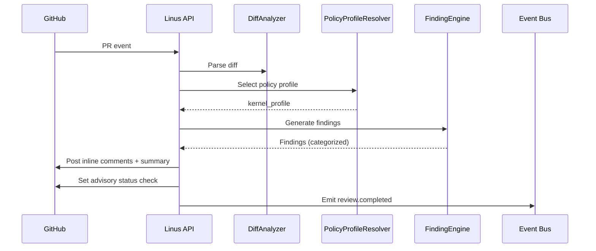
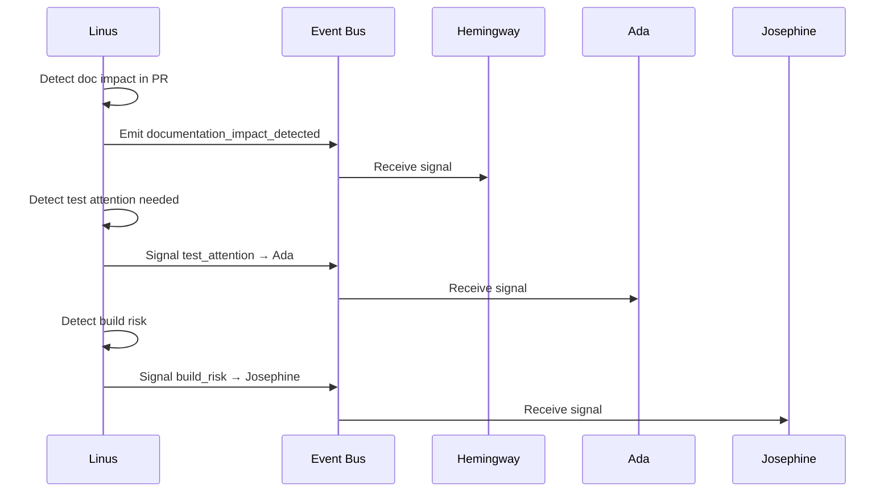

# Linus Code Review Agent Plan

## Summary
Linus should be the code-review agent for the platform. Its v1 job is to evaluate pull requests against code-quality and review-policy rules, produce structured findings, surface likely correctness risks early, and emit clear signals to downstream agents when documentation, build, or test attention is warranted.

Linus should not become a style bot or a generic lint wrapper. It should focus on high-signal review findings tied to correctness, maintainability, and policy.

## Namesake

Linus is named for Linus Torvalds, the creator of Linux and Git, two foundational systems shaped by practical engineering judgment, code review, and change control at scale. We use his name for the code-review agent because Linus is about evaluating changes rigorously, surfacing real risk early, and keeping the codebase healthy as it evolves.

## Product definition
### Goal
- consume GitHub pull request events and diff context
- evaluate code changes against review-policy profiles
- produce structured findings, inline comments, and review summaries
- emit documentation-impact and test/build risk signals when warranted
- keep review output auditable, bounded, and useful to engineers

### Non-goals for v1
- replacing human reviewers
- automatic merge approval for non-trivial pull requests
- replacing compiler, static-analysis, or test tooling already owned elsewhere
- enforcing low-value style rules that are better handled by formatters or linters

### Position in the system
- GitHub is the source of truth for PR state and review state
- Linus evaluates code and policy risk in the PR
- Josephine may consume build-relevant risk signals
- Ada may consume test-scope hints from review findings
- Hemingway may consume documentation-impact signals
- humans remain the approval authority for consequential merges

## Triggering model
- Linus should run as an always-on review service attached to GitHub PR flow.
- Normal work should start from pull request open, update, sync, and review-request events.
- Humans should be able to re-run reviews and apply justified suppressions or overrides under policy.

## Architecture
### Core design
Linus should be split into these concerns:
- `DiffAnalyzer`: normalizes PR diffs, changed files, and review context
- `PolicyProfileResolver`: selects the appropriate review profile by repo, path, language, and branch context
- `FindingEngine`: detects correctness, safety, maintainability, and policy issues
- `ReviewPublisher`: emits structured findings and inline review comments
- `ImpactSignalEmitter`: emits documentation, build, and test impact signals for other agents

Required internal objects:
- `ReviewRequest`
- `ReviewFinding`
- `ReviewSummary`
- `PolicyProfile`
- `ReviewImpactRecord`

### Review grounding
Linus should be grounded in the review types already defined in the shared spec:
- kernel compliance
- embedded C/C++ best practices
- Python utility review

V1 should also respect repository-local conventions and file ownership boundaries where they exist rather than imposing one global standard.

## Diagrams

### PR Review Flow

### Cross-Agent Impact Signals

## Review model
### Inputs
- GitHub PR opened, updated, synchronized, and review-requested events
- repository, branch, commit, and diff metadata
- policy profile selection inputs
- optional prior review history on the PR
- optional build/test/doc context from Josephine, Ada, or Hemingway for re-review enrichment

### Outputs
Linus should produce:
- structured review findings
- inline comments
- summarized review verdicts
- policy-failure signals
- documentation-impact signals
- test/build concern signals

### Review categories
V1 should explicitly support:
- `correctness_risk`
- `safety_risk`
- `concurrency_risk`
- `maintainability_risk`
- `policy_violation`
- `documentation_impact`
- `test_attention_needed`

### Review rules
- findings should prioritize likely bugs, regressions, and dangerous assumptions over style
- every finding should cite the code location, rule or reasoning, and severity
- uncertain findings should be marked as low-confidence, not stated as fact
- review output should be path-aware and language-aware
- low-signal bulk commenting should be suppressed
- documentation-impact findings should be emitted separately so Hemingway can consume them cleanly

## Public API and contracts
### API surface
- `POST /v1/reviews/pr`
  - input: repo, PR number, policy profile or auto-select
  - output: `ReviewSummary`
- `GET /v1/reviews/pr/{repo}/{pr_number}`
  - return current review summary and structured findings
- `GET /v1/reviews/pr/{repo}/{pr_number}/findings`
  - return detailed findings and inline comment payloads
- `POST /v1/reviews/pr/{repo}/{pr_number}/publish`
  - publish review comments or summary status to GitHub under policy

### Internal contracts
- `ReviewRequest`
- `ReviewFinding`
- `ReviewSummary`
- `PolicyProfile`
- `ReviewImpactRecord`

## Policy profiles
### Initial policy set
- `kernel_profile`
  - kernel coding style
  - upstream compatibility concerns
  - API misuse or unsafe patterns
- `embedded_cpp_profile`
  - memory-safety concerns
  - concurrency and state-management risks
  - error-handling and boundary-condition issues
- `python_utility_profile`
  - script correctness
  - failure handling
  - maintainability and unsafe scripting patterns

### Policy behavior
- profiles should be composable by path or component
- repositories should be able to tune severity and suppressions
- suppressions must remain explicit and auditable

## GitHub integration stance
Linus should integrate directly with PR review flow.

Allowed v1 write-backs:
- inline review comments
- PR review summaries
- advisory status checks

Not v1 write-backs:
- force-merge or auto-merge on Linus output alone
- silent closure of findings
- mutation of branch protection rules

## Observability and operations
### Structured events
Emit:
- `review.started`
- `review.completed`
- `review.policy_failed`
- `review.documentation_impact_detected`
- `review.test_attention_detected`

### Metrics
Collect:
- review latency by repo and profile
- finding count by severity and category
- finding acceptance or dismissal rate
- repeat finding rate by repository area
- percentage of PRs with documentation-impact or test-attention signals

### Operator controls
- re-run a review for a PR or commit range
- suppress a finding with justification
- adjust profile selection for a repository scope
- inspect rule and evidence backing any finding

## Security and approvals
- read access to repository contents, diffs, and PR metadata is required
- write-back to GitHub should be limited to review comments and status signals
- suppressions and overrides must be attributable
- no auto-approval for sensitive repos or protected branches without explicit policy
- review records and finding history should remain auditable

## Platform changes required
Linus will be stronger if the platform exposes cleaner review inputs and outputs.

### 1. Canonical PR event schema
Normalize:
- repo
- PR number
- base and head commit SHAs
- changed files
- author
- requested reviewers

### 2. Shared source-reference model
Use a common record shape for file path, line, commit, and PR references so Linus, Hemingway, and Linnaeus speak the same language.

### 3. Review-result schema
Publish machine-readable review findings with:
- severity
- category
- file and line
- confidence
- explanation
- recommended follow-up

### 4. Review-to-agent handoff events
Emit explicit downstream signals for:
- documentation impact to Hemingway
- test attention to Ada
- build-risk hints to Josephine when the PR touches build-critical areas

## Decision Logging & Audit Trail

Every action this agent takes is logged with full context. For decisions, the complete decision tree is recorded — what options were considered, what data was evaluated, and why the chosen path was selected.

| Log Type | What Is Captured | Example |
|----------|-----------------|---------|
| **Action log** | Every API call, event consumed, event emitted, external system interaction. Timestamped with correlation_id and agent_id. | `action=emit_event, event_type=build.completed, build_id=BLD-1234, correlation_id=abc-123` |
| **Decision log** | The full decision tree: inputs evaluated, rules applied, alternatives considered, chosen outcome, and rationale. | `decision=select_test_plan, trigger=PR, inputs=[branch=feature/x, module=opx-core], candidates=[quick_smoke, pr_standard], selected=pr_standard, reason="PR trigger + no HIL changes"` |
| **Rejection log** | When an action is rejected or blocked — what was attempted, what rule prevented it, what the agent did instead. | `decision=promote_release, attempted=sit_to_qa, blocked_by=failing_test_TES-456, action=hold_and_notify` |

All logs are stored in PostgreSQL (audit table) and streamed to Grafana/Loki. Decision logs are queryable by correlation_id, agent_id, decision type, and time range.

## Tool Use & Token Efficiency

This agent prioritizes **deterministic tools** over LLM inference wherever possible. LLM calls are reserved for tasks that genuinely require reasoning, generation, or ambiguity resolution.

| Principle | Implementation |
|-----------|---------------|
| **Deterministic first** | Policy lookups, schema validation, event routing, suite selection, version mapping, and traceability queries all use deterministic code paths. No tokens spent on work that has a known algorithm. |
| **Custom tooling** | The agent platform builds and maintains its own tool library. When a pattern repeats, it becomes a tool. Agents can also generate new tools for themselves when they identify repeated LLM-heavy patterns. |
| **Token-aware execution** | Every LLM call logs input tokens, output tokens, model used, and cost. The agent selects the smallest capable model for each task. |
| **Caching** | LLM responses for identical inputs are cached (Redis). Repeated queries hit cache instead of burning tokens. |

### Token Tracking

All token usage is logged to PostgreSQL and accumulates per agent, per day, per operation type.

| Metric | Tracked | Queryable By |
|--------|---------|-------------|
| **Per-call tokens** | input_tokens, output_tokens, model, latency_ms, cost_usd | correlation_id, agent_id, timestamp |
| **Cumulative totals** | total_input_tokens, total_output_tokens, total_cost_usd | agent_id, date range, operation type |
| **Efficiency ratio** | deterministic_actions / total_actions (target: >80%) | agent_id, date range |

## Standard Commands

Every agent responds to these standard commands in its Teams channel and via REST API.

| Command | What It Returns |
|---------|----------------|
| `/token-status` | Token usage summary: today's input/output tokens, cumulative totals, cost, efficiency ratio, comparison to 7-day average. |
| `/decision-tree` | The last N decisions made by this agent, each showing: timestamp, decision type, inputs evaluated, candidates considered, selected outcome, and rationale. |
| `/why {decision-id}` | Deep dive into a specific decision: full decision tree, all inputs, every rule evaluated, alternatives rejected and why, final rationale with links to source data. |
| `/stats` | Operational statistics: uptime, total actions today/this week/this month, success/failure rates, average latency, queue depth, active jobs, error rate trend. |
| `/work-today` | Summary of today's work: number of jobs processed, key outcomes, notable decisions, any failures or blocked items. |
| `/busy` | Current load: active jobs, queue depth, estimated drain time. Status: idle / working / busy / overloaded. |

All commands also work via the agent's REST API (e.g., `GET /v1/status/tokens`, `GET /v1/status/decisions`, `GET /v1/status/stats`).

## Teams Channel Interface

This agent has a dedicated **Microsoft Teams channel** (`#agent-{name}`) in the "Agent Workforce" team. This is the primary human interface. This channel is managed by **[Shannon](SHANNON_COMMUNICATIONS_AGENT_PLAN.md)**, the communications service agent.

| Function | How It Works |
|----------|-------------|
| **Activity feed** | The agent posts a summary of every significant action. Engineers follow along in real time. |
| **Decision notifications** | Non-trivial decisions are posted with rationale. Engineers can review and challenge. |
| **Approval requests** | When human approval is required, the agent posts an Adaptive Card with approve/reject buttons. |
| **Input requests** | When the agent needs information it cannot determine automatically, it posts a structured request. Engineers reply in-thread. |
| **Error alerts** | Failures and anomalies posted with severity and suggested actions. Critical alerts @mention the relevant team. |
| **Status queries** | Engineers can ask for status by posting in the channel. The agent responds in-thread. |

## Phased roadmap
### Phase 1. Structured PR review
- ingest PR events
- analyze diffs using initial policy profiles
- publish structured findings and summaries

Exit criteria:
- Linus can review a PR and produce useful structured findings
- findings are queryable and attributable to exact code locations

### Phase 2. GitHub review integration
- add inline comment publishing and advisory status checks
- support bounded suppressions and re-runs

Exit criteria:
- review output can appear in normal PR workflow
- noise remains bounded enough for engineers to tolerate it

### Phase 3. Cross-agent impact signals
- emit documentation-impact, test-attention, and build-risk signals
- connect review results to Hemingway, Ada, and Josephine

Exit criteria:
- downstream agents can consume Linus outputs without parsing prose
- review findings influence follow-on work where appropriate

### Phase 4. Repository tuning and hardening
- support repo-specific profiles and suppression policy
- improve confidence scoring and repeated-finding management

Exit criteria:
- high-value findings remain prominent
- repeated false positives are controlled without losing auditability

## Test and acceptance plan
### Review behavior
- PR with clear correctness risk produces a finding
- low-confidence heuristic remains marked as uncertain
- trivial style-only diffs do not generate noisy findings

### GitHub behavior
- inline comments map to the correct file and location
- repeated review runs do not duplicate unchanged comments unnecessarily
- advisory status reflects policy failures accurately

### Cross-agent behavior
- documentation-impact finding emits a clean signal to Hemingway
- test-attention finding emits a clean signal to Ada
- build-critical change can emit a bounded signal to Josephine

### Operational behavior
- suppression remains auditable
- re-runs are stable for unchanged inputs
- review history remains queryable by PR and commit

## Assumptions
- GitHub remains the authoritative PR and review system
- humans retain merge authority in v1
- existing linters and static-analysis tools remain useful adjuncts rather than being replaced
- review quality matters more than review volume
