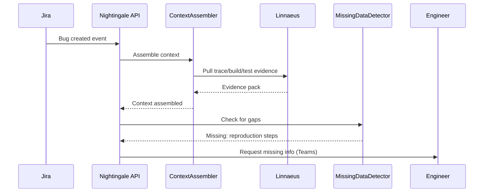
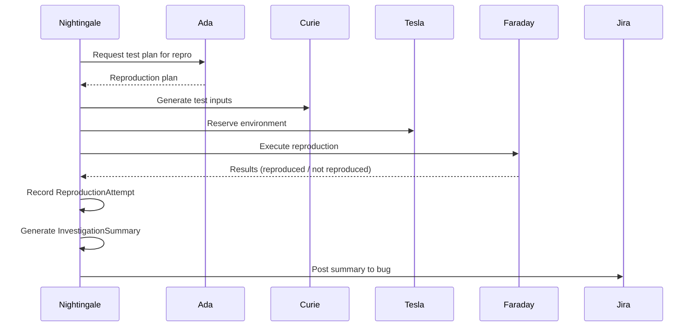

# Nightingale Bug Triage, Analysis, and Reproduction Plan

## Summary
Nightingale should be the bug-investigation agent for the platform. Its v1 job is to react to Jira bug reports, qualify the report, assemble technical context, determine whether the issue is reproducible, and coordinate targeted reproduction work until the bug is either reproduced, blocked on missing data, or clearly triaged for humans.

Nightingale should not replace Jira workflow ownership, release decisions, or traceability ownership. It should turn vague bug reports into actionable technical evidence.

## Product definition
### Goal
- react quickly to new or updated Jira bug reports
- gather build, test, release, and traceability context for the reported issue
- identify missing information and request it explicitly
- create and drive targeted reproduction attempts
- produce durable investigation records, failure signatures, and reproduction status

### Non-goals for v1
- replacing Drucker as Jira workflow owner
- replacing Linnaeus as traceability owner
- replacing Faraday as the test execution agent
- making final severity, customer, or release-policy decisions without human review
- claiming a root cause when only a reproduction has been established

### Position in the system
- Jira remains the source of truth for bug workflow
- Drucker keeps the issue operationally coherent in Jira
- Linnaeus supplies build, test, and release relationships
- Ada, Curie, Faraday, and Tesla provide the test planning and execution spine for reproduction attempts
- Hedy consumes bug investigation outcomes when release risk is affected
- Nightingale owns the investigation loop from intake through reproduction evidence

## Triggering model
- Nightingale should run as an always-on investigation service.
- Normal work should start from new bug reports, relevant Jira updates, reopen events, or explicit reproduction requests.
- Humans should be able to escalate a bug for deeper analysis, approve costly reproduction work, and close or redirect an investigation when policy requires it.

## Architecture
### Core design
Nightingale should be split into these concerns:
- `BugIntakeNormalizer`: turns Jira issues into normalized investigation requests
- `ContextAssembler`: gathers build, test, release, and environment context from Linnaeus, Josephine, Faraday, Hedy, and Babbage
- `MissingDataDetector`: identifies absent logs, build IDs, reproduction steps, hardware scope, or environment details
- `ReproductionPlanner`: decides whether the issue can be reproduced from existing evidence or needs a targeted repro attempt
- `ReproductionCoordinator`: requests targeted planning and execution through Ada, Curie, Faraday, and Tesla
- `InvestigationSummarizer`: records findings, failure signatures, confidence, and next steps

Required internal objects:
- `BugInvestigationRequest`
- `BugInvestigationRecord`
- `FailureSignatureRecord`
- `ReproductionAttempt`
- `InvestigationSummary`

## Investigation model
### Inputs
- Jira bug create, update, and reopen events
- issue fields, comments, attachments, and reproduction notes
- traceability context from Linnaeus
- build and artifact context from Josephine
- prior test execution evidence from Faraday
- release and version context from Hedy and Babbage
- workflow hygiene context from Drucker

### Outputs
Nightingale should produce:
- investigation status records
- missing-information requests
- reproduction-attempt requests
- failure signature and clustering hints
- release-risk and test-gap signals
- human-readable investigation summaries

### Investigation rules
- never claim reproduction without a durable reproduction record
- separate observed facts, inferred hypotheses, and recommended next steps
- prefer exact build/test context over generic “latest build” assumptions
- ask for missing information explicitly rather than silently guessing
- record when a bug is not yet reproducible versus disproven
- keep reproduction evidence linked to exact builds, environments, and runs

## Integration boundaries
### With Drucker
- Drucker owns Jira workflow state, routing, and hygiene
- Nightingale can recommend or request Jira updates, but should not own general ticket workflow

### With Linnaeus
- Linnaeus owns relationship truth
- Nightingale consumes those relationships and may propose new evidence links when an investigation produces them

### With Ada, Curie, Faraday, and Tesla
- Ada selects targeted repro test plans
- Curie materializes repro inputs
- Tesla provides the right environment reservation
- Faraday executes the repro run
- Nightingale coordinates and interprets that loop rather than replacing it

### With Hedy
- Hedy consumes validated bug impact when release risk is affected
- Nightingale does not decide release policy, but it should provide evidence Hedy can act on

## Public API and contracts
### API surface
- `POST /v1/bugs/investigate`
  - input: Jira key, investigation scope, policy profile
  - output: `BugInvestigationRecord`
- `GET /v1/bugs/{jira_key}`
  - return current investigation status, missing data, and linked evidence
- `POST /v1/bugs/{jira_key}/reproduce`
  - request or re-request a targeted reproduction attempt
- `GET /v1/bugs/{jira_key}/attempts`
  - return reproduction attempts and outcomes
- `POST /v1/bugs/{jira_key}/summarize`
  - produce an investigation summary for humans

### Internal contracts
- `BugInvestigationRequest`
- `BugInvestigationRecord`
- `FailureSignatureRecord`
- `ReproductionAttempt`
- `InvestigationSummary`

## Observability and operations
### Structured events
Emit:
- `bug.investigation_started`
- `bug.missing_data_detected`
- `bug.reproduction_requested`
- `bug.reproduced`
- `bug.investigation_summarized`

### Metrics
Collect:
- time from Jira report to first technical triage
- percent of bugs with sufficient reproduction data
- reproduction success rate
- mean time to first reproduction attempt
- percent of investigations blocked on missing information

### Operator controls
- escalate investigation priority
- approve expensive or scarce-environment reproduction attempts
- mark a finding as accepted, rejected, or inconclusive
- suppress duplicate investigations where clustering is strong

## Security and approvals
- Nightingale needs read access to Jira issue content, attached evidence, build records, test records, and traceability records
- write-back to Jira should be limited to investigation comments, missing-data requests, and evidence links in v1
- costly or customer-sensitive reproduction attempts should require explicit approval where policy requires it
- all investigation actions and summaries must be auditable

## Platform changes required
Nightingale will be stronger if the platform exposes cleaner investigation inputs.

### 1. Stable bug event schema
Normalize Jira bug events so Nightingale can react to:
- new bug creation
- major field changes
- reopen events
- new evidence attachments

### 2. Investigation-friendly trace queries
Linnaeus should provide fast lookups from Jira bug to:
- exact builds
- prior test runs
- release context
- version mappings

### 3. Reproduction request handoff
Provide an explicit handoff path from Nightingale into Ada and Faraday so reproduction work is first-class rather than improvised.

### 4. Failure signature model
Create a reusable failure-signature record so similar bugs can be clustered without overwriting individual issue truth.

## Diagrams

### Bug Investigation

### Reproduction Flow

## Decision Logging & Audit Trail

Every action this agent takes is logged with full context. For decisions, the complete decision tree is recorded — what options were considered, what data was evaluated, and why the chosen path was selected.

| Log Type | What Is Captured | Example |
|----------|-----------------|---------|
| **Action log** | Every API call, event consumed, event emitted, external system interaction. Timestamped with correlation_id and agent_id. | `action=emit_event, event_type=build.completed, build_id=BLD-1234, correlation_id=abc-123` |
| **Decision log** | The full decision tree: inputs evaluated, rules applied, alternatives considered, chosen outcome, and rationale. | `decision=select_test_plan, trigger=PR, inputs=[branch=feature/x, module=opx-core], candidates=[quick_smoke, pr_standard], selected=pr_standard, reason="PR trigger + no HIL changes"` |
| **Rejection log** | When an action is rejected or blocked — what was attempted, what rule prevented it, what the agent did instead. | `decision=promote_release, attempted=sit_to_qa, blocked_by=failing_test_TES-456, action=hold_and_notify` |

All logs are stored in PostgreSQL (audit table) and streamed to Grafana/Loki. Decision logs are queryable by correlation_id, agent_id, decision type, and time range.

## Tool Use & Token Efficiency

This agent prioritizes **deterministic tools** over LLM inference wherever possible. LLM calls are reserved for tasks that genuinely require reasoning, generation, or ambiguity resolution.

| Principle | Implementation |
|-----------|---------------|
| **Deterministic first** | Policy lookups, schema validation, event routing, suite selection, version mapping, and traceability queries all use deterministic code paths. No tokens spent on work that has a known algorithm. |
| **Custom tooling** | The agent platform builds and maintains its own tool library. When a pattern repeats, it becomes a tool. Agents can also generate new tools for themselves when they identify repeated LLM-heavy patterns. |
| **Token-aware execution** | Every LLM call logs input tokens, output tokens, model used, and cost. The agent selects the smallest capable model for each task. |
| **Caching** | LLM responses for identical inputs are cached (Redis). Repeated queries hit cache instead of burning tokens. |

### Token Tracking

All token usage is logged to PostgreSQL and accumulates per agent, per day, per operation type.

| Metric | Tracked | Queryable By |
|--------|---------|-------------|
| **Per-call tokens** | input_tokens, output_tokens, model, latency_ms, cost_usd | correlation_id, agent_id, timestamp |
| **Cumulative totals** | total_input_tokens, total_output_tokens, total_cost_usd | agent_id, date range, operation type |
| **Efficiency ratio** | deterministic_actions / total_actions (target: >80%) | agent_id, date range |

## Standard Commands

Every agent responds to these standard commands in its Teams channel and via REST API.

| Command | What It Returns |
|---------|----------------|
| `/token-status` | Token usage summary: today's input/output tokens, cumulative totals, cost, efficiency ratio, comparison to 7-day average. |
| `/decision-tree` | The last N decisions made by this agent, each showing: timestamp, decision type, inputs evaluated, candidates considered, selected outcome, and rationale. |
| `/why {decision-id}` | Deep dive into a specific decision: full decision tree, all inputs, every rule evaluated, alternatives rejected and why, final rationale with links to source data. |
| `/stats` | Operational statistics: uptime, total actions today/this week/this month, success/failure rates, average latency, queue depth, active jobs, error rate trend. |
| `/work-today` | Summary of today's work: number of jobs processed, key outcomes, notable decisions, any failures or blocked items. |
| `/busy` | Current load: active jobs, queue depth, estimated drain time. Status: idle / working / busy / overloaded. |

All commands also work via the agent's REST API (e.g., `GET /v1/status/tokens`, `GET /v1/status/decisions`, `GET /v1/status/stats`).

## Teams Channel Interface

This agent has a dedicated **Microsoft Teams channel** (`#agent-{name}`) in the "Agent Workforce" team. This is the primary human interface. This channel is managed by **[Shannon](SHANNON_COMMUNICATIONS_AGENT_PLAN.md)**, the communications service agent.

| Function | How It Works |
|----------|-------------|
| **Activity feed** | The agent posts a summary of every significant action. Engineers follow along in real time. |
| **Decision notifications** | Non-trivial decisions are posted with rationale. Engineers can review and challenge. |
| **Approval requests** | When human approval is required, the agent posts an Adaptive Card with approve/reject buttons. |
| **Input requests** | When the agent needs information it cannot determine automatically, it posts a structured request. Engineers reply in-thread. |
| **Error alerts** | Failures and anomalies posted with severity and suggested actions. Critical alerts @mention the relevant team. |
| **Status queries** | Engineers can ask for status by posting in the channel. The agent responds in-thread. |

## Phased roadmap
### Phase 1. Intake and context assembly
- react to new bug reports
- gather build, test, release, and traceability context
- detect missing information

Exit criteria:
- Nightingale can explain what is known and unknown for a new bug
- missing-data requests are explicit and durable

### Phase 2. Targeted reproduction workflow
- request targeted repro planning and execution
- record reproduction attempts and outcomes

Exit criteria:
- Nightingale can drive one full bug reproduction loop through the test stack
- reproduction outcomes are queryable and evidence-linked

### Phase 3. Failure signatures and clustering
- record repeatable failure signatures
- identify likely duplicates or shared failure classes

Exit criteria:
- repeated defects can be grouped without losing issue-level detail
- humans can see probable duplicates and reproduction patterns

### Phase 4. Human decision support
- summarize investigation outcomes for release, delivery, and engineering stakeholders
- emit risk signals to Hedy, Brooks, and Drucker where appropriate

Exit criteria:
- investigation summaries are actionable
- downstream agents can consume bug evidence without scraping Jira comments

## Test and acceptance plan
### Intake behavior
- new Jira bug starts an investigation record
- missing build ID or repro steps are flagged explicitly
- duplicate bug update enriches existing investigation rather than losing history

### Reproduction behavior
- targeted repro request is issued when enough context exists
- unreproducible bug remains marked inconclusive rather than falsely closed
- successful reproduction produces a durable evidence record

### Operational behavior
- investigation summaries stay linked to exact evidence
- repeated bug updates do not fork duplicate investigations unnecessarily
- approvals and escalations remain auditable

## Assumptions
- Jira remains the authoritative bug workflow system
- Drucker, Linnaeus, Ada, Curie, Faraday, and Tesla remain separate agents with their own domain truths
- Nightingale is advisory and evidence-driven in v1, not an autonomous policy actor
