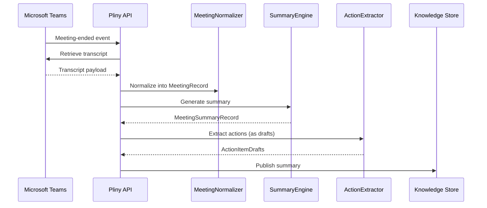
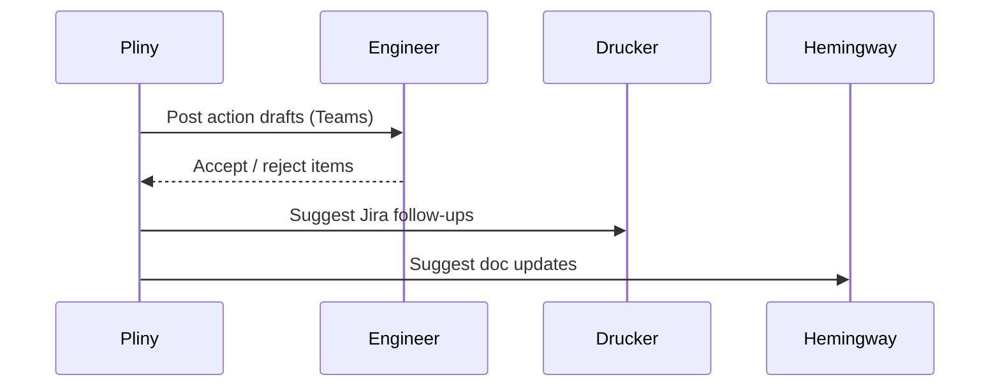

# Pliny Knowledge Capture Agent Plan

## Summary
Pliny should be the knowledge-capture agent for the platform. Its v1 job is to ingest meeting transcripts and metadata, produce structured summaries, extract decisions and action items, and preserve the human rationale that often gets lost between chat, meetings, tickets, and engineering work.

Pliny should not become a generic chatbot for meetings. It should produce durable, reviewable records.

## Namesake

Pliny is named for Pliny the Younger, the Roman lawyer, administrator, and letter-writer whose surviving correspondence preserved events, decisions, and first-hand observations with unusual clarity. We use his name for the knowledge-capture agent because Pliny turns ephemeral meetings into durable records of what happened, what was decided, and what needs follow-up.

## Product definition
### Goal
- detect and ingest Microsoft Teams meeting transcripts and metadata
- generate structured technical summaries
- extract decisions, action items, open questions, and follow-up candidates
- publish durable meeting summary records to an internal knowledge store
- emit structured signals that Drucker, Gantt, Shackleton, Hemingway, and humans can consume

### Non-goals for v1
- replacing Jira as the action-tracking system of record
- replacing Drucker as the Jira workflow owner
- replacing Hemingway as the documentation owner
- automatic ticket creation without approval
- summarizing meetings with no transcript or authorized access path

### Position in the system
- Teams is the transcript and meeting metadata source
- Pliny preserves meeting knowledge and intent
- Drucker may consume action-item suggestions for Jira follow-up
- Gantt and Shackleton may consume decisions and blockers as planning or delivery evidence
- Hemingway may consume meeting-derived clarification or documentation suggestions

## Triggering model
- Pliny should run as an always-on transcript-ingest and summary service.
- Normal work should start from Teams transcript-ready events or explicit ingest and summarize requests.
- Humans should be able to review, publish, redact, or retract meeting summaries and extracted actions.

## Architecture
### Core design
Pliny should be split into these concerns:
- `TranscriptIngestor`: retrieves transcript and meeting metadata from Teams or the transcript store
- `MeetingNormalizer`: converts raw transcript content into a canonical internal form
- `SummaryEngine`: produces structured meeting summaries
- `ActionExtractor`: identifies decisions, actions, owners, deadlines, and unresolved questions
- `PublicationCoordinator`: writes approved summaries to the knowledge store and emits downstream events

Required internal objects:
- `MeetingRecord`
- `TranscriptRecord`
- `MeetingSummaryRecord`
- `ActionItemDraft`
- `DecisionRecord`

### Transcript grounding
Pliny should treat transcript availability as the gating condition for v1:
- transcript-ready events from Teams are the normal trigger
- transcript URI and meeting metadata must be preserved alongside every derived summary
- any generated output must remain linked to the exact transcript source and meeting ID
- if a transcript is partial, delayed, or unauthorized, Pliny should record that state explicitly instead of fabricating a complete summary

## Diagrams

### Meeting Summary Flow

### Action Item Workflow

## Capture model
### Inputs
- Teams transcript-ready events
- transcript text
- meeting metadata such as meeting ID, title, organizer, channel, attendees, and timestamps
- optional topic templates or policy profiles
- optional linked artifact context such as Jira keys, build IDs, or repo references mentioned in meeting metadata

### Outputs
Pliny should produce:
- structured meeting summaries
- decision logs
- action item drafts
- open-question lists
- suggested downstream targets for Jira or documentation

### Extraction rules
- every summary must distinguish fact, decision, action, and unresolved question
- direct quotes should be minimal and only used when needed for precision
- uncertain speaker attribution or ownership should remain marked as uncertain
- action items should remain drafts until accepted by a human or another owning workflow
- references to Jira issues, builds, tests, or releases should be linked only when the identity is explicit or strongly supported

## Publication model
### Primary publication target
V1 should publish to one durable internal meeting-summary store first.

Recommended options:
- an internal repo or docs store
- a dedicated knowledge service
- a record store queried by other agents

### Secondary outputs
Pliny may also emit:
- Jira follow-up suggestions for Drucker or humans
- documentation-update suggestions for Hemingway
- delivery/planning signals for Shackleton and Gantt

### Publication rules
- the canonical record should be the internal meeting summary record, not a Jira comment
- any downstream write-back should be optional, reviewable, and attributable to the meeting summary source
- redaction policy must be applied before publishing outside the authorized summary store

## Public API and contracts
### API surface
- `POST /v1/meetings/ingest`
  - input: `meeting_id`, `transcript_ref`, metadata
  - output: `MeetingRecord`
- `POST /v1/meetings/{meeting_id}/summarize`
  - generate or regenerate a `MeetingSummaryRecord`
- `GET /v1/meetings/{meeting_id}`
  - return raw ingest status, transcript status, and linked summary records
- `GET /v1/meetings/{meeting_id}/summary`
  - return structured summary, decisions, action items, and open questions
- `POST /v1/meetings/{meeting_id}/publish`
  - publish approved outputs to configured targets

### Internal contracts
- `MeetingRecord`
- `TranscriptRecord`
- `MeetingSummaryRecord`
- `ActionItemDraft`
- `DecisionRecord`

## Record model
### Meeting summary structure
Each summary should contain:
- meeting identity and metadata
- short executive summary
- decisions made
- action items with owner/confidence/due-date if known
- open questions
- referenced systems or artifacts
- confidence and completeness notes

### Action item semantics
Action items should include:
- action text
- proposed owner if identifiable
- due date if explicit
- source excerpt reference
- confidence level
- recommended destination such as Jira, docs, or manual follow-up

## Integration boundaries
### With Drucker
- Pliny may suggest Jira follow-up items
- Drucker owns Jira workflow, routing, and field/state changes

### With Gantt and Shackleton
- Pliny provides structured signals about commitments, blockers, and decisions
- Gantt and Shackleton decide whether those signals affect planning or delivery views

### With Hemingway
- Pliny provides documentation-update suggestions and context excerpts
- Hemingway decides what becomes durable product or engineering documentation

### With Berners-Lee
- Pliny may emit references to issues, builds, tests, or releases mentioned in meetings
- Berners-Lee owns durable relationship truth across those systems

## Observability and operations
### Structured events
Emit:
- `meeting.transcript_ingested`
- `meeting.summary_created`
- `meeting.action_items_extracted`
- `meeting.publication_requested`
- `meeting.publication_completed`

### Metrics
Collect:
- transcript ingestion success rate
- summary publication latency
- action-item extraction count
- summary review acceptance rate
- unresolved-owner rate for extracted actions

### Operator controls
- re-run summarization for a meeting
- mark a summary as approved or rejected
- suppress downstream publishing for a meeting
- redact or retract a published summary under policy

## Security and approvals
- transcript access should be scoped to authorized meetings, channels, and users
- summaries may contain sensitive technical or organizational context and should inherit meeting access policy where practical
- downstream publication to Jira, docs, or other broad surfaces should require explicit approval or policy support
- audit transcript access, summary generation, redaction, publication, and retraction actions
- preserve source references without overexposing raw transcript text in broad channels

## Platform changes required
Pliny needs a few platform capabilities to be robust.

### 1. Teams transcript adapter
Provide a stable integration that can:
- detect transcript-ready events
- fetch transcript content and meeting metadata
- handle delayed transcript availability and retry safely

### 2. Canonical meeting schema
Define a shared meeting/transcript record schema with:
- meeting ID
- transcript reference
- organizer and participant metadata
- timestamps
- downstream publication references

### 3. Summary review workflow
Add a lightweight approval model so summaries or action items can be accepted before broad publication or Jira creation.

### 4. Link-friendly artifact detection
Provide shared parsing helpers for Jira keys, build IDs, test IDs, and repo references mentioned in transcript-derived records.

## Decision Logging & Audit Trail

Every action this agent takes is logged with full context. For decisions, the complete decision tree is recorded — what options were considered, what data was evaluated, and why the chosen path was selected.

| Log Type | What Is Captured | Example |
|----------|-----------------|---------|
| **Action log** | Every API call, event consumed, event emitted, external system interaction. Timestamped with correlation_id and agent_id. | `action=emit_event, event_type=build.completed, build_id=BLD-1234, correlation_id=abc-123` |
| **Decision log** | The full decision tree: inputs evaluated, rules applied, alternatives considered, chosen outcome, and rationale. | `decision=select_test_plan, trigger=PR, inputs=[branch=feature/x, module=opx-core], candidates=[quick_smoke, pr_standard], selected=pr_standard, reason="PR trigger + no HIL changes"` |
| **Rejection log** | When an action is rejected or blocked — what was attempted, what rule prevented it, what the agent did instead. | `decision=promote_release, attempted=sit_to_qa, blocked_by=failing_test_TES-456, action=hold_and_notify` |

All logs are stored in PostgreSQL (audit table) and streamed to Grafana/Loki. Decision logs are queryable by correlation_id, agent_id, decision type, and time range.

## Tool Use & Token Efficiency

This agent prioritizes **deterministic tools** over LLM inference wherever possible. LLM calls are reserved for tasks that genuinely require reasoning, generation, or ambiguity resolution.

| Principle | Implementation |
|-----------|---------------|
| **Deterministic first** | Policy lookups, schema validation, event routing, suite selection, version mapping, and traceability queries all use deterministic code paths. No tokens spent on work that has a known algorithm. |
| **Custom tooling** | The agent platform builds and maintains its own tool library. When a pattern repeats, it becomes a tool. Agents can also generate new tools for themselves when they identify repeated LLM-heavy patterns. |
| **Token-aware execution** | Every LLM call logs input tokens, output tokens, model used, and cost. The agent selects the smallest capable model for each task. |
| **Caching** | LLM responses for identical inputs are cached (Redis). Repeated queries hit cache instead of burning tokens. |

### Token Tracking

All token usage is logged to PostgreSQL and accumulates per agent, per day, per operation type.

| Metric | Tracked | Queryable By |
|--------|---------|-------------|
| **Per-call tokens** | input_tokens, output_tokens, model, latency_ms, cost_usd | correlation_id, agent_id, timestamp |
| **Cumulative totals** | total_input_tokens, total_output_tokens, total_cost_usd | agent_id, date range, operation type |
| **Efficiency ratio** | deterministic_actions / total_actions (target: >80%) | agent_id, date range |

## Standard Commands

Every agent responds to these standard commands in its Teams channel and via REST API.

| Command | What It Returns |
|---------|----------------|
| `/token-status` | Token usage summary: today's input/output tokens, cumulative totals, cost, efficiency ratio, comparison to 7-day average. |
| `/decision-tree` | The last N decisions made by this agent, each showing: timestamp, decision type, inputs evaluated, candidates considered, selected outcome, and rationale. |
| `/why {decision-id}` | Deep dive into a specific decision: full decision tree, all inputs, every rule evaluated, alternatives rejected and why, final rationale with links to source data. |
| `/stats` | Operational statistics: uptime, total actions today/this week/this month, success/failure rates, average latency, queue depth, active jobs, error rate trend. |
| `/work-today` | Summary of today's work: number of jobs processed, key outcomes, notable decisions, any failures or blocked items. |
| `/busy` | Current load: active jobs, queue depth, estimated drain time. Status: idle / working / busy / overloaded. |

All commands also work via the agent's REST API (e.g., `GET /v1/status/tokens`, `GET /v1/status/decisions`, `GET /v1/status/stats`).

## Teams Channel Interface

This agent has a dedicated **Microsoft Teams channel** (`#agent-{name}`) in the "Agent Workforce" team. This is the primary human interface. This channel is managed by **[Shannon](SHANNON_COMMUNICATIONS_AGENT_PLAN.md)**, the communications service agent.

| Function | How It Works |
|----------|-------------|
| **Activity feed** | The agent posts a summary of every significant action. Engineers follow along in real time. |
| **Decision notifications** | Non-trivial decisions are posted with rationale. Engineers can review and challenge. |
| **Approval requests** | When human approval is required, the agent posts an Adaptive Card with approve/reject buttons. |
| **Input requests** | When the agent needs information it cannot determine automatically, it posts a structured request. Engineers reply in-thread. |
| **Error alerts** | Failures and anomalies posted with severity and suggested actions. Critical alerts @mention the relevant team. |
| **Status queries** | Engineers can ask for status by posting in the channel. The agent responds in-thread. |

## Phased roadmap
### Phase 1. Transcript ingestion and summary records
- ingest transcript-ready events
- store transcript references and generate structured meeting summaries

Exit criteria:
- transcript ingestion is automatic for a supported meeting scope
- summaries are queryable and linked to exact meeting metadata

### Phase 2. Decisions and action extraction
- extract decision logs, action drafts, and open questions
- capture confidence and ownership uncertainty explicitly

Exit criteria:
- action extraction is useful enough for internal review
- summaries clearly separate decisions from follow-up work

### Phase 3. Controlled publishing
- publish approved summaries to one canonical internal destination
- emit downstream suggestion events for Drucker, Gantt, Shackleton, or Hemingway

Exit criteria:
- one internal team can rely on published meeting summaries
- downstream consumers can use structured outputs without scraping prose

### Phase 4. Targeted downstream automation
- support review-backed Jira follow-up suggestions
- support documentation-update suggestion routing

Exit criteria:
- follow-up suggestions are useful and auditable
- downstream write-backs remain optional and controlled

## Test and acceptance plan
### Ingestion behavior
- transcript-ready event produces a stored meeting record
- delayed transcript availability retries cleanly
- unauthorized transcript access fails explicitly and safely

### Summary behavior
- summary distinguishes decisions, actions, and open questions
- low-confidence ownership remains marked uncertain
- summary retains meeting identity and transcript linkage

### Publication behavior
- approved summary publishes once to the canonical target
- suppressed publication does not leak to downstream channels
- repeated publish requests are idempotent

### Operational behavior
- regeneration preserves audit history
- retractions or redactions are logged
- downstream suggestion events remain linked to the source meeting summary

## Assumptions
- Microsoft Teams is the initial transcript source
- transcript availability is reliable enough for scoped internal rollout
- human review remains appropriate before broad downstream publication in v1
- Jira follow-up creation stays advisory-first and does not bypass Drucker
