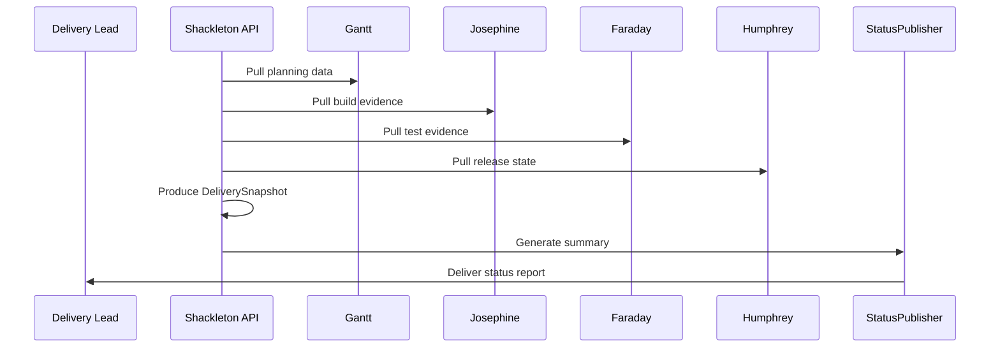
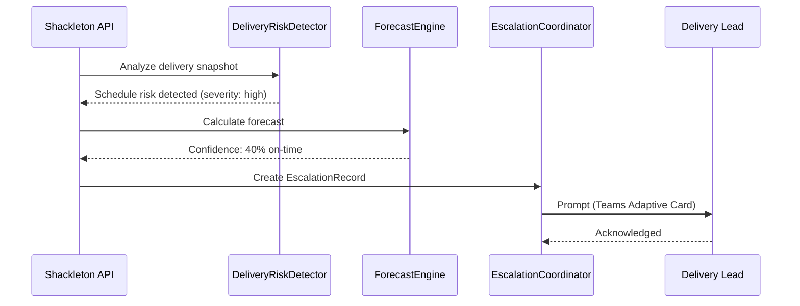

# Shackleton Delivery Manager Plan

## Summary
Shackleton should be the delivery-management agent for the platform. Its v1 job is to monitor execution against plan, detect schedule risk and coordination failure early, and produce operational delivery summaries for humans.

Shackleton should not own project planning itself. Gantt plans; Shackleton watches delivery reality and flags drift, blockage, and risk.

## Namesake

Shackleton is named for Sir Ernest Shackleton, the Antarctic explorer remembered for leadership under uncertainty, setbacks, and changing conditions. We use his name for the delivery manager because Shackleton's job is not to invent the plan but to keep the team moving through real-world risk, slippage, and coordination trouble.

## Product definition
### Goal
- monitor work-in-flight against milestones and release targets
- correlate project status with technical evidence from builds, tests, releases, and traceability
- surface delivery risk, slip probability, blocked handoffs, and missing approvals
- make status reporting fast, current, and evidence-backed

### Non-goals for v1
- replacing Jira as the task system
- replacing Humphrey as the release-decision authority
- automatic reassignment of teams or people
- autonomous reprioritization without review

### Position in the system
- Gantt provides planning snapshots and milestone proposals
- Shackleton measures delivery reality against those plans
- Josephine, Faraday, Humphrey, Mercator, and Berners-Lee provide the technical evidence
- Pliny provides decisions and action-item context

## Triggering model
- Shackleton should primarily run as an on-demand and scheduled reporting service rather than a heavy continuous event processor in v1.
- Normal work should start from delivery-snapshot requests and optional recurring summary jobs.
- Humans should request status views, acknowledge or dismiss risks, and decide whether escalations change plans or commitments.

## Architecture
### Core design
Shackleton should be split into these concerns:
- `StatusAggregator`: combines Jira state, planning snapshots, and technical evidence
- `DeliveryRiskDetector`: identifies slippage, blocked handoffs, missing evidence, and approval gaps
- `ForecastEngine`: produces near-term delivery confidence and likely slip signals
- `StatusPublisher`: emits weekly or on-demand delivery summaries for humans
- `EscalationCoordinator`: raises issues when thresholds are crossed

Required internal objects:
- `DeliverySnapshot`
- `DeliveryRiskRecord`
- `ForecastRecord`
- `StatusSummary`
- `EscalationRecord`

## Diagrams

### Delivery Status

### Risk Escalation

## Monitoring model
### Inputs
- planning snapshots from Gantt
- Jira issue and workflow state
- build status from Josephine
- test execution status from Faraday
- release status from Humphrey
- version state from Mercator
- traceability gaps from Berners-Lee
- meeting actions from Pliny

### Outputs
Shackleton should produce:
- delivery status summaries
- risk classifications
- forecast confidence
- blocked-handoff reports
- escalation prompts

### Monitoring rules
- status claims should always be tied to observable evidence
- “on track” should require both work-state and technical-state support
- missing build/test evidence for release-critical work should lower confidence
- repeated failed handoffs should be surfaced as coordination risk, not buried in local statuses
- approval gaps should be explicit when they gate release or customer commitments

## Public API and contracts
### API surface
- `POST /v1/delivery/snapshot`
  - input: project scope, milestone scope, time horizon
  - output: `DeliverySnapshot`
- `GET /v1/delivery/snapshots/{snapshot_id}`
  - returns current delivery summary, risk, and forecast
- `GET /v1/delivery/projects/{project_key}/status`
  - returns current status summary and confidence
- `GET /v1/delivery/projects/{project_key}/risks`
  - returns active delivery risks and escalations

### Internal contracts
- `DeliverySnapshot`
- `DeliveryRiskRecord`
- `ForecastRecord`
- `StatusSummary`
- `EscalationRecord`

## Observability and operations
### Structured events
Emit:
- `delivery.snapshot_created`
- `delivery.risk_detected`
- `delivery.forecast_changed`
- `delivery.escalation_requested`

### Metrics
Collect:
- blocked-handoff count
- status confidence by milestone
- approval-wait count
- stale action-item count
- delivery slip rate against planned milestones

### Operator controls
- acknowledge or dismiss a risk
- request refresh of delivery snapshot
- mark an escalation as accepted, deferred, or resolved

## Security and approvals
- read access to Jira, planning snapshots, and technical records is required
- v1 write-back should be limited to comments, summaries, and approved escalation markers
- changes to milestone ownership or target dates should remain human-controlled
- audit all escalations, dismissals, and summary publications

## Decision Logging & Audit Trail

Every action this agent takes is logged with full context. For decisions, the complete decision tree is recorded — what options were considered, what data was evaluated, and why the chosen path was selected.

| Log Type | What Is Captured | Example |
|----------|-----------------|---------|
| **Action log** | Every API call, event consumed, event emitted, external system interaction. Timestamped with correlation_id and agent_id. | `action=emit_event, event_type=build.completed, build_id=BLD-1234, correlation_id=abc-123` |
| **Decision log** | The full decision tree: inputs evaluated, rules applied, alternatives considered, chosen outcome, and rationale. | `decision=select_test_plan, trigger=PR, inputs=[branch=feature/x, module=opx-core], candidates=[quick_smoke, pr_standard], selected=pr_standard, reason="PR trigger + no HIL changes"` |
| **Rejection log** | When an action is rejected or blocked — what was attempted, what rule prevented it, what the agent did instead. | `decision=promote_release, attempted=sit_to_qa, blocked_by=failing_test_TES-456, action=hold_and_notify` |

All logs are stored in PostgreSQL (audit table) and streamed to Grafana/Loki. Decision logs are queryable by correlation_id, agent_id, decision type, and time range.

## Tool Use & Token Efficiency

This agent prioritizes **deterministic tools** over LLM inference wherever possible. LLM calls are reserved for tasks that genuinely require reasoning, generation, or ambiguity resolution.

| Principle | Implementation |
|-----------|---------------|
| **Deterministic first** | Policy lookups, schema validation, event routing, suite selection, version mapping, and traceability queries all use deterministic code paths. No tokens spent on work that has a known algorithm. |
| **Custom tooling** | The agent platform builds and maintains its own tool library. When a pattern repeats, it becomes a tool. Agents can also generate new tools for themselves when they identify repeated LLM-heavy patterns. |
| **Token-aware execution** | Every LLM call logs input tokens, output tokens, model used, and cost. The agent selects the smallest capable model for each task. |
| **Caching** | LLM responses for identical inputs are cached (Redis). Repeated queries hit cache instead of burning tokens. |

### Token Tracking

All token usage is logged to PostgreSQL and accumulates per agent, per day, per operation type.

| Metric | Tracked | Queryable By |
|--------|---------|-------------|
| **Per-call tokens** | input_tokens, output_tokens, model, latency_ms, cost_usd | correlation_id, agent_id, timestamp |
| **Cumulative totals** | total_input_tokens, total_output_tokens, total_cost_usd | agent_id, date range, operation type |
| **Efficiency ratio** | deterministic_actions / total_actions (target: >80%) | agent_id, date range |

## Standard Commands

Every agent responds to these standard commands in its Teams channel and via REST API.

| Command | What It Returns |
|---------|----------------|
| `/token-status` | Token usage summary: today's input/output tokens, cumulative totals, cost, efficiency ratio, comparison to 7-day average. |
| `/decision-tree` | The last N decisions made by this agent, each showing: timestamp, decision type, inputs evaluated, candidates considered, selected outcome, and rationale. |
| `/why {decision-id}` | Deep dive into a specific decision: full decision tree, all inputs, every rule evaluated, alternatives rejected and why, final rationale with links to source data. |
| `/stats` | Operational statistics: uptime, total actions today/this week/this month, success/failure rates, average latency, queue depth, active jobs, error rate trend. |
| `/work-today` | Summary of today's work: number of jobs processed, key outcomes, notable decisions, any failures or blocked items. |
| `/busy` | Current load: active jobs, queue depth, estimated drain time. Status: idle / working / busy / overloaded. |

All commands also work via the agent's REST API (e.g., `GET /v1/status/tokens`, `GET /v1/status/decisions`, `GET /v1/status/stats`).

## Teams Channel Interface

This agent has a dedicated **Microsoft Teams channel** (`#agent-{name}`) in the "Agent Workforce" team. This is the primary human interface. This channel is managed by **[Shannon](SHANNON_COMMUNICATIONS_AGENT_PLAN.md)**, the communications service agent.

| Function | How It Works |
|----------|-------------|
| **Activity feed** | The agent posts a summary of every significant action. Engineers follow along in real time. |
| **Decision notifications** | Non-trivial decisions are posted with rationale. Engineers can review and challenge. |
| **Approval requests** | When human approval is required, the agent posts an Adaptive Card with approve/reject buttons. |
| **Input requests** | When the agent needs information it cannot determine automatically, it posts a structured request. Engineers reply in-thread. |
| **Error alerts** | Failures and anomalies posted with severity and suggested actions. Critical alerts @mention the relevant team. |
| **Status queries** | Engineers can ask for status by posting in the channel. The agent responds in-thread. |

## Phased roadmap
### Phase 1. Delivery snapshots
- combine Jira and technical evidence into delivery summaries
- expose confidence and blocked-work views

Exit criteria:
- Shackleton can create a durable delivery snapshot
- snapshot includes linked technical evidence

### Phase 2. Risk detection
- classify blocked handoffs, missing approvals, stale work, and release-readiness mismatch

Exit criteria:
- delivery risks are queryable and grouped by class
- summary confidence changes when supporting evidence changes

### Phase 3. Forecasting
- add near-term slip and readiness forecasts
- relate forecast changes to exact evidence changes

Exit criteria:
- forecast drift is visible and explainable
- milestone confidence is not a black box

### Phase 4. Human reporting loop
- publish recurring or on-demand delivery summaries into human channels
- add controlled Jira or Teams summary publishing

Exit criteria:
- humans can consume Shackleton outputs without digging through raw systems
- summary publication remains auditable

## Test and acceptance plan
### Snapshot behavior
- builds combined status from Jira plus technical evidence
- release-critical work with missing technical proof lowers confidence

### Risk behavior
- blocked handoff detected
- missing approval detected
- stale action item detected
- release-readiness mismatch detected

### Forecast behavior
- forecast changes when evidence changes
- forecast explains major confidence shifts

### Operational behavior
- repeated snapshot generation is stable
- risks and escalations remain auditable
- dismissed risks remain historically visible

## Assumptions
- Shackleton is advisory in v1
- Gantt provides planning context upstream
- humans retain control over target dates, staffing, and commitments
