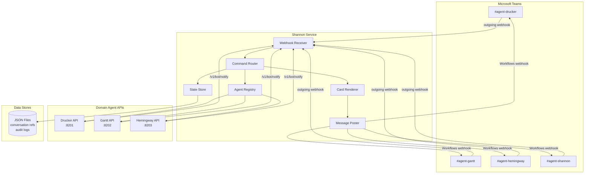
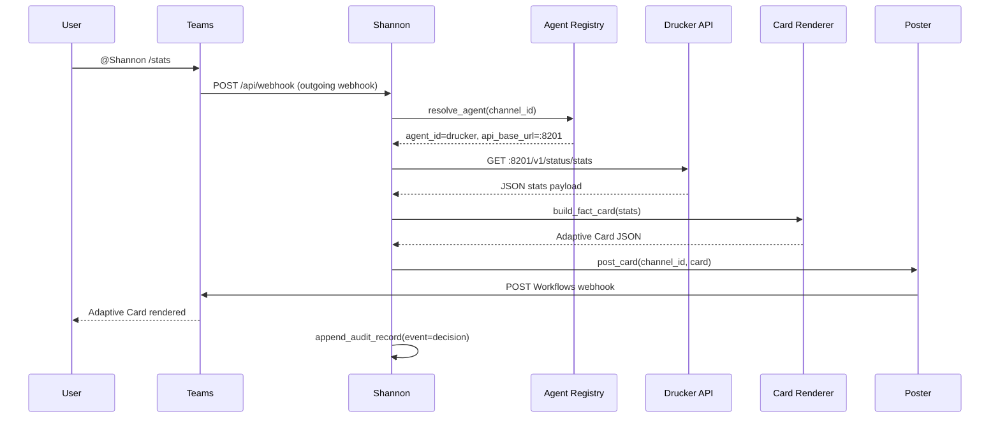
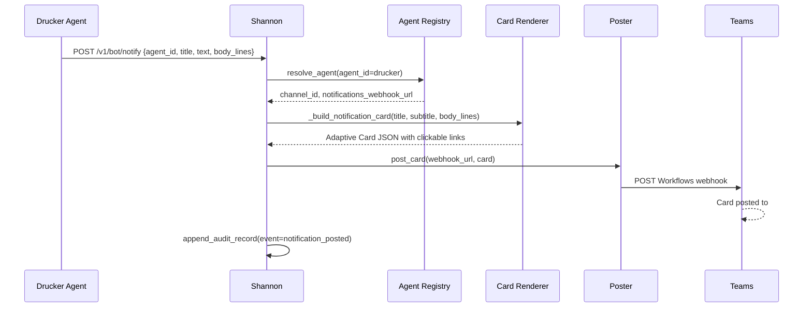
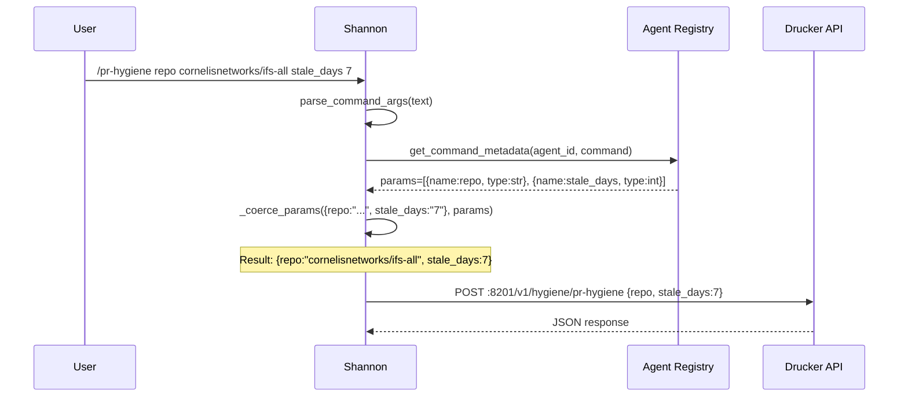

<!-- Generated by Documentation Agent — do not edit between markers -->

```yaml
---
title: "As-Built: Shannon — Communications Agent"
date: "2026-04-08"
status: "draft"
---
```

# Module Overview

Shannon is the single Microsoft Teams bot that serves as the unified human interface for all domain agents in the Cornelis Networks Agent Workforce. Named after Claude Shannon, the father of information theory, it receives messages from Teams channels, routes commands to the correct agent API, renders responses as Adaptive Cards, manages approval workflows, and logs every interaction for audit. Shannon is not a proxy—it owns command parsing, routing, response rendering, approval lifecycle management, conversation threading, rate limiting, error handling, and audit logging.

# What Changed

**Before:** Shannon was a planned service with a full Bot Framework SDK integration, approval workflows, and LLM-based free-text query interpretation.

**After:** Shannon is implemented as a lightweight, deterministic routing service with:
- Microsoft Graph API integration (not Bot Framework SDK)
- Outgoing webhook for user commands + Workflows webhook for proactive messages
- Typed parameter coercion for POST commands
- Per-agent notification channels
- Email sending capability via Graph API
- Zero LLM usage (>95% deterministic execution)

**Impact:** Shannon is production-ready for Phase 1 (basic routing + notifications). Approval workflows (Phase 2) and free-text queries (Phase 3) are deferred. All domain agents can now push notifications and receive routed commands via Shannon's Bot API.

# Component Diagram



# Key Flows

## Flow 1: User Command Routing

**Description:** A user posts `@Shannon /stats` in `#agent-drucker`. Shannon parses the command, resolves the agent from the channel registry, routes to Drucker's API, and posts the response as an Adaptive Card.



## Flow 2: Agent Proactive Notification

**Description:** Drucker completes a polling task and posts an activity notification to its channel via Shannon's Bot API.



## Flow 3: Typed Parameter Coercion

**Description:** A user posts `@Shannon /pr-hygiene repo cornelisnetworks/ifs-all stale_days 7`. Shannon coerces `stale_days` from string to int before forwarding to Drucker.



# Data Model

## Core Data Structures

### `ConversationReference`
Tracks a Teams conversation for proactive messaging.

```python
@dataclass
class ConversationReference:
    reference_id: str          # Unique identifier
    agent_id: str              # Associated agent
    channel_id: str            # Teams channel ID
    team_id: str               # Teams team ID
    conversation_id: str       # Teams conversation ID
    service_url: str           # Bot Framework service URL
    user_id: str               # User who initiated
    user_name: str             # User display name
    created_at: str            # ISO timestamp
    metadata: Dict[str, Any]   # Additional context
```

### `AuditRecord`
Logs every Shannon action for audit trail.

```python
@dataclass
class AuditRecord:
    record_id: str             # Unique audit record ID
    event_type: str            # activity_received, decision, notification_posted
    status: str                # ok, error
    agent_id: str              # Agent involved
    channel_id: str            # Teams channel
    conversation_id: str       # Teams conversation
    team_id: str               # Teams team
    user_id: str               # User identity
    user_name: str             # User display name
    command: str               # Command text
    decision: str              # Decision made (e.g., "routed_to_drucker")
    timestamp: str             # ISO timestamp
    details: Dict[str, Any]    # Additional context
```

### `ChannelMapping`
Maps logical channel names to Teams IDs.

```python
@dataclass
class ChannelMapping:
    name: str                  # Logical name (e.g., "drucker")
    team_id: str               # Teams team ID
    channel_id: str            # Teams channel ID
    team_name: str             # Team display name
    channel_display_name: str  # Channel display name
    enabled: bool              # Whether active
```

## State Persistence

Shannon uses JSON files for state (no database):

- **`conversation_references.json`**: Maps `agent:{id}`, `channel:{id}`, `conversation:{id}` to `ConversationReference` objects.
- **`audit/{YYYY-MM-DD}.jsonl`**: Daily append-only audit logs (one JSON object per line).

# Dependencies

| Dependency | Purpose | Version |
|------------|---------|---------|
| `aiohttp` | Async HTTP client for Graph API | 3.9+ |
| `pydantic` | Data validation and serialization | 2.0+ |
| `pyyaml` | Agent registry config parsing | 6.0+ |
| `fastapi` | REST API framework | 0.100+ |
| `uvicorn` | ASGI server | 0.20+ |
| Microsoft Graph API | Teams messaging and email | v1.0 |
| Podman | Container runtime | 5.x |

# Configuration

## Environment Variables

| Variable | Purpose | Default |
|----------|---------|---------|
| `SHANNON_APP_ID` | Azure AD Application (client) ID | (required) |
| `SHANNON_APP_SECRET` | Azure AD Client Secret | (required) |
| `SHANNON_TENANT_ID` | Azure AD Directory (tenant) ID | (required) |
| `SHANNON_TEAMS_POST_MODE` | Poster mode: `memory`, `workflows`, `botframework` | `workflows` |
| `SHANNON_TEAMS_OUTGOING_WEBHOOK_SECRET` | HMAC secret for outgoing webhook validation | (required) |
| `SHANNON_TEAMS_WORKFLOWS_WEBHOOK_URL` | Incoming webhook URL for proactive messages | (required) |
| `SHANNON_TEAMS_BOT_NAME` | Bot display name | `Shannon` |
| `SHANNON_STATE_DIR` | Directory for JSON state files | `data/shannon` |
| `SHANNON_SEND_WELCOME_ON_INSTALL` | Send welcome message on bot install | `true` |
| `LOG_LEVEL` | Logging verbosity | `INFO` |

## Configuration Files

### `config/shannon/agent_registry.yaml`

Defines all registered agents and their commands.

```yaml
agents:
  drucker:
    channel_name: agent-drucker
    channel_id: "19:abc123..."
    team_id: "def456..."
    api_base_url: "http://host.containers.internal:8201"
    notifications_webhook_url: "https://...powerautomate.com/..."
    custom_commands:
      - command: /pr-hygiene
        description: "Analyze PR hygiene for a repository"
        api_method: POST
        api_path: /v1/hygiene/pr-hygiene
        params:
          - name: repo
            type: str
            required: true
          - name: stale_days
            type: int
            required: false
            default: 14
```

# Key Functions

## `_build_notification_card`

**Purpose:** Constructs an Adaptive Card for agent notifications with automatic URL detection and clickable link rendering.

**Location:** `shannon/service.py` (static method in `ShannonService`)

**Signature:**
```python
@staticmethod
def _build_notification_card(
    title: str,
    subtitle: str,
    body_lines: List[str],
) -> Dict[str, Any]
```

**Implementation Details:**
- Uses regex pattern `r'(https?://\S+)'` to detect URLs in body lines
- For lines containing URLs:
  - Extracts the URL and surrounding text
  - Generates a human-readable label from the URL path (e.g., `cornelisnetworks/ifs-all` from GitHub PR URLs)
  - Creates a `RichTextBlock` with `Action.OpenUrl` to make the text clickable
  - Applies `Accent` color to indicate interactivity
- For lines without URLs:
  - Renders as plain `TextBlock` with wrapping enabled
- Returns Adaptive Card v1.4 JSON structure

**Example:**
```python
# Input:
body_lines = [
    "Stale PR detected:",
    "https://github.com/cornelisnetworks/ifs-all/pulls/123 — Open for 21 days"
]

# Output card includes:
# - Title: "Stale PR Alert"
# - Subtitle: "Notification for Drucker"
# - Clickable link: "cornelisnetworks/ifs-all — Open for 21 days"
```

**Usage:** Called by `post_notification()` to render agent notifications with rich formatting and clickable GitHub/web links.

# Error Handling

## Exception Hierarchy

- **`GraphAPIError`**: Raised for Microsoft Graph API errors. Includes `status`, `error_code`, `message`, and `request_id`.
- **`KeyError`**: Raised when a channel name is not found in the registry.
- **`ValueError`**: Raised for invalid parameter types during coercion.

## Error Handling Patterns

1. **Graph API Retry Logic**: Rate-limited requests (429) are retried with exponential backoff (base 2.0 seconds). Transient server errors (5xx) are retried up to 3 times.

2. **Token Expiry Handling**: OAuth2 tokens are cached and refreshed automatically when expired (with 5-minute buffer).

3. **Missing Credentials**: If `SHANNON_APP_ID`, `SHANNON_APP_SECRET`, or `SHANNON_TENANT_ID` are missing, a warning is logged and API calls will fail gracefully.

4. **Command Routing Errors**: If an agent API is unreachable, Shannon logs the error, posts an error card to the channel, and records the failure in the audit log.

5. **Audit Log Resilience**: If an audit log file is corrupted, Shannon logs a warning and continues operation by creating a new log file.

## Implementation Details & Constants

- **Max retries**: `_MAX_RETRIES = 3` in `graph_client.py` (line 22).
- **Token expiry buffer**: 5 minutes (300 seconds) in `GraphToken.is_expired` (line 42).
- **Default OAuth scope**: `_DEFAULT_SCOPE = 'https://graph.microsoft.com/.default'` (line 20).
- **URL regex pattern**: `r'(https?://\S+)'` in `_build_notification_card()` for link detection.

## Missing Implementations

- **No database**: Shannon uses JSON files for state. This is acceptable for Phase 1 but will not scale beyond ~1000 conversations. Migration to PostgreSQL is planned for Phase 2.
- **No rate limiting**: Shannon does not enforce rate limits on inbound commands. This is acceptable for internal use but should be added before external exposure.