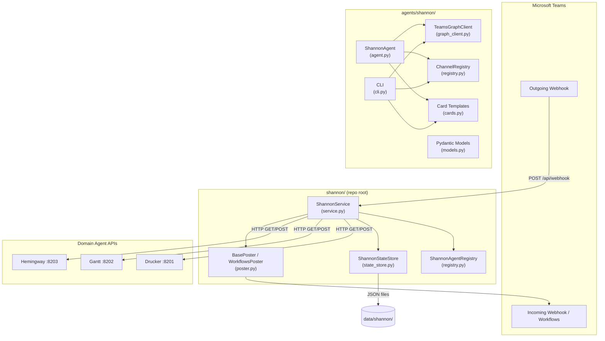
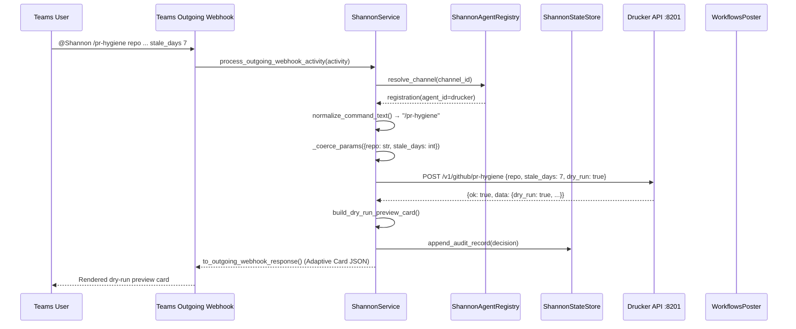
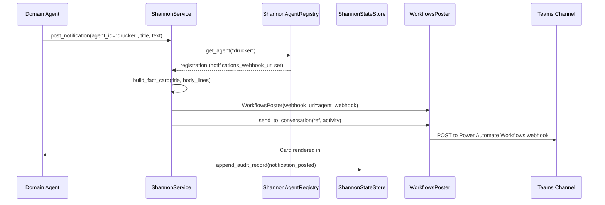
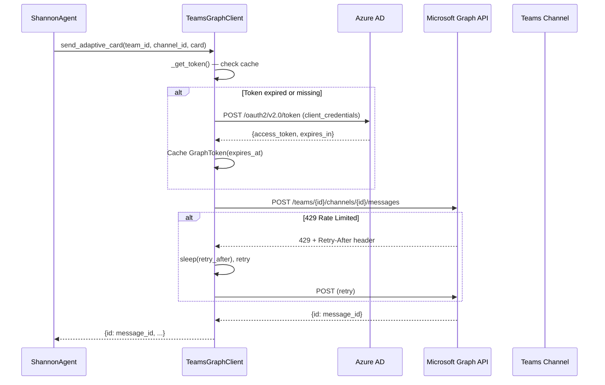

<!-- Generated by Documentation Agent — do not edit between markers -->

```yaml
---
title: "As-Built: Shannon — Communications Agent"
date: "2026-04-03"
status: "draft"
---
```

## 1. Module Overview

Shannon is the communications agent for the Cornelis Networks Agent Workforce — a single Microsoft Teams bot that serves as the unified human interface for all domain agents. Named after Claude Shannon, the father of information theory, the module receives commands from Teams channels, routes them to the correct agent API, renders responses as Adaptive Cards, manages approval workflows, and logs every interaction for audit. Shannon spans two codebases: the agent-framework integration layer in `agents/shannon/` (which provides the `ShannonAgent` class, Graph API client, channel registry, Adaptive Card templates, Pydantic models, and CLI tooling) and the production FastAPI service layer in `shannon/` at the repo root (which provides `ShannonService`, the Teams poster, the outgoing-webhook handler, and the state store). The design is deterministic-first — command parsing, routing, card rendering, and audit logging consume zero LLM tokens.

## 2. What Changed

**Before:** The `TeamsGraphClient` in `agents/shannon/graph_client.py` supported only channel-scoped messaging (posting to Teams channels via `/teams/{team_id}/channels/{channel_id}/messages`). The `ShannonService` in `agents/shannon/service.py` did not exist; command routing and notification posting were not yet implemented.

**After:** `TeamsGraphClient` now includes full 1:1 direct-message support: `resolve_user_by_email()`, `create_one_on_one_chat()`, `send_chat_message()`, and `send_chat_adaptive_card()`. The `ShannonService` class was added as the core command router and notification engine — it handles Teams activity processing, agent command dispatch, dry-run mutation previews, per-agent card rendering, typed parameter coercion, outgoing-webhook responses, proactive notification posting, and full audit logging.

**Impact:** All domain agents (Drucker, Gantt, Hemingway, and future agents) can now receive routed commands from Teams users and push proactive notifications to their dedicated channels. The 1:1 chat capability enables direct bot-to-user messaging for approval workflows and private notifications. Any component that depends on `ShannonService` or `TeamsGraphClient` gains these capabilities without code changes.

## 3. Component Diagram



## 4. Key Flows

### Flow 1: User Command → Agent API → Adaptive Card Response

A user sends `@Shannon /pr-hygiene repo cornelisnetworks/ifs-all stale_days 7` in the `#agent-drucker` Teams channel. Shannon parses the command, resolves the target agent, coerces parameters, calls the agent API, and renders the response as an Adaptive Card.



The routing logic lives in `ShannonService._handle_registered_agent_command()`. The method first checks for standard commands (`/stats`, `/busy`, etc.) via the `STANDARD_COMMAND_ROUTES` dict, then iterates `custom_commands` from the agent registry. For POST commands marked `mutation: true`, the service injects `dry_run=true` unless the user appended `execute`:

```python
is_mutation = (
    command in self.MUTATION_COMMANDS
    or cc.get('mutation', False)
)
if is_mutation:
    json_body['dry_run'] = not execute_requested
```

Parameter coercion is handled by `_coerce_params()`, which reads type metadata from the registry YAML:

```python
def _coerce_params(raw: Dict[str, str], param_defs: List[Dict[str, Any]]) -> Dict[str, Any]:
    type_map = {p['name']: p.get('type', 'str') for p in param_defs}
    result: Dict[str, Any] = {}
    for key, value in raw.items():
        ptype = type_map.get(key, 'str')
        if ptype == 'list':
            result[key] = [v.strip() for v in value.split(',') if v.strip()]
        elif ptype == 'int':
            try:
                result[key] = int(value)
            except ValueError:
                result[key] = value
        # ...
```

### Flow 2: Agent Proactive Notification

A domain agent posts a notification to its Teams channel via Shannon's Bot API. Shannon resolves the agent's dedicated webhook URL (if configured) or falls back to a stored conversation reference.



The per-agent poster selection is in `ShannonService._get_poster_for_agent()`:

```python
def _get_poster_for_agent(self, agent_id: str) -> BasePoster:
    registration = self.registry.get_agent(agent_id)
    if registration and registration.notifications_webhook_url:
        return WorkflowsPoster(webhook_url=registration.notifications_webhook_url)
    return self.poster
```

### Flow 3: Graph API Authentication and Channel Messaging

The `TeamsGraphClient` authenticates via OAuth2 client credentials flow, caches tokens with a 5-minute expiry buffer, and sends Adaptive Cards to Teams channels with automatic retry on rate-limiting (429) and transient server errors (5xx).



The token caching logic in `TeamsGraphClient._get_token()` uses a 5-minute buffer before expiry:

```python
@dataclass
class GraphToken:
    access_token: str
    expires_at: float  # epoch seconds

    @property
    def is_expired(self) -> bool:
        return time.time() >= (self.expires_at - 300)
```

The retry logic in `_request()` handles both 429 (using the `Retry-After` header) and 5xx errors (using exponential backoff with base 2.0 seconds), up to `_MAX_RETRIES = 3` attempts.

## 5. Data Model

### Core Pydantic Models (`agents/shannon/models.py`)

| Model | Purpose | Key Fields |
|-------|---------|------------|
| `AgentRegistryEntry` | Maps a Teams channel to an agent | `agent_id`, `channel_id`, `api_base_url`, `custom_commands`, `enabled` |
| `ConversationRecord` | Tracks a conversation thread | `conversation_id`, `channel_id`, `agent_id`, `thread_id`, `user_id`, `status` |
| `ApprovalRecord` | Approval lifecycle state | `approval_id`, `agent_id`, `approval_type`, `status` (pending/approved/rejected/expired/escalated), `timeout_hours`, `escalation_targets` |
| `NotificationRequest` | Inbound notification from an agent | `notification_id`, `agent_id`, `message`, `card_type`, `metadata` |
| `InputRequest` | Structured human input request | `request_id`, `agent_id`, `fields` (dynamic form schema), `status`, `response` |

### Channel Registry Dataclasses (`agents/shannon/registry.py`)

```python
@dataclass
class ChannelMapping:
    name: str
    team_id: str
    channel_id: str
    team_name: str = ''
    channel_display_name: str = ''
    enabled: bool = True

@dataclass
class RegistryConfig:
    default_team_id: str = ''
    default_team_name: str = ''
    channels: Dict[str, ChannelMapping] = field(default_factory=dict)
```

### Graph Client Dataclasses (`agents/shannon/graph_client.py`)

```python
@dataclass
class GraphToken:
    access_token: str
    expires_at: float
    token_type: str = 'Bearer'

@dataclass
class GraphMessage:
    id: str
    body_content: str
    body_content_type: str
    from_user: Optional[str] = None
    created_datetime: Optional[str] = None
    web_url: Optional[str] = None
    metadata: Dict[str, Any] = field(default_factory=dict)
```

### State Persistence (`agents/shannon/state_store.py`)

`ShannonStateStore` uses flat JSON files on disk:

- **`data/shannon/conversation_references.json`** — Keyed by `agent:{id}`, `channel:{id}`, and `conversation:{id}`. Each value is a serialized `ConversationReference`.
- **`data/shannon/audit/*.jsonl`** — One JSONL file per day (e.g., `2026-04-03.jsonl`). Each line is a serialized `AuditRecord` with `event_type`, `status`, `agent_id`, `command`, `decision`, `details`, and `timestamp`.

### Adaptive Card Schema (`agents/shannon/cards.py`)

All cards use Adaptive Card schema version `1.4` with the standard `http://adaptivecards.io/schemas/adaptive-card.json` schema URL. Card types include: `activity_card`, `decision_card`, `alert_card`, `stats_card`, `token_status_card`, `work_summary_card`, and `approval_card`.

Severity-to-style mapping for alert cards:

```python
_SEVERITY_COLORS: Dict[str, str] = {
    'critical': 'attention',
    'high': 'attention',
    'medium': 'warning',
    'low': 'good',
    'info': 'default',
}
```

## 6. Dependencies

| Dependency | Purpose | Version |
|------------|---------|---------|
| `aiohttp` | Async HTTP client for Microsoft Graph API calls | Not pinned |
| `pydantic` | Data validation models for API requests and records | Not pinned |
| `fastapi` | API router for Shannon's REST endpoints (`agents/shannon/api.py`) | Not pinned |
| `requests` | Synchronous HTTP calls from `ShannonService` to domain agent APIs | Not pinned |
| `pyyaml` | YAML parsing for channel registry and agent registry config | Not pinned |
| `agents.base` | `BaseAgent`, `AgentConfig`, `AgentResponse` base classes | Internal |
| `tools.base` | `ToolDefinition`, `ToolParameter`, `ToolResult` for tool registration | Internal |
| `agents.rename_registry` | `agent_display_name()`, `canonical_agent_name()` for agent name normalization | Internal |
| `shannon.cards` | Production card builders (distinct from `agents/shannon/cards.py`) | Internal |
| `shannon.models` | `AuditRecord`, `ConversationReference`, `ShannonResponse`, `normalize_command_text` | Internal |
| `shannon.poster` | `BasePoster`, `WorkflowsPoster`, `build_poster_from_env` | Internal |
| `shannon.registry` | `ShannonAgentRegistry` (production registry, distinct from `agents/shannon/registry.py`) | Internal |

## 7. Configuration

### Environment Variables

| Variable | Purpose | Default |
|----------|---------|---------|
| `SHANNON_APP_ID` | Azure AD Application (client) ID for Graph API | `''` |
| `SHANNON_APP_SECRET` | Azure AD Client Secret for Graph API | `''` |
| `SHANNON_TENANT_ID` | Azure AD Tenant ID for Graph API | `''` |
| `SHANNON_STATE_DIR` | Directory for JSON state persistence | `data/shannon` |
| `SHANNON_TEAMS_POST_MODE` | Poster mode: `memory`, `workflows`, or `botframework` | (from `build_poster_from_env`) |
| `SHANNON_TEAMS_OUTGOING_WEBHOOK_SECRET` | HMAC secret for Teams outgoing webhook validation | — |
| `SHANNON_TEAMS_WORKFLOWS_WEBHOOK_URL` | Power Automate Workflows incoming webhook URL | — |
| `SHANNON_TEAMS_BOT_NAME` | Bot display name in Teams | `Shannon` |
| `SHANNON_SEND_WELCOME_ON_INSTALL` | Post welcome card on `conversationUpdate` | `true` |
| `LOG_LEVEL` | Logging verbosity | `INFO` |
| `DRY_RUN` | Global dry-run flag | `true` |
| `STATE_BACKEND` | State persistence backend type | `json` |
| `PERSISTENCE_DIR` | General state persistence directory | `/data/state` |

### Configuration Files

| File | Purpose |
|------|---------|
| `agents/shannon/config.yaml` | Agent metadata, LLM settings, event declarations, channel registry with team/channel IDs |
| `config/shannon/agent_registry.yaml` | Production agent registry — maps channels to agents with `api_base_url`, `custom_commands`, `notifications_webhook_url` |
| `agents/shannon/prompts/system.md` | System prompt loaded by `ShannonAgent._load_system_prompt()` |
| `deploy/env/shared.env` | Non-sensitive shared configuration |
| `deploy/env/teams.env` | Teams webhook secrets and post mode |

### Agent Registry YAML Structure

```yaml
agents:
  drucker:
    channel_name: agent-drucker
    api_base_url: "http://host.containers.internal:8201"
    notifications_webhook_url: "https://...powerautomate.com/..."
    custom_commands:
      - command: /pr-hygiene
        api_method: POST
        api_path: /v1/github/pr-hygiene
        mutation: false
        params:
          - name: repo
            type: str
            required: true
          - name: stale_days
            type: int
            required: false
```

## 8. Error Handling

### Graph API Error Hierarchy

`TeamsGraphClient` defines a single exception class `GraphAPIError` that captures HTTP status, error code, message, and request ID:

```python
class GraphAPIError(Exception):
    def __init__(self, status: int, error_code: str, message: str,
                 request_id: Optional[str] = None):
        self.status = status
        self.error_code = error_code
        self.request_id = request_id
        super().__init__(f'Graph API {status} [{error_code}]: {message}')
```

### Retry Strategy

The `_request()` method in `TeamsGraphClient` implements a layered retry strategy:

- **429 Rate Limited**: Sleeps for the `Retry-After` header value, retries up to `_MAX_RETRIES` (3).
- **5xx Server Errors**: Exponential backoff with base `_RETRY_BACKOFF_BASE = 2.0` seconds.
- **Non-retryable errors** (4xx except 429): Immediately raises `GraphAPIError`.
- **Retry exhaustion**: Raises `GraphAPIError` with `error_code='retry_exhausted'`.

### Tool-Level Error Handling

Every tool method in `ShannonAgent` (e.g., `_tool_post_message`, `_tool_post_card`) follows a consistent pattern:

1. Resolve channel via `self._registry.resolve_or_raise()` — catches `KeyError` → `ToolResult.failure()`.
2. Parse JSON inputs — catches `json.JSONDecodeError` → `ToolResult.failure()`.
3. Call Graph API — catches `GraphAPIError` → `ToolResult.failure()`.
4. Catch-all `Exception` → `ToolResult.failure()` with logged error.

### Service-Level Error Handling

`ShannonService._call_agent_api()` wraps all `requests` calls with specific exception handling:

```python
except requests.Timeout:
    return {'ok': False, 'error': f'{registration.agent_id} timed out after {timeout}s'}
except requests.ConnectionError:
    return {'ok': False, 'error': f'{registration.agent_id} is not reachable at {registration.api_base_url}'}
except requests.HTTPError as e:
    return {'ok': False, 'error': f'{registration.agent_id} returned {e.response.status_code}'}
```

Failed agent calls are rendered as error text in the `ShannonResponse` with `decision='agent_call_failed'`.

### Audit Trail

Every processed activity generates audit records via `ShannonService._record()`, which calls `ShannonStateStore.append_audit_record()`. Records include `event_type`, `status` (ok or error), `agent_id`, `command`, `decision`, and `details`. This ensures all errors are persisted for post-mortem analysis.

## 9. Known Limitations / Technical Debt

### API Endpoints Not Implemented

All six endpoints in `agents/shannon/api.py` raise `NotImplementedError`:

```python
@router.post('/notify')
async def notify_channel(request: NotificationRequest):
    raise NotImplementedError('Shannon API not yet implemented')
```

The actual functionality is implemented in `ShannonService` (in `shannon/service.py`), but the FastAPI router in `agents/shannon/api.py` has not been wired to it.

### Approval Workflow — Display Only

The `approval_card()` function in `agents/shannon/cards.py` explicitly notes it is Phase 1 (read-only):

```python
def approval_card(...) -> Dict[str, Any]:
    """Approval request card (display-only for Phase 1).
    Phase 2 will add Action.Submit buttons once the bot framework webhook is wired up."""
```

Approval cards instruct users to reply with "approve" or "reject" in the thread rather than using interactive buttons.

### God Class: `ShannonService`

`ShannonService` in `agents/shannon/service.py` exceeds 500 lines and contains more than 10 public methods. It handles command routing, agent API calls, card rendering dispatch, audit logging, notification posting, outgoing webhook processing, and Teams activity processing. This is a candidate for decomposition into separate router, renderer, and poster components.

### Hardcoded Values

- `_MAX_RETRIES = 3` and `_RETRY_BACKOFF_BASE = 2.0` in `graph_client.py` are module-level constants, not configurable.
- `_CARD_VERSION = '1.4'` in `agents/shannon/cards.py` is hardcoded.
- Load state thresholds in `ShannonService.get_load()` are hardcoded: `0 = idle`, `≤5 = working`, `≤20 = busy`, `>20 = overloaded`.
- `pending_approvals` is hardcoded to `0` in `get_load()` and `rate_limit_headroom` is `'unbounded-v1'`.

### Missing Credential Validation

`TeamsGraphClient.__init__()` logs a warning if credentials are missing but does not fail fast. API calls will fail at runtime with an unhelpful error rather than at initialization:

```python
if not all([self._app_id, self._app_secret, self._tenant_id]):
    log.warning('TeamsGraphClient: missing one or more credentials ...')
```

### Dual Registry / Dual Cards Modules

There are two separate registry implementations (`agents/shannon/registry.py` with `ChannelRegistry` and `shannon/registry.py` with `ShannonAgentRegistry`) and two separate card modules (`agents/shannon/cards.py` and `shannon/cards.py`). The `ShannonService` imports from `shannon.cards` (production card builders) while `ShannonAgent` imports from `agents.shannon.cards`. This split creates confusion about which module is authoritative.

### State Store Scalability

`ShannonStateStore` uses flat JSON files. `get_audit_record()` performs a linear scan of all JSONL files to find a single record by ID. `compute_stats()` loads all records into memory (`limit=-1`). This will not scale beyond a few thousand records per day.

### Truncated Source

The `_tool_post_alert` method in `agents/shannon/agent.py` and the `send_adaptive_card` method in `agents/shannon/graph_client.py` appear truncated in the source — the closing lines are missing. The `_handle_shannon_command` method in `agents/shannon/service.py` is also truncated. These may be source-file length artifacts but should be verified.

### No Circular Dependencies Detected

No circular import patterns were identified between the modules.

### No Hardcoded Credentials

No hardcoded credentials or secret values were found. All secrets are loaded from environment variables.

<!-- End Documentation Agent generated content -->