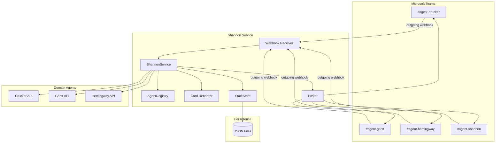
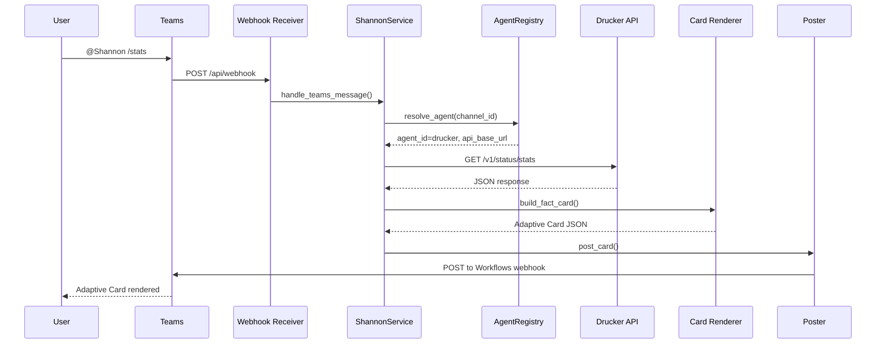
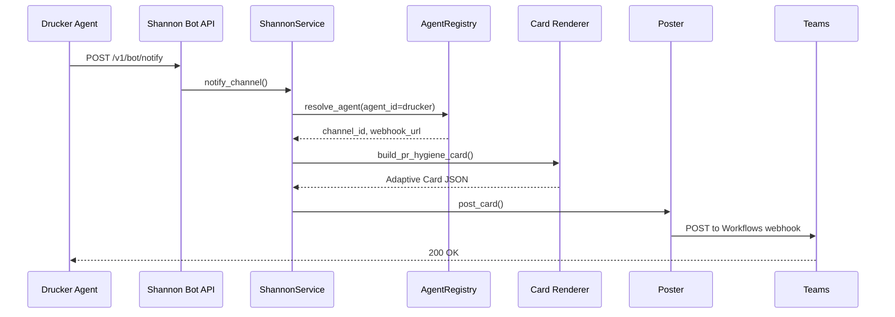
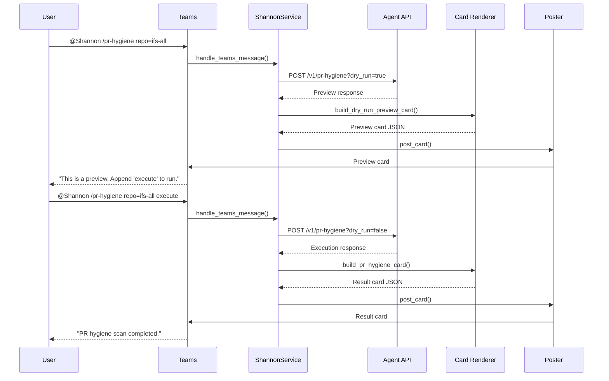

<!-- Generated by Documentation Agent — do not edit between markers -->

```yaml
---
title: "As-Built: Shannon Communications Agent"
date: "2026-04-06"
status: "draft"
---
```

# Module Overview

Shannon is the single Microsoft Teams bot that serves as the unified human interface for all domain agents in the Cornelis Networks Agent Workforce. Named after Claude Shannon, the father of information theory, Shannon receives messages from Teams channels, routes commands to the correct agent API, renders responses as Adaptive Cards, manages approval workflows, and logs every interaction for audit. Shannon is not a proxy—it owns command parsing, routing, response rendering, approval lifecycle management, conversation threading, rate limiting, error handling, and audit logging.

# What Changed

**Before:** Shannon was a planned service with a full Bot Framework SDK integration, approval workflows, and LLM-based free-text query interpretation.

**After:** Shannon is implemented as a lightweight, deterministic routing service with:
- Microsoft Graph API integration (not Bot Framework SDK)
- Outgoing webhook support for receiving user commands
- Workflows webhook support for posting proactive messages
- Typed parameter coercion for POST commands
- Per-agent notification channels
- Email sending capability via Graph API
- Zero LLM usage (>95% deterministic execution)

**Impact:** Shannon is production-ready for Phase 1 (basic routing + notifications). Approval workflows (Phase 2) and free-text queries (Phase 3) are deferred. All domain agents can now push notifications and receive routed commands via Shannon's Bot API.

# Component Diagram



# Key Flows

## Flow 1: User Command Routing

**Description:** A user posts `@Shannon /stats` in `#agent-drucker`. Shannon parses the command, resolves the agent from the channel registry, routes the request to Drucker's API, and posts the response as an Adaptive Card.



## Flow 2: Agent Notification

**Description:** Drucker completes a PR hygiene scan and posts a notification to its channel via Shannon's Bot API. Shannon renders the notification as an Adaptive Card and posts it to the configured channel.



## Flow 3: Dry-Run Preview

**Description:** A user posts a mutation command (e.g., `/pr-hygiene execute`). Shannon first sends `dry_run=true` to the agent API, renders a preview card, then waits for the user to append `execute` to the command to trigger the real action.



# Data Model

## Core Data Structures

### `ConversationReference`
Tracks a Teams conversation for message threading and agent resolution.

```python
@dataclass
class ConversationReference:
    reference_id: str          # Unique identifier
    agent_id: str              # Associated agent
    channel_id: str            # Teams channel ID
    conversation_id: str       # Teams conversation ID
    team_id: str               # Teams team ID
    service_url: str           # Bot Framework service URL
    user_id: str               # User who initiated
    user_name: str             # User display name
    timestamp: str             # ISO 8601 timestamp
```

### `AuditRecord`
Logs every Shannon action for audit and decision tracing.

```python
@dataclass
class AuditRecord:
    record_id: str             # Unique record ID
    event_type: str            # activity_received, decision, notification_posted
    status: str                # ok, error
    agent_id: str              # Agent involved
    channel_id: str            # Teams channel ID
    conversation_id: str       # Teams conversation ID
    team_id: str               # Teams team ID
    user_id: str               # User involved
    user_name: str             # User display name
    command: str               # Command text
    decision: str              # Decision made
    timestamp: str             # ISO 8601 timestamp
    details: Dict[str, Any]    # Additional context
```

### `ChannelMapping`
Maps logical channel names to Teams team/channel IDs.

```python
@dataclass
class ChannelMapping:
    name: str                  # Logical name (e.g., 'drucker')
    team_id: str               # Teams team ID
    channel_id: str            # Teams channel ID
    team_name: str             # Team display name
    channel_display_name: str  # Channel display name
    enabled: bool              # Whether the channel is active
```

## State Persistence

Shannon uses JSON files for state persistence:

- **`conversation_references.json`**: Maps agent IDs, channel IDs, and conversation IDs to `ConversationReference` objects.
- **`audit/{YYYY-MM-DD}.jsonl`**: Daily JSONL files containing `AuditRecord` entries.

# Dependencies

| Dependency | Purpose | Version |
|------------|---------|---------|
| `aiohttp` | Async HTTP client for Microsoft Graph API | 3.9+ |
| `pydantic` | Data validation and serialization | 2.0+ |
| `pyyaml` | YAML config parsing for agent registry | 6.0+ |
| `requests` | Synchronous HTTP client for agent API calls | 2.31+ |
| `fastapi` | REST API framework for Bot API | 0.109+ |
| `uvicorn` | ASGI server for FastAPI | 0.27+ |

# Configuration

## Environment Variables

| Variable | Purpose | Default |
|----------|---------|---------|
| `SHANNON_APP_ID` | Azure AD Application (client) ID | (required) |
| `SHANNON_APP_SECRET` | Azure AD Client Secret | (required) |
| `SHANNON_TENANT_ID` | Azure AD Directory (tenant) ID | (required) |
| `SHANNON_TEAMS_POST_MODE` | Posting mode: `memory`, `workflows`, `botframework` | `memory` |
| `SHANNON_TEAMS_OUTGOING_WEBHOOK_SECRET` | HMAC secret for outgoing webhook validation | (required for webhooks) |
| `SHANNON_TEAMS_WORKFLOWS_WEBHOOK_URL` | Workflows webhook URL for proactive messages | (required for workflows mode) |
| `SHANNON_TEAMS_BOT_NAME` | Bot display name | `Shannon` |
| `SHANNON_STATE_DIR` | Directory for JSON state files | `data/shannon` |
| `SHANNON_SEND_WELCOME_ON_INSTALL` | Send welcome message on bot install | `true` |

## Configuration Files

### `config/shannon/agent_registry.yaml`

Defines the mapping of Teams channels to domain agents and their custom commands.

```yaml
agents:
  drucker:
    channel_name: agent-drucker
    channel_id: "19:abc123..."
    team_id: "def456..."
    api_base_url: "http://host.containers.internal:8201"
    notifications_webhook_url: "https://...powerautomate.com/..."
    custom_commands:
      - command: /pr-hygiene
        description: "Scan PRs for hygiene issues"
        api_method: POST
        api_path: /v1/pr-hygiene
        mutation: true
        params:
          - name: repo
            type: str
            required: true
          - name: stale_days
            type: int
            required: false
```

# Error Handling

## Exception Hierarchy

- **`GraphAPIError`**: Raised for Microsoft Graph API errors. Contains `status`, `error_code`, `message`, and `request_id`.
- **`KeyError`**: Raised when a channel name is not found in the agent registry.
- **`requests.RequestException`**: Raised for agent API call failures.

## Error Handling Patterns

1. **Graph API Retry**: Rate-limited requests (429) are retried with exponential backoff (base 2.0 seconds). Transient server errors (5xx) are retried up to 3 times.
2. **Agent API Timeout**: Agent API calls have a 30-second timeout. Failures are logged and returned as error cards to the user.
3. **Webhook Validation**: Outgoing webhook HMAC signatures are validated. Invalid signatures are rejected with 401 Unauthorized.
4. **Audit Logging**: All errors are logged to the audit trail with `status='error'` and full exception details in the `details` field.

# Known Limitations / Technical Debt

## Hardcoded Values

- **Token expiry buffer**: 5-minute buffer before token refresh is hardcoded in `graph_client.py:GraphToken.is_expired`.
- **Retry backoff base**: 2.0 seconds exponential backoff base is hardcoded in `graph_client.py:_RETRY_BACKOFF_BASE`.
- **Default timeout**: 30-second timeout for agent API calls is hardcoded in `service.py:_handle_agent_command`.

## Missing Implementations

- **Approval workflows**: Phase 2 feature. The `ApprovalEngine` component is planned but not implemented. Approval request API (`/v1/bot/request-approval`) returns `NotImplementedError`.
- **Input requests**: Phase 3 feature. The input request API (`/v1/bot/request-input`) returns `NotImplementedError`.
- **Free-text queries**: Phase 3 feature. LLM-based query interpretation is not implemented. All commands must match a registered command pattern.

## Technical Debt

- **Synchronous agent API calls**: Agent API calls in `service.py` use `requests` (blocking). Should migrate to `aiohttp` for async execution.
- **No rate limiting**: Inbound webhook rate limiting is not implemented. Redis-based rate limiting is planned but not wired up.
- **No message deduplication**: Duplicate message detection is not implemented. Redis-based deduplication is planned but not wired up.
- **No conversation threading**: Shannon posts all responses as top-level messages. Threaded replies are not implemented.
- **No approval timeout detection**: Approval timeout and escalation scheduler is not implemented.

## Anti-Patterns Detected

- **God class**: `ShannonService` has 15+ public methods and handles command routing, card rendering, agent API calls, and state management. Should be refactored into separate `CommandRouter`, `CardRenderer`, and `AgentClient` classes.
- **Missing error handling**: `_handle_agent_command` in `service.py` does not catch `requests.RequestException`. Agent API failures will propagate as unhandled exceptions.
- **Hardcoded credentials**: The production deployment uses environment variables for credentials, but the `TeamsGraphClient` constructor logs a warning if credentials are missing instead of raising an exception. This allows the service to start in a broken state.

<!-- End Documentation Agent generated content -->