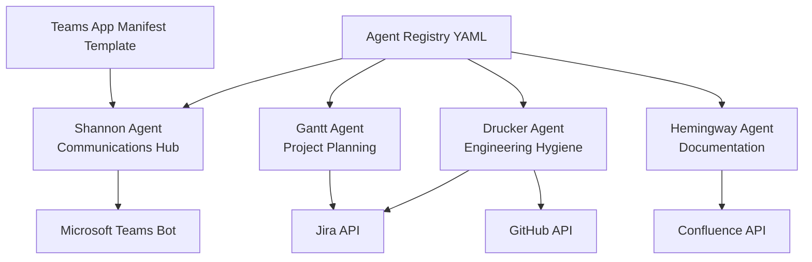
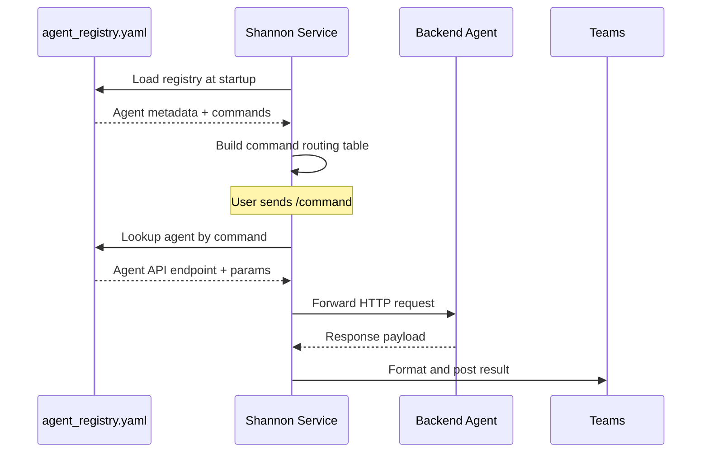
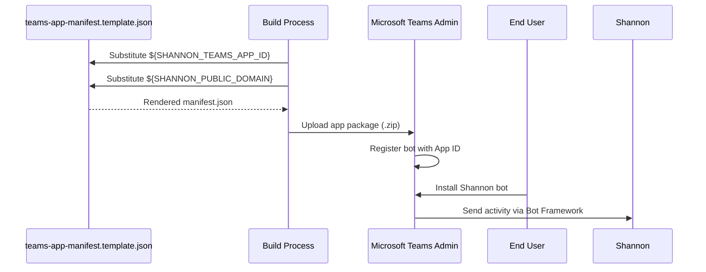
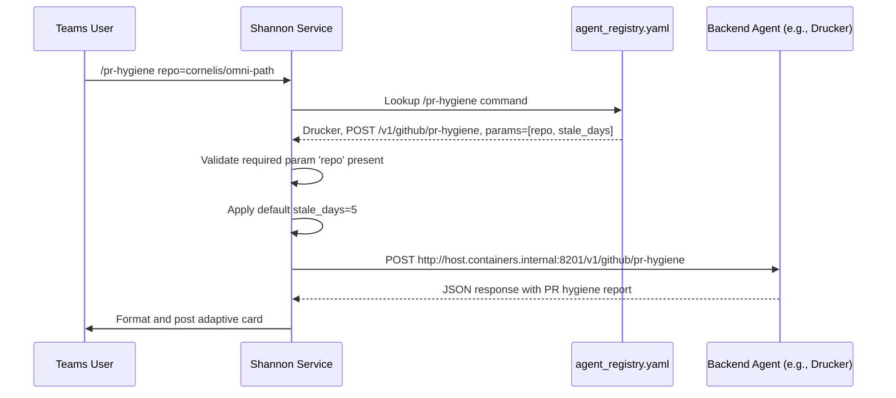

<!-- Generated by Documentation Agent — do not edit between markers -->

```yaml
---
title: "As-Built: Shannon Configuration"
date: "2026-04-06"
status: "draft"
---
```

# Module Overview

The Shannon configuration module defines the agent registry and Teams application manifest for the Cornelis agent workforce. It serves as the single source of truth for agent metadata, command routing, API endpoints, and Teams bot integration. The registry (`agent_registry.yaml`) catalogs four agents (Shannon, Drucker, Gantt, Hemingway) with their capabilities, while the Teams manifest template (`teams-app-manifest.template.json`) configures the Shannon bot for Microsoft Teams deployment.

# What Changed

**Before:** The agent registry used two-space indentation and quoted string values throughout the YAML structure.

**After:** The registry now uses consistent unquoted strings (except where special characters require quoting) and standardized indentation. The Gantt agent gained a `notify_shannon: true` flag.

**Impact:** 
- The YAML formatting change improves readability and reduces diff noise in version control
- The `notify_shannon` flag enables Gantt to send completion notifications back to Shannon's channel
- No functional changes to command routing or API contracts

# Component Diagram



# Key Flows

## Flow 1: Agent Registration and Discovery



**Description:** Shannon loads the agent registry on startup to build its command routing table. When a user issues a command in Teams, Shannon looks up the owning agent, constructs the HTTP request using the registry's `api_base_url` and `api_path`, and forwards the call. The registry acts as a declarative routing manifest.

## Flow 2: Teams Bot Manifest Deployment



**Description:** The Teams manifest template contains placeholder variables for the bot's App ID and public domain. During deployment, these are substituted with environment-specific values. The resulting manifest is packaged and uploaded to Teams, where it registers Shannon as a bot with team-scoped permissions. Users can then install the bot and interact with it via chat.

## Flow 3: Command Parameter Validation and Execution



**Description:** When a user invokes a command with parameters, Shannon validates the input against the registry's `params` schema. Required parameters are checked, optional parameters receive defaults, and type coercion is applied (e.g., `list` splits comma-separated strings). Shannon then constructs the HTTP request and forwards it to the agent's API endpoint. The registry's `mutation` flag determines whether the command requires approval before execution.

# Data Model

## Agent Registry Schema

```yaml
agents:
  - agent_id: str              # Unique identifier (e.g., "shannon")
    display_name: str          # Human-readable name
    role: str                  # Agent's functional role
    description: str           # Purpose and capabilities
    zone: str                  # Architectural zone (e.g., "service_infrastructure")
    channel_name: str          # Teams channel name
    channel_id: str            # Teams channel ID (thread ID)
    team_id: str               # Teams team ID
    api_base_url: str          # Base URL for agent's HTTP API
    approval_types: list       # Approval workflow types (currently unused)
    custom_commands: list      # Command definitions (see below)
    timeout_seconds: int       # HTTP request timeout
    notify_shannon: bool       # Optional: send completion notifications to Shannon
    notifications_webhook_url: str  # Optional: Power Automate webhook for notifications

custom_commands:
  - command: str               # Command name (e.g., "/pr-hygiene")
    description: str           # User-facing description
    api_method: str            # HTTP method (GET, POST)
    api_path: str              # Relative API path
    mutation: bool             # Optional: requires approval if true
    params: list               # Parameter definitions (see below)

params:
  - name: str                  # Parameter name
    type: str                  # Data type (str, int, list)
    required: bool             # Whether parameter is mandatory
    label: str                 # User-facing label/description
```

## Teams Manifest Schema

The `teams-app-manifest.template.json` follows the [Microsoft Teams App Schema v1.19](https://developer.microsoft.com/json-schemas/teams/v1.19/MicrosoftTeams.schema.json). Key fields:

- `id`: Unique app ID (substituted from `${SHANNON_TEAMS_APP_ID}`)
- `bots[0].botId`: Bot Framework registration ID (same as app ID)
- `bots[0].scopes`: `["team"]` — bot operates in team channels only
- `validDomains`: Public domain for bot's webhook endpoint
- `defaultInstallScope`: `"team"` — bot must be installed at team level

# Dependencies

| Dependency | Purpose | Version |
|------------|---------|---------|
| Microsoft Teams Bot Framework | Bot activity handling and message routing | v4.x |
| YAML | Configuration file format | 1.2 |
| Jinja2 (implied) | Template variable substitution in manifest | N/A |
| Agent HTTP APIs | Backend service endpoints for command execution | Custom |

# Configuration

## Environment Variables

The Teams manifest template requires the following environment variables during build:

- `SHANNON_TEAMS_APP_ID`: Microsoft App ID for the Shannon bot (registered in Azure AD)
- `SHANNON_PUBLIC_DOMAIN`: Public-facing domain for the bot's webhook endpoint (e.g., `shannon.cornelisnetworks.com`)

## Agent Registry Configuration

The `agent_registry.yaml` file is loaded at runtime by the Shannon service. No environment variables are required for the registry itself, but agent API endpoints (`api_base_url`) must be reachable from the Shannon container.

### Agent API Endpoints

- **Shannon**: No external API (self-referential status endpoints)
- **Drucker**: `http://host.containers.internal:8201`
- **Gantt**: `http://host.containers.internal:8202`
- **Hemingway**: `http://host.containers.internal:8203`

The `host.containers.internal` hostname is a Docker Desktop convention for accessing the host machine from a container. In production, these would be replaced with service discovery endpoints or Kubernetes service names.

## Teams Bot Permissions

The manifest requests the following permissions:

- `identity`: Access to user identity information
- `messageTeamMembers`: Send direct messages to team members

The bot is scoped to `team` channels only and does not support personal chat or group chat contexts.

# Error Handling

The configuration files themselves do not contain error handling logic, but they define constraints that Shannon enforces:

1. **Missing Required Parameters**: Shannon validates that all `required: true` parameters are present in user commands. Missing parameters result in a user-facing error message.

2. **Invalid Agent ID**: If a command references an unknown agent, Shannon returns a "command not found" error.

3. **Timeout Enforcement**: The `timeout_seconds` field sets the HTTP client timeout for agent API calls. Exceeded timeouts result in a "request timed out" error posted to Teams.

4. **Mutation Flag**: Commands with `mutation: true` require approval before execution. Attempting to execute a mutation command without approval results in an "approval required" error.

# Known Limitations / Technical Debt

1. **Hardcoded Container Hostnames**: Agent API endpoints use `host.containers.internal`, which is Docker Desktop-specific. This breaks in Kubernetes or non-Docker environments. **Recommendation**: Use environment variables or service discovery.

2. **Unused Approval Types**: The `approval_types` field is defined but never populated. The approval workflow is not yet implemented. **Recommendation**: Remove the field or implement the approval system.

3. **Inconsistent Notification Mechanisms**: Drucker uses a Power Automate webhook URL for notifications, while Gantt uses a `notify_shannon` flag. **Recommendation**: Standardize on a single notification pattern.

4. **No Schema Validation**: The YAML registry is loaded without schema validation. Malformed entries could cause runtime errors. **Recommendation**: Add JSON Schema validation or Pydantic models.

5. **Missing Command Versioning**: Commands have no version field, making backward-incompatible API changes difficult to manage. **Recommendation**: Add a `version` field to commands and implement version negotiation.

6. **Hardcoded Team IDs**: The `team_id` and `channel_id` fields contain production Teams identifiers. These should be externalized to environment variables for multi-tenant deployments.

7. **No Rate Limiting Configuration**: The registry does not define rate limits for commands. High-frequency commands could overwhelm backend agents. **Recommendation**: Add `rate_limit` fields (e.g., `max_calls_per_minute`).

<!-- End Documentation Agent generated content -->