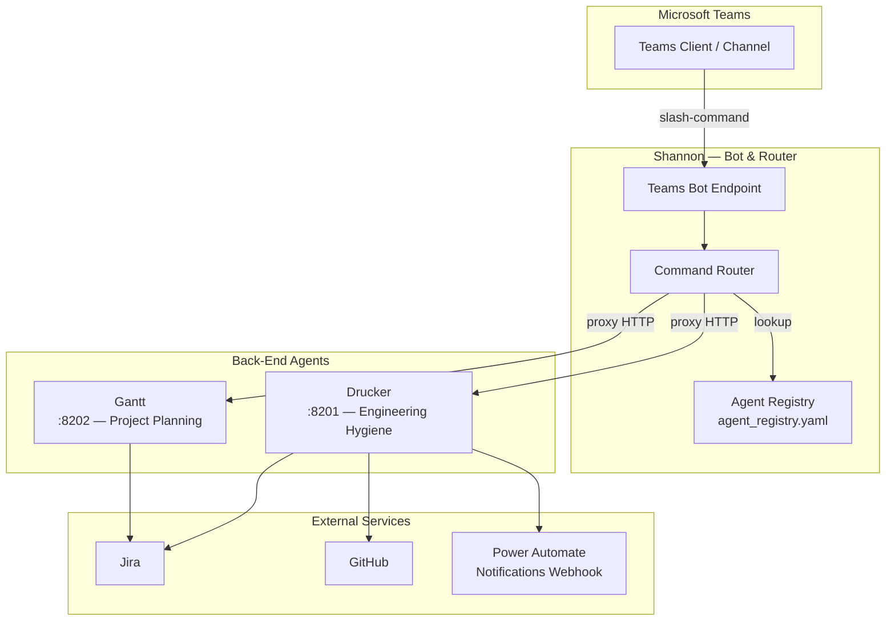
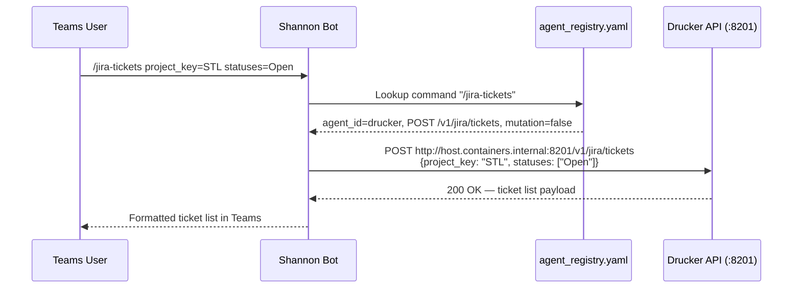
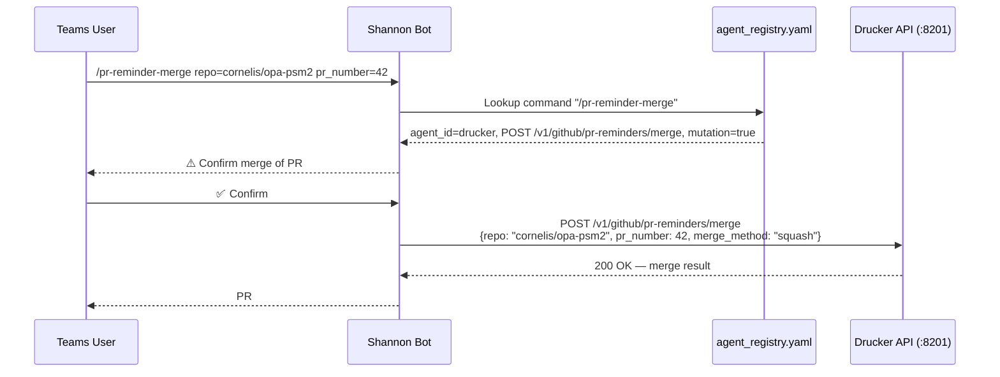
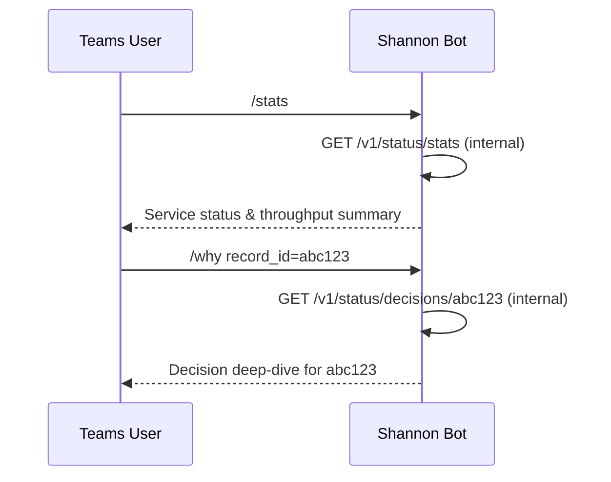

<!-- Generated by Documentation Agent — do not edit between markers -->

```yaml
---
title: "As-Built: Shannon — Configuration & Agent Registry"
date: "2026-04-03"
status: "draft"
---
```

# Module Overview

Shannon is the single Microsoft Teams bot and command-routing surface for the Cornelis agent workforce. Rather than each agent maintaining its own Teams presence, Shannon acts as a unified gateway: it receives slash-commands from Teams channels, resolves which back-end agent should handle the request, proxies the call to that agent's API, and returns the response. The configuration layer documented here — `config/shannon/agent_registry.yaml` and `config/shannon/teams-app-manifest.template.json` — defines the complete roster of agents Shannon knows about, every command those agents expose, and the Teams application identity Shannon uses to operate as a bot.

# What Changed

**Before:** The Drucker agent entry in the registry contained Jira hygiene commands (`/issue-check`, `/intake-report`, `/hygiene-run`, etc.) and core GitHub PR hygiene commands (`/pr-hygiene`, `/pr-stale`, `/pr-reviews`, `/pr-list`, `/naming-compliance`, `/merge-conflicts`, `/ci-failures`, `/stale-branches`, `/extended-hygiene`). There were no Jira ad-hoc query commands, no natural-language query support, and no PR reminder lifecycle commands.

**After:** Two new command groups were added to the `drucker` agent entry:

1. **Jira query & reporting commands** — seven new commands: `/jira-query`, `/jira-tickets`, `/jira-release-status`, `/jira-ticket-counts`, `/jira-status-report`, and `/ask` (LLM-powered natural-language query via `/v1/nl/query`).
2. **PR reminder commands** — seven new commands: `/pr-reminder-scan`, `/pr-reminder-process`, `/pr-reminders-active`, `/pr-reminder-history`, `/pr-reminder-snooze`, `/pr-reminder-merge`. The last two are the first `mutation: true` commands in the registry, meaning they alter state (snoozing reminders, merging PRs).

**Impact:** Shannon's command router must now recognize and dispatch 14 additional slash-commands to the Drucker back-end at `http://host.containers.internal:8201`. Any command-help or auto-complete surface Shannon exposes will show a significantly larger Drucker command set. The introduction of `mutation: true` commands means Shannon (or its consumers) should enforce confirmation flows before executing `/pr-reminder-snooze` and `/pr-reminder-merge`.

# Component Diagram



# Key Flows

## Flow 1 — Slash-Command Dispatch (Read-Only)

A user types a command like `/jira-tickets` in a Teams channel. Shannon resolves the command to the Drucker agent, builds the HTTP request from the registry metadata, proxies it, and returns the result.



The registry entry for `/jira-tickets` specifies `mutation: false`, so Shannon can dispatch immediately without a confirmation step. Parameters like `issue_types`, `statuses`, and `date_filter` are typed as `list` or `str` and are optional unless marked `required: true`.

## Flow 2 — Mutation Command with Confirmation (PR Merge)

A user requests `/pr-reminder-merge`. Because the registry marks this command as `mutation: true`, Shannon should gate execution behind a confirmation step before proxying.



The `merge_method` parameter defaults to `squash` and accepts `merge` or `rebase` as alternatives, per the registry label.

## Flow 3 — Shannon Self-Status Query

Shannon exposes its own operational commands (`/stats`, `/busy`, `/work-today`, `/token-status`, `/decision-tree`, `/why`) that do not proxy to an external agent. These hit Shannon's own `/v1/status/*` endpoints.



Shannon's `api_base_url` is set to `""` (empty string), which signals the router that these commands are handled locally rather than proxied to an external service.

# Data Model

The registry is the authoritative data model for this configuration layer. Its structure is:

```yaml
agents:                          # Top-level list
  - agent_id: str                # Unique identifier (e.g., "drucker")
    display_name: str            # Human-readable name
    role: str                    # Functional role label
    description: str             # One-line purpose
    zone: str                    # Deployment zone (service_infrastructure, planning_delivery)
    channel_name: str            # Teams channel slug
    channel_id: str              # Teams channel ID (tacv2 format)
    team_id: str                 # Teams team ID
    api_base_url: str            # Base URL for proxied calls ("" = local)
    notifications_webhook_url: str  # Optional Power Automate webhook
    approval_types: list         # Reserved, currently empty for all agents
    timeout_seconds: int         # Per-agent HTTP timeout
    custom_commands:             # List of routable commands
      - command: str             # Slash-command trigger (e.g., "/jira-query")
        description: str         # Help text
        api_method: str          # HTTP method (GET | POST)
        api_path: str            # URL path (may contain {placeholders})
        mutation: bool           # true = state-changing, requires confirmation
        params:                  # Optional parameter definitions
          - name: str
            type: str            # str | int | list
            required: bool
            label: str           # Human-readable description
```

**Current agent count:** 3 (`shannon`, `drucker`, `gantt`).

**Current command count by agent:**

| Agent   | Commands |
|---------|----------|
| shannon | 6        |
| drucker | 30       |
| gantt   | 8        |

The Teams app manifest (`teams-app-manifest.template.json`) uses environment-variable placeholders (`${SHANNON_TEAMS_APP_ID}`, `${SHANNON_PUBLIC_DOMAIN}`) and defines the bot with `team` scope, non-notification-only mode, and `identity` + `messageTeamMembers` permissions.

# Dependencies

| Dependency | Purpose | Version |
|---|---|---|
| Microsoft Teams Bot Framework | Bot registration, message receive/send | Manifest v1.19 |
| Drucker API | Back-end for all engineering hygiene commands | Internal `:8201` |
| Gantt API | Back-end for planning and release monitoring commands | Internal `:8202` |
| Power Automate | Drucker notification delivery webhook | SaaS (workflow `7346f433…`) |
| Jira (via Drucker/Gantt) | Ticket data source for hygiene, query, and planning commands | Transitive |
| GitHub (via Drucker) | PR and branch data source for hygiene and reminder commands | Transitive |

# Configuration

| Variable / Setting | Location | Purpose |
|---|---|---|
| `${SHANNON_TEAMS_APP_ID}` | `teams-app-manifest.template.json` | Azure AD app registration ID for the bot |
| `${SHANNON_PUBLIC_DOMAIN}` | `teams-app-manifest.template.json` | Public domain for the bot messaging endpoint |
| `notifications_webhook_url` | `agent_registry.yaml` (drucker) | Power Automate webhook URL for Drucker notifications |
| `api_base_url` | `agent_registry.yaml` (per agent) | Base URL for HTTP proxying; empty string means local handling |
| `timeout_seconds` | `agent_registry.yaml` (per agent) | HTTP timeout for proxied calls (Shannon: 15s, Drucker: 30s) |
| `channel_id` / `team_id` | `agent_registry.yaml` (per agent) | Teams channel and team identifiers for message routing |

**Note:** The Gantt agent's `channel_id` is currently set to `""` (empty string), indicating the channel has not yet been provisioned or linked.

# Error Handling

Error handling patterns are implicit in the registry design rather than explicitly coded in these configuration files:

- **Timeout enforcement:** Each agent declares a `timeout_seconds` value (15 for Shannon, 30 for Drucker). The router is expected to enforce these as HTTP client timeouts when proxying.
- **Mutation gating:** Commands marked `mutation: true` signal the router to require user confirmation before execution, preventing accidental state changes (e.g., merging a PR).
- **Required parameter validation:** Parameters with `required: true` must be validated by Shannon before dispatching. Missing required parameters should produce a user-facing error with the parameter's `label` text.
- **Empty `api_base_url`:** Shannon's own commands have `api_base_url: ""`, which the router must interpret as "handle locally" rather than attempting an HTTP proxy to an empty URL.

# Known Limitations / Technical Debt

1. **Hardcoded webhook URL:** The Drucker agent's `notifications_webhook_url` contains a full Power Automate URL with an embedded SAS signature (`sig=DX5rVpdRL5wpv_H9huN668nWIvrhGTWwe97q6NGpxh4`). This is a **hardcoded credential** that should be externalized to a secrets manager or environment variable. If the signature rotates, this YAML must be redeployed.

   ```yaml
   notifications_webhook_url: "https://default4dbdb7da74ee4b458747ef5ce5ebe6.8a.environment.api.powerplatform.com:443/powerautomate/automations/direct/workflows/7346f433283a433fb6a530451879227b/triggers/manual/paths/invoke?api-version=1&sp=%2Ftriggers%2Fmanual%2Frun&sv=1.0&sig=DX5rVpdRL5wpv_H9huN668nWIvrhGTWwe97q6NGpxh4"
   ```

2. **Hardcoded internal URLs:** Agent `api_base_url` values use `http://host.containers.internal:8201` and `:8202`. These are container-runtime-specific DNS names that will break outside of Docker Desktop or Podman environments.

3. **Gantt channel_id is empty:** The Gantt agent has `channel_id: ""`, meaning Shannon cannot post proactive notifications to a Gantt-specific channel. Commands will work if invoked from any channel, but agent-targeted notifications are not routable.

4. **No schema validation:** The registry YAML has no associated JSON Schema or validation tooling referenced in the repository. Typos in `api_method`, `type`, or `mutation` fields would only surface at runtime.

5. **Drucker command count (30 commands):** The Drucker agent has grown to 30 commands, which may degrade the Teams slash-command discovery experience. Consider grouping commands into sub-agents or introducing a command-category taxonomy.

6. **`approval_types` unused:** All three agents declare `approval_types: []`. The field exists in the schema but has no active implementation, suggesting a planned but unbuilt approval workflow feature.

7. **Inconsistent `mutation` field:** Many Drucker commands explicitly set `mutation: false`, but some commands (e.g., `/pr-reminder-scan`, `/pr-reminder-process`) omit the `mutation` field entirely. The router must treat missing `mutation` as `false` by convention, but this is not documented.

8. **Gantt registry entry is incomplete:** The last command (`/release-survey-reports`) in the Gantt agent is missing its `api_method` and `api_path` fields — the YAML entry ends abruptly after `description`:

   ```yaml
   - command: /release-survey-reports
     description: List stored release surveys
   ```

   This will likely cause a parse error or silent routing failure at runtime.

<!-- End Documentation Agent generated content -->