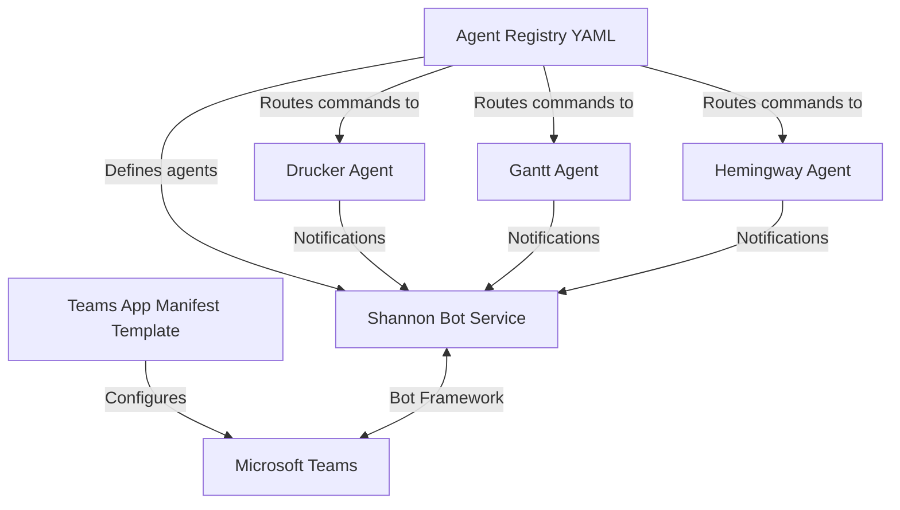
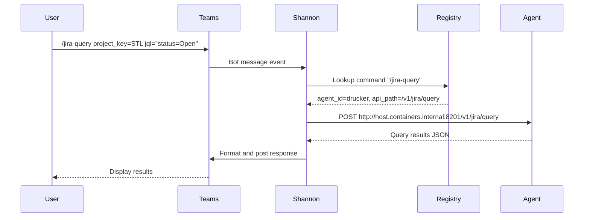
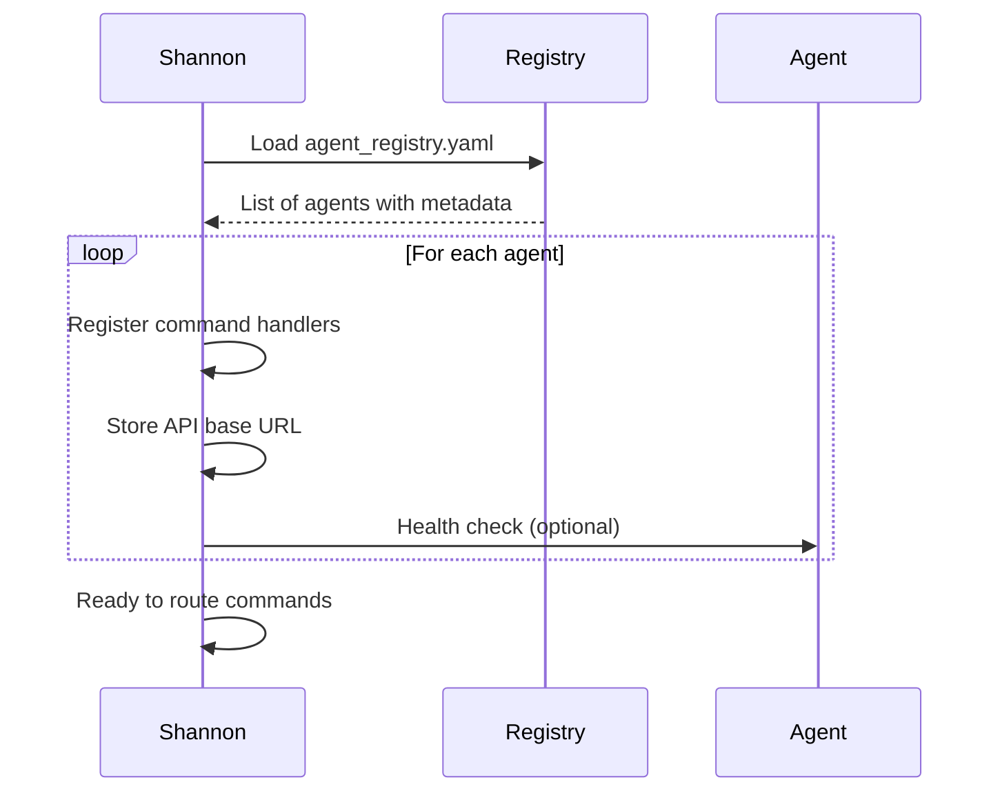
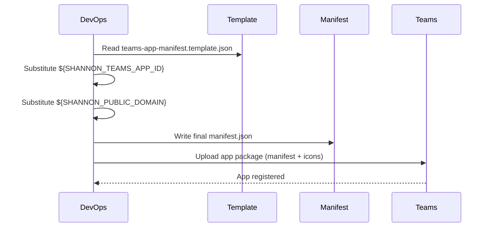

<!-- Generated by Documentation Agent — do not edit between markers -->

```yaml
---
title: "As-Built: Shannon Configuration"
date: "2026-04-06"
status: "draft"
---
```

# Module Overview

The Shannon configuration module defines the agent registry and Teams app manifest for the Cornelis agent workforce. It serves as the single source of truth for agent metadata, command routing, API endpoints, and Teams integration settings. Shannon acts as the communications hub, routing user commands to specialized agents (Drucker, Gantt, Hemingway) and managing their responses through Microsoft Teams channels.

# What Changed

**Before:** The agent registry used YAML indentation with two-space nesting for all agent definitions and command parameters.

**After:** The registry now uses a more compact YAML format with minimal indentation, improving readability and reducing file size by ~7 lines while preserving all functional data.

**Impact:** This is a formatting-only change. No functional behavior is altered. All agents, commands, and parameters remain identical. The change affects only the YAML parser's interpretation path, not the runtime configuration consumed by Shannon or other agents.

# Component Diagram



# Key Flows

## Flow 1: Command Routing from Teams to Agent



**Description:** When a user issues a command in Teams, Shannon parses the command name, looks up the owning agent and API endpoint in 'agent_registry.yaml', forwards the request to the agent's HTTP API, and posts the response back to the Teams channel.

## Flow 2: Agent Registration and Discovery



**Description:** On startup, Shannon loads 'agent_registry.yaml', iterates through all agent definitions, registers their custom commands as bot command handlers, and stores their API endpoints for runtime routing. This enables dynamic command discovery without hardcoding agent-specific logic in Shannon.

## Flow 3: Teams App Manifest Deployment



**Description:** The Teams app manifest template contains environment variable placeholders ('${SHANNON_TEAMS_APP_ID}', '${SHANNON_PUBLIC_DOMAIN}') that are substituted during deployment. The resulting manifest is packaged with app icons and uploaded to Microsoft Teams, registering Shannon as a bot with the specified permissions and scopes.

# Data Model

## Agent Registry Schema

The 'agent_registry.yaml' file defines a list of agent objects with the following structure:

```yaml
agents:
  - agent_id: str              # Unique identifier (e.g., "shannon", "drucker")
    display_name: str          # Human-readable name
    role: str                  # Agent's functional role
    description: str           # Brief description of capabilities
    zone: str                  # Architectural zone (e.g., "service_infrastructure")
    channel_name: str          # Teams channel name
    channel_id: str            # Teams channel ID (thread ID)
    team_id: str               # Teams team ID
    api_base_url: str          # HTTP base URL for agent API (empty for Shannon)
    approval_types: list       # List of approval workflow types (currently unused)
    custom_commands: list      # List of command definitions
      - command: str           # Command name (e.g., "/stats")
        description: str       # Command description
        api_method: str        # HTTP method (GET, POST)
        api_path: str          # API endpoint path
        mutation: bool         # Whether command mutates state (optional)
        params: list           # List of parameter definitions (optional)
          - name: str          # Parameter name
            type: str          # Parameter type (str, int, list)
            required: bool     # Whether parameter is required
            label: str         # Human-readable parameter description
    timeout_seconds: int       # HTTP request timeout
    notify_shannon: bool       # Whether agent posts notifications to Shannon (optional)
    notifications_webhook_url: str  # Power Automate webhook URL (optional)
```

## Teams App Manifest Schema

The 'teams-app-manifest.template.json' follows the [Microsoft Teams app manifest v1.19 schema](https://developer.microsoft.com/json-schemas/teams/v1.19/MicrosoftTeams.schema.json):

- **id**: Teams app ID (substituted from '${SHANNON_TEAMS_APP_ID}')
- **bots**: Array with single bot definition (botId, scopes, capabilities)
- **permissions**: Required permissions ('identity', 'messageTeamMembers')
- **validDomains**: Allowed domains for bot communication (substituted from '${SHANNON_PUBLIC_DOMAIN}')

# Dependencies

| Dependency | Purpose | Version |
|------------|---------|---------|
| Microsoft Teams Bot Framework | Bot registration and message handling | v1.19 |
| YAML parser (PyYAML or equivalent) | Parse agent registry configuration | N/A |
| HTTP client (requests, httpx, etc.) | Forward commands to agent APIs | N/A |
| Environment variable substitution | Inject deployment-specific values into manifest | N/A |

# Configuration

## Environment Variables

- **SHANNON_TEAMS_APP_ID**: Microsoft Teams application ID for Shannon bot (required for manifest generation)
- **SHANNON_PUBLIC_DOMAIN**: Public domain name for Shannon service (required for manifest generation)

## Configuration Files

- **config/shannon/agent_registry.yaml**: Agent metadata, command definitions, and API routing rules
- **config/shannon/teams-app-manifest.template.json**: Teams app manifest template with placeholder variables

## Feature Flags

None. All agents and commands are enabled by default based on registry entries.

# Error Handling

The configuration files themselves do not contain error handling logic. Error handling occurs in the Shannon service that consumes these files:

- **Missing agent in registry**: Shannon logs a warning and skips command registration for that agent.
- **Invalid YAML syntax**: Shannon fails to start and logs a parse error.
- **Unreachable agent API**: Shannon returns a timeout error to the user after 'timeout_seconds' (default 15-60s depending on agent).
- **Missing environment variables in manifest**: Deployment script fails with substitution error.

# Known Limitations / Technical Debt

1. **Hardcoded channel IDs**: Teams channel IDs and team IDs are hardcoded in the registry. If channels are recreated, the registry must be manually updated.

2. **No schema validation**: The YAML file lacks a formal schema definition (e.g., JSON Schema, Pydantic model). Invalid entries may cause runtime errors rather than startup validation failures.

3. **Duplicate command names**: The registry does not enforce uniqueness of command names across agents. If two agents define '/stats', the behavior is undefined (likely last-wins).

4. **Missing API versioning**: Agent API base URLs do not include version prefixes (e.g., '/v1'). API path changes require registry updates.

5. **Notification webhook URL in plaintext**: Drucker's Power Automate webhook URL is stored in plaintext in the registry. This should be moved to a secure secret store.

6. **No command parameter validation**: Parameter types ('str', 'int', 'list') are documented but not enforced. Shannon must implement its own validation logic.

7. **Gantt channel_id is empty**: The Gantt agent has an empty 'channel_id' field, suggesting incomplete configuration or a placeholder for future use.

8. **Approval types unused**: All agents have 'approval_types: []', indicating an unimplemented approval workflow feature.

<!-- End Documentation Agent generated content -->