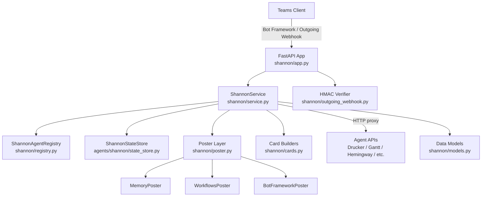
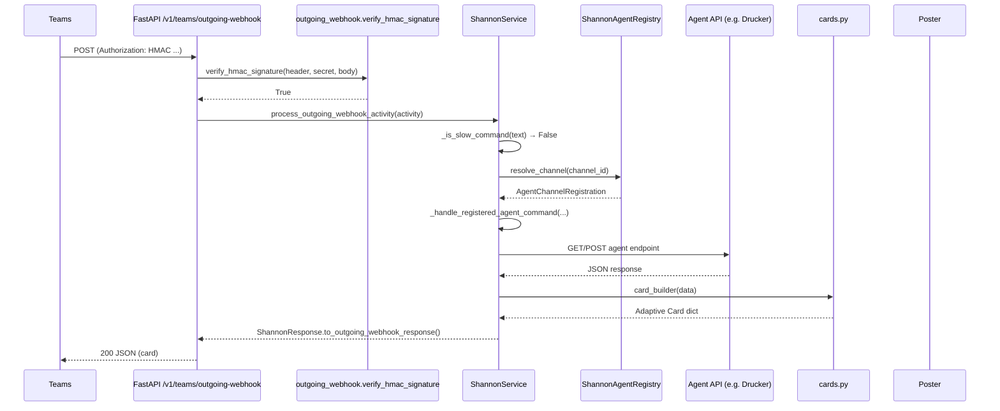
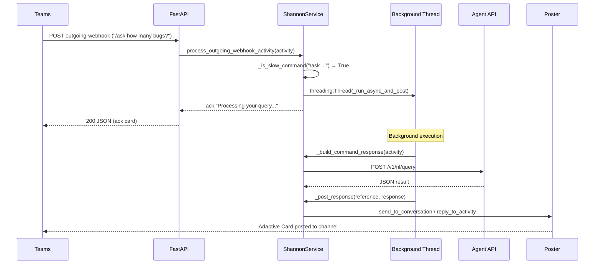
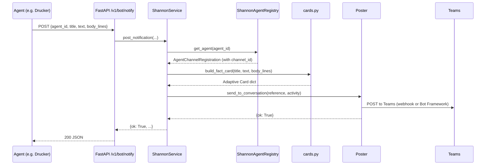

<!-- Generated by Documentation Agent — do not edit between markers -->

```yaml
---
title: "As-Built: Shannon — Communications Agent"
date: "2026-04-03"
status: "draft"
---
```

## Module Overview

Shannon is the single Microsoft Teams bot and routing surface for the Cornelis agent workforce. It receives commands from Teams users — via Bot Framework activities, outgoing webhooks, or direct API calls — normalizes them, resolves the target agent from a YAML-based channel-to-agent registry, proxies the request to that agent's HTTP API, and renders the response as an Adaptive Card posted back to Teams. Shannon also exposes its own introspection commands (`/stats`, `/busy`, `/work-today`, `/decision-tree`, `/why`) and a notification endpoint that any agent can call to push alerts into a Teams channel. The module supports three posting backends (in-memory for tests, Workflows incoming webhooks, and full Bot Framework connector), HMAC-authenticated outgoing webhooks, and an asynchronous deferred-execution path for slow commands like natural-language queries.

## What Changed

**Before:** Jira ticket references in Adaptive Card text were rendered as plain strings. The Drucker `/stats` card showed a minimal four-field layout (`total_reports`, `projects_analyzed`, `total_findings`, `proposed_actions`). Natural-language `/ask` commands and several Jira-specific card builders (`build_jira_query_card`, `build_jira_release_status_card`, `build_jira_ticket_counts_card`, `build_jira_status_report_card`, `build_nl_query_card`) did not exist. Unknown commands in the Shannon channel had no cross-channel redirect. Outgoing webhook processing was fully synchronous — slow agent calls blocked the Teams response timeout. POST command parameter parsing always used positional key-value pair splitting.

**After:** All card text and fact values are now auto-linkified: any Jira ticket key (e.g. `STL-1234`) is converted to a clickable Markdown link via `_linkify_tickets()`. The Drucker `/stats` card renders a richer breakdown including per-category activity, PR reminder counts, and timestamps. Six new card builders support Jira queries, release status, ticket counts, project status reports, and natural-language query results for both Drucker and Gantt agents. Shannon now redirects commands typed in the wrong channel with a `wrong_channel_redirect` decision. Slow commands (`/ask`, `/planning-snapshot`, `/release-monitor`, `/release-survey`, and any non-slash free-text query) are deferred to a background thread with an immediate acknowledgment returned to Teams. POST commands with a single required string parameter now join all trailing arguments into one value instead of requiring key-value pairs.

**Impact:** Teams users see clickable Jira links in every card. Users who type a command in the wrong channel get a helpful redirect instead of "unknown command." Natural-language queries no longer risk a Teams webhook timeout. Agents that expose `/v1/nl/query` (Drucker, Gantt) are now reachable via free-text input in their respective channels.

## Component Diagram



## Key Flows

### Flow 1: Outgoing Webhook Command Routing (Fast Path)

A Teams user @-mentions the Shannon bot in an agent channel. Teams sends an outgoing webhook POST. Shannon verifies the HMAC signature, resolves the channel to an agent, proxies the command to the agent API, builds an Adaptive Card from the response, and returns it synchronously.



### Flow 2: Deferred Slow Command (Async Path)

When a user issues a slow command (e.g. `/ask` or free-text natural-language query), Shannon immediately returns an acknowledgment to avoid the Teams webhook timeout, then processes the command in a background thread and posts the result via the configured poster.



### Flow 3: Agent Notification Push

Any agent in the workforce can POST to `/v1/bot/notify` to push an alert into a Teams channel. Shannon resolves the target channel from the agent registry, builds a fact card, and posts it via the configured poster.



## Data Model

### `AgentChannelRegistration` (`shannon/models.py`)

Maps a Teams channel to an agent. Loaded from `config/shannon/agent_registry.yaml` by `ShannonAgentRegistry`.

```python
@dataclass
class AgentChannelRegistration:
    agent_id: str
    display_name: str
    role: str
    description: str
    zone: str = 'service_infrastructure'
    channel_id: str = ''
    channel_name: str = ''
    team_id: str = ''
    api_base_url: str = ''
    icon_url: str = ''
    notifications_webhook_url: str = ''
    approval_types: List[str] = field(default_factory=list)
    custom_commands: List[Dict[str, Any]] = field(default_factory=list)
    timeout_seconds: int = 30
```

### `ConversationReference` (`shannon/models.py`)

Captures the full Teams conversation context from an inbound activity. Used by posters to address replies.

```python
@dataclass
class ConversationReference:
    reference_id: str          # UUID prefix
    captured_at: str           # ISO-8601 UTC
    agent_id: str
    service_url: str
    channel_id: str
    channel_name: str
    team_id: str
    tenant_id: str
    conversation_id: str
    conversation_type: str
    reply_to_id: str
    user_id: str
    user_name: str
    bot_id: str
    bot_name: str
    raw_activity_type: str
```

### `AuditRecord` (`shannon/models.py`)

Every routing decision, notification post, and error is recorded as an `AuditRecord` and stored in `ShannonStateStore`. Exposed via `/v1/status/decisions`.

```python
@dataclass
class AuditRecord:
    record_id: str             # UUID prefix (8 chars)
    timestamp: str             # ISO-8601 UTC
    event_type: str            # 'decision', 'notification_posted', 'error', etc.
    status: str = 'ok'
    agent_id: str = 'shannon'
    channel_id: str = ''
    conversation_id: str = ''
    command: str = ''
    decision: str = ''
    details: Dict[str, Any] = field(default_factory=dict)
```

### `ShannonResponse` (`shannon/models.py`)

Internal response object that carries both plain text and an optional Adaptive Card. Provides two serialization methods:

- `to_message_activity()` — Bot Framework activity shape
- `to_outgoing_webhook_response()` — adds `contentUrl`, `name`, `thumbnailUrl` fields required by Teams outgoing webhook responses

### Command Text Normalization

```python
MENTION_RE = re.compile(r'<at>.*?</at>', re.IGNORECASE | re.DOTALL)
TAG_RE = re.compile(r'<[^>]+>')

def normalize_command_text(text: str) -> str:
    # Strips <at>Bot</at> markup, HTML tags, &nbsp;, collapses whitespace
```

## Dependencies

| Dependency | Purpose | Version |
|---|---|---|
| `fastapi` | HTTP framework for all Shannon endpoints | — |
| `uvicorn` | ASGI server (used by `run()`) | — |
| `pydantic` | Request body validation (`NotificationRequest`) | — |
| `requests` | HTTP client for agent API proxying and Bot Framework token exchange | — |
| `pyyaml` | Agent registry YAML loading | — |
| `python-dotenv` | `.env` file loading at import time | — |
| `agents.rename_registry` | `canonical_agent_name()`, `agent_display_name()` for agent ID normalization | Internal |
| `config.env_loader` | `resolve_dry_run()` for dry-run mode resolution | Internal |
| `agents.shannon.state_store` | `ShannonStateStore` for audit records and statistics | Internal |

## Configuration

| Variable | Purpose | Default |
|---|---|---|
| `SHANNON_HOST` | Bind address for uvicorn | `0.0.0.0` |
| `SHANNON_PORT` | Bind port for uvicorn | `8200` |
| `SHANNON_TEAMS_BOT_NAME` | Display name used in responses | `Shannon` |
| `SHANNON_TEAMS_POST_MODE` | Poster backend: `memory`, `workflows`, or `botframework` | `memory` |
| `SHANNON_TEAMS_WORKFLOWS_WEBHOOK_URL` | Workflows incoming webhook URL (when mode=`workflows`) | — |
| `SHANNON_TEAMS_APP_ID` | Azure Bot registration app ID (when mode=`botframework`) | — |
| `SHANNON_TEAMS_APP_PASSWORD` | Azure Bot registration app secret (when mode=`botframework`) | — |
| `SHANNON_TEAMS_OUTGOING_WEBHOOK_SECRET` | Base64-encoded HMAC secret for outgoing webhook verification | — |
| `SHANNON_AGENT_REGISTRY_PATH` | Path to agent registry YAML | `config/shannon/agent_registry.yaml` |
| `SHANNON_SEND_WELCOME_ON_INSTALL` | Send welcome card on `installationUpdate` activity | `true` |
| `{AGENT_ID}_API_URL` | Per-agent API base URL override (e.g. `DRUCKER_API_URL`) | — |

## Error Handling

**HMAC Verification:** The outgoing webhook endpoint (`/v1/teams/outgoing-webhook`) returns HTTP 401 if `verify_hmac_signature()` fails. The function uses `hmac.compare_digest()` for timing-safe comparison.

```python
if not verify_hmac_signature(authorization, secret, body_bytes):
    raise HTTPException(status_code=401, detail='Invalid outgoing webhook signature')
```

**Agent API Proxy Errors:** `_call_agent_api()` in `shannon/service.py` wraps all `requests` calls. On failure, the response is converted to a `ShannonResponse` with `decision='agent_call_error'` and the error text is surfaced to the user as a card. HTTP exceptions from agent APIs are caught and logged.

**Activity Processing:** Both `/api/messages` and `/v1/teams/outgoing-webhook` catch broad `Exception` at the endpoint level, log the traceback, and return HTTP 500 with the exception message.

**Notification Validation:** `POST /v1/bot/notify` catches `ValueError` (e.g. unknown agent_id) and returns HTTP 400.

**Decision Not Found:** `GET /v1/status/decisions/{record_id}` returns HTTP 404 when the audit record does not exist.

**Bot Framework Token:** `BotFrameworkPoster._get_access_token()` raises `RuntimeError` if the OAuth token response lacks an `access_token` field.

## Known Limitations / Technical Debt

1. **Bot Framework token caching is naive.** `BotFrameworkPoster._access_token` is cached indefinitely after the first fetch — there is no expiry check or refresh logic. If the token expires (typically after 1 hour), all Bot Framework posts will fail until the service restarts.

2. **Hardcoded Jira base URL.** The ticket linkification in `shannon/cards.py` uses a hardcoded Atlassian URL:
   ```python
   _JIRA_BASE = 'https://cornelisnetworks.atlassian.net/browse'
   ```
   This should be configurable via environment variable for portability.

3. **Hardcoded project key in NL fallback.** When an unrecognized command falls through to the natural-language query path, the project key is hardcoded:
   ```python
   json_body={'query': command_text, 'project_key': 'STL'},
   ```

4. **Thread-per-request for slow commands.** `_run_async_and_post()` spawns a raw `threading.Thread` for each deferred command. There is no thread pool, no concurrency limit, and no timeout. Under load, this could exhaust system threads.

5. **`service.py` is a large module.** `ShannonService` contains all command routing, agent API proxying, card builder dispatch, status introspection, and posting logic in a single class. The file imports over 20 card builders and contains multiple dispatch tables (`STANDARD_COMMAND_ROUTES`, `MUTATION_COMMANDS`, per-agent card builder maps). This is approaching god-class territory and is a candidate for decomposition into a router module and per-agent handler modules.

6. **Missing error handling on `_run_async_and_post`.** While the method has a top-level `try/except`, failures are only logged — there is no mechanism to notify the user that their deferred query failed.

7. **`cards.py` source is truncated in the provided files.** Several card builders referenced by `service.py` (e.g. `build_ci_failures_card`, `build_stale_branches_card`, `build_hemingway_doc_card`, `build_pr_list_card`, `build_pr_reviews_card`, `build_merge_conflicts_card`, `build_naming_compliance_card`, `build_hemingway_confluence_publish_card`, `build_dry_run_preview_card`) are imported but their implementations were not included in the source files provided for this document. Their existence is confirmed by the import statements in `service.py`.

8. **Duplicate NL query card builders.** `build_gantt_nl_query_card` and `build_nl_query_card` have nearly identical logic (same field extraction, same ticket list rendering) but produce different titles ("Gantt Query Result" vs. "Drucker Query Result"). These should be consolidated with a parameterized title.

<!-- End Documentation Agent generated content -->