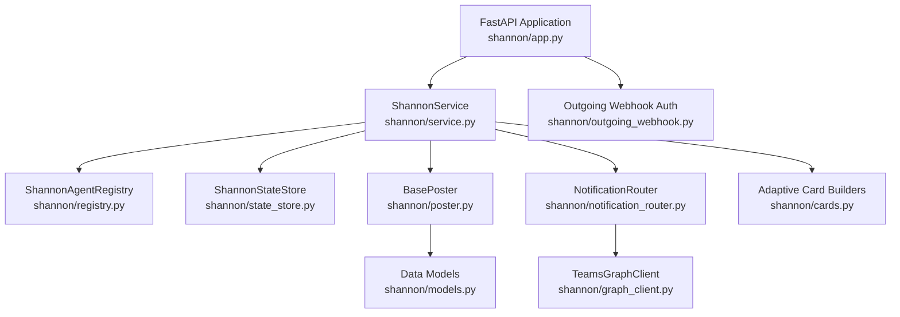
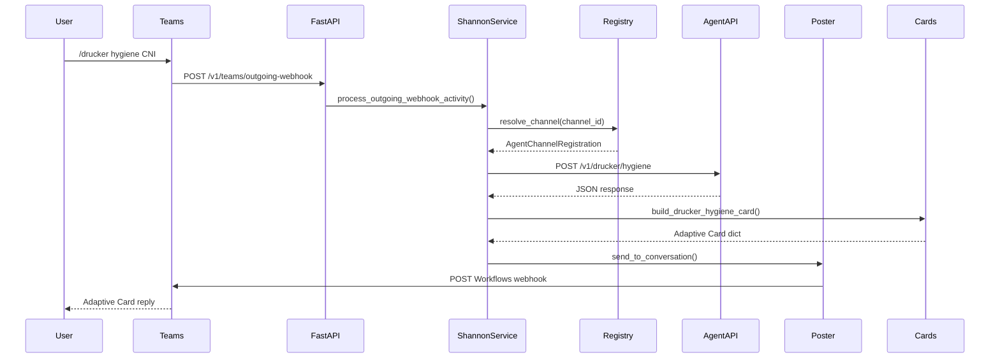
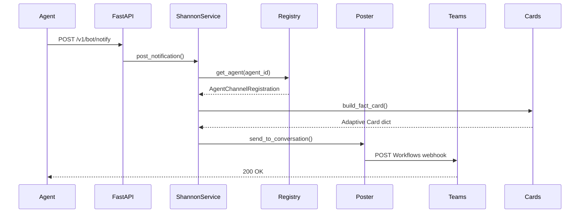
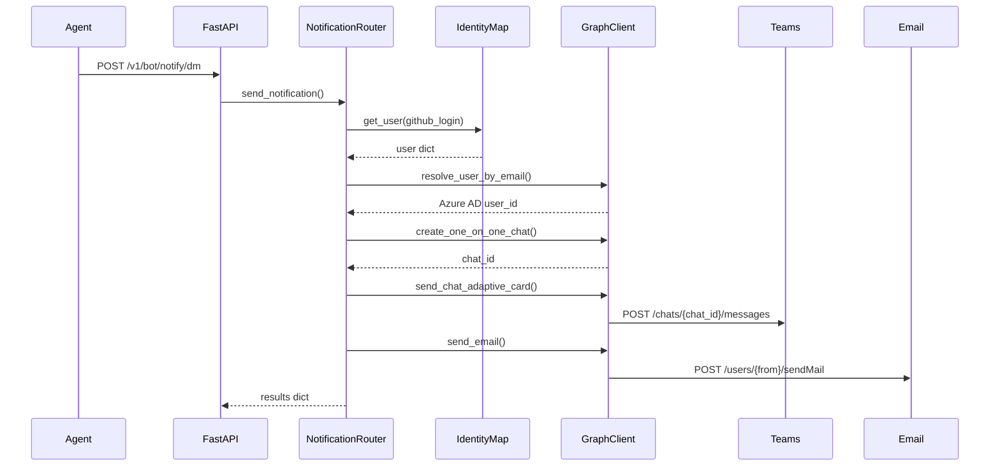

<!-- Generated by Documentation Agent — do not edit between markers -->

```yaml
---
title: "As-Built: Shannon — Teams Communications Agent"
date: "2026-04-06"
status: "draft"
---
```

# Module Overview

Shannon is a FastAPI-based Microsoft Teams bot service that acts as the unified communications surface for the Cornelis agent workforce. It routes slash commands from Teams channels to registered agent APIs, renders responses as Adaptive Cards, posts notifications to Teams channels via Workflows webhooks or Bot Framework, and dispatches direct messages and emails to users via Microsoft Graph API. Shannon maintains a registry of agent-to-channel mappings, persists conversation references for threaded replies, and records audit trails of all routing decisions.

# What Changed

**Before:** Shannon only posted notifications to Teams channels via Workflows webhooks or Bot Framework.

**After:** Shannon now dispatches notifications to individual users via Teams DM and email using the new `NotificationRouter` class and Microsoft Graph API integration.

**Impact:**
- Agents (Drucker, Gantt, Hemingway) can now send targeted notifications to specific users or broadcast to all users in `config/identity_map.yaml`.
- New endpoint `POST /v1/bot/notify/dm` accepts `DMNotifyRequest` payloads with `target_users` (GitHub logins).
- `ShannonService.post_notification()` now calls `send_notification()` after posting to the channel, enabling dual delivery (channel + DM/email).
- Users control delivery channels via `notify_via: [teams_dm, email]` in their identity map entry.

# Component Diagram



# Key Flows

## Flow 1: Teams Slash Command Routing

**Description:** A user sends a slash command in a Teams channel. Shannon resolves the target agent from the registry, forwards the command to the agent's API, and posts the response as an Adaptive Card.



## Flow 2: Agent Notification Posting

**Description:** An agent (e.g., Drucker) posts a notification to a Teams channel via Shannon's `/v1/bot/notify` endpoint. Shannon resolves the channel from the registry and posts the card via the configured poster.



## Flow 3: Direct DM + Email Notification

**Description:** An agent sends a notification to specific users via `/v1/bot/notify/dm`. Shannon's `NotificationRouter` resolves user identities from `identity_map.yaml`, creates 1:1 Teams chats via Graph API, and sends emails via Graph API.



# Data Model

## Core Data Structures

### `AgentChannelRegistration` (shannon/models.py)
Describes how Shannon maps a Teams channel to an agent API.

```python
@dataclass
class AgentChannelRegistration:
    agent_id: str                # e.g., 'drucker'
    display_name: str            # e.g., 'Drucker'
    role: str                    # e.g., 'Jira hygiene and workflow automation'
    description: str
    zone: str = 'service_infrastructure'
    channel_id: str = ''         # Teams channel ID
    channel_name: str = ''       # e.g., 'agent-drucker'
    team_id: str = ''
    api_base_url: str = ''       # e.g., 'http://cn-ai-03:8201'
    icon_url: str = ''
    notifications_webhook_url: str = ''
    approval_types: List[str] = field(default_factory=list)
    custom_commands: List[Dict[str, Any]] = field(default_factory=list)
    timeout_seconds: int = 30
```

### `ConversationReference` (shannon/models.py)
Persisted Teams conversation metadata for threaded replies and notifications.

```python
@dataclass
class ConversationReference:
    reference_id: str            # 8-char UUID
    captured_at: str             # ISO-8601 timestamp
    agent_id: str
    service_url: str             # e.g., 'https://smba.trafficmanager.net/amer/'
    channel_id: str
    channel_name: str
    team_id: str
    tenant_id: str
    conversation_id: str
    conversation_type: str       # 'channel' or 'personal'
    reply_to_id: str             # Activity ID for threading
    user_id: str
    user_name: str
    bot_id: str
    bot_name: str
    raw_activity_type: str       # 'message', 'conversationUpdate', etc.
```

### `AuditRecord` (shannon/models.py)
Audit trail for Shannon routing decisions and events.

```python
@dataclass
class AuditRecord:
    record_id: str               # 8-char UUID
    timestamp: str               # ISO-8601
    event_type: str              # 'decision', 'notification', 'error'
    status: str = 'ok'
    agent_id: str = 'shannon'
    channel_id: str
    conversation_id: str
    team_id: str
    user_id: str
    user_name: str
    command: str
    decision: str                # e.g., 'routed_to_drucker'
    details: Dict[str, Any] = field(default_factory=dict)
```

### `ShannonResponse` (shannon/models.py)
Response payload generated by Shannon before posting to Teams.

```python
@dataclass
class ShannonResponse:
    text: str
    card: Optional[Dict[str, Any]] = None
    command: str = ''
    decision: str = ''
    metadata: Dict[str, Any] = field(default_factory=dict)

    def to_message_activity(self) -> Dict[str, Any]:
        # Converts to Bot Framework message activity
    
    def to_outgoing_webhook_response(self) -> Dict[str, Any]:
        # Converts to Teams Outgoing Webhook response shape
```

## State Persistence

Shannon uses `ShannonStateStore` (not shown in source files) to persist:
- Conversation references (keyed by `channel_id` or `conversation_id`)
- Audit records (keyed by `record_id`)
- Throughput statistics (messages/commands/notifications per day)

# Dependencies

| Dependency | Purpose | Version |
|------------|---------|---------|
| `fastapi` | Web framework for REST API | (not specified) |
| `pydantic` | Request/response validation | (not specified) |
| `requests` | HTTP client for agent API calls | (not specified) |
| `python-dotenv` | Environment variable loading | (not specified) |
| `pyyaml` | YAML parsing for registry and identity map | (not specified) |
| `uvicorn` | ASGI server for FastAPI | (not specified) |
| `agents.rename_registry` | Agent name canonicalization | Internal |
| `agents.shannon.graph_client` | Microsoft Graph API client | Internal |
| `agents.shannon.state_store` | State persistence layer | Internal |
| `config.env_loader` | Dry-run flag resolution | Internal |

# Configuration

## Environment Variables

| Variable | Purpose | Default |
|----------|---------|---------|
| `SHANNON_HOST` | FastAPI bind host | `0.0.0.0` |
| `SHANNON_PORT` | FastAPI bind port | `8200` |
| `SHANNON_TEAMS_POST_MODE` | Poster mode: `memory`, `workflows`, `botframework` | `memory` |
| `SHANNON_TEAMS_WORKFLOWS_WEBHOOK_URL` | Workflows incoming webhook URL | (required if mode=workflows) |
| `SHANNON_TEAMS_APP_ID` | Azure Bot Framework app ID | (required if mode=botframework) |
| `SHANNON_TEAMS_APP_PASSWORD` | Azure Bot Framework app password | (required if mode=botframework) |
| `SHANNON_TEAMS_OUTGOING_WEBHOOK_SECRET` | HMAC secret for outgoing webhook auth | (required) |
| `SHANNON_TEAMS_BOT_NAME` | Bot display name | `Shannon` |
| `SHANNON_SEND_WELCOME_ON_INSTALL` | Send welcome message on bot install | `true` |
| `SHANNON_AGENT_REGISTRY_PATH` | Path to agent registry YAML | `config/shannon/agent_registry.yaml` |
| `CONFIG_DIR` | Base config directory | `config` |
| `NOTIFICATION_EMAIL_FROM` | Default from-address for email notifications | `shannon@cornelisnetworks.com` |
| `{AGENT_ID}_API_URL` | Override agent API base URL (e.g., `DRUCKER_API_URL`) | (optional) |

## Configuration Files

### `config/shannon/agent_registry.yaml`
Defines agent-to-channel mappings and custom commands.

```yaml
agents:
  - agent_id: drucker
    display_name: Drucker
    role: Jira hygiene and workflow automation
    description: Monitors Jira for hygiene issues and automates workflows
    zone: service_infrastructure
    channel_id: "19:abc123..."
    channel_name: agent-drucker
    team_id: "19:def456..."
    api_base_url: http://cn-ai-03:8201
    notifications_webhook_url: https://prod-123.workflow.office.com/...
    custom_commands:
      - command: /hygiene
        description: Run hygiene scan on a Jira project
        params:
          - name: project_key
            type: str
            required: true
```

### `config/identity_map.yaml`
Maps GitHub logins to Teams/email identities and notification preferences.

```yaml
defaults:
  notify_via: [teams_dm, email]
  email_from: shannon@cornelisnetworks.com

users:
  jmac-cornelis:
    email: jmac@cornelisnetworks.com
    teams_email: jmac@cornelisnetworks.com
    jira_account_id: "5f9a1b2c3d4e5f6g7h8i9j0k"
    notify_via: [teams_dm, email]
```

# Error Handling

## Exception Hierarchy

Shannon uses FastAPI's `HTTPException` for HTTP-level errors:

```python
# shannon/app.py
raise HTTPException(status_code=400, detail='Invalid JSON payload')
raise HTTPException(status_code=401, detail='Invalid outgoing webhook signature')
raise HTTPException(status_code=404, detail='Decision not found')
raise HTTPException(status_code=500, detail=str(exc))
```

## Error Handling Patterns

1. **Agent API Failures**: Wrapped in try/except, logged, and returned as error cards:
   ```python
   # shannon/service.py
   try:
       response = self.session.post(url, json=payload, timeout=timeout)
       response.raise_for_status()
   except requests.RequestException as exc:
       log.exception('Agent API call failed')
       return self._build_error_response(...)
   ```

2. **Notification Router Failures**: Non-fatal, logged as warnings:
   ```python
   # shannon/service.py
   try:
       dm_result = send_notification(...)
   except Exception as e:
       log.warning('NotificationRouter dispatch failed (non-fatal): %s', e)
       dm_result = {'error': str(e)}
   ```

3. **HMAC Signature Verification**: Returns 401 if signature is invalid:
   ```python
   # shannon/app.py
   if not verify_hmac_signature(authorization, secret, body_bytes):
       raise HTTPException(status_code=401, detail='Invalid outgoing webhook signature')
   ```

4. **Missing Configuration**: Raises `ValueError` or `FileNotFoundError` at startup:
   ```python
   # shannon/registry.py
   if not self.registry_path.exists():
       raise FileNotFoundError(f'Shannon agent registry not found: {self.registry_path}')
   ```

# Known Limitations / Technical Debt

## Hardcoded Values
- **Jira base URL**: `_JIRA_BASE = 'https://cornelisnetworks.atlassian.net/browse'` in `shannon/cards.py` (line 18)
- **Bot Framework token URL**: `TOKEN_URL = 'https://login.microsoftonline.com/botframework.com/oauth2/v2.0/token'` in `shannon/poster.py` (line 158)
- **Token scope**: `TOKEN_SCOPE = 'https://api.botframework.com/.default'` in `shannon/poster.py` (line 159)

## Missing Implementations
- **Token refresh**: `BotFrameworkPoster._get_access_token()` does not implement token expiration or refresh logic (line 171-186 in `shannon/poster.py`).
- **Retry logic**: Agent API calls in `ShannonService._forward_to_agent()` do not retry on transient failures.
- **Rate limiting**: No rate limiting or backoff for Microsoft Graph API calls in `NotificationRouter`.

## Areas for Improvement
- **Card builder coverage**: Not all agent response types have dedicated card builders (e.g., missing builders for some Gantt and Hemingway response types referenced in `shannon/cards.py` imports but not shown in source).
- **Audit record pruning**: `ShannonStateStore` does not implement automatic pruning of old audit records.
- **Conversation reference expiration**: No TTL or cleanup for stale conversation references.
- **Synchronous notification dispatch**: `send_notification()` uses `asyncio.run()` in a thread pool when called from sync code, which may cause performance issues under high load (line 310-330 in `shannon/notification_router.py`).

## Anti-patterns Detected
- **God class**: `ShannonService` (shannon/service.py) has 1000+ lines and handles command routing, notification posting, card building, agent API calls, and state management. Consider splitting into separate classes for routing, notification, and card rendering.
- **Missing error handling**: `NotificationRouter._send_teams_dm()` and `_send_email()` do not handle Graph API rate limiting (429 responses).
- **Hardcoded credentials**: No hardcoded credentials detected (all secrets loaded from environment variables).

<!-- End Documentation Agent generated content -->