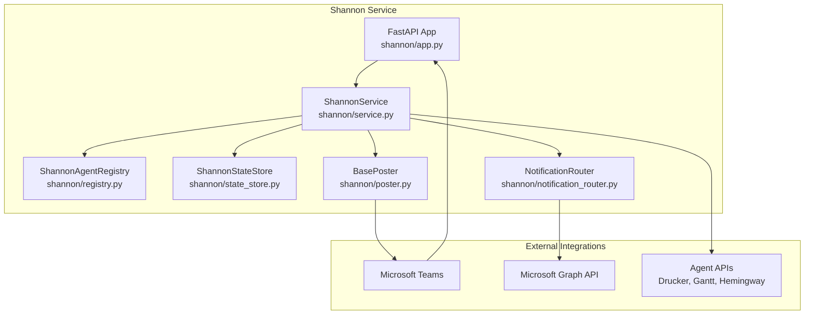
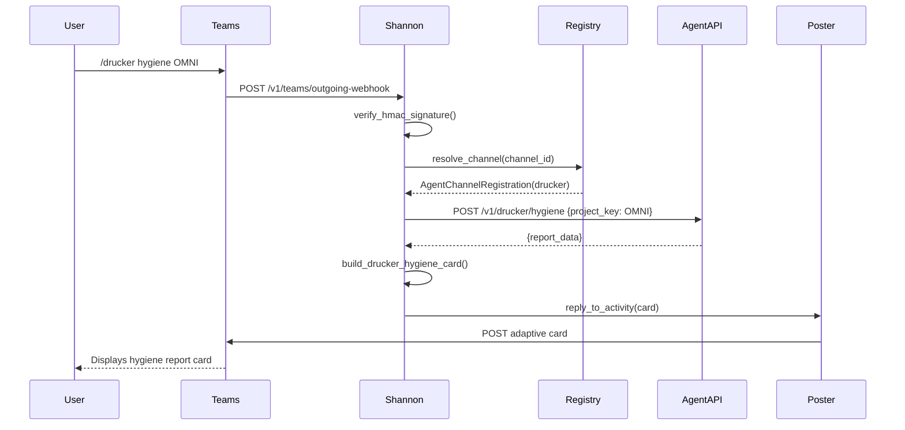
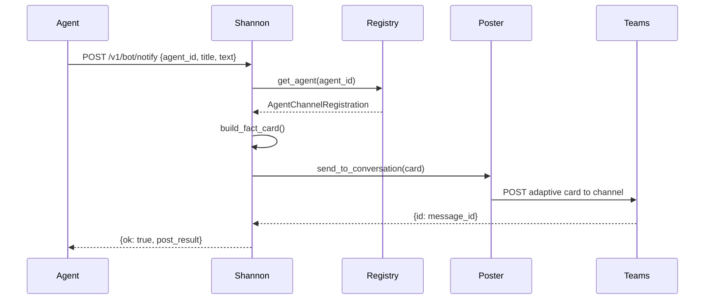
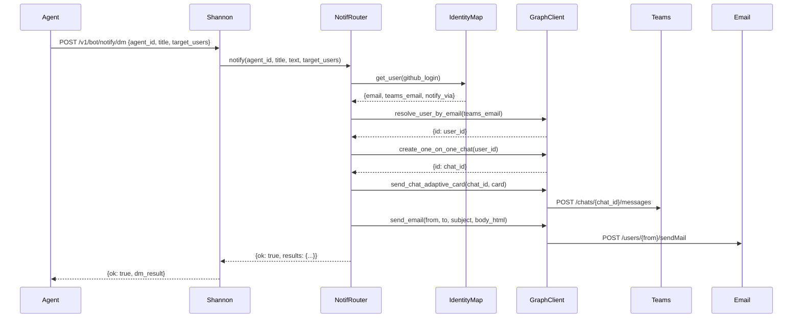

<!-- Generated by Documentation Agent — do not edit between markers -->

```yaml
---
title: "As-Built: Shannon — Teams Communications Agent"
date: "2026-04-06"
status: "draft"
---
```

# Module Overview

Shannon is a FastAPI-based Microsoft Teams bot service that acts as the unified communications surface for the Cornelis agent workforce. It routes user commands from Teams channels to registered agent APIs, renders responses as Adaptive Cards, posts notifications to Teams channels, and dispatches direct messages and emails to users via Microsoft Graph API. Shannon maintains a registry of agent-to-channel mappings, tracks conversation references for threaded replies, and audits all routing decisions for observability.

# What Changed

**Before:** Shannon posted notifications only to Teams channels via incoming webhooks or Bot Framework.

**After:** Shannon now dispatches notifications to individual users via Teams DM and email using the new `NotificationRouter` and Microsoft Graph API integration.

**Impact:**
- Agents (Drucker, Gantt, Hemingway) can now send targeted notifications to specific users or broadcast to all users in the identity map.
- New endpoint `/v1/bot/notify/dm` accepts `DMNotifyRequest` payloads with `target_users` (GitHub logins).
- `ShannonService.post_notification()` now calls `send_notification()` after posting to the channel, enabling dual delivery (channel + DM/email).
- Users control delivery channels via `notify_via: [teams_dm, email]` in `config/identity_map.yaml`.

# Component Diagram



# Key Flows

## Flow 1: Teams Command Routing

**Description:** User sends a slash command in a Teams channel. Shannon resolves the target agent from the registry, forwards the command to the agent's API, and posts the response as an Adaptive Card.



## Flow 2: Agent Notification Posting

**Description:** An agent (e.g., Drucker) posts a notification to a Teams channel via Shannon's `/v1/bot/notify` endpoint. Shannon resolves the channel from the registry and posts the card.



## Flow 3: DM + Email Notification Dispatch

**Description:** Shannon dispatches a notification to target users via Teams DM and email using the `NotificationRouter` and Microsoft Graph API.



# Data Model

## Core Data Structures

### `AgentChannelRegistration` (shannon/models.py)
Describes how Shannon maps a Teams channel to an agent API.

```python
@dataclass
class AgentChannelRegistration:
    agent_id: str                # e.g., 'drucker'
    display_name: str            # e.g., 'Drucker'
    role: str                    # e.g., 'Jira hygiene and triage'
    description: str
    zone: str = 'service_infrastructure'
    channel_id: str = ''         # Teams channel ID
    channel_name: str = ''       # e.g., 'agent-drucker'
    team_id: str = ''
    api_base_url: str = ''       # e.g., 'http://cn-ai-03:8201'
    icon_url: str = ''
    notifications_webhook_url: str = ''
    approval_types: List[str] = field(default_factory=list)
    custom_commands: List[Dict[str, Any]] = field(default_factory=list)
    timeout_seconds: int = 30
```

### `ConversationReference` (shannon/models.py)
Teams conversation metadata persisted by Shannon for threaded replies and notifications.

```python
@dataclass
class ConversationReference:
    reference_id: str            # 8-char UUID
    captured_at: str             # ISO-8601 timestamp
    agent_id: str
    service_url: str             # e.g., 'https://smba.trafficmanager.net/amer/'
    channel_id: str
    channel_name: str
    team_id: str
    tenant_id: str
    conversation_id: str
    conversation_type: str       # 'channel' or 'personal'
    reply_to_id: str             # Activity ID for threading
    user_id: str
    user_name: str
    bot_id: str
    bot_name: str
    raw_activity_type: str       # 'message', 'conversationUpdate', etc.
```

### `AuditRecord` (shannon/models.py)
Audit trail for Shannon routing decisions and events.

```python
@dataclass
class AuditRecord:
    record_id: str               # 8-char UUID
    timestamp: str               # ISO-8601
    event_type: str              # 'decision', 'notification', 'error'
    status: str = 'ok'
    agent_id: str = 'shannon'
    channel_id: str
    conversation_id: str
    team_id: str
    user_id: str
    user_name: str
    command: str
    decision: str                # e.g., 'routed_to_drucker'
    details: Dict[str, Any] = field(default_factory=dict)
```

### `ShannonResponse` (shannon/models.py)
Response payload generated by Shannon before posting to Teams.

```python
@dataclass
class ShannonResponse:
    text: str
    card: Optional[Dict[str, Any]] = None
    command: str = ''
    decision: str = ''
    metadata: Dict[str, Any] = field(default_factory=dict)
```

## State Storage

Shannon uses `ShannonStateStore` (in-memory) to track:
- **Conversation references** (keyed by `channel_id` or `conversation_id`)
- **Audit records** (list of `AuditRecord` instances)
- **Statistics** (message counts, command counts, error counts)

# Dependencies

| Dependency | Purpose | Version |
|------------|---------|---------|
| `fastapi` | Web framework for REST API | (unspecified) |
| `pydantic` | Request/response validation | (unspecified) |
| `requests` | HTTP client for agent API calls | (unspecified) |
| `uvicorn` | ASGI server | (unspecified) |
| `python-dotenv` | Environment variable loading | (unspecified) |
| `pyyaml` | YAML parsing for registry and identity map | (unspecified) |
| `agents.shannon.graph_client` | Microsoft Graph API client (internal) | (internal) |
| `agents.rename_registry` | Agent name canonicalization (internal) | (internal) |
| `config.env_loader` | Dry-run resolution (internal) | (internal) |

# Configuration

## Environment Variables

| Variable | Purpose | Default |
|----------|---------|---------|
| `SHANNON_HOST` | FastAPI bind host | `0.0.0.0` |
| `SHANNON_PORT` | FastAPI bind port | `8200` |
| `SHANNON_TEAMS_POST_MODE` | Posting mode: `memory`, `workflows`, `botframework` | `memory` |
| `SHANNON_TEAMS_WORKFLOWS_WEBHOOK_URL` | Workflows incoming webhook URL (if mode=workflows) | (none) |
| `SHANNON_TEAMS_APP_ID` | Azure Bot App ID (if mode=botframework) | (none) |
| `SHANNON_TEAMS_APP_PASSWORD` | Azure Bot App Password (if mode=botframework) | (none) |
| `SHANNON_TEAMS_OUTGOING_WEBHOOK_SECRET` | HMAC secret for outgoing webhook verification | (none) |
| `SHANNON_TEAMS_BOT_NAME` | Bot display name | `Shannon` |
| `SHANNON_SEND_WELCOME_ON_INSTALL` | Send welcome message on bot install | `true` |
| `SHANNON_AGENT_REGISTRY_PATH` | Path to agent registry YAML | `config/shannon/agent_registry.yaml` |
| `CONFIG_DIR` | Base config directory | `config` |
| `NOTIFICATION_EMAIL_FROM` | Default from-address for email notifications | `shannon@cornelisnetworks.com` |
| `{AGENT_ID}_API_URL` | Override API base URL for a specific agent (e.g., `DRUCKER_API_URL`) | (none) |

## Configuration Files

### `config/shannon/agent_registry.yaml`
Defines agent-to-channel mappings and custom commands.

**Example:**
```yaml
agents:
  - agent_id: drucker
    display_name: Drucker
    role: Jira hygiene and triage
    description: Monitors Jira for hygiene issues and triages tickets
    zone: service_infrastructure
    channel_id: 19:abc123...
    channel_name: agent-drucker
    team_id: 19:def456...
    api_base_url: http://cn-ai-03:8201
    custom_commands:
      - command: /hygiene
        description: Run hygiene scan on a project
        params:
          - name: project_key
            type: str
            required: true
```

### `config/identity_map.yaml`
Maps GitHub logins to Teams emails, Jira account IDs, and notification preferences.

**Example:**
```yaml
defaults:
  notify_via: [teams_dm, email]
  email_from: shannon@cornelisnetworks.com

users:
  jmac-cornelis:
    email: jmac@cornelisnetworks.com
    teams_email: jmac@cornelisnetworks.com
    jira_account_id: 5f9a1b2c3d4e5f6g7h8i9j0k
    notify_via: [teams_dm, email]
```

# Error Handling

## Exception Hierarchy

Shannon uses FastAPI's `HTTPException` for HTTP-level errors and logs exceptions via Python's `logging` module.

**Common error patterns:**

1. **HMAC signature verification failure** (`shannon/outgoing_webhook.py`):
   - Raises `HTTPException(status_code=401, detail='Invalid outgoing webhook signature')`

2. **Agent API call failure** (`shannon/service.py`):
   - Logs exception via `log.exception()`
   - Returns `ShannonResponse` with error text and card

3. **Missing registry entry** (`shannon/registry.py`):
   - Returns `None` from `get_agent()` or `resolve_channel()`
   - Caller handles gracefully (e.g., "Agent not found" response)

4. **Notification dispatch failure** (`shannon/notification_router.py`):
   - Logs warning via `log.warning()`
   - Returns `{'error': str(e)}` in per-user results dict
   - Non-fatal: channel posting continues even if DM/email fails

## Error Response Format

Shannon returns structured error responses:

```python
{
    'ok': False,
    'error': 'Agent not found',
    'agent_id': 'unknown',
    'command': '/hygiene',
}
```

# Known Limitations / Technical Debt

1. **Hardcoded card builders** (`shannon/cards.py`):
   - Each agent response type has a dedicated `build_*_card()` function.
   - Adding new response types requires code changes.
   - **Improvement:** Consider a declarative card template system.

2. **In-memory state store** (`shannon/state_store.py`):
   - `ShannonStateStore` is not persisted across restarts.
   - Conversation references and audit records are lost on service restart.
   - **Improvement:** Implement persistent storage (e.g., SQLite, Redis).

3. **Missing error handling on Graph API calls** (`shannon/notification_router.py`):
   - `_send_teams_dm()` and `_send_email()` catch exceptions but do not retry.
   - **Improvement:** Add exponential backoff retry logic.

4. **Circular dependency risk**:
   - `shannon/notification_router.py` imports `agents.shannon.graph_client` lazily to avoid circular imports.
   - **Improvement:** Refactor `graph_client` into a standalone package.

5. **Incomplete card truncation** (`shannon/cards.py`):
   - Some card builders (e.g., `build_drucker_hygiene_card()`) truncate findings to 5 items with "...and N more".
   - Others (e.g., `build_pr_list_card()`) truncate to 8 or 15 items inconsistently.
   - **Improvement:** Standardize truncation limits and add pagination support.

6. **Hardcoded JIRA base URL** (`shannon/cards.py`):
   - `_JIRA_BASE = 'https://cornelisnetworks.atlassian.net/browse'` is hardcoded.
   - **Improvement:** Load from environment variable or config file.

7. **God class: `ShannonService`** (`shannon/service.py`):
   - 1,200+ lines with 30+ public methods.
   - Handles command routing, notification posting, card building, and state management.
   - **Improvement:** Extract card building into a separate `CardBuilder` class.

8. **Missing unit tests**:
   - No test files found in the provided source.
   - **Improvement:** Add pytest-based unit tests for `ShannonService`, `NotificationRouter`, and card builders.

<!-- End Documentation Agent generated content -->