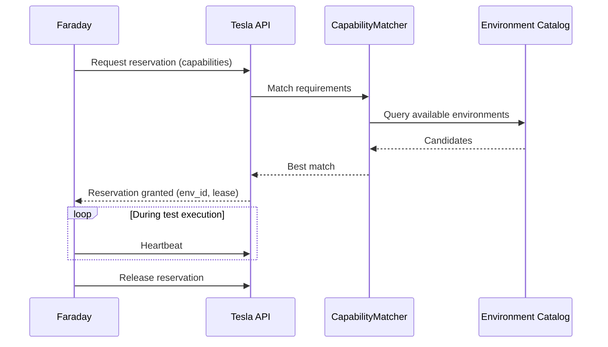
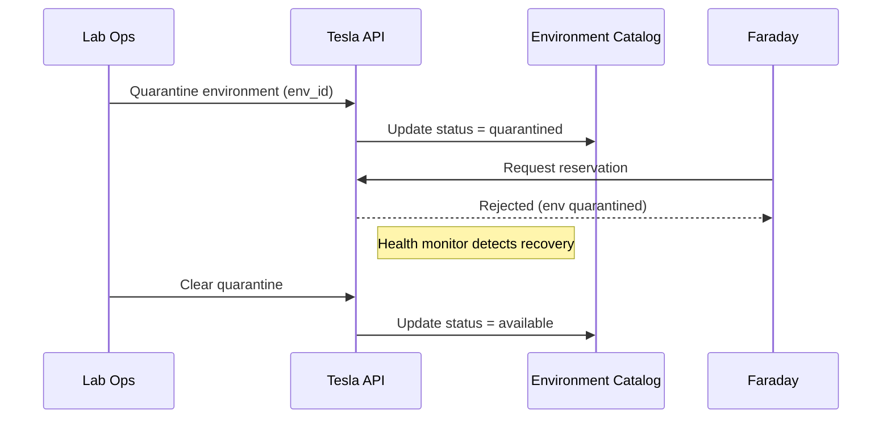

# Tesla Test Environment Manager Plan

## Summary
Tesla should be the shared service that exposes lab and mock-environment state to the test agents and manages reservations for scarce test resources. Its v1 job is not to replace Fuze Test, but to sit in front of it so Ada, Curie, and Faraday can make reservation-aware decisions before invoking Fuze Test in [atf](/Users/johnmacdonald/code/cornelis/atf).

In practical terms:
- Ada decides what kind of environment is needed
- Curie may refine that into executable runtime constraints
- Tesla decides whether that environment is available and reserves it
- Faraday then uses the reserved location, DUT filters, and runtime context to execute the test cycle

## Product definition
### Goal
- provide a machine-readable view of available test environments
- manage reservation requests for HIL and mock environments
- prevent conflicting use of the same scarce DUT or lab partition
- expose health, capability, and utilization data for scheduling
- give the test agents a stable environment contract independent of ATF internals

### Non-goals for v1
- replacing ATF resource files as the source of physical lab description
- becoming a full asset-management CMDB
- dynamically reconfiguring DUT topology during execution
- solving every lab-maintenance workflow
- handling release policy or test-plan selection itself

### Position in the system
- Ada consumes environment state and reservation results during planning
- Curie may consume environment constraints when materializing executable inputs
- Faraday requires an active reservation before running HIL tests
- Fuze Test remains the execution engine once a reservation is granted
- Tesla owns reservation truth and environment availability state

## Triggering model
- Tesla should run as an always-on shared-state and reservation service.
- Normal work should start from reservation requests, reservation heartbeats, releases, quarantine actions, maintenance actions, and environment-state updates.
- Scheduled lease-expiry and health checks should run continuously in the background.
- Humans should be able to quarantine, maintain, reserve, or release environments manually under policy.

## Architecture
### Source of truth model
V1 should use a layered model:
- ATF resource and environment config files remain the source of physical topology and test configuration shape
- Tesla adds dynamic state:
  - current availability
  - reservation ownership
  - maintenance state
  - quarantine state
  - recent failures and health signals

Relevant ATF grounding:
- location selects a `<location>_resources.json` file
- resources files define DUT lists and environment references
- `run-atf.py` already consumes `location`, `dut`, `include`, and `exclude`
- ATF includes operational scripts like [maintain-lab-hosts.py](/Users/johnmacdonald/code/cornelis/atf/executive/maintain-lab-hosts.py)

### Core components
- `EnvironmentCatalog`: loads environment topology from ATF config and publishes normalized environment records
- `ReservationService`: grants, renews, releases, and expires reservations
- `EnvironmentHealthMonitor`: records availability, maintenance, quarantine, and last-known-good status
- `CapabilityMatcher`: matches requested hardware and topology requirements against known environments
- `MaintenanceAdapter`: integrates with existing maintenance scripts or future maintenance actions

### Optional SLURM backend
SLURM can be used as an optional allocation backend, but it should not be the public environment model.

Recommended stance:
- Tesla remains the public API and source of reservation truth for agents
- SLURM, if used, acts as the underlying scheduler or allocator for scarce HIL capacity
- environment identity, ATF location mapping, DUT metadata, maintenance state, and quarantine state remain owned by Tesla

Good uses of SLURM in this design:
- queueing HIL jobs
- enforcing exclusivity
- time-bounded allocations
- worker or rack partitioning
- basic health-aware scheduling

What SLURM should not own directly in this design:
- ATF-facing `location` and DUT-selection semantics
- operator-facing environment records
- environment quarantine policy
- reservation compatibility rules specific to Fuze Test and lab topology

Practical recommendation:
- v1 should use a native reservation service unless SLURM is already an established operational dependency
- later phases may add a SLURM-backed reservation adapter behind the same API if contention, scale, or operations maturity justify it

### Canonical objects
- `EnvironmentRecord`
- `EnvironmentCapabilityProfile`
- `ReservationRequest`
- `EnvironmentReservation`
- `EnvironmentHealthRecord`
- `EnvironmentUtilizationRecord`

## Environment model
### Environment identity
Each reservable environment should have:
- `environment_id`
- `location`
- `environment_class` such as `mock` or `hil`
- `hardware_profile`
- `topology_profile`
- `dut_set`
- `capabilities`
- `status`

### Status model
V1 environment status should support:
- `available`
- `reserved`
- `maintenance`
- `quarantined`
- `degraded`
- `offline`

### Reservation granularity
Reservations should be possible at:
- full environment level for a named lab partition or rack
- DUT subset level when a location contains multiple separable DUTs

Default rule:
- reserve the smallest unit that safely avoids collision
- if safe fine-grained separation is unknown, fall back to reserving the full environment

### Capability matching
The matcher should evaluate:
- required hardware profile
- required topology profile
- mock vs HIL requirement
- required DUT type
- optional include/exclude constraints
- expected reservation duration

## Reservation behavior
### Reservation lifecycle
1. request received
2. environment matched
3. reservation granted or rejected
4. reservation heartbeat renewed while queued or running
5. reservation released on completion, cancellation, or expiry

### Reservation rules
- no two active HIL runs may reserve the same exclusive resource at the same time
- reservation must exist before Faraday dispatches execution to a HIL worker
- mock environments may allow broader concurrency by policy
- reservations should have explicit TTLs plus heartbeats
- orphaned reservations must expire automatically

### Reservation outcomes
- `granted`
- `queued`
- `rejected_no_capacity`
- `rejected_capability_mismatch`
- `rejected_policy`
- `expired`
- `released`

### Conflict policy
- first match does not mean first use; grant only if policy and exclusivity checks pass
- when multiple candidate environments exist, choose the least contended valid environment
- when no HIL environment is available:
  - return a queueable reservation if policy allows waiting
  - return failure immediately if caller requires fast fail
  - permit mock fallback only when explicitly allowed by plan policy

## Public API and contracts
### API surface
- `GET /v1/environments`
  - list known environments with status and capabilities
- `GET /v1/environments/{environment_id}`
  - detailed environment record and current reservation state
- `POST /v1/reservations`
  - input: hardware profile, topology profile, environment class, duration, test plan ID, optional location preference, optional DUT filters
  - output: reservation status plus matched environment if granted
- `POST /v1/reservations/{reservation_id}/heartbeat`
  - renew active reservation
- `POST /v1/reservations/{reservation_id}/release`
  - release reservation explicitly
- `POST /v1/environments/{environment_id}/quarantine`
  - operator action to remove environment from normal scheduling
- `POST /v1/environments/{environment_id}/maintenance`
  - operator action to place environment into maintenance state

### Internal contracts
- `EnvironmentRecord`
- `ReservationRequest`
- `EnvironmentReservation`
- `EnvironmentHealthRecord`
- `ReservationConflict`

## Integration with the test agents
### Ada usage
Ada should:
- query available environment classes and capability matches during planning
- request reservation feasibility before finalizing HIL-heavy plans

### Curie usage
Curie should:
- refine executable suite or DUT targeting based on granted environment shape where needed

### Faraday usage
Faraday should:
- require an active reservation before starting HIL execution
- pass location and DUT-selection context to Fuze Test
- renew the reservation while the run is active
- release the reservation during teardown

### Fuze Test mapping
Tesla should not try to hide the Fuze Test environment model. It should map cleanly into the existing ATF vocabulary:
- `location`
- `dut`
- `include`
- `exclude`

## Observability and operations
### Metrics
Collect:
- reservation request rate
- grant rate
- queue wait time
- reservation duration
- expiry rate
- environment utilization by location and class
- maintenance and quarantine counts
- repeated failure rate by environment

### Events
Emit:
- `environment.discovered`
- `environment.status_changed`
- `environment.quarantined`
- `reservation.requested`
- `reservation.granted`
- `reservation.rejected`
- `reservation.expired`
- `reservation.released`

### Operator controls
Operators should be able to:
- mark an environment offline
- quarantine a flaky environment
- force-release a stuck reservation
- place an environment into maintenance mode
- inspect recent reservation and failure history

## Security and access
- use service principals for reservation and status operations
- separate read access to environment state from write access to reservation and operator controls
- do not expose raw host credentials from ATF resource files through the API
- redact sensitive endpoint details from user-facing responses where not required
- audit every reservation grant, release, force-release, quarantine, and maintenance action

## ATF changes that would improve this design
Tesla can be built alongside ATF as-is, but the following changes would improve the integration substantially.

### 1. Machine-readable resource export
Provide a stable ATF export of normalized resource and DUT metadata derived from the current location/resource files.

### 2. Health probe hooks
Expose lightweight health checks for:
- lab host reachability
- DUT reachability
- PTA readiness
- maintenance status

### 3. Reservation-aware execution guard
Allow Fuze Test to accept an optional reservation token and reject execution if the reservation is invalid or expired.

### 4. Better maintenance integration
Generalize existing maintenance actions, such as [maintain-lab-hosts.py](/Users/johnmacdonald/code/cornelis/atf/executive/maintain-lab-hosts.py), behind callable interfaces instead of standalone scripts only.

## Diagrams

### Environment Reservation

### Environment Quarantine

## Decision Logging & Audit Trail

Every action this agent takes is logged with full context. For decisions, the complete decision tree is recorded — what options were considered, what data was evaluated, and why the chosen path was selected.

| Log Type | What Is Captured | Example |
|----------|-----------------|---------|
| **Action log** | Every API call, event consumed, event emitted, external system interaction. Timestamped with correlation_id and agent_id. | `action=emit_event, event_type=build.completed, build_id=BLD-1234, correlation_id=abc-123` |
| **Decision log** | The full decision tree: inputs evaluated, rules applied, alternatives considered, chosen outcome, and rationale. | `decision=select_test_plan, trigger=PR, inputs=[branch=feature/x, module=opx-core], candidates=[quick_smoke, pr_standard], selected=pr_standard, reason="PR trigger + no HIL changes"` |
| **Rejection log** | When an action is rejected or blocked — what was attempted, what rule prevented it, what the agent did instead. | `decision=promote_release, attempted=sit_to_qa, blocked_by=failing_test_TES-456, action=hold_and_notify` |

All logs are stored in PostgreSQL (audit table) and streamed to Grafana/Loki. Decision logs are queryable by correlation_id, agent_id, decision type, and time range.

## Tool Use & Token Efficiency

This agent prioritizes **deterministic tools** over LLM inference wherever possible. LLM calls are reserved for tasks that genuinely require reasoning, generation, or ambiguity resolution.

| Principle | Implementation |
|-----------|---------------|
| **Deterministic first** | Policy lookups, schema validation, event routing, suite selection, version mapping, and traceability queries all use deterministic code paths. No tokens spent on work that has a known algorithm. |
| **Custom tooling** | The agent platform builds and maintains its own tool library. When a pattern repeats, it becomes a tool. Agents can also generate new tools for themselves when they identify repeated LLM-heavy patterns. |
| **Token-aware execution** | Every LLM call logs input tokens, output tokens, model used, and cost. The agent selects the smallest capable model for each task. |
| **Caching** | LLM responses for identical inputs are cached (Redis). Repeated queries hit cache instead of burning tokens. |

### Token Tracking

All token usage is logged to PostgreSQL and accumulates per agent, per day, per operation type.

| Metric | Tracked | Queryable By |
|--------|---------|-------------|
| **Per-call tokens** | input_tokens, output_tokens, model, latency_ms, cost_usd | correlation_id, agent_id, timestamp |
| **Cumulative totals** | total_input_tokens, total_output_tokens, total_cost_usd | agent_id, date range, operation type |
| **Efficiency ratio** | deterministic_actions / total_actions (target: >80%) | agent_id, date range |

## Standard Commands

Every agent responds to these standard commands in its Teams channel and via REST API.

| Command | What It Returns |
|---------|----------------|
| `/token-status` | Token usage summary: today's input/output tokens, cumulative totals, cost, efficiency ratio, comparison to 7-day average. |
| `/decision-tree` | The last N decisions made by this agent, each showing: timestamp, decision type, inputs evaluated, candidates considered, selected outcome, and rationale. |
| `/why {decision-id}` | Deep dive into a specific decision: full decision tree, all inputs, every rule evaluated, alternatives rejected and why, final rationale with links to source data. |
| `/stats` | Operational statistics: uptime, total actions today/this week/this month, success/failure rates, average latency, queue depth, active jobs, error rate trend. |
| `/work-today` | Summary of today's work: number of jobs processed, key outcomes, notable decisions, any failures or blocked items. |
| `/busy` | Current load: active jobs, queue depth, estimated drain time. Status: idle / working / busy / overloaded. |

All commands also work via the agent's REST API (e.g., `GET /v1/status/tokens`, `GET /v1/status/decisions`, `GET /v1/status/stats`).

## Teams Channel Interface

This agent has a dedicated **Microsoft Teams channel** (`#agent-{name}`) in the "Agent Workforce" team. This is the primary human interface. This channel is managed by **[Shannon](SHANNON_COMMUNICATIONS_AGENT_PLAN.md)**, the communications service agent.

| Function | How It Works |
|----------|-------------|
| **Activity feed** | The agent posts a summary of every significant action. Engineers follow along in real time. |
| **Decision notifications** | Non-trivial decisions are posted with rationale. Engineers can review and challenge. |
| **Approval requests** | When human approval is required, the agent posts an Adaptive Card with approve/reject buttons. |
| **Input requests** | When the agent needs information it cannot determine automatically, it posts a structured request. Engineers reply in-thread. |
| **Error alerts** | Failures and anomalies posted with severity and suggested actions. Critical alerts @mention the relevant team. |
| **Status queries** | Engineers can ask for status by posting in the channel. The agent responds in-thread. |

## Phased roadmap
### Phase 1. Environment catalog
- normalize environment identity from ATF location/resource files
- expose read-only environment inventory and capability records

Exit criteria:
- environments are queryable by location and capability
- mock and HIL classes are distinguished

### Phase 2. Reservation service
- implement reservation create, heartbeat, release, and expiry
- integrate with Ada, Curie, and Faraday flows

Exit criteria:
- HIL runs cannot start without reservation
- expired or abandoned reservations are reclaimed

### Phase 3. Health and operator controls
- add health state, maintenance, quarantine, and force-release operations
- record utilization and repeated-failure signals

Exit criteria:
- operators can remove bad environments from scheduling
- reservation history and health state are inspectable

### Phase 4. ATF-aware guardrails
- add reservation token validation and better health-probe integration into ATF-adjacent tooling

Exit criteria:
- Tesla and Fuze Test agree on reservation validity
- environment drift is easier to detect before execution

## Test and acceptance plan
### Catalog behavior
- environment inventory loads from ATF resource files
- capability matching returns valid environments by location and hardware profile

### Reservation behavior
- grant when capacity exists
- reject on capability mismatch
- queue or fail when capacity is exhausted according to policy
- expire orphaned reservations
- release on completion and cancellation

### Integration behavior
- Ada can reason about environment availability before execution
- Faraday cannot start HIL run without valid reservation
- location/include/exclude context maps cleanly into Fuze Test inputs

### Operational behavior
- quarantine removes environment from scheduling
- maintenance state blocks reservation
- force-release clears stuck reservations
- audit trail records all operator actions

## Assumptions
- ATF resource files remain the physical topology source of truth in v1
- Tesla and the test agents are internal services
- mock and HIL environments need different worker-routing and reservation policies
- full lab asset management is outside v1 scope
