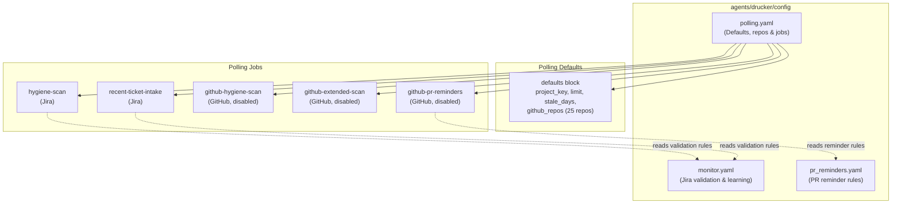
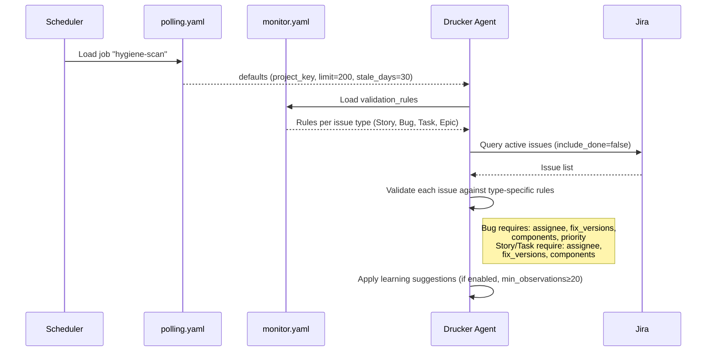
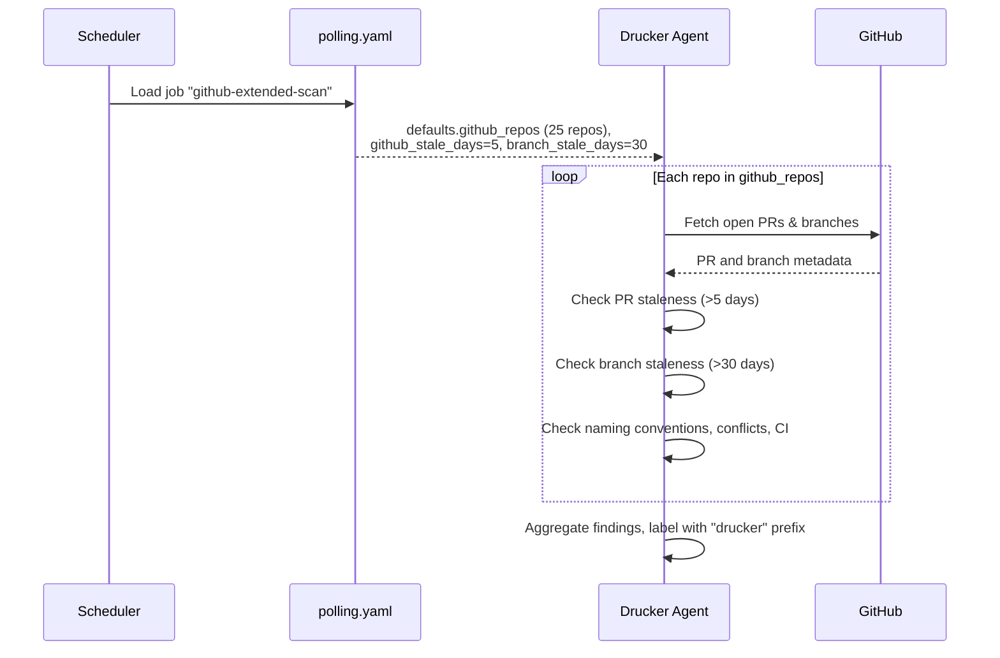
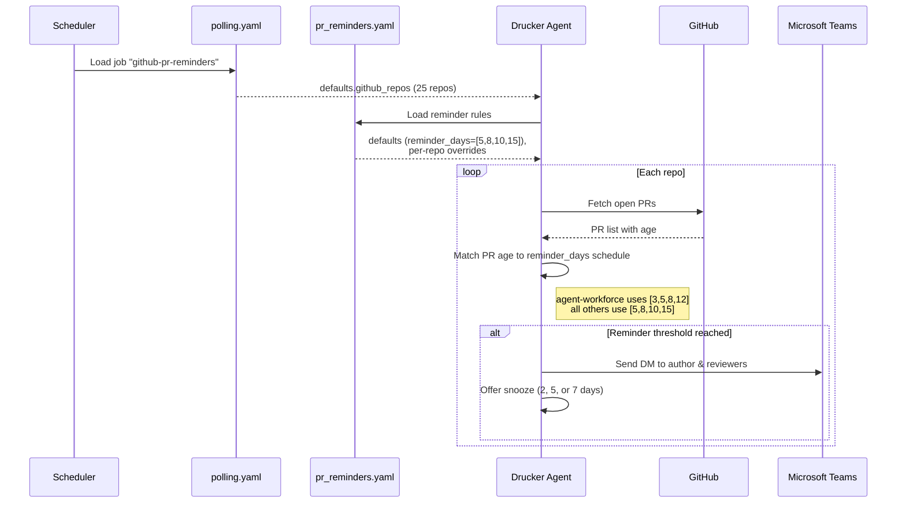

<!-- Generated by Documentation Agent — do not edit between markers -->

```yaml
---
title: "As-Built: Drucker Agent — Config"
date: "2026-04-03"
status: "draft"
---
```

# Config — Design Reference

## 1. Module Overview

The `agents/drucker/config/` directory contains the YAML configuration files that govern the Drucker agent — an automated project-hygiene and workflow-enforcement bot operating across Jira and GitHub for Cornelis Networks repositories. Three files define the agent's complete runtime behavior: `monitor.yaml` controls Jira ticket validation rules and a machine-learning suggestion engine; `polling.yaml` declares the polling defaults, the canonical list of monitored GitHub repositories, and the set of scheduled scan jobs; and `pr_reminders.yaml` configures a pull-request reminder system that notifies authors and reviewers of stale PRs via Teams direct messages. Together these files parameterize every scan, validation, and notification the Drucker agent can perform without requiring code changes.

## 2. What Changed

### Before

- The `github_repos` list was specified per-job inside `polling.yaml` (both `github-hygiene-scan` and `github-extended-scan` carried an empty `github_repos: []` key).
- No `github-pr-reminders` job existed.
- No `pr_reminders.yaml` file existed.

### After

- The `github_repos` list was **hoisted to `defaults`** in `polling.yaml`, establishing a single canonical list of 25 repositories shared by all GitHub-related jobs. The per-job `github_repos: []` keys were removed.
- A new job `github-pr-reminders` (scan type `github-pr-reminders`, disabled by default) was added to `polling.yaml`.
- A new file `pr_reminders.yaml` was introduced, defining reminder cadences, notification channels, snooze options, and per-repo overrides.

### Impact

- **All GitHub scan jobs** (`github-hygiene-scan`, `github-extended-scan`, `github-pr-reminders`) now inherit the same repository list from `defaults.github_repos`. Adding or removing a repo is a single-line change.
- **Consumers of `polling.yaml`** that previously read `github_repos` from individual job entries must now fall back to `defaults.github_repos` when the key is absent on a job.
- **Teams integration** is now a first-class notification channel; any component that processes `pr_reminders.yaml` must support `teams_dm` delivery and snooze state management.

## 3. Component Diagram



## 4. Key Flows

### Flow 1 — Jira Hygiene Scan

The `hygiene-scan` job reads `polling.yaml` defaults and `monitor.yaml` validation rules to audit every active Jira ticket in the configured project.



**Description:** The scheduler triggers the `hygiene-scan` job. The agent merges job-level settings with `defaults` from `polling.yaml`, then loads `monitor.yaml` to obtain per-issue-type `required` and `warn` field lists. Each Jira issue is validated; missing required fields produce errors, missing warn fields produce warnings. When the `learning` block is enabled and at least 20 observations exist, the agent may auto-fill fields (confidence ≥ 0.90), suggest values (≥ 0.50), or flag anomalies.

### Flow 2 — GitHub Extended Scan

The `github-extended-scan` job checks PRs, branch naming, merge conflicts, CI status, and stale branches across all 25 repositories.



**Description:** The job inherits `github_repos` from `defaults` (25 repositories spanning agent-workforce, ifs-all, driver repos, firmware tools, etc.). For each repository, the agent evaluates open PRs against `github_stale_days: 5` and branches against `branch_stale_days: 30`. The `label_prefix: drucker` from defaults is used to tag issues. This job is currently **disabled** (`enabled: false`).

### Flow 3 — GitHub PR Reminders

The `github-pr-reminders` job uses both `polling.yaml` and `pr_reminders.yaml` to send escalating Teams DM reminders for stale pull requests.



**Description:** For each of the 25 monitored repos, the agent checks open PR age against the `reminder_days` schedule. The `jmac-cornelis/agent-workforce` repo has a tighter cadence (`[3, 5, 8, 12]` days) than the default (`[5, 8, 10, 15]`). Notifications target both `author` and `reviewers` via `teams_dm`. Users can snooze reminders for 2, 5, or 7 days. Supported merge methods (`squash`, `merge`, `rebase`) are declared for downstream tooling. This job is currently **disabled** (`enabled: false` in `polling.yaml`), though the `pr_reminders.yaml` defaults block sets `enabled: true` — the polling job's `enabled` flag takes precedence at the scheduler level.

## 5. Data Model

### monitor.yaml — Validation Rules Schema

```yaml
# Per issue-type validation structure
validation_rules:
  <IssueType>:          # One of: Story, Bug, Task, Epic
    required: [<field>]  # Fields that MUST be populated; absence = error
    warn: [<field>]      # Fields that SHOULD be populated; absence = warning
```

| Issue Type | Required Fields | Warn Fields |
|---|---|---|
| Story | `assignee`, `fix_versions`, `components` | `description` |
| Bug | `assignee`, `fix_versions`, `components`, `priority` | `description` |
| Task | `assignee`, `fix_versions`, `components` | `description` |
| Epic | `assignee` | `description` |

### monitor.yaml — Learning Configuration

```yaml
learning:
  enabled: true
  min_observations: 20
  confidence_thresholds:
    auto_fill: 0.90    # ≥90% confidence → fill automatically
    suggest: 0.50      # ≥50% confidence → suggest to user
    flag_only: 0.0     # <50% confidence → flag for review only
```

### polling.yaml — Defaults Schema

| Key | Type | Value | Purpose |
|---|---|---|---|
| `project_key` | string | `''` (empty) | Jira project key; must be set at runtime |
| `limit` | int | `200` | Max issues per query |
| `include_done` | bool | `false` | Whether to include resolved issues |
| `stale_days` | int | `30` | Days before a Jira issue is considered stale |
| `label_prefix` | string | `drucker` | Prefix for labels applied by the agent |
| `persist` | bool | `true` | Whether to persist scan state between runs |
| `notify_shannon` | bool | `false` | Whether to notify the Shannon agent |
| `github_stale_days` | int | `5` | Days before a PR is considered stale |
| `github_repos` | list | 25 repos | Canonical list of monitored GitHub repositories |

### polling.yaml — Job Schema

```yaml
jobs:
  - job_id: <string>        # Unique identifier
    description: <string>   # Human-readable purpose
    scan_type: <enum>       # jira | github | github-extended | github-pr-reminders
    recent_only: <bool>     # (Jira jobs) Use checkpoint-based incremental scan
    enabled: <bool>         # (GitHub jobs) Whether the job is active
    github_stale_days: <int>    # Override default PR staleness threshold
    branch_stale_days: <int>    # (github-extended) Branch staleness threshold
```

### pr_reminders.yaml — Reminder Schema

```yaml
defaults:
  reminder_days: [<int>]        # Days-since-open thresholds for reminders
  notify: [author, reviewers]   # Who receives notifications
  channels: [teams_dm]          # Delivery channels
  snooze_options_days: [<int>]  # Snooze durations offered to recipients
  merge_methods: [<string>]     # Allowed merge strategies
  enabled: <bool>               # Master enable/disable

repos:
  - repo: <org/name>
    reminder_days: [<int>]      # Optional per-repo override
```

## 6. Dependencies

| Dependency | Purpose | Version |
|---|---|---|
| Jira API | Ticket querying and field validation for hygiene scans | N/A (external service) |
| GitHub API | PR and branch metadata retrieval for GitHub scan jobs | N/A (external service) |
| Microsoft Teams API | Delivery of DM reminders to PR authors and reviewers | N/A (external service) |
| Shannon Agent | Optional cross-agent notification (`notify_shannon` flag) | Internal |
| YAML parser | Runtime deserialization of all three config files | N/A (language-dependent) |

## 7. Configuration

### Environment / Runtime Variables

| Variable / Key | File | Required | Default | Notes |
|---|---|---|---|---|
| `project` | `monitor.yaml` | Yes (at runtime) | `''` (empty) | Must be set to a valid Jira project key before scans execute |
| `defaults.project_key` | `polling.yaml` | Yes (at runtime) | `''` (empty) | Same — empty string means Jira jobs will fail without override |
| `poll_interval_minutes` | `monitor.yaml` | No | `5` | How often the monitor loop runs |
| `defaults.persist` | `polling.yaml` | No | `true` | Enables checkpoint persistence for incremental scans |
| `defaults.notify_shannon` | `polling.yaml` | No | `false` | Cross-agent notification toggle |

### Feature Flags

| Flag | File | Current State | Effect |
|---|---|---|---|
| `learning.enabled` | `monitor.yaml` | `true` | Enables ML-based field suggestion engine |
| `github-hygiene-scan.enabled` | `polling.yaml` | `false` | GitHub basic PR hygiene scan is **off** |
| `github-extended-scan.enabled` | `polling.yaml` | `false` | GitHub extended scan (branches, CI, naming) is **off** |
| `github-pr-reminders.enabled` | `polling.yaml` | `false` | PR reminder notifications are **off** |
| `pr_reminders.defaults.enabled` | `pr_reminders.yaml` | `true` | Reminder subsystem considers itself enabled |

## 8. Error Handling

These configuration files are declarative YAML and do not contain error-handling logic themselves. However, the structure implies the following error-handling contract for consumers:

- **Empty `project` / `project_key`:** Both `monitor.yaml` and `polling.yaml` ship with empty-string project identifiers. Consumers must validate these at startup and fail fast if unset, since Jira queries require a project key.
- **Validation rule enforcement:** `monitor.yaml` distinguishes between `required` (error-level) and `warn` (warning-level) field checks, establishing a two-tier severity model.
- **Learning confidence tiers:** The three thresholds (`auto_fill: 0.90`, `suggest: 0.50`, `flag_only: 0.0`) create a graduated response — high-confidence actions are automated, low-confidence findings are surfaced for human review.
- **Disabled jobs:** GitHub jobs default to `enabled: false`, providing a safe-by-default posture. The agent must check this flag before executing any GitHub scan.

## 9. Known Limitations / Technical Debt

1. **Empty project identifiers (hardcoded placeholder):** Both `monitor.yaml` (`project: ''`) and `polling.yaml` (`project_key: ''`) ship with empty strings. There is no schema validation or default-value fallback documented in the config files. If a consumer does not override these, Jira scans will silently target no project or fail at the API level.

2. **Conflicting `enabled` flags for PR reminders:** `polling.yaml` sets `github-pr-reminders.enabled: false` while `pr_reminders.yaml` sets `defaults.enabled: true`. The precedence rule is not documented in the config files. Consumers must establish and enforce a clear precedence hierarchy.

3. **No schema validation file:** There is no JSON Schema, Pydantic model, or equivalent validation artifact for any of the three YAML files. Typos in key names (e.g., `reminder_day` instead of `reminder_days`) would be silently ignored.

4. **Repo list duplication:** The same 25-repository list appears in both `polling.yaml` (`defaults.github_repos`) and `pr_reminders.yaml` (`repos`). Changes to the monitored repo set require edits in two files, creating a synchronization risk.

5. **No credentials in config (positive note):** No hardcoded credentials, tokens, or URLs are present in any of the three files. Authentication is handled externally.

6. **All GitHub scan jobs are disabled:** The three GitHub-related jobs (`github-hygiene-scan`, `github-extended-scan`, `github-pr-reminders`) are all set to `enabled: false`. Only the two Jira jobs (`hygiene-scan`, `recent-ticket-intake`) are active by default.

7. **Missing `poll_interval_minutes` in `polling.yaml`:** The polling interval is defined only in `monitor.yaml` (`poll_interval_minutes: 5`). It is unclear whether the polling job scheduler reads from `monitor.yaml` or has its own interval mechanism. This coupling is implicit.

<!-- End Documentation Agent generated content -->