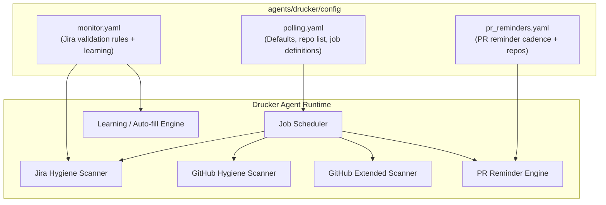
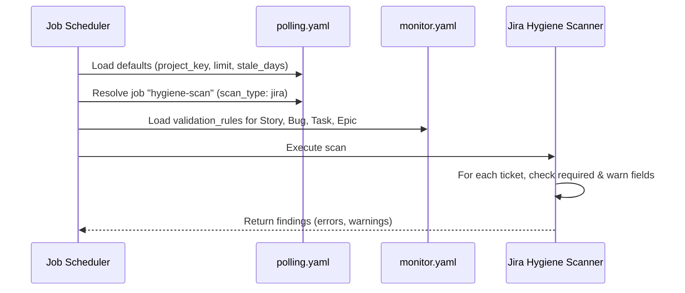
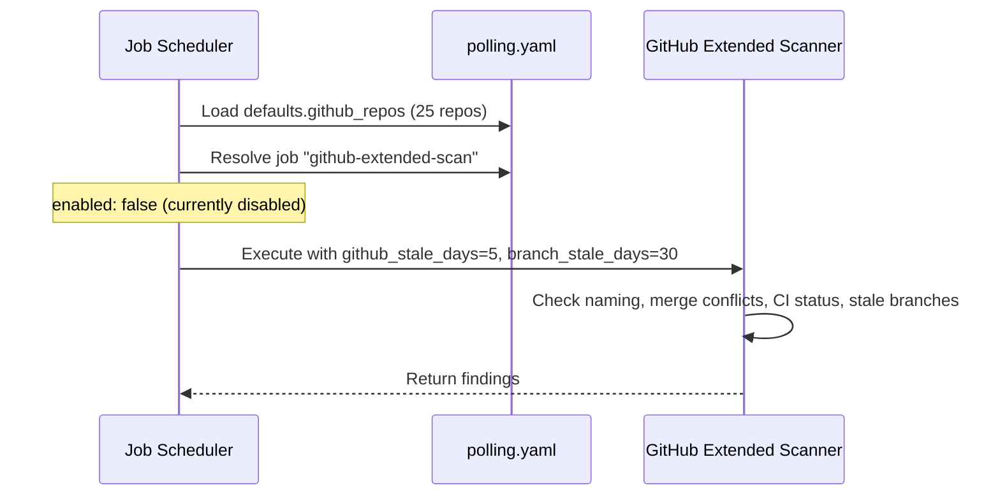
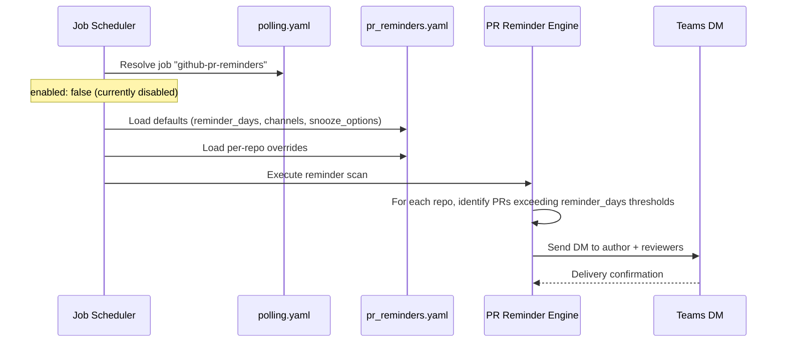

<!-- Generated by Documentation Agent — do not edit between markers -->

```yaml
---
title: "As-Built: Drucker Agent — Config"
date: "2026-04-03"
status: "draft"
---
```

# Config — Design Reference

## 1. Module Overview

The `agents/drucker/config/` directory contains the YAML configuration files that govern the Drucker agent — a project-hygiene automation agent responsible for scanning Jira tickets and GitHub repositories for compliance issues, stale work, and missing metadata. Three configuration files define the agent's behavior: `monitor.yaml` controls Jira field-validation rules and a machine-learning suggestion subsystem; `polling.yaml` defines the polling defaults, the canonical list of monitored GitHub repositories, and the discrete scan jobs the agent can execute; and `pr_reminders.yaml` configures a pull-request reminder system that notifies authors and reviewers of aging PRs via Teams direct messages. Together these files parameterize every aspect of the Drucker agent's scan loop without requiring code changes.

## 2. What Changed

### Before

- The `github_repos` list was specified per-job inside `polling.yaml` (as empty arrays on the `github-hygiene-scan` and `github-extended-scan` jobs).
- No `github-pr-reminders` job existed.
- No `pr_reminders.yaml` file existed.

### After

- The `github_repos` list is now a **top-level default** in `polling.yaml`, shared by all GitHub-related jobs. Twenty-five repositories are enumerated once.
- Per-job `github_repos: []` overrides have been removed from `github-hygiene-scan` and `github-extended-scan`.
- A new job `github-pr-reminders` (scan type `github-pr-reminders`, currently `enabled: false`) has been added to `polling.yaml`.
- A new file `pr_reminders.yaml` has been introduced, defining reminder cadences, notification channels, snooze options, and per-repo overrides.

### Impact

- **Job runners** that resolve GitHub repo lists must now fall back to `defaults.github_repos` rather than expecting a per-job key.
- **Notification subsystem** must support the new `github-pr-reminders` scan type and the Teams DM channel defined in `pr_reminders.yaml`.
- **All 25 monitored repositories** are now consistently defined in one place, reducing configuration drift between jobs.

## 3. Component Diagram



## 4. Key Flows

### Flow 1 — Jira Hygiene Scan



The scheduler reads `polling.yaml` to determine scan parameters — `limit: 200`, `stale_days: 30`, `include_done: false` — then loads the per-issue-type validation rules from `monitor.yaml`. For example, a **Bug** must have `assignee`, `fix_versions`, `components`, and `priority`; a missing `description` produces a warning rather than an error. The `recent-ticket-intake` job follows the same flow but sets `recent_only: true` to use checkpoint-based incremental scanning.

### Flow 2 — GitHub Extended Scan



The `github-extended-scan` job inherits the global `github_repos` list from `defaults` and adds a `branch_stale_days: 30` parameter for stale-branch detection. Both `github-hygiene-scan` and `github-extended-scan` are currently **disabled** (`enabled: false`).

### Flow 3 — PR Reminder Dispatch



The PR reminder engine reads `pr_reminders.yaml` to determine when to nudge. The default cadence is days `[5, 8, 10, 15]`, but individual repos can override — for example, `jmac-cornelis/agent-workforce` uses an accelerated schedule of `[3, 5, 8, 12]`. Notifications target both `author` and `reviewers` via the `teams_dm` channel. Users can snooze reminders for `[2, 5, 7]` days. The job is currently **disabled** in `polling.yaml`.

## 5. Data Model

### monitor.yaml — Validation Rules

```yaml
validation_rules:
  <IssueType>:          # One of: Story, Bug, Task, Epic
    required: [<field>]  # Fields that must be populated — violation = error
    warn: [<field>]      # Fields that should be populated — violation = warning
```

| Issue Type | Required Fields | Warn Fields |
|---|---|---|
| Story | `assignee`, `fix_versions`, `components` | `description` |
| Bug | `assignee`, `fix_versions`, `components`, `priority` | `description` |
| Task | `assignee`, `fix_versions`, `components` | `description` |
| Epic | `assignee` | `description` |

### monitor.yaml — Learning Subsystem

```yaml
learning:
  enabled: true
  min_observations: 20
  confidence_thresholds:
    auto_fill: 0.90    # ≥90% confidence → auto-populate field
    suggest: 0.50      # ≥50% confidence → suggest to user
    flag_only: 0.0     # <50% confidence → flag for review only
```

The learning subsystem requires at least 20 observations before making predictions. Three tiers of action are defined by confidence thresholds.

### polling.yaml — Job Definition Schema

Each entry in the `jobs` list follows this structure:

| Field | Type | Description |
|---|---|---|
| `job_id` | string | Unique identifier for the job |
| `description` | string | Human-readable purpose |
| `scan_type` | enum | One of `jira`, `github`, `github-extended`, `github-pr-reminders` |
| `recent_only` | bool | (Jira only) Use checkpoint-based incremental scan |
| `enabled` | bool | Whether the job is active; absent means enabled |
| `github_stale_days` | int | Override for stale-PR threshold |
| `branch_stale_days` | int | (Extended only) Stale-branch threshold |

### pr_reminders.yaml — Reminder Schema

```yaml
defaults:
  reminder_days: [5, 8, 10, 15]   # Days-since-open thresholds
  notify: [author, reviewers]       # Who receives the reminder
  channels: [teams_dm]              # Delivery channel
  snooze_options_days: [2, 5, 7]    # Snooze durations offered
  merge_methods: [squash, merge, rebase]  # Allowed merge strategies
  enabled: true

repos:
  - repo: <org/repo>
    reminder_days: [<override>]     # Optional per-repo override
```

## 6. Dependencies

| Dependency | Purpose | Version |
|---|---|---|
| Jira API | Source of ticket data for hygiene scans | Runtime (external) |
| GitHub API | Source of PR, branch, and CI data for GitHub scans | Runtime (external) |
| Microsoft Teams API | Delivery channel for PR reminder DMs | Runtime (external) |
| PyYAML (or equivalent) | YAML config parsing | Runtime (internal) |
| Drucker Job Scheduler | Orchestrates job execution from `polling.yaml` definitions | Internal module |
| Drucker Learning Engine | Consumes `monitor.yaml` learning thresholds | Internal module |

## 7. Configuration

### Environment Variables

The config files themselves do not embed environment variable references. However, several fields are left intentionally blank and must be supplied at runtime or by an outer configuration layer:

| Parameter | File | Current Value | Notes |
|---|---|---|---|
| `project` | `monitor.yaml` | `''` (empty) | Must be set to a Jira project key before use |
| `defaults.project_key` | `polling.yaml` | `''` (empty) | Must be set to a Jira project key before use |

### Feature Flags

| Flag | File | Path | Current Value |
|---|---|---|---|
| Learning enabled | `monitor.yaml` | `learning.enabled` | `true` |
| PR reminders enabled | `pr_reminders.yaml` | `defaults.enabled` | `true` |
| GitHub hygiene scan | `polling.yaml` | `jobs[2].enabled` | `false` |
| GitHub extended scan | `polling.yaml` | `jobs[3].enabled` | `false` |
| GitHub PR reminders job | `polling.yaml` | `jobs[4].enabled` | `false` |
| Shannon notifications | `polling.yaml` | `defaults.notify_shannon` | `false` |
| Persist results | `polling.yaml` | `defaults.persist` | `true` |

### Key Tuning Parameters

| Parameter | File | Value | Description |
|---|---|---|---|
| `poll_interval_minutes` | `monitor.yaml` | `5` | How often the monitor polls |
| `defaults.limit` | `polling.yaml` | `200` | Max tickets per Jira query |
| `defaults.stale_days` | `polling.yaml` | `30` | Days before a Jira ticket is considered stale |
| `defaults.github_stale_days` | `polling.yaml` | `5` | Days before a PR is considered stale |
| `defaults.label_prefix` | `polling.yaml` | `drucker` | Prefix for labels applied by the agent |
| `learning.min_observations` | `monitor.yaml` | `20` | Minimum data points before learning activates |

## 8. Error Handling

These configuration files are declarative YAML and contain no error-handling logic themselves. Error handling is the responsibility of the consuming runtime code. Based on the structure, the following patterns are implied:

- **Missing required fields** in `monitor.yaml` validation rules produce errors (distinct from warnings for `warn` fields).
- **Empty `project` / `project_key`** values will cause scan jobs to fail at runtime if not overridden — no default fallback is encoded.
- **Disabled jobs** (`enabled: false`) are expected to be silently skipped by the scheduler rather than raising errors.
- **Per-repo overrides** in `pr_reminders.yaml` that omit optional keys (e.g., `reminder_days`) are expected to fall back to `defaults` — a standard YAML-merge pattern.

## 9. Known Limitations / Technical Debt

1. **Empty project keys** — Both `monitor.yaml` (`project: ''`) and `polling.yaml` (`project_key: ''`) ship with empty strings. There is no schema validation or fail-fast mechanism in the config files themselves. A misconfigured deployment will only fail at scan time.

2. **Repo list duplication** — The same 25-repository list appears in three places: `polling.yaml` (`defaults.github_repos`), `pr_reminders.yaml` (`repos`), and implicitly in any job that inherits from defaults. If a repository is added or removed, all three locations must be updated manually. There is no single source of truth or `!include` directive.

3. **All GitHub jobs disabled** — Every GitHub-related job (`github-hygiene-scan`, `github-extended-scan`, `github-pr-reminders`) is set to `enabled: false`. The PR reminder subsystem is fully configured in `pr_reminders.yaml` (with `enabled: true` at the defaults level) but cannot execute because the corresponding polling job is disabled. This creates a confusing split where the feature config says "on" but the job config says "off."

4. **No schema version** — None of the YAML files declare a schema version. Future changes to the structure (e.g., renaming `warn` to `warnings`) have no migration path or compatibility detection.

5. **Hardcoded repository URLs** — All 25 GitHub repository identifiers are hardcoded strings. There is no dynamic discovery mechanism.

6. **`include_done: false` is global** — The `include_done` flag applies to all Jira jobs via defaults. There is no per-job override demonstrated, which may limit future scan types that need to inspect completed work.

7. **Learning thresholds not per-issue-type** — The `learning.confidence_thresholds` block in `monitor.yaml` applies uniformly across all issue types. There is no mechanism to set different auto-fill confidence for Bugs vs. Stories, despite Bugs having stricter required-field rules.

<!-- End Documentation Agent generated content -->