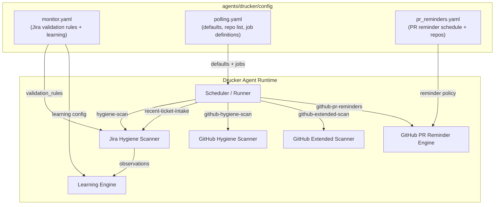
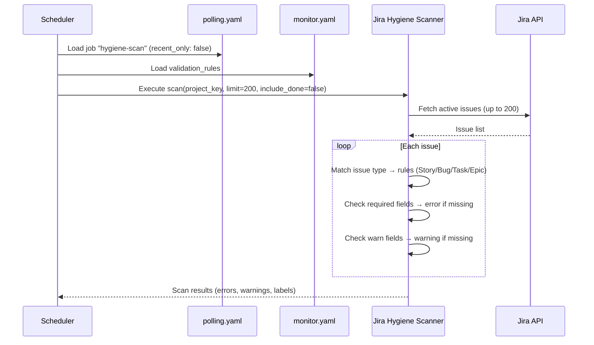
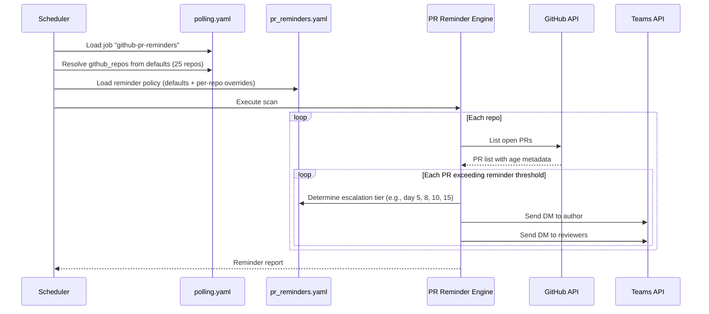
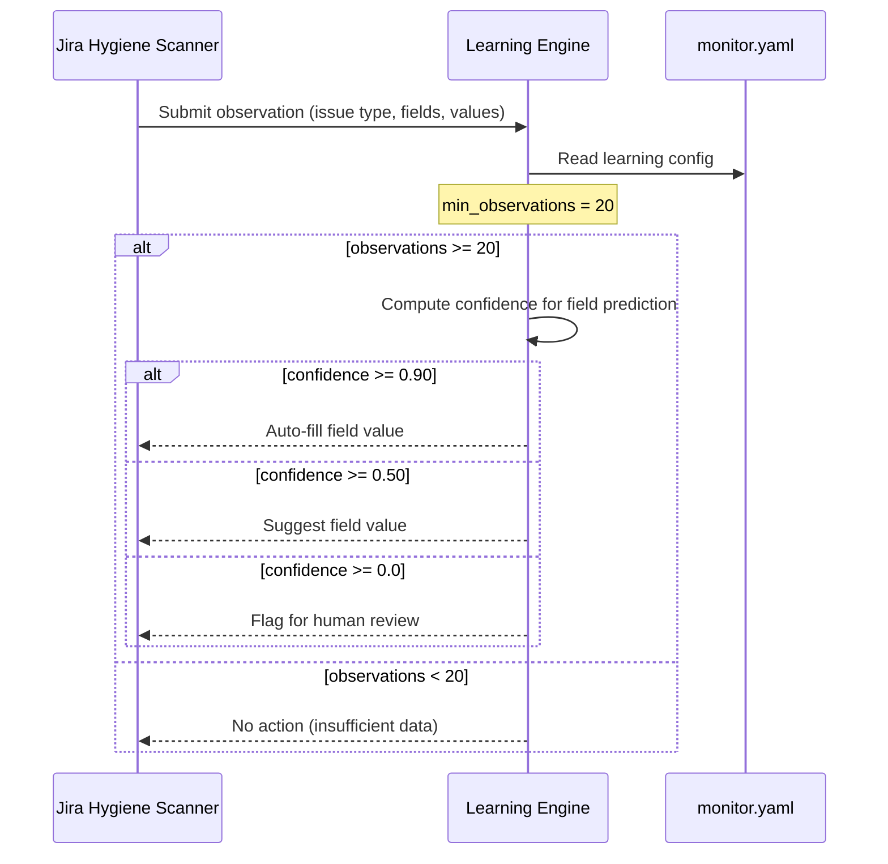

<!-- Generated by Documentation Agent — do not edit between markers -->

```yaml
---
title: "As-Built: Drucker Agent — Config"
date: "2026-04-03"
status: "draft"
---
```

# Config — Design Reference

## 1. Module Overview

The `agents/drucker/config/` directory contains the declarative YAML configuration that governs the **Drucker** agent — an automated project-hygiene and workflow-enforcement bot operating across Jira and GitHub for Cornelis Networks repositories. Three configuration files define the agent's behavior: `monitor.yaml` specifies Jira ticket validation rules and a machine-learning feedback loop; `polling.yaml` declares the polling cadence, default parameters, monitored GitHub repositories, and the discrete scan jobs the agent executes; and `pr_reminders.yaml` controls a pull-request reminder system that nudges authors and reviewers via Teams direct messages on a configurable escalation schedule. Together these files form a single, code-reviewable source of truth for every tunable knob in the Drucker agent.

## 2. What Changed

### Before

- The `github_repos` list was **not** present in `polling.yaml` defaults. Instead, each GitHub-related job carried its own `github_repos: []` key (an empty list), meaning no repositories were actually scanned.
- There was no `github-pr-reminders` job definition.
- The file `pr_reminders.yaml` did not exist.

### After

- A centralized `github_repos` list of **25 repositories** was added to the `defaults` block of `polling.yaml`, replacing the per-job empty lists. All GitHub scan jobs now inherit this shared list.
- A new job `github-pr-reminders` (scan type `github-pr-reminders`, currently `enabled: false`) was added to `polling.yaml`.
- A new file `pr_reminders.yaml` was introduced, defining reminder escalation schedules, notification channels, snooze options, and per-repo overrides.

### Impact

- **GitHub scan jobs** (`github-hygiene-scan`, `github-extended-scan`, `github-pr-reminders`) now have a concrete repository target list available via defaults, even though all three remain disabled (`enabled: false`).
- **Downstream consumers** of the polling config (the Drucker scheduler / runner) must now support the `github-pr-reminders` scan type and load `pr_reminders.yaml` when that job is enabled.
- **Teams integration** is implied by `pr_reminders.yaml` (`channels: [teams_dm]`), introducing a new external dependency that must be wired before the feature is activated.

## 3. Component Diagram



## 4. Key Flows

### Flow 1 — Jira Hygiene Scan

The scheduler picks up the `hygiene-scan` job from `polling.yaml`, loads validation rules from `monitor.yaml`, and checks every active Jira ticket against the required/warn field lists for its issue type.



**Details:**

- Issue type `Bug` in `monitor.yaml` has the strictest rule set — it additionally requires `priority`:

```yaml
Bug:
  required:
    - assignee
    - fix_versions
    - components
    - priority
  warn:
    - description
```

- `Epic` is the most lenient, requiring only `assignee`.
- The `stale_days: 30` default from `polling.yaml` governs how old an untouched ticket can be before it is flagged.
- Results may be persisted (`persist: true`) and optionally labeled with the `drucker` prefix (`label_prefix: drucker`).

### Flow 2 — GitHub PR Reminder Escalation

When the `github-pr-reminders` job is enabled, the agent iterates over the shared repository list, identifies stale PRs, and sends escalating Teams DM reminders according to the schedule in `pr_reminders.yaml`.



**Details:**

- The default escalation ladder is `[5, 8, 10, 15]` days, but `jmac-cornelis/agent-workforce` overrides this to `[3, 5, 8, 12]`:

```yaml
repos:
  - repo: jmac-cornelis/agent-workforce
    reminder_days: [3, 5, 8, 12]
```

- Recipients are `[author, reviewers]` via `[teams_dm]`.
- Users can snooze reminders for `[2, 5, 7]` days (`snooze_options_days`).
- Acceptable merge methods are declared as `[squash, merge, rebase]` — this likely feeds UI or bot messaging about how to close the PR.

### Flow 3 — Learning Engine Feedback Loop

The learning subsystem in `monitor.yaml` observes field-fill patterns across Jira tickets and, once sufficient data is collected, can auto-fill, suggest, or flag field values.



**Details:**

The three-tier confidence model is defined in `monitor.yaml`:

```yaml
learning:
  enabled: true
  min_observations: 20
  confidence_thresholds:
    auto_fill: 0.90
    suggest: 0.50
    flag_only: 0.0
```

- **Auto-fill (≥ 0.90):** The agent writes the predicted value directly.
- **Suggest (≥ 0.50):** The agent proposes a value for human confirmation.
- **Flag only (≥ 0.0):** The agent highlights the field without a recommendation.

## 5. Data Model

The configuration layer is purely declarative YAML. There are no database schemas, but the logical data structures are:

| Structure | File | Shape | Purpose |
|---|---|---|---|
| `defaults` | `polling.yaml` | Flat key-value map | Global defaults inherited by all jobs |
| `defaults.github_repos` | `polling.yaml` | List of 25 strings (`org/repo`) | Canonical set of monitored GitHub repositories |
| `jobs[]` | `polling.yaml` | List of objects (`job_id`, `scan_type`, `enabled`, …) | Discrete scan job definitions |
| `validation_rules` | `monitor.yaml` | Map of issue type → `{required: [], warn: []}` | Per-issue-type field validation policy |
| `learning` | `monitor.yaml` | Object (`enabled`, `min_observations`, `confidence_thresholds`) | ML feedback loop parameters |
| `defaults` | `pr_reminders.yaml` | Flat key-value map | Default reminder escalation policy |
| `repos[]` | `pr_reminders.yaml` | List of objects (`repo`, optional overrides) | Per-repo reminder policy overrides |

**Inheritance model:** Jobs in `polling.yaml` inherit from `defaults` — any key not overridden at the job level falls back to the default. Similarly, repos in `pr_reminders.yaml` inherit from `defaults` unless they supply their own `reminder_days` (as `agent-workforce` does).

## 6. Dependencies

| Dependency | Purpose | Version |
|---|---|---|
| Jira REST API | Ticket fetching, field validation, label application | External (runtime) |
| GitHub REST API | PR listing, branch metadata, CI status | External (runtime) |
| Microsoft Teams API | Sending DM reminders to PR authors/reviewers | External (runtime) |
| YAML parser (e.g., PyYAML / ruamel.yaml) | Loading configuration files | Internal (runtime) |
| Drucker Scheduler / Runner | Consumes `polling.yaml` to orchestrate scan jobs | Internal module |
| Drucker Learning Engine | Consumes `monitor.yaml` learning section | Internal module |

## 7. Configuration

### Environment Variables

The config files themselves do not embed environment variable references, but several values are clearly intended to be set at deployment time:

| Parameter | File | Default | Notes |
|---|---|---|---|
| `project` | `monitor.yaml` | `''` (empty) | **Must be set** — the Jira project key to validate |
| `defaults.project_key` | `polling.yaml` | `''` (empty) | **Must be set** — the Jira project key for polling jobs |
| `poll_interval_minutes` | `monitor.yaml` | `5` | How often the monitor loop runs |
| `defaults.limit` | `polling.yaml` | `200` | Max issues fetched per Jira query |
| `defaults.include_done` | `polling.yaml` | `false` | Whether to include resolved/done tickets |
| `defaults.stale_days` | `polling.yaml` | `30` | Days of inactivity before a Jira ticket is stale |
| `defaults.github_stale_days` | `polling.yaml` | `5` | Days of inactivity before a PR is stale |
| `defaults.persist` | `polling.yaml` | `true` | Whether scan results are persisted |
| `defaults.notify_shannon` | `polling.yaml` | `false` | Whether to notify the Shannon agent |
| `defaults.label_prefix` | `polling.yaml` | `drucker` | Prefix for labels applied to Jira tickets |

### Feature Flags

| Flag | File | Default | Effect |
|---|---|---|---|
| `learning.enabled` | `monitor.yaml` | `true` | Enables/disables the ML feedback loop |
| `jobs[].enabled` | `polling.yaml` | (per job) | `github-hygiene-scan`: `false`, `github-extended-scan`: `false`, `github-pr-reminders`: `false`. Jira jobs have no `enabled` key (implicitly always on). |
| `defaults.enabled` | `pr_reminders.yaml` | `true` | Master switch for the PR reminder system |

## 8. Error Handling

The configuration files are declarative and contain no error-handling logic themselves. Error handling is the responsibility of the consuming runtime code. However, the configuration design implies the following patterns:

- **Required vs. warn field distinction** (`monitor.yaml`): The `required` list produces errors (blocking), while the `warn` list produces warnings (advisory). This two-tier severity model is the primary error-classification mechanism for Jira hygiene.
- **Confidence thresholds** (`monitor.yaml`): The learning engine uses a graduated response (`auto_fill` → `suggest` → `flag_only`) rather than a binary pass/fail, reducing the risk of incorrect automated changes.
- **`enabled: false` guards** (`polling.yaml`): All three GitHub scan jobs ship disabled, acting as a safety mechanism to prevent execution before the runtime integration is ready.
- **Minimum observation gate** (`min_observations: 20`): Prevents the learning engine from acting on insufficient data.

## 9. Known Limitations / Technical Debt

1. **Empty project keys** — Both `monitor.yaml` (`project: ''`) and `polling.yaml` (`project_key: ''`) ship with empty strings. There is no schema validation or default-value fallback visible in the config layer. If the runtime does not enforce these at startup, scans will silently target no project.

2. **Hardcoded repository list duplication** — The 25-repository list appears in both `polling.yaml` (`defaults.github_repos`) and `pr_reminders.yaml` (`repos[]`). These are not cross-referenced; they must be kept in sync manually. A single shared source (e.g., a `repos.yaml` anchor file) would eliminate drift risk.

3. **All GitHub jobs disabled** — `github-hygiene-scan`, `github-extended-scan`, and `github-pr-reminders` are all set to `enabled: false`. The PR reminder pipeline (`pr_reminders.yaml`) is fully configured but cannot execute until the corresponding job is enabled and the Teams integration is wired.

4. **No schema validation** — There is no JSON Schema, Pydantic model, or equivalent validation layer declared alongside these YAML files. Typos in keys (e.g., `rquired` instead of `required`) would be silently ignored.

5. **Missing `poll_interval_minutes` in `polling.yaml`** — The polling interval is defined only in `monitor.yaml`. It is unclear whether the scheduler reads from `monitor.yaml` or has its own cadence. This split could cause confusion about which file controls execution frequency.

6. **`notify_shannon: false`** — References an inter-agent notification channel (the Shannon agent) that is disabled and whose integration contract is not documented in these config files.

7. **No credential or secret references** — API tokens for Jira, GitHub, and Teams are not referenced anywhere in the config files. This is correct practice (secrets should not live in YAML), but there is no documentation of which environment variables or secret-store keys the runtime expects.

<!-- End Documentation Agent generated content -->