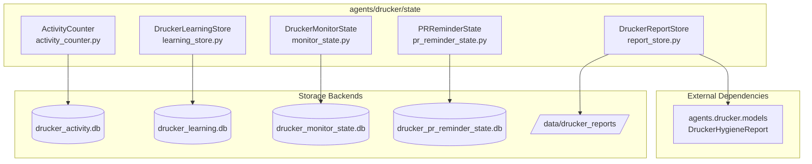
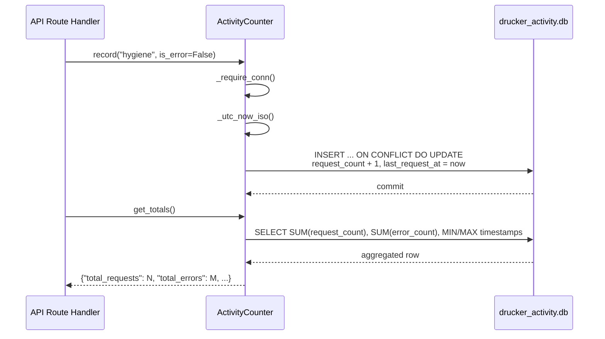
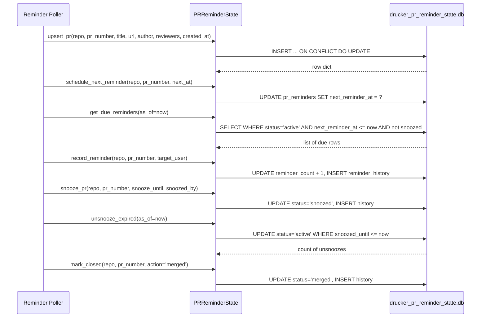
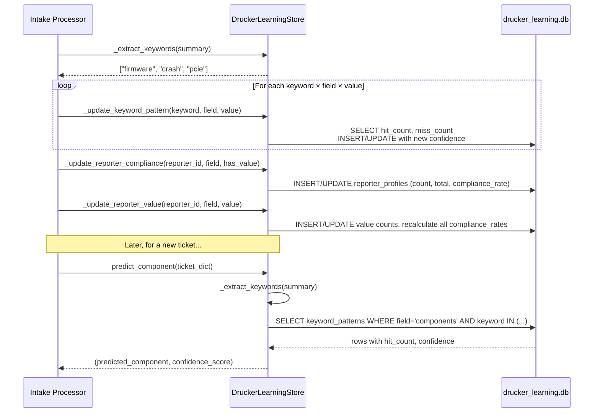

<!-- Generated by Documentation Agent — do not edit between markers -->

```yaml
---
title: "As-Built: Drucker State Layer"
date: "2026-04-03"
status: "draft"
---
```

## Module Overview

The `agents/drucker/state/` package provides the persistence layer for the Drucker agent — a Jira hygiene and PR review automation system within the Cornelis Networks agent workforce. The package contains five SQLite-backed and filesystem-backed stores, each responsible for a distinct domain of durable state: API request activity counters, ticket-intake learning patterns, intake-monitor checkpoints, PR reminder lifecycle tracking, and hygiene report artifact storage. Every SQLite store follows a consistent architectural pattern — thread-safe access via `threading.RLock`, `sqlite3.Row`-based row factories, auto-creating `data/` directories, and explicit `close()` lifecycle management. The filesystem store (`DruckerReportStore`) persists JSON and Markdown report artifacts to a configurable directory tree organized by project key and report ID.

## What Changed

- **Before:** The state layer consisted of three stores: `DruckerLearningStore` (keyword/reporter pattern learning), `DruckerMonitorState` (intake checkpoint and validation history), and `DruckerReportStore` (hygiene report persistence). There was no centralized API activity tracking and no PR reminder state management.

- **After:** Two new stores were added. `ActivityCounter` provides per-category request and error counting with first/last timestamps across all Drucker API endpoints. `PRReminderState` manages the full lifecycle of pull request review reminders — tracking, scheduling, snoozing, closing, and audit history. Both follow the established SQLite patterns already present in the package.

- **Impact:** Upstream API route handlers now have a dedicated counter store for observability metrics. The PR reminder subsystem gains durable state, enabling reminder scheduling, snooze/unsnooze workflows, and historical audit trails. Existing stores (`DruckerLearningStore`, `DruckerMonitorState`, `DruckerReportStore`) are unchanged.

## Component Diagram



## Key Flows

### Flow 1: Recording API Activity

When a Drucker API endpoint handles a request, it calls `ActivityCounter.record()` with a category string (e.g., `'hygiene'`, `'jira'`, `'github'`, `'pr-reminders'`) and an error flag. The counter upserts a row using SQLite's `ON CONFLICT` clause, atomically incrementing counts and updating timestamps.



The `record()` method uses a single SQL statement with `ON CONFLICT(category) DO UPDATE` to handle both first-time inserts and subsequent increments:

```python
def record(self, category: str, is_error: bool = False) -> None:
    conn = self._require_conn()
    now = self._utc_now_iso()
    with self._lock:
        cursor = conn.cursor()
        cursor.execute(
            '''
            INSERT INTO activity (category, request_count, error_count, first_request_at, last_request_at)
            VALUES (?, 1, ?, ?, ?)
            ON CONFLICT(category) DO UPDATE SET
                request_count = request_count + 1,
                error_count = error_count + ?,
                last_request_at = ?
            ''',
            (category, int(is_error), now, now, int(is_error), now),
        )
        conn.commit()
```

### Flow 2: PR Reminder Lifecycle (Track → Remind → Snooze → Close)

A PR is registered via `upsert_pr()`, scheduled for reminders via `schedule_next_reminder()`, and then the polling loop calls `get_due_reminders()` to find PRs past their reminder deadline. After sending a notification, `record_reminder()` increments the count and logs to history. Users can snooze a PR, and `unsnooze_expired()` reactivates them when the window elapses. Finally, `mark_closed()` terminates tracking.



### Flow 3: Learning from Ticket Intake Observations

When Drucker processes a new Jira ticket, `DruckerLearningStore` extracts keywords from the summary, updates keyword-to-field-value patterns, tracks reporter compliance rates, and records observations. Later, `predict_component()` aggregates keyword pattern confidence scores to suggest a component for new tickets.



The keyword extraction filters out stopwords and short tokens:

```python
def _extract_keywords(self, summary: str) -> list[str]:
    if not summary:
        return []
    tokens = re.split(r'[^a-zA-Z0-9]+', summary.lower())
    keywords: list[str] = []
    seen: set[str] = set()
    for token in tokens:
        if len(token) < 3:
            continue
        if token in self._STOPWORDS:
            continue
        if token in seen:
            continue
        seen.add(token)
        keywords.append(token)
    return keywords
```

## Data Model

### ActivityCounter — `drucker_activity.db`

| Table | Column | Type | Description |
|-------|--------|------|-------------|
| `activity` | `category` | `TEXT PRIMARY KEY` | Endpoint category (e.g., `'hygiene'`, `'jira'`, `'github'`) |
| | `request_count` | `INTEGER` | Total requests for this category |
| | `error_count` | `INTEGER` | Total errors for this category |
| | `first_request_at` | `TEXT` | ISO 8601 UTC timestamp of first request |
| | `last_request_at` | `TEXT` | ISO 8601 UTC timestamp of most recent request |

### DruckerLearningStore — `drucker_learning.db`

| Table | Column | Type | Description |
|-------|--------|------|-------------|
| `observations` | `id` | `INTEGER PK AUTOINCREMENT` | Row ID |
| | `ticket_key` | `TEXT` | Jira ticket key |
| | `field` | `TEXT` | Field name observed |
| | `predicted_value` | `TEXT` | What the model predicted |
| | `actual_value` | `TEXT` | What was actually set |
| | `correct` | `INTEGER` | 1 if prediction matched |
| | `timestamp` | `TEXT` | ISO 8601 UTC |
| `keyword_patterns` | `keyword, field, value` | `TEXT PK (composite)` | Keyword-to-field-value mapping |
| | `hit_count` | `INTEGER` | Times this keyword co-occurred with this value |
| | `miss_count` | `INTEGER` | Times keyword appeared without this value |
| | `confidence` | `REAL` | `hit_count / (hit_count + miss_count + 2)` — Laplace-smoothed |
| `reporter_profiles` | `reporter_id, field, value` | `TEXT PK (composite)` | Reporter behavior tracking |
| | `count` | `INTEGER` | Times this reporter used this value |
| | `total` | `INTEGER` | Total observations for this reporter+field |
| | `compliance_rate` | `REAL` | `count / total` |
| `learned_tickets` | `ticket_key, fingerprint` | `TEXT PK (composite)` | Deduplication of learned tickets |
| | `learned_at` | `TEXT` | ISO 8601 UTC |

**Indexes:** `idx_drucker_obs_ticket_field`, `idx_drucker_keyword_patterns`, `idx_drucker_reporter_profiles`, `idx_drucker_learned_tickets_key`.

### DruckerMonitorState — `drucker_monitor_state.db`

| Table | Column | Type | Description |
|-------|--------|------|-------------|
| `checkpoints` | `project` | `TEXT PRIMARY KEY` | Jira project key |
| | `last_checked` | `TEXT` | ISO 8601 UTC of last poll |
| `processed_tickets` | `ticket_key` | `TEXT PRIMARY KEY` | Ticket already processed |
| | `project` | `TEXT` | Project key |
| | `processed_at` | `TEXT` | ISO 8601 UTC |
| `validation_history` | `id` | `INTEGER PK AUTOINCREMENT` | Row ID |
| | `ticket_key` | `TEXT` | Ticket validated |
| | `project` | `TEXT` | Project key |
| | `result_json` | `TEXT` | JSON-serialized validation result |
| | `timestamp` | `TEXT` | ISO 8601 UTC |

**Indexes:** `idx_drucker_processed_project`, `idx_drucker_history_ticket`, `idx_drucker_history_project`.

### PRReminderState — `drucker_pr_reminder_state.db`

| Table | Column | Type | Description |
|-------|--------|------|-------------|
| `pr_reminders` | `id` | `INTEGER PK AUTOINCREMENT` | Row ID |
| | `repo` | `TEXT` | Repository identifier |
| | `pr_number` | `INTEGER` | Pull request number |
| | `pr_title` | `TEXT` | PR title |
| | `pr_url` | `TEXT` | PR URL |
| | `author_github` | `TEXT` | GitHub username of author |
| | `reviewers_github` | `TEXT` | Comma-separated reviewer usernames |
| | `created_at` | `TEXT` | PR creation timestamp |
| | `first_reminded_at` | `TEXT` | First reminder sent |
| | `last_reminded_at` | `TEXT` | Most recent reminder sent |
| | `next_reminder_at` | `TEXT` | Scheduled next reminder |
| | `reminder_count` | `INTEGER` | Total reminders sent |
| | `snoozed_until` | `TEXT` | Snooze expiry timestamp |
| | `snoozed_by` | `TEXT` | Who snoozed it |
| | `status` | `TEXT` | `'active'`, `'snoozed'`, `'closed'`, `'merged'` |
| | | | `UNIQUE(repo, pr_number)` |
| `reminder_history` | `id` | `INTEGER PK AUTOINCREMENT` | Row ID |
| | `repo, pr_number` | `TEXT, INTEGER` | PR identifier |
| | `action` | `TEXT` | `'reminded'`, `'snoozed'`, `'closed'`, `'merged'` |
| | `target_user` | `TEXT` | User targeted by action |
| | `details_json` | `TEXT` | Optional JSON payload |
| | `timestamp` | `TEXT` | ISO 8601 UTC |

**Indexes:** `idx_pr_reminders_repo_status`, `idx_pr_reminders_next` (partial, active only), `idx_reminder_history_pr`.

### DruckerReportStore — Filesystem

Reports are stored at `data/drucker_reports/<PROJECT>/<REPORT_ID>/`:
- `report.json` — Full report data serialized as JSON.
- `summary.md` — Markdown summary text.

The store accepts either a `DruckerHygieneReport` model instance (from `agents.drucker.models`) or a plain `Dict[str, Any]`.

## Dependencies

| Dependency | Purpose | Version |
|---|---|---|
| `sqlite3` | Persistent storage for all four SQLite-backed stores | Python stdlib |
| `threading` | `RLock` for thread-safe database access | Python stdlib |
| `json` | Serialization of validation results, history details, report data | Python stdlib |
| `pathlib.Path` | Directory creation and file path resolution | Python stdlib |
| `re` | Keyword extraction tokenization in `DruckerLearningStore` | Python stdlib |
| `hashlib` | Imported in `learning_store.py` (available for fingerprinting) | Python stdlib |
| `logging` | Structured logging in `DruckerReportStore` and `DruckerLearningStore` | Python stdlib |
| `agents.drucker.models.DruckerHygieneReport` | Report model with `to_dict()` and `summary_markdown` | Internal |

## Configuration

| Parameter | Source | Default | Description |
|---|---|---|---|
| `db_path` (ActivityCounter) | Constructor argument | `'data/drucker_activity.db'` | SQLite database file path |
| `db_path` (DruckerLearningStore) | Constructor argument | `'data/drucker_learning.db'` | SQLite database file path |
| `min_observations` (DruckerLearningStore) | Constructor argument | `20` | Minimum observation count before predictions are returned; clamped to ≥ 1 |
| `db_path` (DruckerMonitorState) | Constructor argument | `'data/drucker_monitor_state.db'` | SQLite database file path |
| `db_path` (PRReminderState) | Constructor argument | `'data/drucker_pr_reminder_state.db'` | SQLite database file path |
| `storage_dir` (DruckerReportStore) | Constructor argument | `None` (falls through) | Filesystem directory for report artifacts |
| `DRUCKER_REPORT_DIR` | Environment variable | `'data/drucker_reports'` | Overrides default report storage directory when `storage_dir` is not passed |

All SQLite stores accept `':memory:'` as `db_path` for testing, which skips directory creation.

## Error Handling

All five stores follow a consistent error handling pattern:

1. **Connection guard:** Every public method calls `_require_conn()`, which raises `RuntimeError` if the connection has been closed:

   ```python
   def _require_conn(self) -> sqlite3.Connection:
       if self.conn is None:
           raise RuntimeError('ActivityCounter connection is closed')
       return self.conn
   ```

2. **Thread safety:** All database operations are wrapped in `with self._lock:` blocks using a `threading.RLock`, preventing concurrent access corruption.

3. **Lifecycle management:** Each SQLite store exposes a `close()` method that closes the connection and sets `self.conn = None`, making subsequent operations fail fast via the connection guard.

4. **DruckerReportStore** uses `try/except` blocks around file I/O in `get_report()` and `list_reports()`, logging errors via `log.error()` or `log.warning()` and returning `None` or skipping unreadable files rather than propagating exceptions.

5. **Input validation:** `DruckerReportStore.save_report()` raises `ValueError` for missing `report_id` or `project_key`. `DruckerLearningStore.set_min_observations()` clamps the value to a minimum of 1.

6. **No explicit exception hierarchy** is defined — the stores rely on `RuntimeError`, `ValueError`, and propagated `sqlite3` exceptions.

## Known Limitations / Technical Debt

1. **Truncated source file:** The `learning_store.py` source is truncated mid-method — the `predict_component()` method's loop body (`for row in r`) is cut off. The weighted-sum aggregation logic and the method's return path are missing from the provided source. This means the prediction pipeline may be incomplete or the documentation cannot fully describe its behavior.

2. **No connection pooling or WAL mode:** All SQLite stores use the default journal mode. Under concurrent write load from multiple threads, this could cause `SQLITE_BUSY` errors. No retry logic or WAL (`PRAGMA journal_mode=WAL`) configuration is present.

3. **Hardcoded default database paths:** Each store has a hardcoded default path (e.g., `'data/drucker_activity.db'`, `'data/drucker_learning.db'`). These are relative paths that depend on the working directory of the process. There is no centralized configuration or path resolution.

4. **No database migration strategy:** Schema is created via `CREATE TABLE IF NOT EXISTS`. If columns need to be added or modified in the future, there is no migration framework — schema changes would require manual `ALTER TABLE` statements or database recreation.

5. **`DruckerLearningStore` approaches god-class territory:** At approximately 400+ lines with 12+ public/private methods spanning keyword extraction, reporter profiling, pattern updates, and prediction, this class handles multiple responsibilities that could be decomposed.

6. **Missing error handling on `conn.commit()`:** No store wraps `conn.commit()` in try/except. A disk-full or I/O error during commit would propagate an unhandled `sqlite3.OperationalError`.

7. **`_update_reporter_value` recalculates all sibling rows:** The method issues a blanket `UPDATE reporter_profiles SET total = ? ... WHERE reporter_id = ? AND field = ? AND value != '__present__'` on every call, which scales linearly with the number of distinct values per reporter+field combination.

8. **Unused imports in `learning_store.py`:** `hashlib` is imported but not used in the visible source code. It may be intended for the `learned_tickets.fingerprint` column but no fingerprint generation code is present in the provided source.

9. **`DruckerReportStore._sort_timestamp` returns `datetime.min` for unparseable timestamps** rather than raising, which silently sorts corrupt data to the end of the list without alerting operators.

<!-- End Documentation Agent generated content -->