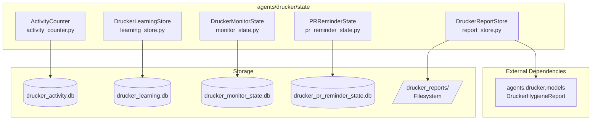
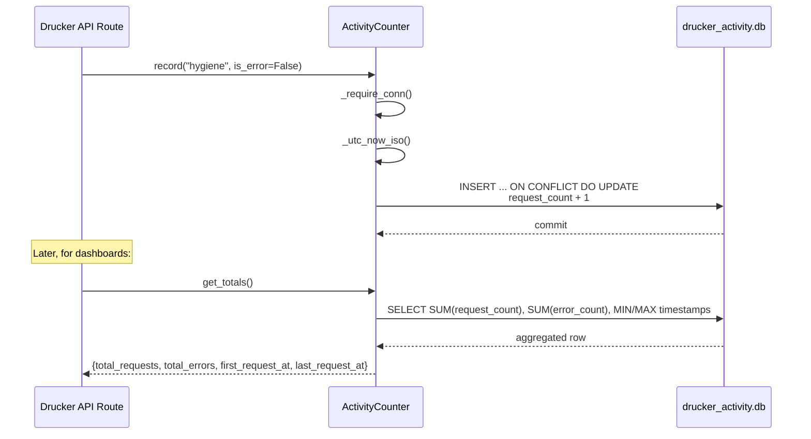
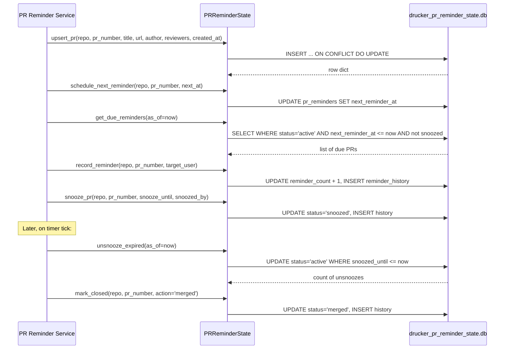
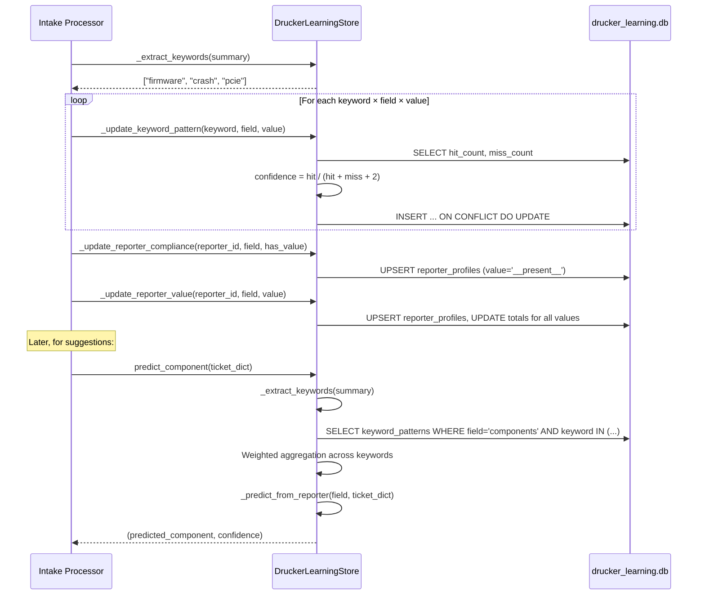

<!-- Generated by Documentation Agent — do not edit between markers -->

```yaml
---
title: "As-Built: Drucker State Layer"
date: "2026-04-03"
status: "draft"
---
```

## Module Overview

The `agents/drucker/state/` package is the persistence layer for the Drucker agent — a Jira hygiene and PR review automation service within the Cornelis Networks agent workforce. It comprises five SQLite-backed stores and one filesystem-backed store, each owning a distinct slice of Drucker's operational state: API request activity counters, ticket-intake learning patterns, intake-monitor checkpoints, PR reminder lifecycle tracking, and hygiene report artifacts. Every SQLite store follows a consistent internal pattern — thread-safe access via `threading.RLock`, `check_same_thread=False` connections, auto-creating parent directories, an `_init_db()` schema bootstrap, a `_require_conn()` guard, and a `close()` teardown method. The filesystem store (`DruckerReportStore`) persists JSON and Markdown report artifacts under a configurable directory tree keyed by project and report ID.

## What Changed

- **Before:** The state layer consisted of two stores: `DruckerMonitorState` for intake-monitor checkpoints and processed-ticket tracking, `DruckerLearningStore` for keyword/reporter pattern learning, and `DruckerReportStore` for hygiene report persistence.
- **After:** Two new stores were added: `ActivityCounter` for tracking per-category API request and error counts with timestamps, and `PRReminderState` for managing the full PR reminder lifecycle including scheduling, snoozing, unsnoozing, closure, and action history.
- **Impact:** Upstream Drucker API routes and background tasks now have dedicated persistence for request telemetry (via `ActivityCounter`) and PR reminder workflows (via `PRReminderState`). Existing consumers of `DruckerMonitorState`, `DruckerLearningStore`, and `DruckerReportStore` are unaffected. The new stores introduce two additional SQLite database files (`data/drucker_activity.db` and `data/drucker_pr_reminder_state.db`) to the `data/` directory.

## Component Diagram



## Key Flows

### Flow 1: Recording API Activity

When a Drucker API endpoint handles a request, it calls `ActivityCounter.record()` with a category string (e.g., `'hygiene'`, `'jira'`, `'github'`, `'pr-reminders'`) and an error flag. The counter upserts a row using SQLite's `ON CONFLICT` clause, atomically incrementing `request_count` and conditionally `error_count`, while preserving `first_request_at` and updating `last_request_at`.



The `record()` method uses a single SQL statement with `ON CONFLICT` to handle both first-seen and subsequent requests:

```python
def record(self, category: str, is_error: bool = False) -> None:
    conn = self._require_conn()
    now = self._utc_now_iso()
    with self._lock:
        cursor = conn.cursor()
        cursor.execute(
            '''
            INSERT INTO activity (category, request_count, error_count, first_request_at, last_request_at)
            VALUES (?, 1, ?, ?, ?)
            ON CONFLICT(category) DO UPDATE SET
                request_count = request_count + 1,
                error_count = error_count + ?,
                last_request_at = ?
            ''',
            (category, int(is_error), now, now, int(is_error), now),
        )
        conn.commit()
```

### Flow 2: PR Reminder Lifecycle (Upsert → Schedule → Remind → Snooze → Close)

The `PRReminderState` manages the full lifecycle of a pull request reminder. A PR is first registered via `upsert_pr()`, then scheduled with `schedule_next_reminder()`. When due, `get_due_reminders()` returns eligible PRs, and `record_reminder()` logs the action. PRs can be snoozed and later auto-reactivated via `unsnooze_expired()`, or permanently closed via `mark_closed()`.



### Flow 3: Learning from Ticket Intake (Keyword & Reporter Pattern Updates)

When a ticket is processed, `DruckerLearningStore` extracts keywords from the summary and updates keyword-to-field-value confidence scores. It simultaneously tracks per-reporter compliance rates and value preferences. These patterns are later queried by `predict_component()` to suggest metadata for new tickets.



The keyword extraction filters out stopwords and short tokens:

```python
def _extract_keywords(self, summary: str) -> list[str]:
    if not summary:
        return []
    tokens = re.split(r'[^a-zA-Z0-9]+', summary.lower())
    keywords: list[str] = []
    seen: set[str] = set()
    for token in tokens:
        if len(token) < 3:
            continue
        if token in self._STOPWORDS:
            continue
        if token in seen:
            continue
        seen.add(token)
        keywords.append(token)
    return keywords
```

## Data Model

### ActivityCounter — `drucker_activity.db`

| Table | Column | Type | Constraint | Description |
|-------|--------|------|------------|-------------|
| `activity` | `category` | TEXT | PRIMARY KEY | Endpoint category (e.g., `'hygiene'`, `'jira'`, `'github'`) |
| | `request_count` | INTEGER | NOT NULL DEFAULT 0 | Cumulative successful + failed requests |
| | `error_count` | INTEGER | NOT NULL DEFAULT 0 | Cumulative error requests |
| | `first_request_at` | TEXT | | ISO 8601 UTC timestamp of first request |
| | `last_request_at` | TEXT | | ISO 8601 UTC timestamp of most recent request |

### DruckerLearningStore — `drucker_learning.db`

| Table | Column | Type | Constraint | Description |
|-------|--------|------|------------|-------------|
| `observations` | `id` | INTEGER | PK AUTOINCREMENT | Row ID |
| | `ticket_key` | TEXT | NOT NULL | Jira ticket key |
| | `field` | TEXT | NOT NULL | Normalized field name |
| | `predicted_value` | TEXT | | What was predicted |
| | `actual_value` | TEXT | | What was actually set |
| | `correct` | INTEGER | NOT NULL | 1 if prediction matched |
| | `timestamp` | TEXT | NOT NULL | ISO 8601 UTC |
| `keyword_patterns` | `keyword` | TEXT | PK (composite) | Lowercased keyword token |
| | `field` | TEXT | PK (composite) | Normalized field name |
| | `value` | TEXT | PK (composite) | Field value associated with keyword |
| | `hit_count` | INTEGER | DEFAULT 0 | Times keyword co-occurred with value |
| | `miss_count` | INTEGER | DEFAULT 0 | Times keyword appeared without value |
| | `confidence` | REAL | DEFAULT 0.0 | `hit / (hit + miss + 2)` — Laplace-smoothed |
| `reporter_profiles` | `reporter_id` | TEXT | PK (composite) | Reporter identifier |
| | `field` | TEXT | PK (composite) | Normalized field name |
| | `value` | TEXT | PK (composite) | Field value or `'__present__'` sentinel |
| | `count` | INTEGER | DEFAULT 0 | Occurrences of this value |
| | `total` | INTEGER | DEFAULT 0 | Total observations for this reporter+field |
| | `compliance_rate` | REAL | DEFAULT 0.0 | `count / total` |
| `learned_tickets` | `ticket_key` | TEXT | PK (composite) | Ticket key |
| | `fingerprint` | TEXT | PK (composite) | Content hash for deduplication |
| | `learned_at` | TEXT | NOT NULL | ISO 8601 UTC |

**Indexes:** `idx_drucker_obs_ticket_field`, `idx_drucker_keyword_patterns`, `idx_drucker_reporter_profiles`, `idx_drucker_learned_tickets_key`.

### DruckerMonitorState — `drucker_monitor_state.db`

| Table | Column | Type | Constraint | Description |
|-------|--------|------|------------|-------------|
| `checkpoints` | `project` | TEXT | PRIMARY KEY | Jira project key |
| | `last_checked` | TEXT | NOT NULL | ISO 8601 UTC polling cursor |
| `processed_tickets` | `ticket_key` | TEXT | PRIMARY KEY | Jira ticket key |
| | `project` | TEXT | | Project key |
| | `processed_at` | TEXT | NOT NULL | ISO 8601 UTC |
| `validation_history` | `id` | INTEGER | PK AUTOINCREMENT | Row ID |
| | `ticket_key` | TEXT | NOT NULL | Jira ticket key |
| | `project` | TEXT | | Project key |
| | `result_json` | TEXT | | JSON-serialized validation result |
| | `timestamp` | TEXT | NOT NULL | ISO 8601 UTC |

**Indexes:** `idx_drucker_processed_project`, `idx_drucker_history_ticket`, `idx_drucker_history_project`.

### PRReminderState — `drucker_pr_reminder_state.db`

| Table | Column | Type | Constraint | Description |
|-------|--------|------|------------|-------------|
| `pr_reminders` | `id` | INTEGER | PK AUTOINCREMENT | Row ID |
| | `repo` | TEXT | NOT NULL | Repository identifier (e.g., `org/repo`) |
| | `pr_number` | INTEGER | NOT NULL | Pull request number |
| | `pr_title` | TEXT | DEFAULT '' | PR title |
| | `pr_url` | TEXT | DEFAULT '' | PR URL |
| | `author_github` | TEXT | DEFAULT '' | PR author GitHub handle |
| | `reviewers_github` | TEXT | DEFAULT '' | Comma-separated reviewer handles |
| | `created_at` | TEXT | NOT NULL | PR creation timestamp |
| | `first_reminded_at` | TEXT | | First reminder timestamp |
| | `last_reminded_at` | TEXT | | Most recent reminder timestamp |
| | `next_reminder_at` | TEXT | | Scheduled next reminder |
| | `reminder_count` | INTEGER | DEFAULT 0 | Total reminders sent |
| | `snoozed_until` | TEXT | | Snooze expiry timestamp |
| | `snoozed_by` | TEXT | DEFAULT '' | Who snoozed it |
| | `status` | TEXT | DEFAULT 'active' | `active`, `snoozed`, `closed`, `merged` |
| | | | UNIQUE(repo, pr_number) | |
| `reminder_history` | `id` | INTEGER | PK AUTOINCREMENT | Row ID |
| | `repo` | TEXT | NOT NULL | Repository identifier |
| | `pr_number` | INTEGER | NOT NULL | Pull request number |
| | `action` | TEXT | NOT NULL | `reminded`, `snoozed`, `closed`, `merged` |
| | `target_user` | TEXT | DEFAULT '' | User targeted by action |
| | `details_json` | TEXT | | JSON payload for action-specific data |
| | `timestamp` | TEXT | NOT NULL | ISO 8601 UTC |

**Indexes:** `idx_pr_reminders_repo_status`, `idx_pr_reminders_next` (partial, `WHERE status = 'active'`), `idx_reminder_history_pr`.

### DruckerReportStore — Filesystem

Reports are stored as:
```
data/drucker_reports/<PROJECT_KEY>/<REPORT_ID>/report.json
data/drucker_reports/<PROJECT_KEY>/<REPORT_ID>/summary.md
```

The store reads/writes plain JSON and Markdown files. It depends on `DruckerHygieneReport` from `agents.drucker.models` for the `to_dict()` and `summary_markdown` interface.

## Dependencies

| Dependency | Purpose | Version |
|---|---|---|
| `sqlite3` (stdlib) | Persistence engine for all four SQLite-backed stores | Python stdlib |
| `threading` (stdlib) | `RLock` for thread-safe database access | Python stdlib |
| `json` (stdlib) | Serialization of validation results, PR reminder details, and reports | Python stdlib |
| `pathlib` (stdlib) | Directory creation and file path resolution | Python stdlib |
| `hashlib` (stdlib) | Imported in `learning_store.py` (available for fingerprinting) | Python stdlib |
| `re` (stdlib) | Keyword tokenization in `DruckerLearningStore._extract_keywords()` | Python stdlib |
| `logging` (stdlib) | Diagnostic logging in `DruckerLearningStore` and `DruckerReportStore` | Python stdlib |
| `agents.drucker.models.DruckerHygieneReport` | Report model with `to_dict()` and `summary_markdown` | Internal |

## Configuration

| Parameter | Source | Default | Description |
|---|---|---|---|
| `db_path` (ActivityCounter) | Constructor argument | `'data/drucker_activity.db'` | SQLite database file path |
| `db_path` (DruckerLearningStore) | Constructor argument | `'data/drucker_learning.db'` | SQLite database file path |
| `min_observations` (DruckerLearningStore) | Constructor argument / `set_min_observations()` | `20` | Minimum observation count before predictions are returned; clamped to ≥ 1 |
| `db_path` (DruckerMonitorState) | Constructor argument | `'data/drucker_monitor_state.db'` | SQLite database file path |
| `db_path` (PRReminderState) | Constructor argument | `'data/drucker_pr_reminder_state.db'` | SQLite database file path |
| `storage_dir` (DruckerReportStore) | Constructor argument | `None` (falls through) | Filesystem directory for report artifacts |
| `DRUCKER_REPORT_DIR` | Environment variable | `'data/drucker_reports'` | Overrides `storage_dir` when constructor arg is `None` |

All SQLite stores accept `':memory:'` as `db_path` for testing; when a real path is given, parent directories are created automatically via `Path.mkdir(parents=True, exist_ok=True)`.

## Error Handling

All five stores follow a consistent error handling pattern:

1. **Connection guard:** Every public method calls `_require_conn()`, which raises `RuntimeError` with a descriptive message if `close()` has already been called:

   ```python
   def _require_conn(self) -> sqlite3.Connection:
       if self.conn is None:
           raise RuntimeError('ActivityCounter connection is closed')
       return self.conn
   ```

2. **Thread safety:** All database operations are wrapped in `with self._lock:` blocks using a `threading.RLock`, preventing concurrent mutation from multiple threads sharing the same store instance.

3. **Filesystem errors in `DruckerReportStore`:** The `get_report()` method catches generic `Exception` on file reads and logs errors via `log.error()`, returning `None` on failure. The `list_reports()` method catches and logs `Exception` per file, skipping unreadable reports rather than aborting the listing. The `save_report()` method raises `ValueError` for missing `report_id` or `project_key` but does not catch I/O errors from `open()` or `json.dump()` — those propagate to the caller.

4. **No explicit SQLite error handling:** None of the SQLite stores catch `sqlite3.Error` or its subclasses. Database errors (e.g., disk full, corruption) propagate as unhandled exceptions.

## Known Limitations / Technical Debt

1. **Truncated source file — `learning_store.py`:** The `predict_component()` method in `DruckerLearningStore` is truncated in the provided source (cuts off mid-iteration at `for row in r`). The weighted aggregation logic, the reporter-based fallback path, and the return statement are missing from the visible code. This means the full prediction pipeline cannot be verified from the available source.

2. **No SQLite error handling on I/O boundaries:** None of the four SQLite-backed stores catch `sqlite3.OperationalError`, `sqlite3.DatabaseError`, or other SQLite exceptions. A disk-full condition, database corruption, or locked-database scenario will propagate as an unhandled exception. This is an anti-pattern for production services.

3. **Missing error handling on filesystem writes in `DruckerReportStore.save_report()`:** While `get_report()` and `list_reports()` catch I/O exceptions, `save_report()` lets `open()` and `json.dump()` exceptions propagate uncaught. A permissions error or disk-full condition during report persistence will surface as an unhandled `OSError`.

4. **Hardcoded default database paths:** All four SQLite stores have hardcoded default paths under `data/` (e.g., `'data/drucker_activity.db'`, `'data/drucker_learning.db'`). These are not configurable via environment variables — only `DruckerReportStore` supports `DRUCKER_REPORT_DIR`. In containerized or multi-instance deployments, callers must explicitly pass `db_path` to avoid collisions.

5. **No connection pooling or WAL mode:** Each store opens a single `sqlite3.Connection` with `check_same_thread=False` and relies on an `RLock` for serialization. Write-heavy workloads under concurrent access may experience contention. SQLite WAL mode is not enabled, which would improve concurrent read performance.

6. **`DruckerLearningStore` approaches god-class territory:** The class contains extensive logic spanning keyword extraction, keyword pattern updates, reporter compliance tracking, reporter value tracking, reporter-based prediction, and component prediction — all in a single class. While the line count is within bounds, the breadth of responsibilities suggests this could benefit from decomposition.

7. **`_STOPWORDS` set is hardcoded in `DruckerLearningStore`:** The stopword list is a class-level constant with no mechanism for runtime extension or project-specific customization. Domain-specific terms that should be filtered (or preserved) require a code change.

8. **Laplace smoothing constant is hardcoded:** The confidence formula in `_update_keyword_pattern()` uses `hit_count / (hit_count + miss_count + 2)` with a fixed smoothing factor of 2. This is not configurable.

<!-- End Documentation Agent generated content -->