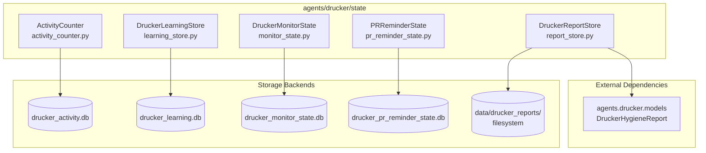
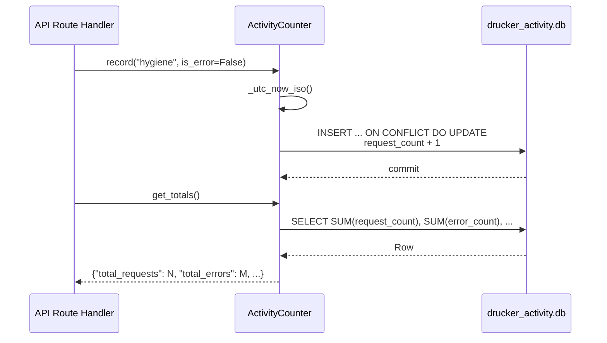

<!-- Generated by Documentation Agent — do not edit between markers -->

```yaml
---
title: "As-Built: Drucker State Layer"
date: "2026-04-03"
status: "draft"
---
```

## Module Overview

The `agents/drucker/state/` package provides the persistence layer for the Drucker agent — a Jira hygiene and PR review automation system within the Cornelis Networks agent workforce. The package contains five SQLite-backed and filesystem-backed stores, each responsible for a distinct domain of durable state: API request activity counters, ticket-intake learning patterns, intake-monitor checkpoints, PR reminder lifecycle tracking, and hygiene report artifact storage. Every SQLite store follows a consistent architectural pattern — thread-safe access via `threading.RLock`, `sqlite3.Row`-based result handling, automatic parent-directory creation, and an explicit `close()` lifecycle method. The filesystem store (`DruckerReportStore`) persists JSON and Markdown report artifacts to a configurable directory tree. Together, these stores give the Drucker agent crash-resilient, queryable state without requiring an external database server.

## What Changed

- **Before:** The state layer consisted of three stores: `DruckerLearningStore` (keyword/reporter pattern learning), `DruckerMonitorState` (intake checkpoint tracking), and `DruckerReportStore` (hygiene report persistence). There was no centralized API activity tracking and no PR reminder state management.

- **After:** Two new stores were added: `ActivityCounter` for tracking per-category API request and error counts with timestamps, and `PRReminderState` for full PR reminder lifecycle management including scheduling, snoozing, unsnoozing, and action history. The existing three stores remain unchanged.

- **Impact:** Upstream API route handlers now have a dedicated counter store to call `record()` on every request. The PR reminder subsystem gains durable state for reminder scheduling, snooze windows, and audit history — enabling the Drucker agent to persist reminder state across restarts and query due reminders on a schedule.

## Component Diagram



## Key Flows

### Flow 1: Recording and Querying API Activity

The `ActivityCounter` provides a fire-and-forget `record()` call for every API request, using SQLite's `ON CONFLICT` upsert to atomically increment counters and update timestamps.



The `record()` method uses a single SQL statement that inserts a new category row or increments the existing one:

```python
def record(self, category: str, is_error: bool = False) -> None:
    conn = self._require_conn()
    now = self._utc_now_iso()
    with self._lock:
        cursor = conn.cursor()
        cursor.execute(
            '''
            INSERT INTO activity (category, request_count, error_count, first_request_at, last_request_at)
            VALUES (?, 1, ?, ?, ?)
            ON CONFLICT(category) DO UPDATE SET
                request_count = request_count + 1,
                error_count = error_count + ?,
                last_request_at = ?
            ''',
            (category, int(is_error), now, now, int(is_error), now),
        )
        conn.commit()
```

### Flow 2: PR Reminder Lifecycle (Upsert → Schedule → Remind → Snooze → Close)

`PRReminderState` tracks pull requests through a multi-state lifecycle: `active` → `snoozed` → `active` (unsnooze) → `closed`/`merged`. Each state transition is logged to `reminder_history`.

```mermaid
sequenceDiagram
    participant Caller as PR Reminder Service
    participant PRS as PRReminderState
    participant DB as drucker_pr_reminder_state.db

    Caller->>PRS: upsert_pr(repo, pr_number, ...)
    PRS->>DB: INSERT ... ON CONFLICT DO UPDATE
    DB-->>PRS: row
    PRS-->>Caller: Dict (pr record)

    Caller->>PRS: schedule_next_reminder(repo, pr_number, next_at)
    PRS->>DB: UPDATE pr_reminders SET next_reminder_at = ?

    Caller->>PRS: get_due_reminders(as_of=now)
    PRS->>DB: SELECT WHERE status='active' AND next_reminder_at <= ?
    DB-->>PRS: rows
    PRS-->>Caller: List[Dict]

    Caller->>PRS: record_reminder(repo, pr_number, target_user)
    PRS->>DB: UPDATE reminder_count + 1; INSERT reminder_history

    Caller->>PRS: snooze_pr(repo, pr_number, snooze_until, snoozed_by)
    PRS->>DB: UPDATE status='snoozed'; INSERT reminder_history

    Caller->>PRS: unsnooze_expired(as_of=now)
    PRS->>DB: UPDATE status='active' WHERE snoozed_until <= ?
    DB-->>PRS: count
    PRS-->>Caller: int (unsnooze count)

    Caller->>PRS: mark_closed(repo, pr_number, action='merged')
    PRS->>DB: UPDATE status='merged'; INSERT reminder_history
```

The `get_due_reminders()` query filters for active, non-snoozed PRs whose `next_reminder_at` has passed:

```python
cursor.execute(
    '''
    SELECT * FROM pr_reminders
    WHERE status = 'active'
      AND next_reminder_at IS NOT NULL
      AND next_reminder_at <= ?
      AND (snoozed_until IS NULL OR snoozed_until <= ?)
    ORDER BY next_reminder_at ASC
    ''',
    (now, now),
)
```

### Flow 3: Learning Store — Observe Ticket and Predict Component

`DruckerLearningStore` ingests resolved ticket data to build keyword→component and reporter→field-value frequency tables, then uses those patterns to predict metadata for new tickets.

```mermaid
sequenceDiagram
    participant Intake as Intake Processor
    participant LS as DruckerLearningStore
    participant DB as drucker_learning.db

    Note over Intake,LS: Learning Phase (resolved ticket)
    Intake->>LS: _extract_keywords(summary)
    LS-->>Intake: ["firmware", "pcie", "link"]
    loop For each keyword
        Intake->>LS: _update_keyword_pattern(keyword, "components", "Firmware")
        LS->>DB: SELECT hit_count, miss_count; UPSERT with new confidence
    end
    Intake->>LS: _update_reporter_compliance(reporter, field, has_value)
    LS->>DB: UPSERT reporter_profiles (count, total, compliance_rate)
    Intake->>LS: _update_reporter_value(reporter, "components", "Firmware")
    LS->>DB: UPSERT reporter_profiles; UPDATE totals for all values

    Note over Intake,LS: Prediction Phase (new ticket)
    Intake->>LS: predict_component(ticket_dict)
    LS->>LS: _extract_keywords(summary)
    LS->>DB: SELECT keyword_patterns WHERE field='components' AND keyword IN (...)
    DB-->>LS: rows with hit_count, confidence
    LS->>LS: Weighted aggregation across keywords
    LS-->>Intake: ("Firmware", 0.72)
```

Keyword extraction strips stopwords and short tokens:

```python
def _extract_keywords(self, summary: str) -> list[str]:
    tokens = re.split(r'[^a-zA-Z0-9]+', summary.lower())
    keywords: list[str] = []
    seen: set[str] = set()
    for token in tokens:
        if len(token) < 3:
            continue
        if token in self._STOPWORDS:
            continue
        if token in seen:
            continue
        seen.add(token)
        keywords.append(token)
    return keywords
```

## Data Model

### ActivityCounter — `drucker_activity.db`

| Table | Column | Type | Description |
|-------|--------|------|-------------|
| `activity` | `category` | `TEXT PRIMARY KEY` | Endpoint category (e.g. `hygiene`, `jira`, `github`, `nl`, `pr-reminders`) |
| | `request_count` | `INTEGER` | Total requests for this category |
| | `error_count` | `INTEGER` | Total errors for this category |
| | `first_request_at` | `TEXT` | ISO 8601 UTC timestamp of first request |
| | `last_request_at` | `TEXT` | ISO 8601 UTC timestamp of most recent request |

### DruckerLearningStore — `drucker_learning.db`

| Table | Column | Type | Description |
|-------|--------|------|-------------|
| `observations` | `id` | `INTEGER PK AUTOINCREMENT` | Row ID |
| | `ticket_key` | `TEXT` | Jira ticket key |
| | `field` | `TEXT` | Metadata field name |
| | `predicted_value` | `TEXT` | What the model predicted |
| | `actual_value` | `TEXT` | What was actually set |
| | `correct` | `INTEGER` | 1 if prediction matched |
| | `timestamp` | `TEXT` | ISO 8601 UTC |
| `keyword_patterns` | `(keyword, field, value)` | `TEXT PK` | Composite primary key |
| | `hit_count` | `INTEGER` | Times this keyword co-occurred with this field value |
| | `miss_count` | `INTEGER` | Times keyword appeared without this value |
| | `confidence` | `REAL` | `hit_count / (hit_count + miss_count + 2)` — Laplace-smoothed |
| `reporter_profiles` | `(reporter_id, field, value)` | `TEXT PK` | Composite primary key |
| | `count` | `INTEGER` | Times this reporter used this value (or `__present__` sentinel for compliance) |
| | `total` | `INTEGER` | Total observations for this reporter+field |
| | `compliance_rate` | `REAL` | `count / total` |
| `learned_tickets` | `(ticket_key, fingerprint)` | `TEXT PK` | Deduplication — prevents re-learning the same ticket state |
| | `learned_at` | `TEXT` | ISO 8601 UTC |

### DruckerMonitorState — `drucker_monitor_state.db`

| Table | Column | Type | Description |
|-------|--------|------|-------------|
| `checkpoints` | `project` | `TEXT PRIMARY KEY` | Jira project key |
| | `last_checked` | `TEXT` | ISO 8601 UTC polling cursor |
| `processed_tickets` | `ticket_key` | `TEXT PRIMARY KEY` | Ticket already processed |
| | `project` | `TEXT` | Owning project |
| | `processed_at` | `TEXT` | ISO 8601 UTC |
| `validation_history` | `id` | `INTEGER PK AUTOINCREMENT` | Row ID |
| | `ticket_key` | `TEXT` | Ticket key |
| | `project` | `TEXT` | Project key |
| | `result_json` | `TEXT` | JSON-serialized validation result |
| | `timestamp` | `TEXT` | ISO 8601 UTC |

### PRReminderState — `drucker_pr_reminder_state.db`

| Table | Column | Type | Description |
|-------|--------|------|-------------|
| `pr_reminders` | `id` | `INTEGER PK AUTOINCREMENT` | Row ID |
| | `(repo, pr_number)` | `UNIQUE` | Natural key for a PR |
| | `pr_title`, `pr_url` | `TEXT` | Display metadata |
| | `author_github` | `TEXT` | PR author's GitHub handle |
| | `reviewers_github` | `TEXT` | Comma-separated reviewer handles |
| | `created_at` | `TEXT` | PR creation timestamp |
| | `first_reminded_at` | `TEXT` | First reminder sent |
| | `last_reminded_at` | `TEXT` | Most recent reminder sent |
| | `next_reminder_at` | `TEXT` | Scheduled next reminder (indexed, filtered on `status='active'`) |
| | `reminder_count` | `INTEGER` | Total reminders sent |
| | `snoozed_until` | `TEXT` | Snooze expiry |
| | `snoozed_by` | `TEXT` | Who snoozed it |
| | `status` | `TEXT` | `active`, `snoozed`, `closed`, `merged` |
| `reminder_history` | `id` | `INTEGER PK AUTOINCREMENT` | Row ID |
| | `repo`, `pr_number` | `TEXT`, `INTEGER` | PR reference |
| | `action` | `TEXT` | `reminded`, `snoozed`, `closed`, `merged` |
| | `target_user` | `TEXT` | User targeted by the action |
| | `details_json` | `TEXT` | Optional JSON payload |
| | `timestamp` | `TEXT` | ISO 8601 UTC |

### DruckerReportStore — Filesystem

Reports are stored as:
```
data/drucker_reports/<PROJECT_KEY>/<REPORT_ID>/report.json
data/drucker_reports/<PROJECT_KEY>/<REPORT_ID>/summary.md
```

The store reads/writes `DruckerHygieneReport` model objects (from `agents.drucker.models`) or plain dicts. Listing and retrieval use `pathlib.Path.glob()` patterns.

## Dependencies

| Dependency | Purpose | Version |
|---|---|---|
| `sqlite3` | Persistent storage for all four SQLite-backed stores | Python stdlib |
| `threading` | `RLock` for thread-safe database access | Python stdlib |
| `pathlib` | Directory creation and file path resolution | Python stdlib |
| `json` | Serialization of validation results, reminder details, and reports | Python stdlib |
| `hashlib` | Imported in `learning_store.py` (available for fingerprint computation) | Python stdlib |
| `re` | Keyword tokenization in `DruckerLearningStore._extract_keywords()` | Python stdlib |
| `logging` | Structured logging in `learning_store.py` and `report_store.py` | Python stdlib |
| `agents.drucker.models.DruckerHygieneReport` | Report data model for `DruckerReportStore.save_report()` | Internal |

## Configuration

| Parameter | Source | Default | Description |
|---|---|---|---|
| `db_path` (ActivityCounter) | Constructor argument | `data/drucker_activity.db` | SQLite database file path |
| `db_path` (DruckerLearningStore) | Constructor argument | `data/drucker_learning.db` | SQLite database file path |
| `min_observations` (DruckerLearningStore) | Constructor argument | `20` | Minimum observation count before predictions are returned; floor-clamped to 1 |
| `db_path` (DruckerMonitorState) | Constructor argument | `data/drucker_monitor_state.db` | SQLite database file path |
| `db_path` (PRReminderState) | Constructor argument | `data/drucker_pr_reminder_state.db` | SQLite database file path |
| `storage_dir` (DruckerReportStore) | Constructor argument | `None` (falls through) | Filesystem directory for report artifacts |
| `DRUCKER_REPORT_DIR` | Environment variable | `data/drucker_reports` | Overrides default report storage directory when `storage_dir` is not passed |

All SQLite stores accept `':memory:'` as `db_path` for testing — in that case, parent directory creation is skipped.

## Error Handling

All five stores follow a consistent error handling pattern:

1. **Connection guard** — Every store implements `_require_conn()`, which raises `RuntimeError` if the connection has been closed:

   ```python
   def _require_conn(self) -> sqlite3.Connection:
       if self.conn is None:
           raise RuntimeError('ActivityCounter connection is closed')
       return self.conn
   ```

2. **Thread safety** — All database operations are wrapped in `with self._lock:` blocks using a `threading.RLock`. The reentrant lock allows nested calls within the same thread.

3. **SQLite `check_same_thread=False`** — All connections are opened with this flag to permit multi-threaded access (guarded by the application-level lock).

4. **`DruckerReportStore` file I/O** — `get_report()` catches generic `Exception` on file reads and returns `None` / logs a warning rather than propagating. `list_reports()` similarly catches and skips unreadable files:

   ```python
   except Exception as e:
       log.warning(f'Skipping unreadable report file {json_path}: {e}')
       continue
   ```

5. **No retry logic** — None of the stores implement retry or backoff on SQLite busy/locked errors. The `RLock` serializes access within a single process, but cross-process contention is not handled.

## Known Limitations / Technical Debt

1. **Truncated source file** — `learning_store.py` is truncated mid-method in the provided source. The `predict_component()` method's weighted aggregation logic and any remaining public methods (e.g., `learn_from_ticket()`, `predict_priority()`) are not visible. The `_ticket_keywords` instance dict is initialized but never populated in the visible code, suggesting caching logic exists in the truncated portion.

2. **No connection pooling or WAL mode** — All SQLite stores use the default journal mode. For concurrent read-heavy workloads (e.g., `get_due_reminders()` polled frequently), enabling WAL mode (`PRAGMA journal_mode=WAL`) would reduce reader/writer contention.

3. **Hardcoded default database paths** — Each store has a hardcoded default path (e.g., `'data/drucker_activity.db'`, `'data/drucker_learning.db'`). These are not centralized in a configuration module; changing the data directory requires updating each constructor call site.

4. **`DruckerLearningStore` is a potential god class** — The visible portion already contains 10+ methods spanning keyword extraction, pattern updates, reporter compliance tracking, reporter value tracking, and prediction. With the truncated portion likely adding more public methods, this class may exceed 500 lines with >10 public methods.

5. **Missing `close()` in `DruckerReportStore`** — Unlike the four SQLite stores, `DruckerReportStore` has no `close()` method. While it uses no persistent connection, the inconsistency breaks the uniform lifecycle contract.

6. **No schema migration support** — All stores use `CREATE TABLE IF NOT EXISTS`. Adding columns to existing tables requires manual migration; there is no versioning or `ALTER TABLE` logic.

7. **`_sort_timestamp` fallback** — In `DruckerReportStore._sort_timestamp()`, unparseable timestamps silently fall back to `datetime.min`, which could cause reports with malformed timestamps to sort to the bottom without any warning.

8. **`hashlib` imported but unused in visible code** — `learning_store.py` imports `hashlib` but the fingerprint computation that uses it is in the truncated portion. If the truncated code is missing from the actual deployment, this is dead code.

9. **No index on `pr_reminders.status` alone** — The `idx_pr_reminders_next` partial index filters on `status = 'active'`, but `list_active()` queries `status NOT IN ('closed', 'merged')` which cannot use this index efficiently. A broader index on `(status)` would help.

<!-- End Documentation Agent generated content -->