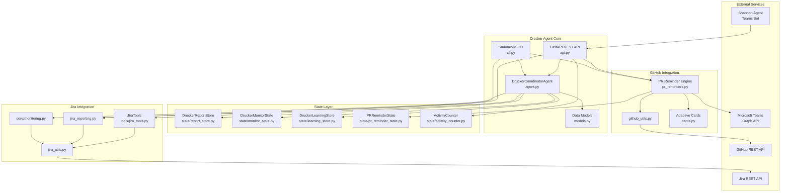
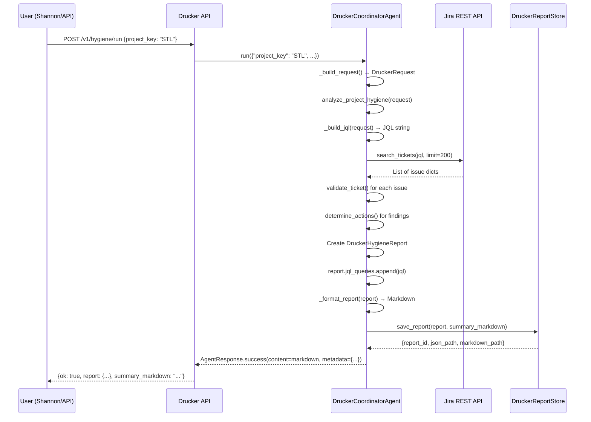
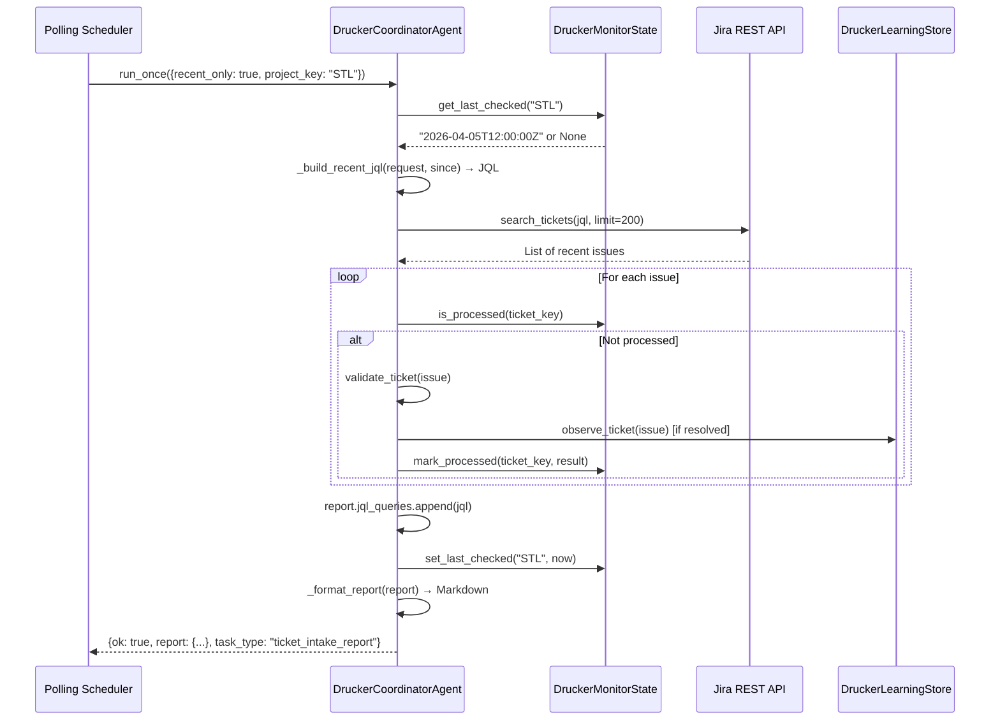
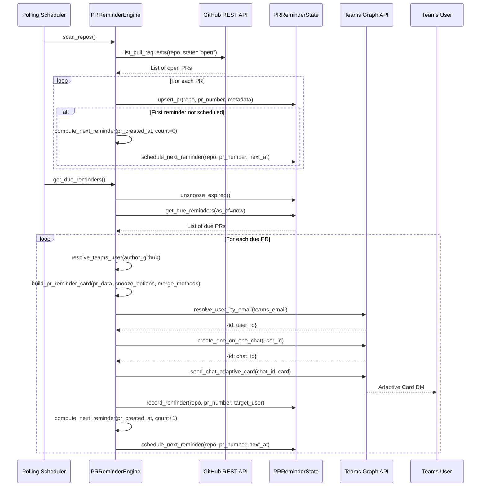

<!-- Generated by Documentation Agent — do not edit between markers -->

```yaml
---
title: "As-Built: Drucker Engineering Hygiene Agent"
date: "2026-04-06"
status: "draft"
---
```

# Drucker Engineering Hygiene Agent — Design Reference

## 1. Module Overview

The Drucker Engineering Hygiene Agent is a deterministic automation system that monitors Jira ticket quality and GitHub pull request lifecycle health across the Cornelis Networks engineering organization. Named after management theorist Peter Drucker, the agent identifies workflow drift, missing metadata, stale work, and routing mistakes in both Jira and GitHub, then proposes safe, reviewable remediation actions. Drucker operates in dry-run mode by default, ensuring all mutations are previewed before execution. It exposes REST API endpoints, CLI commands, and Teams chat integration via Shannon, and persists all findings in SQLite-backed state stores and filesystem-based report archives. The agent is the most feature-rich implemented agent in the workforce, combining Jira hygiene analysis, GitHub PR scanning, PR reminder DMs via Teams, natural language query translation, and a learning subsystem that observes ticket-intake patterns to suggest metadata for new issues.

## 2. What Changed

### Before
- Drucker performed Jira hygiene scans and GitHub PR hygiene scans, but did not record the JQL queries used to fetch tickets.
- The `DruckerHygieneReport` model had no `jql_queries` field.
- The Markdown report output did not include a "JQL Queries Used" section.

### After
- The `DruckerHygieneReport` model now includes a `jql_queries: List[str]` field (default empty list).
- `analyze_project_hygiene()` appends the constructed JQL query to `report.jql_queries` before returning.
- `analyze_recent_ticket_intake()` appends the recent-ticket JQL query to `report.jql_queries`.
- `_format_report()` now renders a "## JQL Queries Used" section in the Markdown output when `report.jql_queries` is non-empty, listing each query with a numbered index.

### Impact
- **Observability:** Users can now see exactly which JQL queries Drucker executed to produce a hygiene report, improving transparency and debugging.
- **Downstream consumers:** Any code that deserializes `DruckerHygieneReport.to_dict()` will now see a `jql_queries` key (empty list if no queries were recorded).
- **Markdown reports:** All persisted and API-returned Markdown summaries now include the JQL query section when applicable.

## 3. Component Diagram



## 4. Key Flows

### Flow 1 — Jira Project Hygiene Scan (with JQL Recording)

When a user requests a full Jira hygiene scan via Shannon (`@Shannon /hygiene-run project STL`) or the API (`POST /v1/hygiene/run`), Drucker constructs a JQL query, fetches tickets, validates them against `monitor.yaml` rules, generates findings and proposed actions, and now records the JQL query in the report.



**Description:** The `_build_jql()` method constructs a JQL query string based on the request parameters (`project_key`, `include_done`, `stale_days`, custom `jql`). After fetching tickets from Jira, the agent validates each ticket against the `monitor.yaml` rules (required fields, stale thresholds, label compliance). Findings are categorized (e.g., `stale_ticket`, `missing_fix_version`, `unassigned_ticket`) and mapped to proposed actions (e.g., `add_comment`, `add_label`, `suggest_assignee`). The constructed JQL query is appended to `report.jql_queries` before the report is formatted and persisted. The Markdown output now includes a "## JQL Queries Used" section listing the query.

### Flow 2 — Recent Ticket Intake Scan (Checkpointed)

The `recent-ticket-intake` job scans only tickets created or updated since the last checkpoint, using `DruckerMonitorState` to track the cursor. This flow is used for continuous monitoring without re-scanning the entire project.



**Description:** The `analyze_recent_ticket_intake()` method queries Jira for tickets created or updated since the last checkpoint (stored in `DruckerMonitorState.checkpoints`). For each ticket, it checks `processed_tickets` to avoid duplicate validation. New tickets are validated, and if they are resolved (status in `Done`, `Closed`, `Resolved`), they are passed to `DruckerLearningStore.observe_ticket()` to update keyword→component and reporter→field-value patterns. The checkpoint is updated to the current timestamp, and the JQL query is recorded in `report.jql_queries`. This flow enables incremental hygiene monitoring without full project scans.

### Flow 3 — PR Reminder DM Delivery via Teams

The PR reminder engine scans configured GitHub repositories for stale pull requests, schedules reminders based on `pr_reminders.yaml` cadences, resolves GitHub usernames to Teams identities via `identity_map.yaml`, and delivers interactive Adaptive Cards via the Microsoft Graph API.



**Description:** The `scan_repos()` method iterates over all enabled repositories in `pr_reminders.yaml`, fetches open PRs via `github_utils.list_pull_requests()`, and upserts each PR into `PRReminderState`. For new PRs, it computes the first reminder time using the `reminder_days` schedule (e.g., `[5, 8, 10, 15]` days after PR creation). The `get_due_reminders()` method first calls `unsnooze_expired()` to reactivate any PRs whose snooze window has elapsed, then queries for PRs where `next_reminder_at <= now` and `status = 'active'`. For each due PR, the engine resolves the GitHub username to a Teams email via `identity_map.yaml`, builds an Adaptive Card with snooze and merge action buttons, and delivers it via the Graph API. The reminder count is incremented, and the next reminder is scheduled using the next interval in the cadence (or repeating the last interval if the schedule is exhausted).

## 5. Data Model

### Core Data Structures

#### `DruckerRequest` (models.py)

| Field | Type | Default | Description |
|---|---|---|---|
| `project_key` | `str` | `''` | Jira project key (e.g., "STL") |
| `ticket_key` | `Optional[str]` | `None` | Specific ticket for single-issue checks |
| `limit` | `int` | `200` | Max tickets per query |
| `include_done` | `bool` | `False` | Include resolved/closed tickets |
| `stale_days` | `int` | `30` | Days before a ticket is considered stale |
| `jql` | `Optional[str]` | `None` | Custom JQL override |
| `since` | `Optional[str]` | `None` | Checkpoint override (ISO datetime) |
| `recent_only` | `bool` | `False` | Use checkpointed recent-ticket scan |
| `label_prefix` | `str` | `'drucker'` | Label prefix for Drucker-applied labels |
| `requested_by` | `Optional[str]` | `None` | User who requested the scan |
| `approved_by` | `Optional[str]` | `None` | User who approved actions |
| `correlation_id` | `Optional[str]` | `None` | Request correlation ID |
| `trigger` | `str` | `'interactive'` | Trigger source (interactive, scheduled, api) |

#### `DruckerFinding` (models.py)

| Field | Type | Description |
|---|---|---|
| `finding_id` | `str` | Unique finding ID (UUID prefix) |
| `ticket_key` | `str` | Jira ticket key |
| `category` | `str` | Finding category (e.g., `stale_ticket`, `missing_fix_version`) |
| `severity` | `str` | Severity level (`high`, `medium`, `low`) |
| `title` | `str` | Human-readable title |
| `description` | `str` | Detailed description |
| `evidence` | `List[str]` | Evidence strings (e.g., "Last updated 45 days ago") |
| `recommendation` | `str` | Suggested remediation |
| `action_ids` | `List[str]` | IDs of proposed actions linked to this finding |

#### `DruckerAction` (models.py)

| Field | Type | Description |
|---|---|---|
| `action_id` | `str` | Unique action ID (UUID prefix) |
| `ticket_key` | `str` | Jira ticket key |
| `action_type` | `str` | Action type (`add_comment`, `add_label`, `update_field`, `transition`) |
| `title` | `str` | Human-readable title |
| `description` | `str` | Detailed description |
| `finding_ids` | `List[str]` | IDs of findings that triggered this action |
| `confidence` | `str` | Confidence level (`high`, `medium`, `low`) |
| `comment` | `str` | Comment text (for `add_comment` actions) |
| `update_fields` | `Dict[str, Any]` | Field updates (for `update_field` actions) |
| `transition_to` | `str` | Target status (for `transition` actions) |

#### `DruckerHygieneReport` (models.py)

| Field | Type | Default | Description |
|---|---|---|---|
| `project_key` | `str` | `''` | Jira project key |
| `created_at` | `str` | `datetime.now(UTC).isoformat()` | Report creation timestamp |
| `report_id` | `str` | `uuid.uuid4()[:8]` | Unique report ID |
| `request` | `Dict[str, Any]` | `{}` | Serialized `DruckerRequest` |
| `project_info` | `Dict[str, Any]` | `{}` | Jira project metadata |
| `summary` | `Dict[str, Any]` | `{}` | Aggregated counts (total_tickets, finding_count, action_count, by_severity, by_category) |
| `findings` | `List[DruckerFinding]` | `[]` | All findings |
| `proposed_actions` | `List[DruckerAction]` | `[]` | All proposed actions |
| `tickets` | `List[Dict[str, Any]]` | `[]` | Normalized ticket dicts |
| `errors` | `List[str]` | `[]` | Errors encountered during scan |
| `summary_markdown` | `str` | `''` | Markdown-formatted summary |
| `jql_queries` | `List[str]` | `[]` | **NEW:** JQL queries used to fetch tickets |

### State Store Schemas

#### `drucker_activity.db` — ActivityCounter

| Table | Column | Type | Notes |
|---|---|---|---|
| `activity` | `category` | TEXT PK | Endpoint category (hygiene, jira, github, nl, pr-reminders) |
| | `request_count` | INTEGER | Total requests |
| | `error_count` | INTEGER | Total errors |
| | `first_request_at` | TEXT | ISO 8601 UTC |
| | `last_request_at` | TEXT | ISO 8601 UTC |

#### `drucker_learning.db` — DruckerLearningStore

| Table | Column | Type | Notes |
|---|---|---|---|
| `observations` | `id` | INTEGER PK AUTO | |
| | `ticket_key` | TEXT | e.g., "STL-1234" |
| | `field` | TEXT | Normalized field name |
| | `predicted_value` | TEXT | What was predicted |
| | `actual_value` | TEXT | What was actually set |
| | `correct` | INTEGER | 0 or 1 |
| | `timestamp` | TEXT | ISO 8601 UTC |
| `keyword_patterns` | `keyword, field, value` | TEXT PK (composite) | |
| | `hit_count` | INTEGER | Times keyword co-occurred with value |
| | `miss_count` | INTEGER | Times keyword appeared without value |
| | `confidence` | REAL | `hit / (hit + miss + 2)` (Laplace smoothing) |
| `reporter_profiles` | `reporter_id, field, value` | TEXT PK (composite) | `value='__present__'` tracks compliance |
| | `count` | INTEGER | |
| | `total` | INTEGER | |
| | `compliance_rate` | REAL | `count / total` |
| `learned_tickets` | `ticket_key, fingerprint` | TEXT PK (composite) | Deduplication via content hash |
| | `learned_at` | TEXT | ISO 8601 UTC |

#### `drucker_monitor_state.db` — DruckerMonitorState

| Table | Column | Type | Notes |
|---|---|---|---|
| `checkpoints` | `project` | TEXT PK | Jira project key |
| | `last_checked` | TEXT | ISO 8601 cursor |
| `processed_tickets` | `ticket_key` | TEXT PK | |
| | `project` | TEXT | |
| | `processed_at` | TEXT | |
| `validation_history` | `id` | INTEGER PK AUTO | |
| | `ticket_key` | TEXT | |
| | `project` | TEXT | |
| | `result_json` | TEXT | JSON-serialized validation result |
| | `timestamp` | TEXT | |

#### `drucker_pr_reminder_state.db` — PRReminderState

| Table | Column | Type | Notes |
|---|---|---|---|
| `pr_reminders` | `id` | INTEGER PK AUTO | |
| | `repo` | TEXT | GitHub `owner/repo` |
| | `pr_number` | INTEGER | UNIQUE with repo |
| | `pr_title` | TEXT | |
| | `pr_url` | TEXT | |
| | `author_github` | TEXT | |
| | `reviewers_github` | TEXT | Comma-separated or JSON |
| | `created_at` | TEXT | PR creation time |
| | `first_reminded_at` | TEXT | |
| | `last_reminded_at` | TEXT | |
| | `next_reminder_at` | TEXT | Scheduling cursor |
| | `reminder_count` | INTEGER | |
| | `snoozed_until` | TEXT | |
| | `snoozed_by` | TEXT | |
| | `status` | TEXT | `active`, `snoozed`, `closed`, `merged` |
| `reminder_history` | `id` | INTEGER PK AUTO | |
| | `repo, pr_number` | TEXT, INTEGER | |
| | `action` | TEXT | `reminded`, `snoozed`, `closed`, `merged` |
| | `target_user` | TEXT | |
| | `details_json` | TEXT | |
| | `timestamp` | TEXT | |

#### Filesystem — DruckerReportStore

```
data/drucker_reports/
  └── <PROJECT_KEY>/
      └── <REPORT_ID>/
          ├── report.json
          └── summary.md
```

## 6. Dependencies

| Dependency | Purpose | Version |
|---|---|---|
| `fastapi` | REST API framework | N/A |
| `pydantic` | Request/response validation | N/A |
| `uvicorn` | ASGI server | N/A |
| `sqlite3` | Embedded database for state stores | Python stdlib |
| `yaml` | Config file parsing | PyYAML |
| `dotenv` | Environment variable loading | python-dotenv |
| `jira` | Jira REST API client | jira (Atlassian Python SDK) |
| `github_utils` | GitHub REST API wrapper | Internal module |
| `agents.shannon.graph_client.TeamsGraphClient` | Microsoft Graph API client for Teams DMs | Internal module |
| `agents.base.BaseAgent` | Agent framework base class | Internal module |
| `agents.review_agent.ReviewAgent` | Review session orchestration | Internal module |
| `core.monitoring` | Jira ticket validation rules | Internal module |
| `core.reporting` | Bug activity reporting | Internal module |
| `tools.jira_tools.JiraTools` | Jira tool wrappers for agents | Internal module |
| `tools.knowledge_tools` | Knowledge base search tools | Internal module |
| `llm.cornelis_llm.CornelisLLM` | LLM client for NL query translation | Internal module |

## 7. Configuration

### Environment Variables

| Variable | Required | Default | Description |
|---|---|---|---|
| `JIRA_URL` | Yes | N/A | Jira instance base URL (e.g., `https://cornelisnetworks.atlassian.net`) |
| `JIRA_SERVICE_EMAIL` | Yes | N/A | Jira service account email |
| `JIRA_SERVICE_API_TOKEN` | Yes | N/A | Jira service account API token |
| `GITHUB_TOKEN` | No | N/A | GitHub personal access token (required for PR hygiene scans) |
| `GITHUB_API_URL` | No | `https://api.github.com` | GitHub API base URL |
| `DRY_RUN` | No | `true` | Mutation safety flag (all writes are dry-run unless `false`) |
| `LOG_LEVEL` | No | `INFO` | Logging level |
| `STATE_BACKEND` | No | `json` | State backend type (unused by Drucker, which uses SQLite) |
| `PERSISTENCE_DIR` | No | `/data/state` | State directory for containerized deployments |
| `DRUCKER_MONITOR_STATE_DB` | No | `data/drucker_monitor_state.db` | Path to monitor state SQLite DB |
| `DRUCKER_LEARNING_DB` | No | `data/drucker_learning.db` | Path to learning store SQLite DB |
| `DRUCKER_REPORT_DIR` | No | `data/drucker_reports` | Filesystem directory for report artifacts |

### Configuration Files

#### `agents/drucker/config/monitor.yaml`

Defines per-issue-type validation rules and learning subsystem parameters.

```yaml
project: ''  # Must be set at runtime
poll_interval_minutes: 5

validation_rules:
  Story:
    required: [assignee, fix_versions, components]
    warn: [description]
  Bug:
    required: [assignee, fix_versions, components, priority]
    warn: [description]
  Task:
    required: [assignee, fix_versions, components]
    warn: [description]
  Epic:
    required: [assignee]
    warn: [description]

learning:
  enabled: true
  min_observations: 20
  confidence_thresholds:
    auto_fill: 0.90
    suggest: 0.50
    flag_only: 0.0
```

#### `agents/drucker/config/polling.yaml`

Defines polling defaults, the canonical list of 25 monitored GitHub repositories, and five discrete scan jobs.

```yaml
defaults:
  project_key: ''
  limit: 200
  include_done: false
  stale_days: 30
  label_prefix: drucker
  persist: true
  notify_shannon: false
  github_stale_days: 5
  github_repos:
    - jmac-cornelis/agent-workforce
    - cornelisnetworks/ifs-all
    # ... (25 repos total)

jobs:
  - job_id: hygiene-scan
    description: Full-project hygiene scan for active work.
    scan_type: jira
    recent_only: false

  - job_id: recent-ticket-intake
    description: Recent-ticket intake scan using Drucker checkpoint state.
    scan_type: jira
    recent_only: true

  - job_id: github-hygiene-scan
    description: GitHub PR hygiene scan for stale PRs and missing reviews.
    scan_type: github
    enabled: false

  - job_id: github-extended-scan
    description: Extended GitHub hygiene scan including naming, conflicts, CI, and stale branches.
    scan_type: github-extended
    enabled: false
    branch_stale_days: 30

  - job_id: github-pr-reminders
    description: Scan repos for stale PRs and send Teams DM reminders to authors and reviewers.
    scan_type: github-pr-reminders
    enabled: false
```

#### `agents/drucker/config/pr_reminders.yaml`

Defines PR reminder cadences, notification channels, snooze options, and per-repo overrides.

```yaml
defaults:
  reminder_days: [5, 8, 10, 15]
  notify: [author, reviewers]
  channels: [teams_dm]
  snooze_options_days: [2, 5, 7]
  merge_methods: [squash, merge, rebase]
  enabled: true

repos:
  - repo: jmac-cornelis/agent-workforce
    reminder_days: [3, 5, 8, 12]
  - repo: cornelisnetworks/ifs-all
  # ... (25 repos total)
```

## 8. Error Handling

### Jira Connection Errors

All Jira operations are wrapped in try/except blocks that catch `JiraConnectionError` and return `AgentResponse.error_response()` or HTTP 500 responses. The `jira_utils.connect_to_jira()` function validates credentials and raises `JiraConnectionError` if authentication fails.

### GitHub Connection Errors

GitHub API calls in `github_utils.py` raise `GitHubConnectionError` if the token is missing or invalid. The PR reminder engine logs errors and continues processing remaining PRs rather than failing the entire scan.

### State Store Connection Guards

All five SQLite state stores (`ActivityCounter`, `DruckerLearningStore`, `DruckerMonitorState`, `PRReminderState`, `DruckerReportStore`) implement a `_require_conn()` guard that raises `RuntimeError('... connection is closed')` if `close()` has been called. All public methods call this guard before accessing the database.

### Dry-Run Safety

All mutation operations default to `dry_run=true`. The `DRY_RUN` environment variable is checked in `agent.py` and `api.py`. When `dry_run=true`, Jira write-back actions are logged but not executed, and API responses include `dry_run: true` in the metadata. Users must explicitly pass `dry_run=false` in API requests or set `DRY_RUN=false` in the environment to enable mutations.

### LLM Errors (NL Query Translation)

The `run_nl_query()` function in `nl_query.py` wraps LLM calls in try/except and returns `{ok: false, error: str(e)}` if the LLM call fails. If the LLM chooses not to call a tool (no `tool_calls` in the response), the function returns the LLM's text response directly with `tool_used: None`.

## 9. Known Limitations / Technical Debt

### 1. Empty Project Keys in Config Files

Both `monitor.yaml` (`project: ''`) and `polling.yaml` (`defaults.project_key: ''`) ship with empty project keys. These are **hardcoded placeholders** that must be populated at runtime or via an external mechanism. There is no documented contract for how this resolution occurs. The agent will fail if `project_key` is not provided in the request.

### 2. Duplicated Repository Lists

The 25-repository list appears in both `polling.yaml` (`defaults.github_repos`) and `pr_reminders.yaml` (`repos`). These lists are manually synchronized. Any addition or removal must be applied to both files, creating a maintenance risk. A single canonical source would be preferable.

### 3. All GitHub Jobs Disabled by Default

The three GitHub scan jobs (`github-hygiene-scan`, `github-extended-scan`, `github-pr-reminders`) are all set to `enabled: false` in `polling.yaml`. This suggests the GitHub scanning capability is not yet production-ready or is gated behind an external activation step.

### 4. No Schema Validation for Config Files

There is no JSON Schema or equivalent validation definition for the YAML config files. Typos in key names (e.g., `reminder_day` instead of `reminder_days`) would silently produce incorrect behavior.

### 5. Hardcoded Label Prefix

`defaults.label_prefix: drucker` in `polling.yaml` is a hardcoded string that will be applied as Jira labels. Changing the agent's identity would require updating this value.

### 6. No Automatic GitHub Repository Discovery

The GitHub repository list is manually maintained in `polling.yaml` and `pr_reminders.yaml`. There is no automatic discovery mechanism (e.g., querying the GitHub org for all repos). New repositories must be manually added to both config files.

### 7. PR Reminder Snooze State Not Synced with GitHub

When a user snoozes a PR reminder via the Teams DM card, the snooze state is stored in `PRReminderState` but is not reflected in GitHub (e.g., as a label or comment). If the PR is closed or merged externally, Drucker will not automatically detect this until the next scan.

### 8. Learning Store Predictions Require Manual Observation

The `DruckerLearningStore` requires at least `min_observations` (default 20) samples before it will emit predictions. There is no mechanism to seed the store with historical data or to manually override the threshold for specific fields.

### 9. No Retry Logic for Teams Graph API Calls

The `PRReminderEngine` uses `asyncio.run()` to bridge async Graph API calls into sync context. If a Graph API call fails (e.g., due to a transient network error), the entire reminder delivery fails with no retry. The engine logs the error and continues to the next PR, but the failed reminder is not rescheduled.

### 10. JQL Queries Not Validated Before Execution

The `_build_jql()` and `_build_recent_jql()` methods construct JQL query strings by string concatenation. There is no validation of the resulting JQL syntax before it is sent to Jira. Malformed JQL will cause a Jira API error, which is caught and logged, but the error message may not be user-friendly.

<!-- End Documentation Agent generated content -->