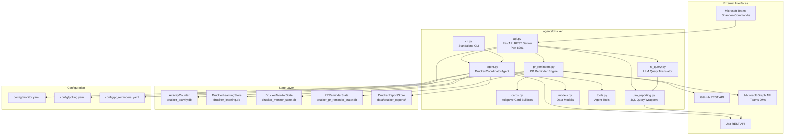
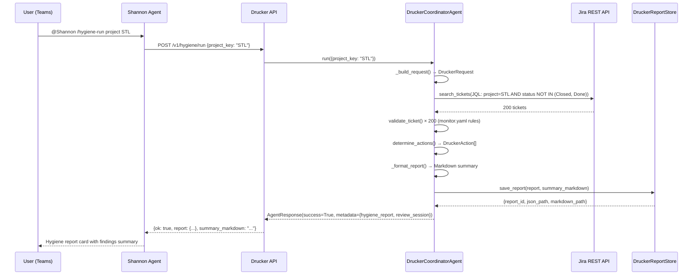
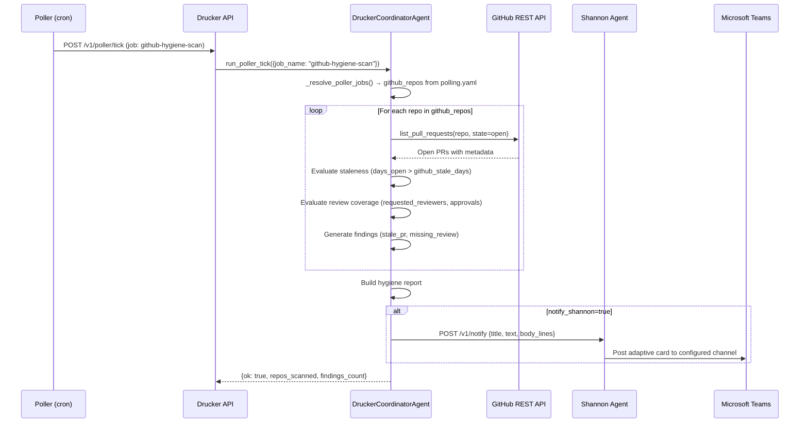
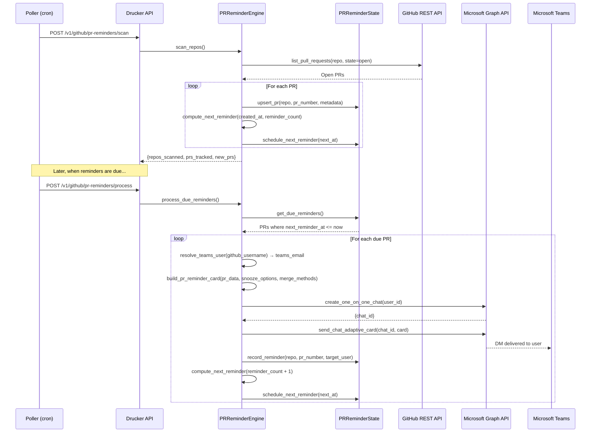

<!-- Generated by Documentation Agent — do not edit between markers -->

```yaml
---
title: "As-Built: Drucker Engineering Hygiene Agent"
date: "2026-04-06"
status: "draft"
---
```

# Drucker Engineering Hygiene Agent — Design Reference

## 1. Module Overview

The Drucker Engineering Hygiene Agent is a deterministic-first automation system that monitors Jira ticket quality and GitHub pull request lifecycle health across the Cornelis Networks engineering organization. Named after management theorist Peter Drucker, the agent identifies workflow drift, missing metadata, stale work, and routing mistakes in both Jira and GitHub, then proposes safe, reviewable remediation actions. Drucker operates in dry-run mode by default, ensuring all mutations are explicitly approved before execution. The agent exposes REST API endpoints (port 8201), integrates with Shannon for Teams-based command routing, and persists hygiene reports, PR reminder state, and learning patterns in SQLite databases. Drucker's architecture prioritizes deterministic evidence over LLM inference — token usage is limited to natural language query translation (`/ask` endpoint), while all hygiene scans, validation rules, and action proposals follow hardcoded policy logic.

## 2. What Changed

### Before
- Drucker performed Jira hygiene scans only.
- GitHub PR hygiene was planned but not implemented.
- No PR reminder DM workflow existed.
- No natural language query translation capability.
- Hygiene reports did not include the JQL queries used to generate them.

### After
- **GitHub PR hygiene scanning** is fully implemented with six scan types: stale PRs, missing reviews, naming compliance, merge conflicts, CI failures, and stale branches.
- **PR reminder DMs** are delivered via Microsoft Teams Graph API with interactive Adaptive Cards supporting snooze and merge actions.
- **Natural language query translation** (`/v1/nl/query`) uses LLM function calling to convert plain English questions into structured Jira tool calls.
- **JQL query logging** — all hygiene reports now include a `jql_queries` field documenting the exact JQL used to fetch tickets.
- **Activity counters** track per-category API request and error counts with timestamps.
- **PR reminder state store** (`PRReminderState`) manages the full PR lifecycle including scheduling, snoozing, and action history.

### Impact
- **Shannon integration** now routes 20+ Drucker commands including GitHub PR hygiene and PR reminder operations.
- **Downstream consumers** of hygiene reports can replay scans by executing the logged JQL queries.
- **PR authors and reviewers** receive automated Teams DMs with actionable cards when PRs exceed staleness thresholds.
- **Observability** improved via `/v1/status/*` endpoints exposing request counts, token usage (zero for deterministic paths), and recent decisions.

## 3. Component Diagram



## 4. Key Flows

### Flow 1 — Jira Hygiene Scan (Full Project)

When a user triggers a full Jira hygiene scan via Shannon (`@Shannon /hygiene-run`) or the API (`POST /v1/hygiene/run`), Drucker queries Jira for all active tickets, validates each against `monitor.yaml` rules, and generates a hygiene report with findings and proposed actions.



**Key details:**
- The JQL query is now logged in `report.jql_queries` (recent change).
- Validation rules are loaded from `config/monitor.yaml` per issue type (Bug, Story, Task, Epic).
- Findings are categorized by severity (high, medium, low) and type (stale_ticket, missing_fix_version, etc.).
- Proposed actions are review-gated — no Jira writes occur unless `dry_run=false` is explicitly passed.

### Flow 2 — GitHub PR Hygiene Scan

GitHub PR hygiene scans run on a configurable schedule (defined in `config/polling.yaml`) or on-demand via Shannon (`@Shannon /pr-hygiene cornelisnetworks/ifs-all`). Drucker fetches open PRs from the GitHub API, evaluates staleness and review coverage, and delivers findings through Shannon.



**Key details:**
- The default `github_stale_days` threshold is 5 days (configurable in `polling.yaml`).
- Draft PRs receive a 2× grace period (10 days default).
- Findings include PR number, title, author, reviewers, age, and a direct link.
- Notifications are delivered through Shannon, not written as GitHub PR comments.

### Flow 3 — PR Reminder DM Delivery

The PR reminder engine scans configured repositories for stale PRs, schedules reminders based on `config/pr_reminders.yaml` cadences, resolves GitHub usernames to Teams identities via `config/identity_map.yaml`, and delivers interactive Adaptive Cards via Microsoft Graph API.



**Key details:**
- Reminder cadences are per-repo configurable (e.g., `[5, 8, 10, 15]` days for most repos, `[3, 5, 8, 12]` for `agent-workforce`).
- Adaptive Cards include snooze buttons (2, 5, 7 days) and merge buttons (squash, merge, rebase).
- Snooze actions update `snoozed_until` in `PRReminderState` and suppress reminders until expiry.
- Merge actions default to dry-run mode — a confirmation card is sent before execution.

## 5. Data Model

### Core Data Structures

#### `DruckerRequest` (models.py)
Input request for hygiene scans.

| Field | Type | Default | Description |
|---|---|---|---|
| `project_key` | `str` | `''` | Jira project key |
| `ticket_key` | `Optional[str]` | `None` | Specific ticket for issue-check |
| `limit` | `int` | `200` | Max tickets per query |
| `include_done` | `bool` | `False` | Include resolved/closed tickets |
| `stale_days` | `int` | `30` | Staleness threshold in days |
| `jql` | `Optional[str]` | `None` | Custom JQL override |
| `since` | `Optional[str]` | `None` | Checkpoint override (ISO date) |
| `recent_only` | `bool` | `False` | Use recent-ticket intake mode |
| `label_prefix` | `str` | `'drucker'` | Label prefix for Drucker-applied labels |
| `requested_by` | `Optional[str]` | `None` | User who triggered the scan |
| `approved_by` | `Optional[str]` | `None` | User who approved actions |
| `correlation_id` | `Optional[str]` | `None` | Trace ID for multi-step workflows |
| `trigger` | `str` | `'interactive'` | Trigger source (interactive, scheduled, webhook) |

#### `DruckerFinding` (models.py)
A single hygiene violation for a ticket.

| Field | Type | Description |
|---|---|---|
| `finding_id` | `str` | UUID-based unique ID |
| `ticket_key` | `str` | Jira ticket key |
| `category` | `str` | Finding type (stale_ticket, missing_fix_version, etc.) |
| `severity` | `str` | high, medium, low |
| `title` | `str` | Human-readable title |
| `description` | `str` | Detailed explanation |
| `evidence` | `List[str]` | Supporting facts (e.g., "Last updated 45 days ago") |
| `recommendation` | `str` | Suggested remediation |
| `action_ids` | `List[str]` | IDs of proposed actions addressing this finding |

#### `DruckerAction` (models.py)
A proposed Jira write-back action.

| Field | Type | Description |
|---|---|---|
| `action_id` | `str` | UUID-based unique ID |
| `ticket_key` | `str` | Target Jira ticket |
| `action_type` | `str` | comment, label, field_update, transition |
| `title` | `str` | Human-readable title |
| `description` | `str` | Detailed explanation |
| `finding_ids` | `List[str]` | Findings this action addresses |
| `confidence` | `str` | high, medium, low |
| `comment` | `str` | Comment text (if action_type=comment) |
| `update_fields` | `Dict[str, Any]` | Field updates (if action_type=field_update) |
| `transition_to` | `str` | Target status (if action_type=transition) |

#### `DruckerHygieneReport` (models.py)
Durable hygiene report artifact.

| Field | Type | Description |
|---|---|---|
| `report_id` | `str` | 8-character UUID prefix |
| `project_key` | `str` | Jira project key |
| `created_at` | `str` | ISO 8601 UTC timestamp |
| `request` | `Dict[str, Any]` | Serialized `DruckerRequest` |
| `project_info` | `Dict[str, Any]` | Jira project metadata |
| `summary` | `Dict[str, Any]` | Aggregated counts (total_tickets, finding_count, etc.) |
| `findings` | `List[DruckerFinding]` | All findings |
| `proposed_actions` | `List[DruckerAction]` | All proposed actions |
| `tickets` | `List[Dict[str, Any]]` | Normalized ticket data |
| `errors` | `List[str]` | Errors encountered during scan |
| `summary_markdown` | `str` | Human-readable Markdown summary |
| `jql_queries` | `List[str]` | **New:** JQL queries used to fetch tickets |

### State Store Schemas

#### `drucker_activity.db` — ActivityCounter

| Table | Column | Type | Notes |
|---|---|---|---|
| `activity` | `category` | TEXT PK | Endpoint category (hygiene, jira, github, nl, pr-reminders) |
| | `request_count` | INTEGER | Monotonically increasing |
| | `error_count` | INTEGER | Subset of request_count |
| | `first_request_at` | TEXT | ISO 8601 UTC |
| | `last_request_at` | TEXT | ISO 8601 UTC |

#### `drucker_learning.db` — DruckerLearningStore

| Table | Column | Type | Notes |
|---|---|---|---|
| `observations` | `id` | INTEGER PK AUTO | |
| | `ticket_key` | TEXT | e.g., "PROJ-123" |
| | `field` | TEXT | Normalized field name |
| | `predicted_value` | TEXT | What was predicted |
| | `actual_value` | TEXT | What was actually set |
| | `correct` | INTEGER | 0 or 1 |
| | `timestamp` | TEXT | ISO 8601 UTC |
| `keyword_patterns` | `keyword, field, value` | TEXT PK (composite) | |
| | `hit_count` | INTEGER | Times keyword co-occurred with value |
| | `miss_count` | INTEGER | Times keyword appeared without value |
| | `confidence` | REAL | `hit / (hit + miss + 2)` |
| `reporter_profiles` | `reporter_id, field, value` | TEXT PK (composite) | `value='__present__'` tracks compliance |
| | `count` | INTEGER | |
| | `total` | INTEGER | |
| | `compliance_rate` | REAL | `count / total` |
| `learned_tickets` | `ticket_key, fingerprint` | TEXT PK (composite) | Deduplication via content hash |
| | `learned_at` | TEXT | ISO 8601 UTC |

#### `drucker_monitor_state.db` — DruckerMonitorState

| Table | Column | Type | Notes |
|---|---|---|---|
| `checkpoints` | `project` | TEXT PK | Jira project key |
| | `last_checked` | TEXT | ISO 8601 cursor |
| `processed_tickets` | `ticket_key` | TEXT PK | |
| | `project` | TEXT | |
| | `processed_at` | TEXT | |
| `validation_history` | `id` | INTEGER PK AUTO | |
| | `ticket_key` | TEXT | |
| | `project` | TEXT | |
| | `result_json` | TEXT | JSON-serialized validation result |
| | `timestamp` | TEXT | |

#### `drucker_pr_reminder_state.db` — PRReminderState

| Table | Column | Type | Notes |
|---|---|---|---|
| `pr_reminders` | `id` | INTEGER PK AUTO | |
| | `repo` | TEXT | GitHub `owner/repo` |
| | `pr_number` | INTEGER | UNIQUE with repo |
| | `pr_title` | TEXT | |
| | `pr_url` | TEXT | |
| | `author_github` | TEXT | |
| | `reviewers_github` | TEXT | Comma-separated or JSON |
| | `created_at` | TEXT | PR creation time |
| | `first_reminded_at` | TEXT | |
| | `last_reminded_at` | TEXT | |
| | `next_reminder_at` | TEXT | Scheduling cursor |
| | `reminder_count` | INTEGER | |
| | `snoozed_until` | TEXT | |
| | `snoozed_by` | TEXT | |
| | `status` | TEXT | `active`, `snoozed`, `closed`, `merged` |
| `reminder_history` | `id` | INTEGER PK AUTO | |
| | `repo, pr_number` | TEXT, INTEGER | |
| | `action` | TEXT | `reminded`, `snoozed`, `closed`, `merged` |
| | `target_user` | TEXT | |
| | `details_json` | TEXT | |
| | `timestamp` | TEXT | |

## 6. Dependencies

| Dependency | Purpose | Version |
|---|---|---|
| `fastapi` | REST API framework | N/A |
| `pydantic` | Request/response validation | N/A |
| `uvicorn` | ASGI server | N/A |
| `sqlite3` | Embedded database for state stores | Python stdlib |
| `yaml` | Configuration file parsing | PyYAML |
| `dotenv` | Environment variable loading | python-dotenv |
| `jira` | Jira REST API client | jira (Python library) |
| `github_utils` | GitHub REST API wrapper | Internal module |
| `agents.shannon.graph_client` | Microsoft Graph API client for Teams DMs | Internal module |
| `llm.cornelis_llm` | LLM client for natural language query translation | Internal module |
| `agents.base` | Base agent framework | Internal module |
| `agents.review_agent` | Review session management | Internal module |
| `core.monitoring` | Jira validation rules engine | Internal module |
| `core.reporting` | Bug activity reporting | Internal module |
| `tools.jira_tools` | Jira tool wrappers for agent use | Internal module |
| `tools.knowledge_tools` | Knowledge base search tools | Internal module |
| `notifications.jira_comments` | Jira comment notification helpers | Internal module |

## 7. Configuration

### Environment Variables

| Variable | Default | Description |
|---|---|---|
| `JIRA_URL` | — | Jira instance base URL (required) |
| `JIRA_SERVICE_EMAIL` | — | Jira service account email (required) |
| `JIRA_SERVICE_API_TOKEN` | — | Jira service account API token (required) |
| `GITHUB_TOKEN` | — | GitHub personal access token (required for PR hygiene) |
| `GITHUB_API_URL` | `https://api.github.com` | GitHub API base URL |
| `DRY_RUN` | `true` | Global dry-run toggle (mutations disabled when true) |
| `LOG_LEVEL` | `INFO` | Logging verbosity |
| `STATE_BACKEND` | `json` | State backend type (unused by Drucker) |
| `PERSISTENCE_DIR` | `/data/state` | State directory for containerized deployments |
| `DRUCKER_MONITOR_STATE_DB` | `data/drucker_monitor_state.db` | Monitor state SQLite path |
| `DRUCKER_LEARNING_DB` | `data/drucker_learning.db` | Learning store SQLite path |
| `DRUCKER_REPORT_DIR` | `data/drucker_reports` | Report artifact directory |

### Configuration Files

| File | Purpose |
|---|---|
| `config/monitor.yaml` | Jira validation rules per issue type, learning subsystem config |
| `config/polling.yaml` | Polling job definitions, GitHub repo list, scan defaults |
| `config/pr_reminders.yaml` | PR reminder cadences, snooze options, merge methods |
| `config/identity_map.yaml` | GitHub username → Teams email mapping |
| `prompts/system.md` | Agent system prompt |

### Feature Flags (Job-Level)

All GitHub scan jobs are disabled by default in `config/polling.yaml`:

```yaml
jobs:
  - job_id: github-hygiene-scan
    enabled: false
  - job_id: github-extended-scan
    enabled: false
  - job_id: github-pr-reminders
    enabled: false
```

Jira jobs (`hygiene-scan`, `recent-ticket-intake`) are enabled by default (no `enabled` key).

## 8. Error Handling

### Dry-Run Safety

All mutation operations default to `dry_run: true`. This means:
- Jira write-backs (comments, labels, field updates, transitions) are **proposed but not executed**.
- GitHub PR merge actions return a **preview card** instead of merging.
- PR reminder snooze actions are **logged but not applied** unless explicitly confirmed.

To override dry-run mode:
- **Shannon:** Append `execute` to the command (e.g., `@Shannon /hygiene-run project STL execute`).
- **API:** Pass `dry_run=false` in the request body.
- **Environment:** Set `DRY_RUN=false` in `deploy/env/shared.env`.

### Connection Guards

All state stores (`ActivityCounter`, `DruckerLearningStore`, `DruckerMonitorState`, `PRReminderState`, `DruckerReportStore`) implement a `_require_conn()` guard that raises `RuntimeError` if `close()` has been called. This prevents use-after-close bugs.

### Thread Safety

All SQLite stores use `threading.RLock` to protect concurrent access from multiple threads sharing a single store instance. All database operations are wrapped in `with self._lock:` blocks.

### Idempotent Writes

All SQLite insert operations use `INSERT ... ON CONFLICT DO UPDATE` (UPSERT), making repeated calls with the same key safe.

### Error Logging

- Failed Jira API calls are logged with `log.error()` and appended to `report.errors`.
- Failed GitHub API calls are logged and returned as `{ok: false, error: "..."}` in API responses.
- Failed Teams DM deliveries are logged and recorded in `reminder_history` with `action='error'`.

## 9. Known Limitations / Technical Debt

### 1. Empty Project Keys in Configuration

Both `config/monitor.yaml` (`project: ''`) and `config/polling.yaml` (`defaults.project_key: ''`) ship with empty project keys. These are **hardcoded placeholders** that must be populated at runtime or via an external mechanism. There is no documented contract for how this resolution occurs.

**Impact:** Scans will fail if `project_key` is not explicitly passed in the request.

### 2. Duplicated Repository Lists

The 25-repository list appears in both `config/polling.yaml` (`defaults.github_repos`) and `config/pr_reminders.yaml` (`repos`). These lists are manually synchronized. Any addition or removal must be applied to both files, creating a maintenance risk.

**Recommendation:** Consolidate to a single canonical source (e.g., `defaults.github_repos` in `polling.yaml`) and have `pr_reminders.yaml` reference it.

### 3. All GitHub Jobs Disabled by Default

The three GitHub scan jobs (`github-hygiene-scan`, `github-extended-scan`, `github-pr-reminders`) are all set to `enabled: false`. This suggests the GitHub scanning capability is not yet production-ready or is gated behind an external activation step.

**Impact:** GitHub hygiene scans will not run on the polling schedule unless manually enabled.

### 4. No Schema Validation for Configuration Files

There is no JSON Schema or equivalent validation definition for `monitor.yaml`, `polling.yaml`, or `pr_reminders.yaml`. Typos in key names (e.g., `reminder_day` instead of `reminder_days`) would silently produce incorrect behavior.

**Recommendation:** Add schema validation at startup or via a pre-commit hook.

### 5. Implicit `enabled` Default for Jira Jobs

The Jira jobs (`hygiene-scan`, `recent-ticket-intake`) omit the `enabled` key entirely, relying on the runtime to treat absence as `true`. This implicit convention is not documented in the config and could lead to confusion.

**Recommendation:** Explicitly set `enabled: true` for all jobs.

### 6. Hardcoded Label Prefix

`defaults.label_prefix: drucker` is a hardcoded string that will be applied as Jira labels. Changing the agent's identity would require updating this value.

**Impact:** Labels like `drucker-stale` are agent-specific and not easily rebranded.

### 7. No Retry Logic for Graph API Calls

The `PRReminderEngine` makes synchronous Graph API calls via `TeamsGraphClient` with no retry logic. Transient network failures will cause DM delivery to fail permanently.

**Recommendation:** Add exponential backoff retry logic for Graph API calls.

### 8. No Rate Limiting for GitHub API

The GitHub PR hygiene scanner fetches open PRs for 25 repositories in a tight loop with no rate limiting. This could trigger GitHub's secondary rate limits (abuse detection).

**Recommendation:** Add a configurable delay between repository scans (e.g., 1 second).

### 9. No Pagination for Large PR Lists

The `list_pull_requests()` call in `github_utils` has a hardcoded `limit=100`. Repositories with >100 open PRs will have incomplete scans.

**Recommendation:** Implement pagination or raise the limit with a warning.

### 10. No Audit Trail for Dry-Run Overrides

When a user passes `dry_run=false` to execute mutations, there is no audit log recording who approved the action or when. The `DruckerRequest` model has `requested_by` and `approved_by` fields, but they are not populated by the API layer.

**Recommendation:** Capture `requested_by` from Shannon's conversation context and log all `dry_run=false` executions to a dedicated audit table.

<!-- End Documentation Agent generated content -->