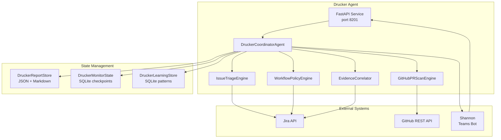
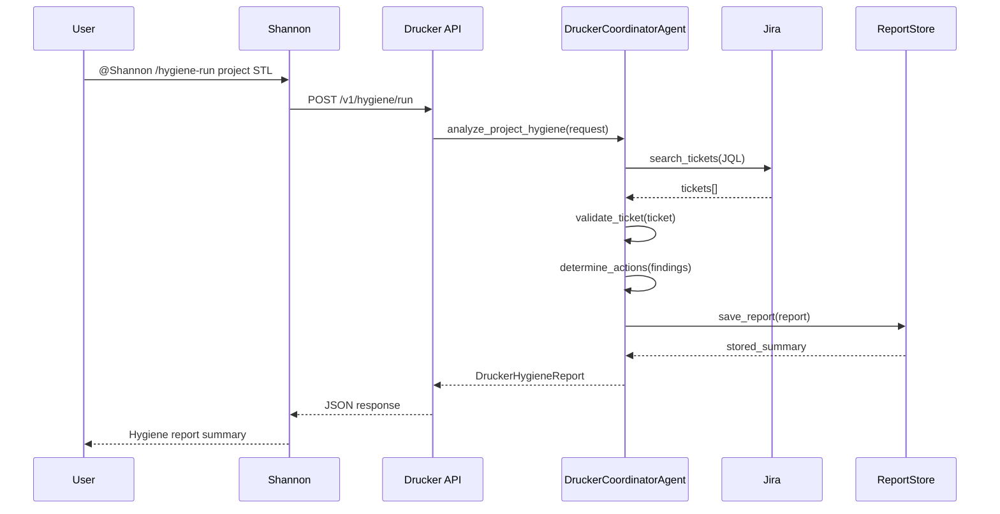
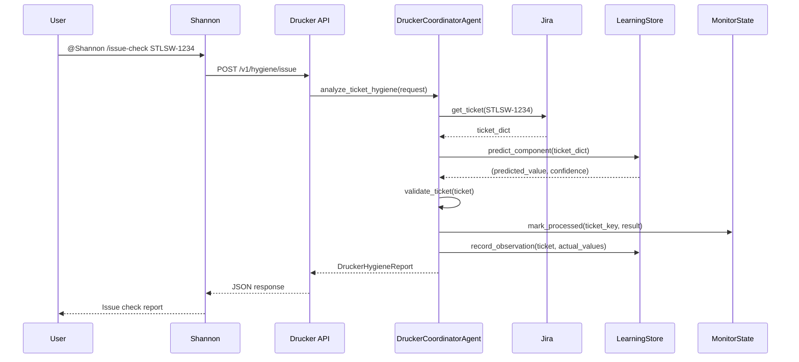
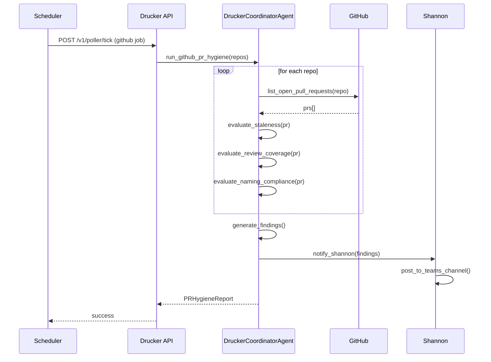

<!-- Generated by Documentation Agent — do not edit between markers -->

```yaml
---
title: "As-Built: Drucker Engineering Hygiene Agent"
date: "2026-04-06"
status: "draft"
---
```

# Module Overview

The Drucker Engineering Hygiene Agent is a deterministic, zero-LLM-token coordinator that automates Jira ticket hygiene and GitHub pull request lifecycle management. It scans projects for stale tickets, missing metadata, workflow anomalies, and PR hygiene issues, then produces structured findings and review-gated remediation proposals. Drucker operates in dry-run mode by default, ensuring all mutations are explicitly approved before execution.

# What Changed

**Before:** Drucker was a concept in planning documents with no implementation.

**After:** Drucker is the most feature-rich implemented agent in the workforce, with:
- Full Jira project hygiene scanning (stale tickets, missing fields, label compliance)
- Single-ticket intake validation with learning-based suggestions
- Recent-ticket intake reports using checkpoint-based polling
- GitHub PR hygiene scanning (stale PRs, missing reviews, naming compliance, merge conflicts, CI failures, stale branches)
- Scheduled polling with configurable job definitions
- Persistent report storage with JSON + Markdown artifacts
- Shannon (Teams) integration for command routing and notifications
- Review-gated write-back coordination (proposals only, no autonomous writes)
- Learning store for keyword/component pattern recognition and reporter compliance tracking

**Impact:** 
- Shannon now routes all Drucker commands (`/issue-check`, `/hygiene-run`, `/pr-hygiene`, etc.) to Drucker's REST API
- Jira hygiene reports are stored in `data/drucker_reports/<PROJECT>/<REPORT_ID>/`
- GitHub PR findings are delivered through Shannon notifications, not written as PR comments
- Polling jobs run on configurable schedules (default: 5-minute intervals for Jira, daily for GitHub)
- All Drucker operations are auditable through structured event logs and decision records

# Component Diagram



# Key Flows

## Flow 1: Jira Project Hygiene Scan



**Description:** User triggers a full project hygiene scan through Shannon. Drucker fetches all active tickets matching the JQL query, validates each ticket against monitor config rules, generates findings and proposed actions, persists the report to disk, and returns a summary to Shannon for Teams notification.

## Flow 2: Single-Ticket Intake Validation



**Description:** User requests validation for a single ticket. Drucker fetches the ticket, consults the learning store for metadata predictions (component, fix version), validates against monitor config rules, records the observation for future learning, marks the ticket as processed in monitor state, and returns findings with suggested actions.

## Flow 3: GitHub PR Hygiene Scan



**Description:** Scheduled poller triggers a GitHub PR hygiene scan. Drucker fetches all open PRs for configured repositories, evaluates each PR for staleness (no activity beyond threshold), missing review requests, naming compliance violations, merge conflicts, and CI failures. Findings are aggregated into a report and delivered to Shannon for Teams notification. No GitHub comments or status checks are written.

# Data Model

## Core Data Structures

### DruckerRequest
Input request for generating a hygiene report.

```python
@dataclass
class DruckerRequest:
    project_key: str = ''
    ticket_key: Optional[str] = None
    limit: int = 200
    include_done: bool = False
    stale_days: int = 30
    jql: Optional[str] = None
    since: Optional[str] = None
    recent_only: bool = False
    label_prefix: str = 'drucker'
    requested_by: Optional[str] = None
    approved_by: Optional[str] = None
    correlation_id: Optional[str] = None
    trigger: str = 'interactive'
```

### DruckerFinding
A single hygiene finding for a ticket or PR.

```python
@dataclass
class DruckerFinding:
    finding_id: str
    ticket_key: str
    category: str  # 'stale_ticket', 'missing_component', etc.
    severity: str  # 'high', 'medium', 'low'
    title: str
    description: str
    evidence: List[str]
    recommendation: str
    action_ids: List[str]
```

### DruckerAction
A proposed Jira write-back action.

```python
@dataclass
class DruckerAction:
    action_id: str
    ticket_key: str
    action_type: str  # 'comment', 'label', 'field_update', 'transition'
    title: str
    description: str
    finding_ids: List[str]
    confidence: str  # 'high', 'medium', 'low'
    comment: str
    update_fields: Dict[str, Any]
    transition_to: str
```

### DruckerHygieneReport
Durable hygiene report with findings and proposed actions.

```python
@dataclass
class DruckerHygieneReport:
    project_key: str
    created_at: str
    report_id: str
    request: Dict[str, Any]
    project_info: Dict[str, Any]
    summary: Dict[str, Any]
    findings: List[DruckerFinding]
    proposed_actions: List[DruckerAction]
    tickets: List[Dict[str, Any]]
    errors: List[str]
    summary_markdown: str
    jql_queries: List[str]  # Added in recent PR
```

## State Persistence

### DruckerReportStore
Stores hygiene reports as JSON + Markdown artifacts in `data/drucker_reports/<PROJECT>/<REPORT_ID>/`.

**Schema:**
- `report.json` — full report data
- `summary.md` — human-readable summary

### DruckerMonitorState (SQLite)
Tracks checkpoint cursors and processed tickets for recent-ticket intake scanning.

**Tables:**
- `checkpoints` — last_checked timestamp per project
- `processed_tickets` — ticket_key, project, processed_at
- `validation_history` — ticket_key, result_json, timestamp

### DruckerLearningStore (SQLite)
Tracks keyword/component patterns and reporter field compliance for metadata suggestions.

**Tables:**
- `observations` — ticket_key, field, predicted_value, actual_value, correct, timestamp
- `keyword_patterns` — keyword, field, value, hit_count, miss_count, confidence
- `reporter_profiles` — reporter_id, field, value, count, total, compliance_rate
- `learned_tickets` — ticket_key, fingerprint, learned_at

# Dependencies

| Dependency | Purpose | Version |
|------------|---------|---------|
| `fastapi` | REST API framework | ^0.104.0 |
| `uvicorn` | ASGI server | ^0.24.0 |
| `pydantic` | Request/response validation | ^2.5.0 |
| `jira` | Jira REST API client | ^3.5.0 |
| `PyGithub` | GitHub REST API client | ^2.1.0 |
| `sqlite3` | State persistence | stdlib |
| `pyyaml` | Config file parsing | ^6.0 |
| `python-dotenv` | Environment variable loading | ^1.0.0 |
| Internal: `agents.base` | Base agent framework | — |
| Internal: `agents.review_agent` | Review session coordination | — |
| Internal: `core.monitoring` | Validation rules engine | — |
| Internal: `jira_utils` | Jira connection helpers | — |
| Internal: `tools.jira_tools` | Jira tool wrappers | — |
| Internal: `tools.knowledge_tools` | Knowledge base search | — |
| Internal: `notifications.jira_comments` | Jira comment notifier | — |
| Internal: `agents.pm_runtime` | Shannon notification helper | — |

# Configuration

## Environment Variables

| Variable | Required | Default | Description |
|----------|----------|---------|-------------|
| `JIRA_URL` | Yes | — | Jira instance base URL |
| `JIRA_SERVICE_EMAIL` | Yes | — | Jira service account email |
| `JIRA_SERVICE_API_TOKEN` | Yes | — | Jira service account API token |
| `GITHUB_TOKEN` | No | — | GitHub PAT for PR scanning |
| `GITHUB_API_URL` | No | `https://api.github.com` | GitHub API base URL |
| `DRY_RUN` | No | `true` | Dry-run mode for mutations |
| `DRUCKER_MONITOR_STATE_DB` | No | `data/drucker_monitor_state.db` | Monitor state SQLite path |
| `DRUCKER_LEARNING_DB` | No | `data/drucker_learning.db` | Learning store SQLite path |
| `DRUCKER_REPORT_DIR` | No | `data/drucker_reports` | Report storage directory |
| `LOG_LEVEL` | No | `INFO` | Logging level |

## Configuration Files

### `agents/drucker/config/monitor.yaml`
Defines validation rules per issue type.

```yaml
project: ''
poll_interval_minutes: 5

validation_rules:
  Story:
    required:
      - assignee
      - fix_versions
      - components
    warn:
      - description
  Bug:
    required:
      - assignee
      - fix_versions
      - components
      - priority
    warn:
      - description

learning:
  enabled: true
  min_observations: 20
  confidence_thresholds:
    auto_fill: 0.90
    suggest: 0.50
    flag_only: 0.0
```

### `agents/drucker/config/polling.yaml`
Defines polling jobs, intervals, and thresholds.

```yaml
defaults:
  project_key: ''
  limit: 200
  include_done: false
  stale_days: 30
  label_prefix: drucker
  persist: true
  notify_shannon: false
  github_stale_days: 5

jobs:
  - job_id: hygiene-scan
    description: Full-project hygiene scan for active work.
    scan_type: jira
    recent_only: false

  - job_id: recent-ticket-intake
    description: Recent-ticket intake scan using Drucker checkpoint state.
    scan_type: jira
    recent_only: true

  - job_id: github-hygiene-scan
    description: GitHub PR hygiene scan for stale PRs and missing reviews.
    scan_type: github
    enabled: false
    github_stale_days: 5
    github_repos: []
```

### `agents/drucker/prompts/system.md`
Agent behavior prompt (loaded at initialization).

**Key directives:**
- Prefer deterministic evidence over speculation
- Treat Jira writes as proposals until approved
- Focus on hygiene and coordination, not roadmapping
- Use knowledge base for org structure and component ownership
- Notify GitHub findings through Shannon, not PR comments

# Error Handling

## Exception Hierarchy

Drucker uses standard Python exceptions with structured logging:

- `ValueError` — invalid input parameters (e.g., missing `project_key`)
- `RuntimeError` — state store connection failures
- `FileNotFoundError` — missing config files
- `JiraConnectionError` — Jira API failures (from `jira_utils`)
- `GitHubConnectionError` — GitHub API failures (from GitHub adapter)

## Error Handling Patterns

### API Endpoints
All API endpoints return structured error responses:

```python
{
    "ok": False,
    "error": "descriptive error message"
}
```

### Agent Execution
Agent errors are captured in `DruckerHygieneReport.errors` list and logged:

```python
try:
    report = agent.analyze_project_hygiene(request)
except Exception as e:
    log.error(f'Drucker hygiene run failed: {e}')
    return {'ok': False, 'error': str(e)}
```

### State Store Failures
State store operations use thread-safe locking and connection validation:

```python
def _require_conn(self) -> sqlite3.Connection:
    if self.conn is None:
        raise RuntimeError('DruckerLearningStore connection is closed')
    return self.conn
```

### External API Failures
Jira and GitHub API calls are wrapped with try/except and logged:

```python
try:
    tickets = search_tickets(jira, jql, fields=fields, limit=limit)
except Exception as e:
    log.error(f'Jira search failed: {e}')
    report.errors.append(f'Jira search failed: {e}')
```

# Known Limitations / Technical Debt

## Hardcoded Values

1. **Default stale thresholds:**
   - Jira tickets: 30 days (configurable via `stale_days` parameter)
   - GitHub PRs: 5 days (configurable via `github_stale_days` parameter)
   - Draft PRs: 2x grace period (hardcoded multiplier in `_evaluate_pr_staleness`)

2. **Stopwords list:**
   - `DruckerLearningStore._STOPWORDS` is a hardcoded set of 40+ common words
   - Should be externalized to a config file for easier maintenance

3. **Category labels:**
   - `DruckerCoordinatorAgent.CATEGORY_LABELS` maps finding categories to Jira labels
   - Hardcoded mapping should be moved to `monitor.yaml`

4. **Minimum observations threshold:**
   - Learning store defaults to 20 observations before making predictions
   - Configurable via `monitor.yaml` but not exposed in all code paths

## Missing Implementations

1. **GitHub PR comment writing:**
   - Drucker only notifies through Shannon, does not write PR comments or status checks
   - Planned for future release (see `docs/PLAN.md`)

2. **Branch/PR naming enforcement:**
   - Naming compliance detection is implemented but enforcement is not
   - Requires policy engine integration (see `plans/branch-pr-naming-proposal.md`)

3. **Autonomous Jira write-backs:**
   - All Jira mutations require explicit approval (dry-run mode default)
   - Auto-apply mode exists but is disabled by default for safety

4. **GitHub repository auto-discovery:**
   - Repos must be explicitly configured in `polling.yaml`
   - No automatic discovery of org repositories

5. **Review session execution:**
   - Review sessions are generated but not automatically executed
   - Requires manual approval through Shannon or API

## Technical Debt

1. **God class warning:**
   - `DruckerCoordinatorAgent` is 1,700+ lines with 20+ public methods
   - Should be refactored into separate engines (IssueTriageEngine, WorkflowPolicyEngine, etc.)

2. **Circular dependency risk:**
   - `agents.drucker.agent` imports `agents.review_agent`
   - `agents.review_agent` may import Drucker tools in the future
   - Needs dependency injection or interface abstraction

3. **Missing error handling on external calls:**
   - Some Jira API calls lack try/except wrappers (e.g., `get_project_info`)
   - GitHub API calls assume successful responses without validation

4. **Hardcoded Shannon notification format:**
   - `_build_hygiene_notification_payload` constructs Teams message format inline
   - Should use a template system for easier customization

5. **SQLite connection thread-safety:**
   - State stores use `check_same_thread=False` with manual locking
   - Should migrate to connection pooling or async SQLite library

6. **JQL query construction:**
   - JQL strings are built with f-strings and manual escaping
   - Should use a JQL builder library for safety and readability

7. **Learning store keyword extraction:**
   - `_extract_keywords` uses regex splitting and stopword filtering
   - Should use NLP library (spaCy, NLTK) for better tokenization

8. **Report storage file I/O:**
   - `DruckerReportStore` uses synchronous file I/O
   - Should use async I/O for better performance under load

9. **Missing unit tests:**
   - No test coverage for state stores, learning algorithms, or API endpoints
   - Should add pytest suite with fixtures for Jira/GitHub mocking

10. **Incomplete observability:**
    - Structured events are defined but not emitted in all code paths
    - Metrics collection is planned but not implemented

<!-- End Documentation Agent generated content -->