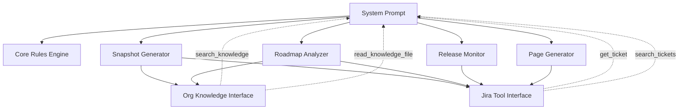
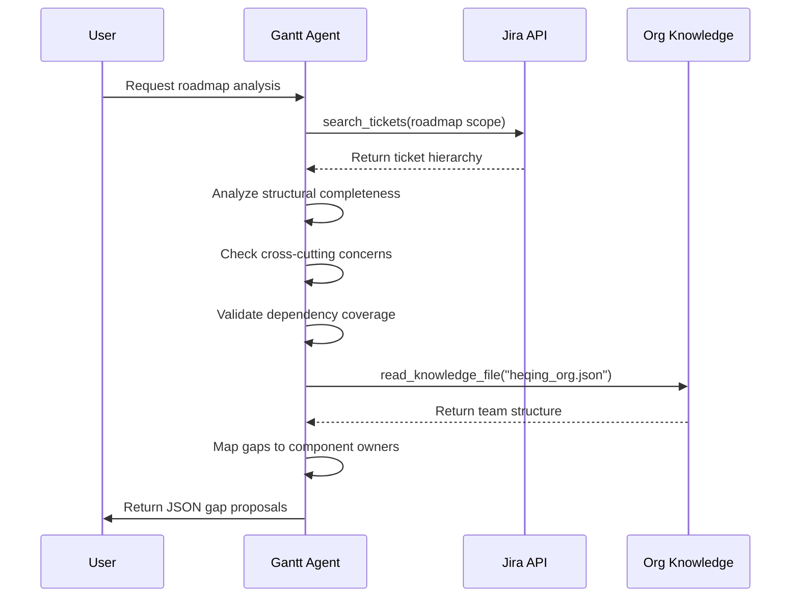
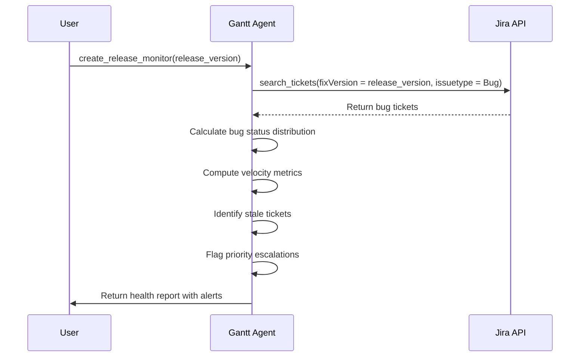
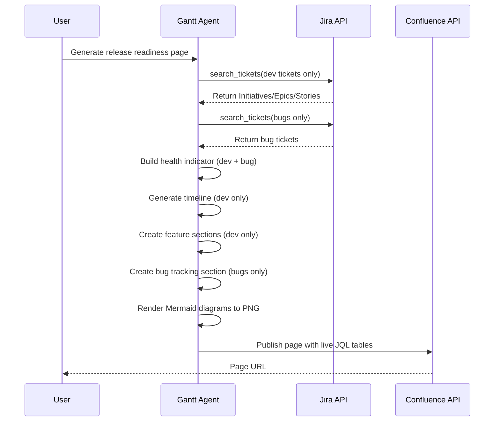

<!-- Generated by Documentation Agent — do not edit between markers -->

```yaml
---
title: "As-Built: Gantt Agent System Prompt"
date: "2026-04-06"
status: "draft"
---
```

## Module Overview

The Gantt Agent system prompt defines the behavior, capabilities, and output formats for an AI-powered project planning agent that analyzes Jira work state and produces planning intelligence for Cornelis Networks engineering teams. The prompt establishes strict rules for Jira ticket hierarchy, roadmap analysis, release monitoring, and documentation generation while grounding all recommendations in observable project data rather than speculation.

## What Changed

**Before:** The prompt supported roadmap and release health page generation but did not explicitly separate bug tracking from development ticket analysis, leading to potential confusion when generating release readiness views.

**After:** Added a comprehensive "Roadmap & Release Health Page Generation" section (lines 321-445) that:
- Establishes a fundamental rule to always separate bug tickets from development tickets in all analysis
- Defines distinct page structures for roadmap views (dev tickets only) vs. release readiness views (both dev and bugs)
- Specifies a 5-section page template: Health, Timeline, Summary, Features, and Bug Tracking
- Provides detailed guidance on live JQL table generation, Mermaid diagram rendering, and Confluence publication

**Impact:** 
- Users of the Gantt agent will receive clearer, more structured roadmap and release health pages
- Bug analysis is now explicitly separated from feature delivery tracking
- Confluence publication workflows gain specific technical guidance on diagram rendering and live table embedding
- The agent's output becomes more consistent and actionable for engineering leadership

## Component Diagram



## Key Flows

### Flow 1: Roadmap Gap Analysis



**Description:** When performing roadmap analysis, the agent loads the ticket hierarchy from Jira, evaluates it against four dimensions (structural completeness, cross-cutting concerns, dependency coverage, release readiness), consults the org knowledge base to identify component owners, and outputs a structured JSON document proposing missing Epics and Stories with suggested assignments.

### Flow 2: Release Health Monitoring



**Description:** Release monitoring focuses exclusively on bug tickets for a given release. The agent queries Jira for all bugs in the target `fixVersion`, computes status distributions (Open/In Progress/Verify/Closed), calculates daily velocity (open rate, close rate, net burn), identifies stale tickets, and surfaces alerts for new P0/P1 bugs or priority escalations.

### Flow 3: Page Generation with Bug/Dev Separation



**Description:** When generating a release readiness page, the agent makes two separate Jira queries—one for development tickets (Initiatives/Epics/Stories) and one for bugs. It builds the health assessment from both populations, generates a timeline showing only dev features, creates per-Initiative feature sections with live JQL tables excluding bugs, adds a dedicated bug tracking section, renders Mermaid diagrams to PNG attachments, and publishes the complete page to Confluence with live-updating JQL filter tables.

## Data Model

### Gap Proposal Schema

The roadmap analyzer outputs a JSON structure conforming to this schema:

```json
{
  "proposed_gaps": [
    {
      "section": "string",           // Section title this gap belongs in
      "issue_type": "Epic | Story",  // Never Initiative, Task, or Sub-task
      "depth": 1,                     // Hierarchy depth (1 for Epic, 2 for Story)
      "summary": "string",            // Jira ticket summary with [TAG] prefix
      "priority": "P0 | P1 | P2 | P3",
      "suggested_component": "string", // Must be real Jira component
      "acceptance_criteria": "string", // Measurable definition of done
      "dependencies": "string",        // Semicolon-separated STL-XXXXX keys
      "suggested_fix_version": "string",
      "labels": "string",
      "parent_summary": "string"       // Parent Epic summary if this is a Story
    }
  ],
  "analysis_notes": "string"          // Markdown summary of findings
}
```

### Ticket Hierarchy Rules

The prompt enforces a strict 2-level execution hierarchy:

- **Initiative** → **Epic** → **Story**
- Tasks and Sub-tasks are prohibited for software planning
- Epics must be feature-based vertical slices, not work-type buckets
- Stories map 1-to-1 with development branches/pull requests

### Ticket Naming Convention

All Epics and Stories use bracketed tags:

```
[TAG] Descriptive summary text
```

Examples from the codebase:
- `[CYR RoCE] Implement RoCE driver support`
- `[SR-IOV Driver] Develop SR-IOV ethernet driver`
- `[GPU OPX] Enable GPU over OPX`

### Page Structure Model

Release readiness and roadmap pages follow this 5-section structure:

1. **Health** — Green/Yellow/Red indicator with risk factors
2. **Timeline** — Mermaid gantt diagram showing dev features only
3. **Summary** — 8-12 line text overview with dev completion % and bug closure % reported separately
4. **Features** — Per-Initiative subsections with live JQL tables (dev tickets only, Initiative ticket excluded from table)
5. **Bug Tracking** — P0/P1 tables, component heatmap, stale ticket list (release readiness only)

## Dependencies

| Dependency | Purpose | Version |
|------------|---------|---------|
| Jira API | Ticket queries, field metadata, release info | Cloud REST API |
| Knowledge Base | Org structure, component ownership, repo mapping | Internal JSON files |
| Confluence API | Page publication, diagram rendering, live JQL tables | Cloud REST API |
| Mermaid | Diagram generation for timelines and component views | Embedded in Confluence |

## Configuration

### Environment Variables

The prompt references these tools which require configuration:

- `search_knowledge` — Requires knowledge base path configuration
- `read_knowledge_file` — Requires access to `data/knowledge/heqing_org.json`
- `create_filter` — Requires Jira API credentials and project context
- Confluence publication tools — Require Confluence space ID and credentials

### Feature Flags

The prompt operates in distinct modes triggered by tool invocation:

- **Snapshot Mode** — Triggered by general planning requests
- **Roadmap Analysis Mode** — Triggered by `create_roadmap_snapshot`
- **Release Monitor Mode** — Triggered by `create_release_monitor`
- **Page Generation Mode** — Triggered by requests to generate roadmap or release health pages

### Org Knowledge Reference

Primary org reference file: `data/knowledge/heqing_org.json`

Contains:
- Team structure (44 people in Heqing Zhu's SW engineering org)
- Per-person Jira component assignments with issue counts
- GitHub repo contribution mapping

## Error Handling

### Evidence Gap Handling

The prompt explicitly requires the agent to:

> Highlight evidence gaps explicitly instead of guessing.

When data is missing:
- Flag confidence limits in snapshot outputs
- Note missing build, test, release, or meeting evidence
- Identify unassigned or unscheduled work
- Surface blocked and stale tickets

### Validation Rules

The prompt enforces strict validation on gap proposals:

```python
# From lines 267-283
# Field Rules
- issue_type — "Epic" or "Story" only. Never "Initiative" or "Bug".
- priority — One of "P0", "P1", "P2", "P3"
- suggested_component — Must be a real Jira component from the project.
- acceptance_criteria — Measurable and testable.
- dependencies — Semicolon-separated list of existing STL- ticket keys.
                 Must reference real keys. Set to "" if no dependencies.
```

### Anti-Pattern Detection

The roadmap analyzer must flag these structural issues:

- Orphan Epics (no parent Initiative)
- Orphan Stories (no parent Epic)
- Epics organized by work-type instead of feature deliverable
- Stories acting as umbrellas for multiple branch-sized threads
- Stories that should be promoted out of sub-task style decomposition

### Bug/Dev Ticket Separation

The prompt enforces strict separation (lines 330-343):

> **Always** separate bug tickets (`issuetype = Bug`) from development tickets
> (Initiatives, Epics, Stories) in all analysis and page output.

Violation of this rule results in:
- Incorrect completion percentages
- Mixed populations in tables
- Misleading health assessments

## Known Limitations / Technical Debt

### Hardcoded Values

- **Priority levels** — Hardcoded to `P0`, `P1`, `P2`, `P3` (lines 270-274). No support for custom priority schemes.
- **Stale ticket threshold** — Hardcoded to 30 days (line 408). Not configurable per project.
- **Org knowledge file path** — Hardcoded to `data/knowledge/heqing_org.json` (line 48). Single org structure assumed.
- **Ticket key prefix** — Hardcoded to `STL-` (lines 281, 407). Not adaptable to other Jira projects.

### Missing Implementations

- **Velocity calculation details** — The prompt mentions "daily open rate, close rate, net burn rate" (line 313) but does not specify the calculation window or smoothing algorithm.
- **Component risk heatmap algorithm** — Referenced in line 407 but no threshold or scoring logic is defined.
- **Mermaid rendering fallback** — Lines 442-444 reference `render_diagrams()` and `_render_mermaid()` but do not specify error handling if rendering fails.
- **JQL query validation** — The prompt requires JQL queries to be returned (line 418) but does not specify syntax validation or error recovery.

### Circular Dependencies

- The prompt references tools (`search_knowledge`, `create_filter`, `build_jira_jql_table_macro`) that are not defined within the prompt itself, creating a dependency on external tool implementations.
- The "Page Generation Rules" section (lines 417-444) assumes the existence of `confluence_utils.py` functions without specifying their interface contracts.

### Technical Debt

- **Spreadsheet format specification** — Lines 145-165 define a CSV/Excel export format but do not specify how the agent should generate the actual file (tool call, direct output, etc.).
- **Tag inheritance enforcement** — Lines 166-238 define ticket naming conventions with tag inheritance but do not specify how the agent should handle tag conflicts or missing parent tags.
- **Cross-cutting concern detection** — Lines 199-217 list cross-cutting concerns to check but do not provide a detection algorithm or heuristic for identifying when they are missing.
- **Confluence macro syntax** — Line 387 references `build_jira_jql_table_macro` but does not specify the macro syntax or parameters, creating a dependency on undocumented Confluence integration code.

<!-- End Documentation Agent generated content -->