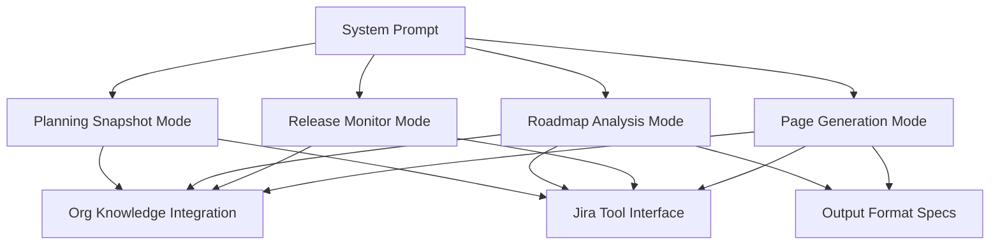
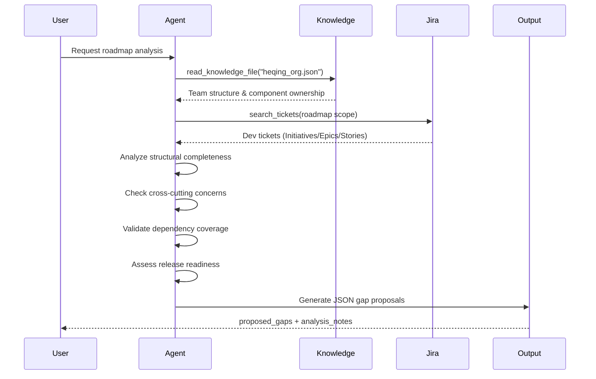
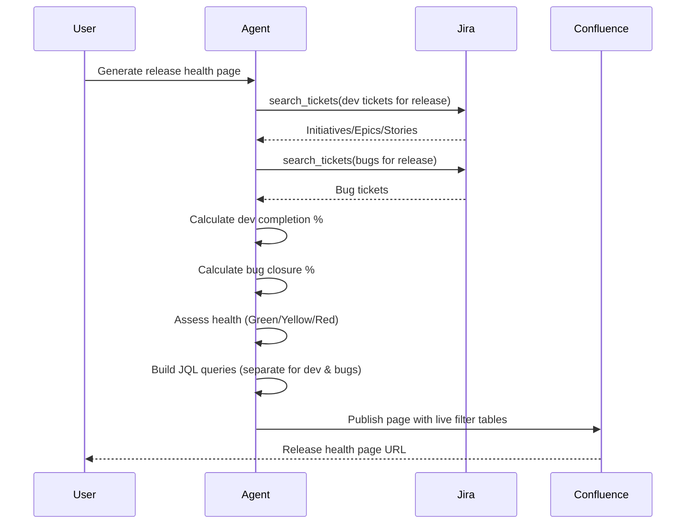
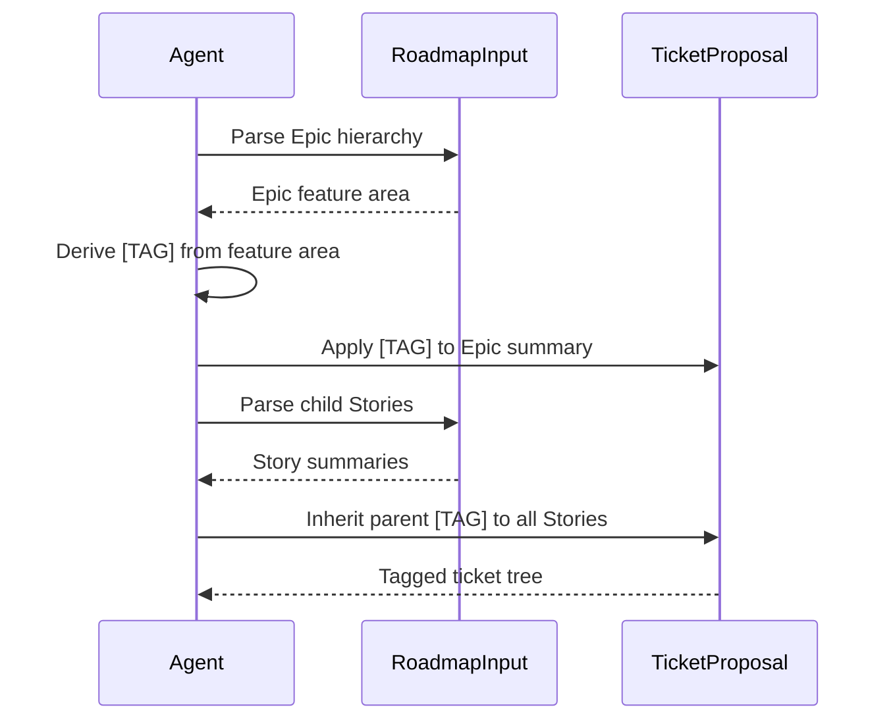

<!-- Generated by Documentation Agent — do not edit between markers -->

```yaml
---
title: "As-Built: Gantt Agent System Prompt"
date: "2026-04-06"
status: "draft"
---
```

## Module Overview

The Gantt Agent system prompt defines the behavior, capabilities, and output formats for a project-planning AI agent that transforms Jira work state into actionable planning intelligence. The agent operates in multiple modes—planning snapshots, roadmap analysis, release monitoring, and page generation—while maintaining strict separation between bug tracking and feature development workflows.

## What Changed

**Before:** The agent generated roadmap and release health pages without explicit guidance on separating bug tickets from development tickets, leading to mixed populations in analysis tables and unclear completion metrics.

**After:** The prompt now enforces strict separation between bugs (`issuetype = Bug`) and development tickets (Initiatives, Epics, Stories) across all page generation modes. Roadmap pages exclude bugs entirely; release readiness pages report dev completion and bug closure independently in separate sections.

**Impact:** 
- Page consumers (engineering managers, release managers) now see clear, unmixed metrics for feature delivery vs. bug resolution
- JQL queries generated by the agent no longer accidentally blend bug and dev ticket populations
- Confluence pages published by the agent maintain live, correctly-scoped Jira filter tables
- The agent's health assessments now explicitly account for both dev progress and bug health as separate dimensions

## Component Diagram



## Key Flows

### Flow 1: Roadmap Gap Analysis



The agent loads organizational knowledge to understand component ownership, retrieves development tickets from Jira (excluding bugs), evaluates the roadmap across four dimensions (structural completeness, cross-cutting concerns, dependency coverage, release readiness), and outputs a structured JSON document proposing missing Epics and Stories with suggested components, priorities, and acceptance criteria.

### Flow 2: Release Health Page Generation



The agent retrieves development tickets and bug tickets separately, calculates independent completion metrics, determines overall health status, generates JQL queries for live Jira filter tables, and publishes a Confluence page with distinct sections for feature progress and bug tracking.

### Flow 3: Jira Ticket Naming Convention Application



When proposing or generating ticket structures, the agent derives a short bracketed tag (e.g., `[RoCE Driver]`, `[SR-IOV MW]`) from each Epic's feature area and applies it consistently to all child Stories, ensuring scannable ticket lists in Jira.

## Data Model

### Gap Proposal Schema

```json
{
  "proposed_gaps": [
    {
      "section": "string",
      "issue_type": "Epic | Story",
      "depth": "integer (1 or 2)",
      "summary": "string (with [TAG] prefix)",
      "priority": "P0 | P1 | P2 | P3",
      "suggested_component": "string (real Jira component)",
      "acceptance_criteria": "string (measurable outcome)",
      "dependencies": "string (semicolon-separated STL-XXXXX keys)",
      "suggested_fix_version": "string (e.g., 14.0.0.x)",
      "labels": "string (e.g., cn6k-driver-roadmap)",
      "parent_summary": "string (if issue_type=Story)"
    }
  ],
  "analysis_notes": "string (markdown summary)"
}
```

### Spreadsheet Planning Table Format

The agent outputs Jira plans as CSV/Excel with depth columns:

| Depth 0 (Initiative) | Depth 1 (Epic) | Depth 2 (Story) | key | summary | ... |
|---|---|---|---|---|---|
| Initiative Title | | | STL-1000 | Initiative Title | ... |
| | Epic Title | | STL-1001 | Epic Title | ... |
| | | Story Title | STL-1002 | Story Title | ... |

**Rules:**
- One row per ticket
- Title appears only in its own depth column
- Parent path is NOT repeated on child rows
- Jira key in separate `key` column
- Parent-first ordering (Initiative → Epics → Stories)

### Priority Definitions

| Priority | Meaning |
|---|---|
| `P0` | Critical path. Release cannot ship without this. |
| `P1` | Required for release. Must be completed but has some scheduling flexibility. |
| `P2` | Important. Should be in the release but can be deferred if necessary. |
| `P3` | Nice to have. Improves quality or coverage but is not blocking. |

### Health Status Model

```python
health_status = {
    "indicator": "Green | Yellow | Red",
    "risk_factors": [
        "P0/P1 blocker count",
        "Velocity trend (positive/negative)",
        "Stale ticket count",
        "Unassigned critical items",
        "Dependency chain risks"
    ],
    "dev_completion_pct": "float (0-100)",
    "bug_closure_pct": "float (0-100)"  # Release readiness only
}
```

## Dependencies

| Dependency | Purpose | Version |
|---|---|---|
| Jira API | Ticket search, field retrieval, release data | Cloud REST API |
| Knowledge Base | Org structure (`heqing_org.json`), component ownership | Internal JSON |
| Mermaid | Diagram generation (gantt, sequence, component) | Latest |
| Confluence API | Page publication with live JQL tables | Cloud REST API |
| `confluence_utils.py` | Mermaid-to-PNG rendering, image upload | Internal module |

## Configuration

### Available Tools

The agent has access to the following Jira and knowledge base tools:

- `get_project_info` — Retrieve project metadata
- `search_tickets` — JQL-based ticket search
- `get_ticket` — Fetch single ticket details
- `get_project_fields` — List available Jira fields
- `get_releases` — Retrieve release/fixVersion data
- `search_knowledge` — Keyword search in knowledge base
- `list_knowledge_files` — List all knowledge base files
- `read_knowledge_file` — Read specific knowledge file (e.g., `heqing_org.json`)
- `create_release_monitor` — Generate release health monitoring report
- `create_filter` — Create named Jira filter from JQL query

### Org Knowledge File

Primary reference: `data/knowledge/heqing_org.json`

Contains:
- Team structure (44 people in Heqing Zhu's SW engineering org)
- Per-person Jira component assignments with issue counts
- GitHub repo contribution mapping

Used for:
- Suggesting realistic component assignments
- Identifying capacity constraints
- Flagging unowned work
- Correlating dependencies with team boundaries

### Feature Tags

The agent maintains a registry of established feature area tags:

| Tag | Feature Area |
|---|---|
| `[CYR Cport]` | CYR firmware cport updates |
| `[CYR 800G]` | CYR 800GB support |
| `[CYR OPX]` | CYR OPX design and dual-plane |
| `[CYR RoCE]` | CYR RoCE driver support |
| `[CYR SR-IOV]` | CYR OPA SR-IOV support |
| `[RoCE Driver]` | RoCE driver implementation |
| `[RoCE HFIsvc]` | RoCE via HFIsvc |
| `[RoCE DevOps]` | RoCE CI/build pipeline |
| `[SR-IOV Driver]` | SR-IOV ethernet driver |
| `[SR-IOV MW]` | SR-IOV middleware (OPX) |
| `[SR-IOV Arch]` | SR-IOV architecture design |
| `[OPA HFIsvc]` | OPA port to HFIsvc |
| `[MW OPX]` | Middleware OPX enablement |
| `[RDMA Core]` | RDMA core API implementation |
| `[ETH MAC]` | Ethernet MAC configuration |
| `[ETH FW]` | Ethernet firmware |
| `[TCP/IP Perf]` | TCP/IP performance testing |
| `[GPU SOL]` | GPU SpeedOfLight |
| `[GPU OPA]` | GPU over OPA verbs |
| `[GPU RoCE]` | GPU over RoCE verbs |
| `[GPU OPX]` | GPU over OPX |
| `[SERDES]` | SERDES configuration |
| `[PQC]` | Post-quantum cryptography |
| `[Build Pipeline]` | CI/build pipeline |
| `[EMU Delivery]` | Emulation SW delivery |
| `[BTS/Verbs]` | BTS and verbs merge |
| `[FW Tools]` | Firmware tools |
| `[Backport ETH]` | ETH driver distro backports |
| `[Backport OPA]` | OPA driver distro backports |
| `[IPoIB]` | IPoIB enablement |
| `[Storage]` | Storage protocol enablement |
| `[Perf RoCE]` | RoCE performance targets |
| `[Perf OPA]` | OPA performance targets |
| `[Perf OPX]` | OPX performance targets |

## Error Handling

### Anti-patterns Flagged in Analysis

The agent explicitly flags the following in the "Known Limitations / Technical Debt" section of gap analysis:

1. **Orphan Epics** — Epics with no parent Initiative
2. **Orphan Stories** — Stories with no parent Epic
3. **Work-type Epics** — Epics organized by work category (e.g., "Firmware", "Validation") instead of feature deliverable
4. **Umbrella Stories** — Stories acting as containers for multiple branch-sized threads
5. **Sub-task Decomposition** — Stories that should be promoted out of sub-task style into normal Stories under a feature Epic
6. **Missing Cross-Cutting Concerns** — Gaps in DevOps/CI, distro backports, performance validation, GPU enablement, storage protocol support, or IPoIB compatibility
7. **Unlinked Dependencies** — Cross-section dependencies not explicitly captured in Jira links
8. **Circular Dependencies** — Dependency chains that loop back on themselves
9. **Missing Fix Versions** — Items with no `fixVersion` when release scope is defined
10. **Mismatched Fix Versions** — Items with `fixVersion` that does not match the release being analyzed

### Validation Rules

When proposing gaps or generating pages, the agent enforces:

- **Issue Type Constraint**: Only `Epic` or `Story` — never `Initiative`, `Task`, `Sub-task`, or `Bug` in gap proposals
- **Component Validation**: `suggested_component` must be a real Jira component from the project
- **Dependency Key Validation**: All keys in `dependencies` field must reference real existing `STL-` tickets
- **Priority Validation**: Must be one of `P0`, `P1`, `P2`, `P3`
- **Acceptance Criteria Requirement**: Must describe an observable, measurable outcome, not a process step
- **JQL Separation**: Dev ticket queries must exclude bugs (`issuetype != Bug`); bug queries must use `issuetype = Bug`

## Known Limitations / Technical Debt

### Hardcoded Values

- **Stale Ticket Threshold**: 30 days with no update (line reference: "Stale tickets table: Bugs with no update in 30+ days")
- **Component Limit**: Component diagrams limited to 5-12 components (not enforced in code, only in guidance)
- **Org Knowledge File Path**: `data/knowledge/heqing_org.json` is hardcoded as the primary org reference

### Missing Implementations

- **Automatic Filter Creation**: The prompt instructs the agent to "offer to create a named Jira filter for each query using the `create_filter` tool" after generating JQL, but does not specify the automatic creation logic or naming convention for filters
- **Mermaid Rendering Pipeline**: The prompt references `render_diagrams()` and `_render_mermaid()` from `confluence_utils.py` for PNG conversion before Confluence publication, but does not define fallback behavior if rendering fails
- **Health Status Calculation**: The prompt defines Green/Yellow/Red health indicators and lists risk factors, but does not provide the exact scoring algorithm or threshold values for transitioning between states

### Areas for Improvement

1. **Velocity Calculation**: The prompt mentions "daily open rate, close rate, net burn rate" in Release Monitor Mode but does not specify the time window for velocity calculation or how to handle weekends/holidays
2. **Capacity Risk Modeling**: The prompt instructs the agent to "flag capacity risks when one person owns too many active items" but does not define the threshold for "too many" or how to weight items by size/complexity
3. **Cross-Team Dependency Detection**: The prompt states "cross-team dependencies are higher risk" but does not provide a mechanism for automatically detecting team boundaries from Jira data when org knowledge is incomplete
4. **Timeline Visualization**: The prompt requires Mermaid gantt diagrams but does not specify how to handle overlapping features, missing dates, or releases with >20 major features (which would produce unreadable diagrams)
5. **Bug vs. Dev Separation Enforcement**: While the recent change adds explicit separation rules, the prompt does not define validation logic to prevent the agent from accidentally mixing populations in edge cases (e.g., when a Story is misclassified as a Bug in Jira)

### Technical Debt

- **Spreadsheet Format Duplication**: The depth column naming convention (`Depth 0 (Initiative)`, `Depth 1 (Epic)`, `Depth 2 (Story)`) is defined in the Spreadsheet Output Format section but not enforced by a schema or validation rule
- **Tag Registry Maintenance**: The feature tag table is manually maintained in the prompt. If new feature areas are added to the project, the prompt must be updated manually. There is no mechanism to auto-discover tags from existing Jira tickets.
- **Confluence Macro Dependency**: The prompt assumes `build_jira_jql_table_macro` is available for generating live filter tables, but does not specify fallback behavior if the Confluence instance does not support this macro or if the macro API changes

<!-- End Documentation Agent generated content -->