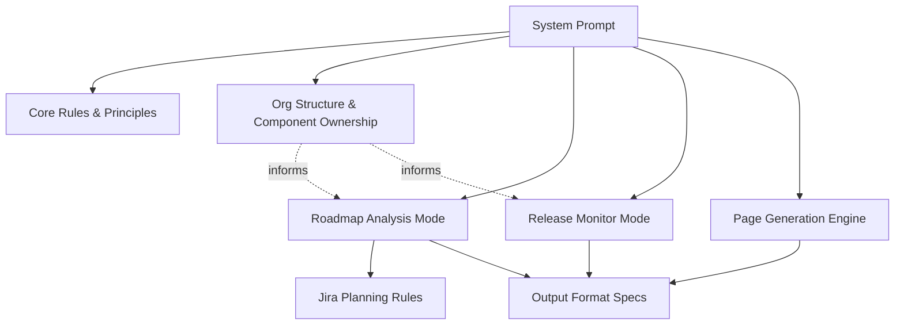
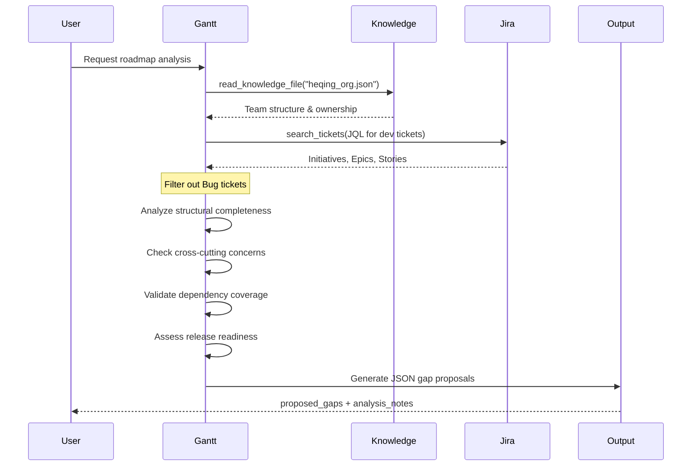
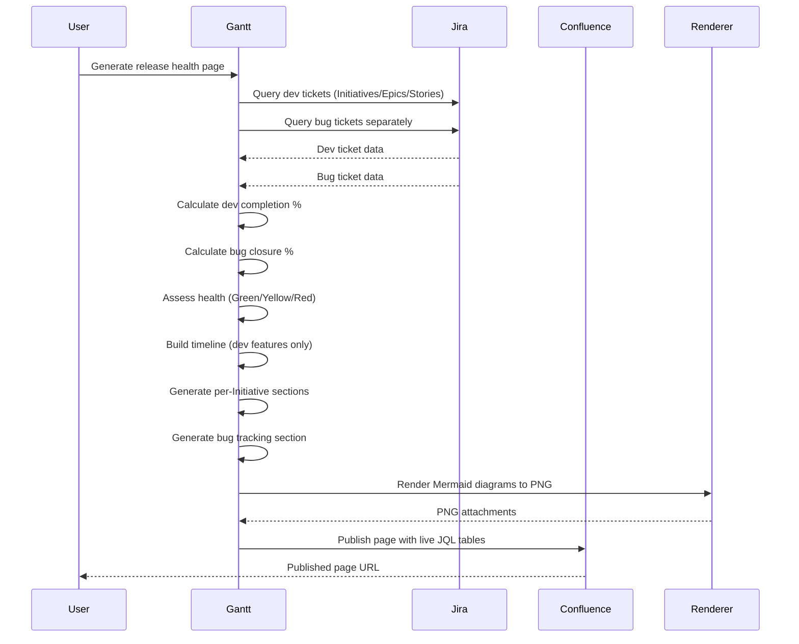
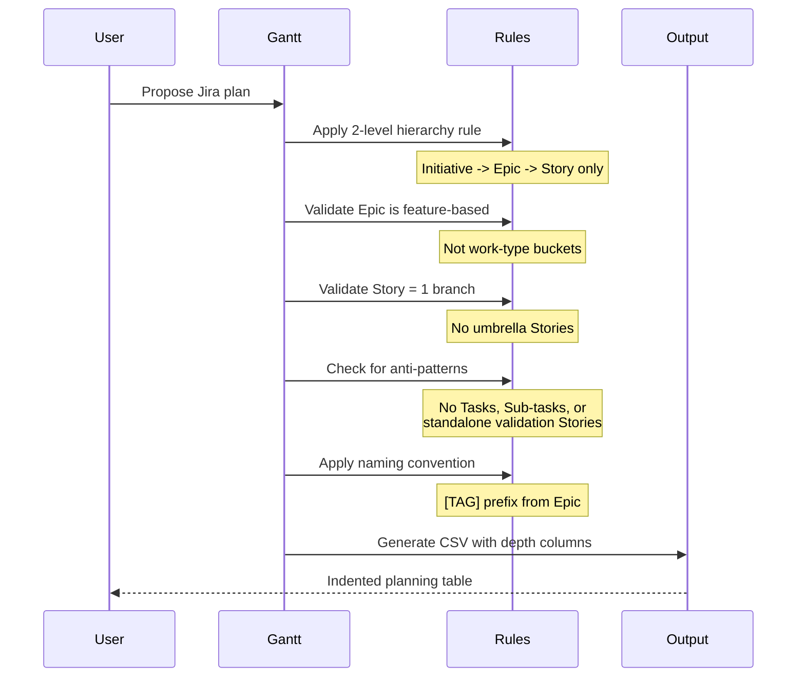

<!-- Generated by Documentation Agent — do not edit between markers -->

```yaml
---
title: "As-Built: Gantt Agent System Prompt"
date: "2026-04-06"
status: "draft"
---
```

## Module Overview

The Gantt Agent system prompt defines the behavior, capabilities, and output formats for an AI-powered project planning agent that analyzes Jira work state and produces planning intelligence for Cornelis Networks engineering teams. The prompt establishes strict rules for roadmap analysis, release monitoring, Jira ticket structure, and documentation generation while grounding all outputs in observable project data rather than speculation.

## What Changed

**Before:** The agent could generate roadmap and release health pages but lacked explicit guidance on separating bug tracking from development work, and had no standardized page structure for Confluence publication.

**After:** The prompt now includes a comprehensive "Roadmap & Release Health Page Generation" section (lines 321-445) that:
- Mandates strict separation of bug tickets from development tickets in all analysis
- Defines a standardized 5-section page structure (Health, Timeline, Summary, Features, Bug Tracking)
- Specifies how to render Initiative-level features with live JQL tables
- Provides explicit rules for Confluence publication including Mermaid diagram rendering
- Clarifies that roadmap pages exclude bugs entirely while release readiness pages include both

**Impact:** 
- Users requesting roadmap or release health pages will receive consistently structured output
- Confluence pages will use live JQL filter tables that stay current after publication
- Bug analysis and feature development progress are now clearly separated in all reports
- The agent will no longer mix bug counts with development ticket counts in completion metrics

## Component Diagram



## Key Flows

### Flow 1: Roadmap Gap Analysis



**Description:** When performing roadmap analysis, the agent loads organizational knowledge to understand component ownership, queries Jira for development tickets only (excluding bugs), evaluates coverage across four dimensions (structural completeness, cross-cutting concerns, dependencies, release readiness), and outputs a structured JSON document proposing missing work items with suggested components, priorities, and acceptance criteria.

### Flow 2: Release Health Page Generation



**Description:** Release health page generation queries development tickets and bug tickets as separate populations, calculates independent completion metrics, assesses overall health based on both populations, generates a timeline showing only dev features, creates per-Initiative sections with live JQL filter tables (excluding the Initiative ticket itself from the table), adds a dedicated bug tracking section with P0/P1 tables and component risk heatmaps, renders Mermaid diagrams to PNG for Confluence compatibility, and publishes the page with live tables that stay current.

### Flow 3: Jira Ticket Structure Enforcement



**Description:** When proposing Jira structures, the agent enforces a strict 2-level execution hierarchy (Initiative -> Epic -> Story), validates that Epics are feature-based vertical slices rather than work-type buckets, ensures each Story maps to a single development branch, rejects Tasks and Sub-tasks for software planning, applies bracketed tag prefixes inherited from parent Epics, and outputs an indented planning table with separate depth columns where each row shows only its own title in the appropriate depth column.

## Data Model

### Core Data Structures

**Gap Proposal Schema** (lines 269-288):
```json
{
  "proposed_gaps": [
    {
      "section": "string",
      "issue_type": "Epic | Story",
      "depth": "integer",
      "summary": "string",
      "priority": "P0 | P1 | P2 | P3",
      "suggested_component": "string",
      "acceptance_criteria": "string",
      "dependencies": "string (semicolon-separated keys)",
      "suggested_fix_version": "string",
      "labels": "string",
      "parent_summary": "string (optional)"
    }
  ],
  "analysis_notes": "string (markdown)"
}
```

**Priority Levels** (lines 290-295):
- `P0` — Critical path, release cannot ship without this
- `P1` — Required for release, must be completed
- `P2` — Important, should be in release but can be deferred
- `P3` — Nice to have, improves quality but not blocking

**Ticket Naming Tags** (lines 213-256): A controlled vocabulary of bracketed prefixes that identify feature areas and flow from Epic to child Stories. Examples include `[CYR Cport]`, `[RoCE Driver]`, `[SR-IOV MW]`, `[GPU SOL]`, `[Build Pipeline]`, etc.

**Spreadsheet Depth Columns** (lines 187-211):
- `Depth 0 (Initiative)` — Initiative title only
- `Depth 1 (Epic)` — Epic title only  
- `Depth 2 (Story)` — Story title only
- Each row contains title in its own depth column, not full parent path

**Health Indicator States** (lines 331-337):
- **Green** — On track, no P0/P1 blockers, positive velocity
- **Yellow** — At risk, warning signals present but manageable
- **Red** — Off track, critical blockers or negative velocity

## Dependencies

| Dependency | Purpose | Version |
|------------|---------|---------|
| Jira API | Query tickets, create filters, read project metadata | Cloud REST API |
| Knowledge Base | Read org structure (`heqing_org.json`), component ownership | Internal JSON files |
| Confluence API | Publish pages with live JQL tables and attachments | Cloud REST API |
| Mermaid | Generate timeline and component diagrams | Embedded in output |
| `confluence_utils.py` | Render Mermaid diagrams to PNG for Confluence | Internal module |

## Configuration

**Knowledge Base Files** (lines 42-44):
- `data/knowledge/heqing_org.json` — Primary org reference with 44 SW engineers, component ownership, and GitHub repo mapping

**Available Tools** (lines 59-68):
- `get_project_info` — Retrieve Jira project metadata
- `search_tickets` — Execute JQL queries
- `get_ticket` — Fetch individual ticket details
- `get_project_fields` — List available custom fields
- `get_releases` — Query fix versions and release dates
- `search_knowledge` — Keyword search in knowledge base
- `list_knowledge_files` — Enumerate knowledge base files
- `read_knowledge_file` — Load specific knowledge file
- `create_release_monitor` — Generate release health report
- `create_filter` — Create named Jira filter from JQL

**Output Modes**:
- Roadmap Analysis Mode (lines 70-316) — Gap identification, no timeline planning
- Release Monitor Mode (lines 318-319) — Bug trends, velocity, readiness tracking
- Page Generation Mode (lines 321-445) — Structured Markdown/Confluence output

## Error Handling

The prompt uses declarative constraints rather than exception handling:

**Anti-patterns to Flag** (lines 153-166):
- Orphan Epics (no parent Initiative)
- Orphan Stories (no parent Epic)
- Epics organized by work-type instead of feature
- Stories acting as umbrellas for multiple branches
- Stories that should be promoted from sub-task decomposition

**Validation Rules**:
- Every Initiative MUST have at least one Epic (line 154)
- Every Epic MUST have implementation Stories (line 155)
- `issue_type` must be `"Epic"` or `"Story"` only (line 290)
- `priority` must be one of `"P0"`, `"P1"`, `"P2"`, `"P3"` (line 291)
- `suggested_component` must be a real Jira component (line 296)
- `dependencies` must reference real `STL-` keys or be empty string (line 299)

**Evidence Gaps** (line 18):
- Highlight missing build, test, release, or meeting evidence explicitly instead of guessing

**Capacity Constraints** (lines 52-56):
- Flag when component owner has heavy workload
- Identify unowned work outside team's component scope
- Surface cross-team coordination needs

## Known Limitations / Technical Debt

1. **Hardcoded Project Prefix**: The prompt assumes all ticket keys use the `STL-` prefix (line 299). Multi-project environments would require parameterization.

2. **Static Tag Vocabulary**: The ticket naming tags (lines 213-256) are hardcoded examples from one project. The prompt instructs the agent to "create a new one following the same style" but provides no validation mechanism for tag uniqueness or consistency.

3. **Missing Diagram Rendering Implementation**: The prompt references `render_diagrams()` and `_render_mermaid()` from `confluence_utils.py` (lines 442-444) but does not include the implementation or error handling for diagram rendering failures.

4. **No Cycle Detection**: While the prompt instructs the agent to "surface circular or missing dependency chains" (line 201), it provides no algorithm or tool for detecting cycles in the dependency graph.

5. **Ambiguous "Stale" Definition**: The prompt mentions "stale tickets" multiple times (lines 28, 317, 411) but only defines the threshold once as "30+ days" (line 411) in the bug tracking context. The definition for dev tickets is implicit.

6. **Incomplete Cross-Cutting Concern List**: The cross-cutting concerns checklist (lines 168-185) is specific to one product domain (RDMA/networking). The prompt does not explain how to adapt this list for other engineering domains.

7. **No Validation of JQL Syntax**: The prompt instructs the agent to generate JQL queries (lines 85-92, 415-416) but provides no mechanism to validate JQL syntax before execution or publication.

8. **Confluence Macro Dependency**: The prompt assumes `build_jira_jql_table_macro` exists (line 385) but does not define its interface or error behavior when the macro is unavailable.

9. **Org Knowledge Staleness**: The prompt treats `heqing_org.json` as authoritative (line 42) but provides no guidance on how to detect or handle stale org data (e.g., engineers who have left, components that have been deprecated).

10. **Missing Acceptance Criteria Examples**: While the prompt mandates "measurable and testable" acceptance criteria (lines 297-299), it provides no examples of good vs. bad criteria, leaving interpretation to the agent.

<!-- End Documentation Agent generated content -->